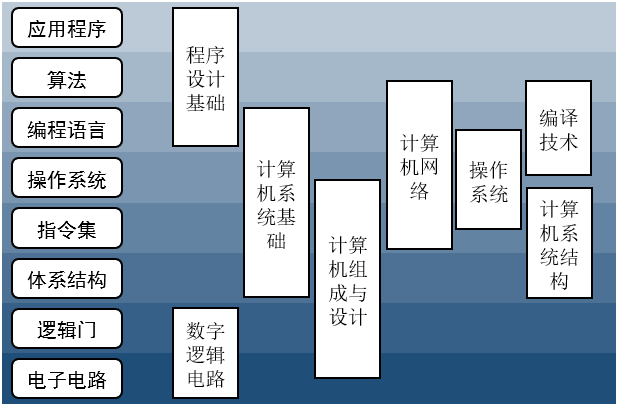

# 关于计算机专业

## 计算机是什么样的专业

摘自知乎[「计算机科学与技术」专业是一门什么样的专业？](https://www.zhihu.com/question/324786705/answer/690957563)里的回答：

## 计算机核心课程体系

《计算机系统基础》序言里关于计算机专业系统能力培养课程体系总体思路，也是计算机理论与技术的模块化拆解，书里的图重新画了一下

<figure>
    
</figure>

这里只包含了计算机技术最核心原理性的东西，有了这些知识储备，再学其他计算机就相关的东西也很容易触类旁通，举一反三。

## 计算机科学与技术知识地图

用更广阔的视野来看计算机科学，youtube[图解计算机科学](https://youtu.be/SzJ46YA_RaA)

<figure>
    
</figure>

最早的计算机被发明用来解决代数问题，计算机也在以令人难以致信的速度发展，现在一台智能手机的运算能力比 60 年代全世界的计算能力还要强。两台 NES 游戏机就能承担阿波罗登月计划需要的全部运算能力。

计算机科学在探究计算机可以做什么，粗略的分成这三部分：
- 计算机基础理论
- 计算机工程
- 计算机应用

Alan Tuning 提出了图灵机(Tuning Machine)的概念，为通用计算机提供了一个简要描述。后来设计的其他所有计算机都等价于图灵机。

**可计算理论(Computability Theory)**试图区分什么是可以计算的，什么是不可计算的。有些问题因为本身的性质永远无法被计算机解决（还有一些因为理论上可以但事实上要花太多内存或者太多时间，超过宇宙寿命这种的），那么就不浪费时间去做了。**算法(Algorithms)**就是为了解决一个特定的问题创造出来的一系列和硬件以及编程语言无关的指令，并且人们花大量的时间去改进他，以期获得最好的效果。算法可以获得同样的最终效果，比如排序，但是有些算法就更加的高效，这就是 $$ O(n) $$ 复杂性。

**信息理论(Information Theory)**研究信息的性质，衡量方法，如何存储以及通信。其中一个应用就是如何尽可能的压缩(Compression)数据，在能够保留大部分或者所有信息的同时，尽量少的占用存储资源。此外还有其他应用。和信息论相关的是**编码理论(Coding Theory)**，显然密码学(Cryptography)对于因特网上传递的信息的隐私非常重要，目前已有的加密方案大多基于一些非常复杂的数学问题设计，计算理论的主干就这些，但是还有更多细节。逻辑(Logic)、图论(Graph Theory)、计算几何(Computational Geometry)、自动机理论(Automata Theory)、量子计算(Quantum Coputation)、并行编程(Parallel Programming)、形式化方法(Formal Methods)、数据结构(Datastructures)。

还是先来看看计算机工程(Computer Engineering)。

设计计算机是一个挑战，这里涉及到特别多的领域，设计者要保证计算机可以解决各种各样的难题，并尽可能的优化。每个在计算机上运行的任务都会通过计算机的核心部件—— CPU ，但在同一时间执行不同的事情的时候， CPU 需要在这些事件之间来回切换，这样才能保证每件事情都能在一个合理的时间内完成，这是通过一个调度程序实现的，这个程序会选择什么时候做什么事情，并且尝试以最有效的方式来组织任务，有时候这是一件很难的事情。多核技术能够帮助提高速度，因为有多个核的 CPU 可以并行执行多个任务，但是这也让调度更加复杂。**计算机体系结构(Computer Architecture)**是研究如何设计处理器完成任务的，因为不同的架构会擅长执行不同的任务，CPU 是基于通用目的，GPU 是基于图像优化的， FPGA 则是可以被编程，从而非常高效的完成非常特定的任务。

在基础硬件的上层，有许多层次的软件，他们是程序员用各式各样的程序语言来写的。人类使用程序语言去告诉计算机该去做什么，而且这些语言之间的差异巨大，这些差别来自于需要完成的工作不同，如和硬件打交道的汇编与 C ，开发网站的 css 和 JavaScript ，总的来说，一个语言越接近硬件人类使用起来越难。程序员编写的所有层次的代码都必须转换成 CPU 指令，这通过一种或几种称为**编译器(Compilers)**的程序可以实现，设计程序语言和编译器是一件大事，它们是程序员构建万物的基础。因此他们必须有足够的易用性，同时必须有足够多的功能，这样程序员才能用他们实现自己的奇妙想法。

**操作系统(Operating System)**是计算机软件中的重要一环，是人和计算机交互的接口，同时它管理着其他所有运行在硬件上的程序，要开发出一款优秀的操作系统是一个极大的挑战。由此带来了**软件工程(Software Engineering)**：有组织的编写指令，告诉计算机该做什么。构建优秀的软件是某种形式的艺术，必须把创意翻译成某种语言下的逻辑指令，并且尽可能的高效，还要正确无误，因此也诞生了许多的优秀实践和设计理念供人们参考(如版本控制、设计模式、面向对象方法、软件测试方法等)

另外还有一些重要领域，比如计算机网络：让多计算机通信并协同工作，以解决各类难题。数据管理与数据库：存储和检索大量数据。计算机图形：绘制逼真的画面。这些都是计算机的应用，计算机科学里的一个很有意思的部分，解决真实世界的问题。这些技术是我们使用许多程序、应用和网站的基础。

有了计算机工具，我们就可以用他来做些事情，这就是计算机应用。比如，解决最优化问题，花最少的钱获得最好的体验，找到最佳路径，或者最有效的组合，这些都有实际的经济价值。当尝试计算出一个逻辑公式是否可以被满足的时候，这就设计到了布尔可满足性问题。这是第一个被证明为 NP 完备的问题，因此普遍被认为是不可解决的，但是伴随着 SAT 求解器的惊人发展，如今大量的 SAT 问题被解决，特别是在人工智能领域。计算机扩展了我们的大脑，增强了我们的感官，计算机科学的前沿研究领域则正在发展一种可以独立思考的计算机系统：人工智能(AI)。 AI 研究的道路有许多，其中最突出的就是机器学习，它的目标是发展技术和算法，使得计算机能从大量的数据中学习，然后用学到的东西做一些有用的事情，例如进行决策，比如进行分类。与之密切相关的领域有例如及其视觉，目标是像人一样，在图像中利用图像处理技术，使得计算机可以看到物体。自然语言处理的目标则是使得计算机可以理解人类的语言并用其来沟通，或者是帮助分析和处理大批量的文本信息。这其中还会用到另一个领域，一般称为知识表示。知识根据他们的相互关系来组织，比如意思相近的词就聚集在一起。机器学习的算法得到了改进，因为我们现在可以提供大量的数据给它们。大数据技术着眼于如何管理和分析这么多的数据，并从中获得价值。未来我们会从物联网添加数据集以及日常的通讯中获得更多的数据。黑客技术并不是传统学科，但是绝对值得一提，尝试发现计算机系统中的弱点，并且在不被发现的情况下加以利用。计算机科学则使用计算机来帮助解答科学问题，从基础物理到神经科学，甚至用超级计算机来解决非常庞大的难题，这在模拟计算领域很常见。人机交互技术的目的是研究如何设计好计算机系统使得方便又直观。虚拟现实增强现实和远程增强，也增加了我们对现实的体验。最终机器人技术赋予了计算机物理的实体，从一个扫地机器人制造像人类一样聪明的机器人。

以上就是计算机的一个粗略地图，这是一个仍在高速发展的领域。尽管现在我们不太容易再去小型化一个晶体管，硬件好像到达了一个极限，因此许多人也在研发其他的计算机来客服这个问题。计算机给人类社会带来了巨大冲击。

