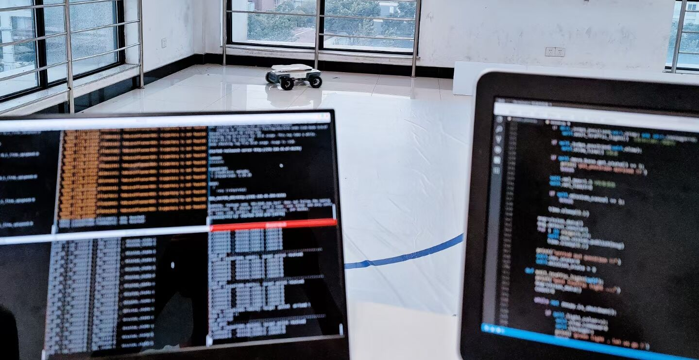

# 2021.7

用计算机用的比较多，在决定系统学习计算机时，模糊地对计算机的一个感觉

## 关于计算机的学习

<!--引出计算机这个事情-->
前段时间玩了个游戏[叫戴森球计划（Dyson Sphere Program）](https://store.steampowered.com/app/1366540/Dyson_Sphere_Program/)，玩法是一个人在整个宇宙，通过采集资源、规划和设计生产线、研发解锁新科技最后建起来戴森球。游戏初期PCB布线的感觉，到了后期，错综复杂的流水线，飞在天上看有种手搓CPU的错觉。下面的视频是Steam官网视频，全是游戏里的内容，看起来还是挺震撼的。

<figure>
    <video src="https://media.st.dl.pinyuncloud.com/steam/apps/256800538/movie480_vp9.webm?t=1600949954" width=480 controls="controls">
    </video>
</figure>

人比动物先进的地方在于人会制造和使用工具。在游戏世界里，靠各种工具在一个人的努力下开发整个星系。在现实世界中，计算机就是由人设计的一种强到不可思议的工具，越深入了解越崇拜设计这个东西的人。计算机真是人类工程历史上的奇迹，尤其是现代计算机，所以想一下子学会也是不太现实的，还是得慢慢来😂😂😂。

<!--专业背景-->
计算机科学和纯软件工程还不太一样，知乎里常讲的EE(Electronic Engineering)除了计算机科学，此还有其他的正统的电子技术。我本科学的是电气工程大类专业，Electrical Engineering，二级学科是电力电子技术，有点电机工程的意思。本科沉迷于控制方向的智能车和电子设计竞赛，反而专业课里要学的一些东西比如电机设计、传统的电力系统学的稀碎。好在都是电子大类的专业，往计算机和自动化靠靠也是合情合理的。

学计算机一个是学计算机这个工具本身，学这个工具是咋回事儿。另一个就是作为工具学应用，比如控制领域的计算机控制技术。这里的内容是工科学生为了更好的使用计算机，应该要掌握的计算机基础知识，所以笔记本的名字叫“计算机基础”。

计算机已经渗透到各个工程学科了，随便拎出来一个专业都用的到计算机平台，比如我了解的，控制学科、车辆工程、还有一些传感器学科都在参与的移动轮式机器人（简约版自动驾驶）好大一部分是基于ROS使用C++开发的。如果开发者对计算机组成原理、操作系统原理、面向对象设计、数据结构、网络通信有深入的理解，再加上自己的专业特色，那么肯定是比不是特别熟悉计算机技术的开发者有优势的。

<figure>
  
</figure>

对于计算机本身，知识可以分为偏硬和偏软两类知识。对于计算机应用，知识可以分为工程类和理论类。计算机作为工具，工程是基石，理论是精髓。比如电机控制，使用现代控制理论、基于稳定的硬件电路和高精度传感器、以32位MCU作为控制核心搭载一个嵌入式操作系统实现。再比如上面提到的ROS机器人，SLAM建图一种方案：使用各种算法（粒子滤波、传感器融合...一大堆搞不懂的算法）、基于特别贵的激光雷达特别贵的IMU、以高性能工控机为上层核心运行着ROS实现；底层也是32位微处理器运行个小的嵌入式操作系统。

总之，掌握好这个基本工具还是很有必要的。

