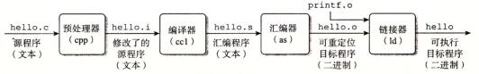
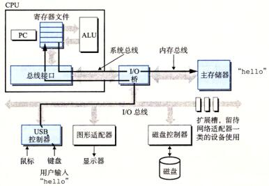
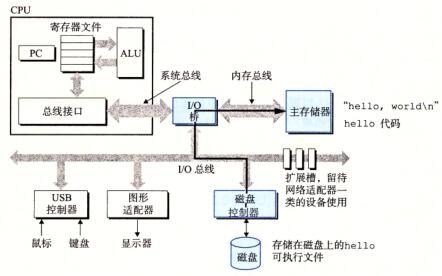
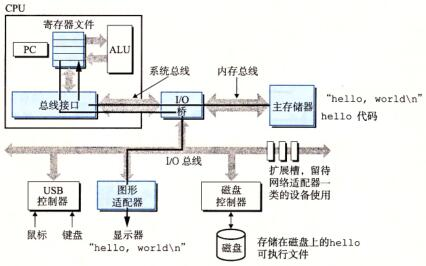

# 2022.2

看了一部分csapp的想法，有了一些模糊的整体的概念。

## 从hello world开始

计算机科学的知识可以强行拆成软硬两部分，但是计算机是个**系统**，这里主要是强调硬件和软件的整体性，没有软件的硬件就是一堆废铁，脱离硬件的软件都没法运行。

展开各种细节前举个例子，我在某本书上看了一个hello world的小故事。

编程经典程序Hello World，这个程序的意义不简单，屏幕上出现这行问候，说明硬件工作正常、语法正确、编译链接没毛病、环境能跑的通了。意义重大！！这也是我记得上大一第一节C语言课老师展示的代码。
```c
/* hello.c */
#include <stdio.h>

int main()
{
	printf("hello world\n");
	return 0;
}
```

现在来看看他是怎么跑起来的，从程序员坐在电脑面前到程序员看到屏幕上出现Hello World为止。

程序员敲击键盘，键盘产生中断送入键位数据形成屏幕的字符（这段还是必要的简化了），有了源程序`hello.c`。`hello.c`的存储方式为Ascii文本编码，源文件里的内容8bit一组作为一个字节放在存储器里，计算机理解信息的方式就是上下文（这个概念在汇编机器码位置会更深入理解），所以说“**信息就是位+上下文**”。

有了源文件，接下来要搞出可执行文件，指令
``` bash
$ gcc -o hello hello.c
```
使用GCC编译器把我们看得懂的代码翻译成计算机看得懂的机器码。实际上也进行了4个步骤

<figure>
	
</figure>

- 预处理阶段，预处理器找'#'后面'include'他就知道去相应路径找文件包含展开了，要是'define'就是替换，其他类似。
- 编译阶段，编译器则把`hello.i`翻译成`hello.s`
```nasm
main:
	subq	$8, %rsp
	movl	$.LCO, %edi
	call	puts
	movl	$0, %eax
	addq	$8 %rsp
	ret
```
- 汇编阶段，输出`hello.o`，这时候就是二进制机器码了，可以对着手册查机器码手工反汇编😂。
- 链接阶段，把调用的函数和自己写的拼起来，得到了`hello`文件，加载到内存中就可以执行了。

上面这一部分还是软件操作，下面就到硬件了。在shell中运行
```bash
linux> ./hello
hello world
linux>
```
shell等待输入一个命令行，然后执行这个命令。如果该命令行的第一个单词不是一个内置的shell命令，那么shell就会假设这是一个可执行文件的名字，它将加载并运行这个文件。shell将加载并运行hello程序，然后等待程序终止。hello程序在屏幕上输出它的消息，然后终止。shell随后输出一个提示符，等待下一个输入的命令行。

在深入一点点，信息是怎么在电脑里面流动的呢？

键盘上输入`./hello`后，shell程序读入到寄存器，然后存到内存中，

<figure>
   
</figure>

前面编译好的程序在磁盘中，磁盘中的程序想执行都要想加载到内存里。敲击回车后，shell知道了指令输入结束，然后**理性分析**出了这个是文件，于是就在当前目录找到了hello，并且通过DMA加载到了内存里（这里有个地址寻址的问题以后说）。

<figure>
   
</figure>

数据到了主存以后CPU就真正开始执行程序了，这里的数据（字符串）是嵌在代码段里的，每读一个机器码程序技术寄存器+1，取指执行重复。这些指令将“hello, world\n”字符串中的字节从主存复制到寄存器文件，再从寄存器文件中复制到显示设备，最终显示在屏幕上

<figure>
  
</figure>

这段小程序涉及到了整个计算机体系，可以作为后面展开学习的线索，这几个线索分别是：

- 程序语言和编译过程——程序到机器码
  - 学计算机起码得会一种语言。最低要求。
  - C/C++ 编译原理*
  - 数据结构、面向对象方法、软件工程*

- 计算机硬件结构——看得见摸得着的东西
  - 计算机组成原理 
  - 微机原理（前置知识：数字逻辑电路，模拟电路*，电路*）

- 操作系统——计算机资源管理
  - 操作系统原理

- 网络通信——现代信息产业的基石
  - 计算机网络

上面几个主题概括了计算机学科的很大一部分，也会在后面的章节中展开来，想都整明白是个不小的挑战，有侧重点的学习也是一个不错的选择😁。

在有了坚实的计算机基础以后，学习新技术也会比较容易，比如说理解操作系统和计算机网络后，再去学习 ROS(Robot Operating System) 会非常轻松，并没有什么新的概念，只要去熟悉类和接口就好了。
