# 从浏览器开始

<figure>
    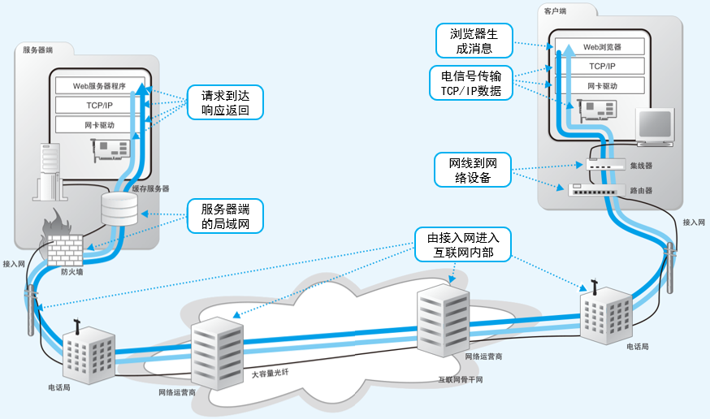
</figure>

现在开始上网。网上冲浪从在浏览器中输入网址(URL)开始。

<figure>
    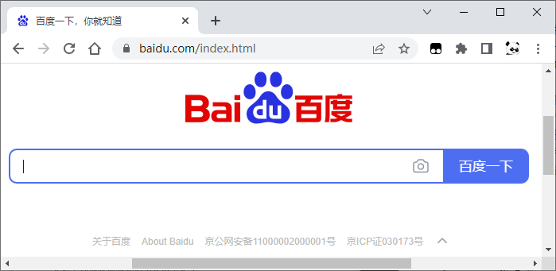
</figure>

在地址栏输入 **http://baidu.com/index.html**

然后回车，浏览器会生成一个请求：“给我index.html这和个文件”。这就是 http 的请求消息。

有了请求消息，浏览器委托操作系统向 web 服务器 发送请求，但是**网址是帮助人记忆的，在计算机之间是用IP地址来寻找对方的**，这就需要浏览器先向 DNS 服务器查询域名对应的 IP 地址。而全世界有上万台 DNS 服务器，这些服务器需要互相接力才能完成域名对应 IP 地址的查询。

查询到 IP 地址后，浏览器才真正把消息委托给操作系统发送。委托也挺复杂的，但是只有写这些程序的人需要精通这些规则。

这部分内容解决 4 个问题
- http 请求消息，浏览器如何根据网址去请求需要的资源
- 向 dns 服务器查询 web 服务器的 IP 地址
- 全世界 dns 服务器配合工作的方式
- 浏览器委托操作系统协助的方式

## 1.浏览器生成 http 请求消息

### 1.1.输入的网址与浏览器的解析

一个网址： **http://www.baidu.com/index.html**

这个东西叫 URL(Uniform Resource Locator)，统一资源定位符。我们通常使用浏览器来冲浪（访问web服务器），但是浏览器不止有这个功能，也可以用来在 ftp(File Transfer Protocol) 服务器上传下载文件，除了"http:"开头，也可以使用"ftp:"，"file:"，"mailto:"开头。

一些常见的 url，用我自己的网站举一些例子

- 访问一个png格式的图片
  - https://xym.work/images/wechat.png
- 访问一个html格式的文件
  - https://xym.work/notebook.html
  - https://xym.work/blog/pid-in-c.html
- 访问一个文件
  - file://localhost/e:/path/file.zip


url 的开头的文字表示浏览器应该使用的访问方法，如访问 web 服务器时用 http 协议，访问 ftp 服务器用ftp 协议。因此这部分可以理解为协议类型。

浏览器解析 url，浏览器对网址的理解

|协议||服务器名|目录|文件名|
|:-:|-|:-:|:-:|:-:|
|http:|//|xym.work|/images|/wechat.png|
|https:|//|xym.work|/blog|/pid-in-c.html|

这个 url 会拆分成这几部分，因此浏览器的解析结果就是访问 xym.work 这个 web 服务器上在 /images 目录下的 wechat.png 这个文件。

也即我们看到的网页本质上是个文件。如 pid-in-c.html 这个文件，**文本+格式控制+小插件**就形成各类各种各样的网页。

### 1.2.url 省略的情况

前面的内容要说一个事情，用浏览器浏览网页的本质是向 web 服务器请求文件。还是拿我自己的网站举例子，我的网页服务器里的文件

<figure>
    
</figure>

访问我网站的 url 为 [https://xym.work](https://xym.work)，或者 [https://xym.work/index.html](https://xym.work/index.html)，这两个 url 显示的内容是一样的。(百度同理，前面提到了访问百度的 url ： http://www.baidu.com/index.html 但是实际我们都访问的是 http://www.baidu.com，试过以后会发现，这两个显示的内容一样。后面都那我自己的网站举例子)

更细致的来说，下面这三个最终效果都是访问百度的主页

|协议||服务器名|文件名|
|:-:|-|:-:|:-|
|https:|//|xym.work|
|https:|//|xym.work|/
|https:|//|xym.work|/index.html

特意拿出了第二个。但是，https://xym.work/index.html 这种写法是最能表达含义，即我要向 xym.work 这个 web 服务器请求 index.html 文件。但是另外两种写法访问的结果也一样，因此可以判断，另外两种写法是有省略的。

服务器会预先设置好省略时访问的默认文件名，大多数情况下是 index.html 或者 default.html

https://xym.work/ 只访问了服务器的根目录，因此实际访问的是根目录的index.html文件。

https://xym.work 是最多用方式，连/都省略了，没有路径名，就代表访问根目录下的默认文件，也即/index.html

还有一种情况

https://xym.work/blog

不可以既有一个 blog 目录，还有个 blog 文件。这个网址末尾没有/，看起来是个文件，但是呢，也可以是一个目录，默认访问 blog 里的 index.html 文件。

<figure>
    
</figure>

>最早的时候 `index.html` 这个文件叫做主页(home page)，意思是省略文件名访问的默认页面，后来这个词义扩大化了。

### 1.3.http 协议的基本思路

解析完 url 后，就知道访问的目标文件在哪里了，接下来浏览器会用 http 协议访问 web 服务器。

先来看看 http 协议又是咋回事。

<figure>
    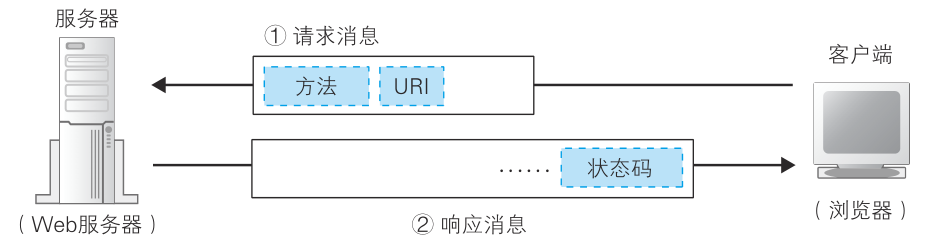
</figure>

http 协议定义了客户端和服务器之间交互的消息内容和步骤。基本思路很简单：
- 1.客户端向服务器发送消息请求
- 2.服务器响应消息

请求消息包含的内容是“对什么”和“进什么什么操作”。即 **URI**(Uniform Resource Identifier，同意资源标识符)和 **方法**。

URI 的内容是一个存放网页数据的的文件名或者 CGI 程序。如 “/dir/file.html”，“/dir/program.cgi”。URI仅限于此，也可以直接使用http开头的URL作为URI，总之这里可以写各种访问目标。

方法表示让web服务器完成什么样的工作。典型的比如读取URI表示的数据，下表给出了主要方法

<figure>
    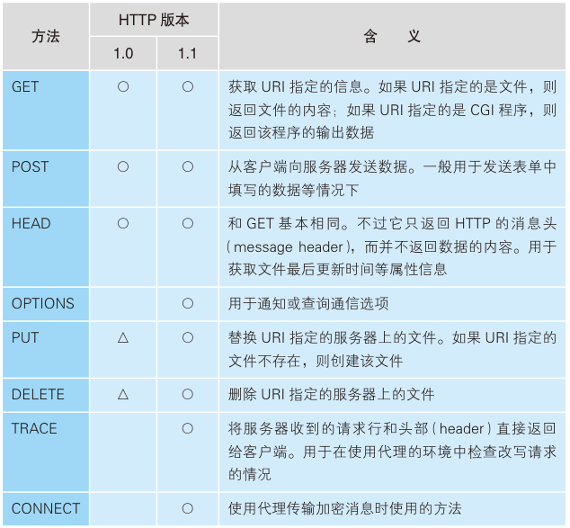
</figure>

收到请求，web服务器会对其中的内容进行解析，根据要求来完成自己的工作，然后把结果存放在相应信息里。相应信息的开头是个状态码，比如404 not found就是个状态码。状态码后面是头字段和网页数据。

客户端收到响应消息后，读出数据显示在屏幕上，整个HTTP的工作就完成了。

### 1.4.生成 http 消息和收到 web 服务器响应

大概清楚了http的基本流程，回来浏览器本身来。

对URL解析后，浏览器确定了web服务器和文件名，接下来是根据这些信息来生成http请求信息。http消息在格式上有严格规定。

```html
GET /sample.html HTTP/1.1

```

```html
HTTP/1.1 200 OK

```

## 2.DNS 服务器

有了 http 消息，接下来要委托操作系统将消息发送给 web 服务器，浏览器能解析网址生成 http 消息，但是本身并不具备将消息发送到网络中的功能。不仅仅浏览器需要发送消息，QQ，下载软件，游戏等都需要发送消息，这种每个应用软件都需要的功能(软件复用)让操作系统来实现更合适。

在发送消息前，还有件事情要做，查询网址中服务器域名对应的 **IP 地址**。在委托操作系统发送消息时，给的不是域名而是 IP 地址，因此需要根据域名查询IP地址。

### 2.1. IP 地址

互联网和公司内部的局域网都是基于 TCP/IP 的思路来设计的，一些小的子网连接起来组成大的网络。结构如下图：

<figure>
    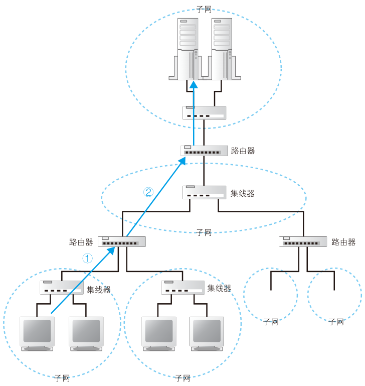
</figure>

子网可以理解为用集线器连接起来的几台计算机，将子网通过路由器连接起来，就形成了一个网络。


>集线器是一种对包进行转发的设备，分为中继式集线器和交换式集线器两种。

>路由器是一种对包进行转发的设备。

>交换机也是一种对包进行转发的设备。

>具体区别，后面网络设备章节做区分说。

网络中，所有设备都会被分配一个 IP 地址。IP 地址分割为**网络号**和**主机号**。网络号是分配给整个子网的，主机号是给子网中的一台计算机的。

通过IP地址可以判断访问对象服务器的位置，从而将消息发送到服务器。后面会更加详细的说整个过程，这里简单看看。消息先经过子网的集线器，到达距离最近的路由器，路由器根据消息的目的地判断下一个路由器位置，经过子网的集线器发送到下一个路由器，直到传送到目的地为止。

实际的 IP 地址是一串 32bit 的数字，1Byte 一个组分为 4 组，写成10进制后圆点隔开就是常见的IP格式。比如 `192.168.1.1`，通常后面还会跟着一个子网掩码，两种格式
- 192.168.1.1/255.255.255.0
- 192.168.1.1/24
这种方式表示的子网的地址。

仅靠 IP 地址无法区分哪部分是网络号，哪部分是主机号。这两部分总共 32bit 但是并不固定，可以自己分配，因此需要**子网掩码**来指出网络号占用的bit位。

子网掩码为 1 的部分表示网络号，为 0 的部分表示主机号。IP 地址的主机号为 0 代表的是整个子网而非单台计算机，主机号全为 1 代码向子网所有设备发送消息即广播。

### 2.2.域名与 IP 共存

TCP/IP 网络通过 IP 地址来确定通信对象，不知道 IP 就无法发送消息。

既然如此，在网址中直接写 IP 地址就好了，IP 地址代替网址是可以正常工作的，如下面这个 IP 地址指向 baidu

http://202.108.22.5/

然而这并不好记忆，这就和电话号码与联系人的关系一样。如何在互联网中不用 IP 地址，直接使用名称确定通信对象呢？使用名称效率上可能并不高，毕竟使用 IP 地址只需要 4Byte 就能解决，使用字符串保存名称的话，4Byte 显然不太够用。何况，域名不仅仅长，长度还是不固定的。

于是有了现在的方案，让人来使用域名，让路由器使用 IP 地址，为了联系人和机器，需要一个机制来把域名和 IP 地址对应起来，在人和机器都不做出牺牲的前提下完美解决，这就是 DNS(Domain Name System) 域名服务系统。

DNS 功能并不仅限于把服务器名和 IP 地址关联，它还可以将邮件地址和邮件服务器进行关联，以及为各种信息关联相应的名称。

### 2.3. Socket 库提供查询 IP 地址的方法

查询 IP 地址很容易，询问最近的 DNS 服务器就行。浏览器如何向 DNS 服务器发出请求呢？来探索一下这个事情。

向 DNS 服务器发出查询，也就是向 DNS 服务器发送查询消息，接收返回的消息。也就是说有 DNS 服务器，在我们的计算机上一定有对应的 DNS 客户端。相当于 DNS 客户端的部分称为**DNS解析器**（简称解析器）。通过 DNS 查询 IP 地址的操作称为**域名解析**(resolution)，因此负责执行解析的这一操作就叫解析器(resolver)了。

解析器是一段程序，包含在操作系统的 Socket 库中。 Socket 库里包含的程序组件可以让其他应用程序调用操作系统的网络功能，解析器就是这个库里的一种程序组件。

解析器用起来很简单，调库嘛，都很容易的。

```c
#include <stdio.h>
#include <stdlib.h>
#include <netdb.h>
#include <sys/socket.h>
#include <netinet/in.h>
#include <arpa/inet.h>
 
int main()
{
    struct hostent *host = gethostbyname("www.baidu.com");
    if(!host)
    {
        puts("Get IP address error!");
        exit(0);
    }
 
    //别名
    for(int i=0; host->h_aliases[i]; i++)
    {
        printf("Aliases %d: %s\n", i+1, host->h_aliases[i]);
    }
 
    //地址类型
    printf("Address type: %s\n", (host->h_addrtype==AF_INET) ? "AF_INET": "AF_INET6");
 
    //IP地址
    for(int i=0; host->h_addr_list[i]; i++)
    {
        printf("IP addr %d: %s\n", i+1, inet_ntoa( *(struct in_addr*)host->h_addr_list[i] ) );
    }
 
    return 0;
}
```

### 解析器的内部原理

网络应用程序（浏览器）调用解析器时，调用解析器代码。解析器会生成发送给 DNS 服务器的查询消息（和浏览器生成发送给 web 服务器的 http 消息过程类似），根据 DNS 的规则，生成一条“告诉我 xxx.com 的 IP 地址”的消息，发送出去。

发送消息这个操作不是有解析器完成，同样委托给操作系统内部的协议栈来完成。解析器本身不具备使用网络收发数据的功能。解析器调用协议栈，协议栈执行真正的发送操作，通过网卡把消息发送给DNS服务器。

DNS 服务器收到查询消息，如果要访问的 web 服务器在 DNS 服务器上注册过，那么这条记录就可以找到，然后web服务器的IP地址被写入响应消息返回到客户端，电信号到达网卡，经过协议栈传递给解析器，解析器读取IP地址，返回给应用程序。

<figure>
    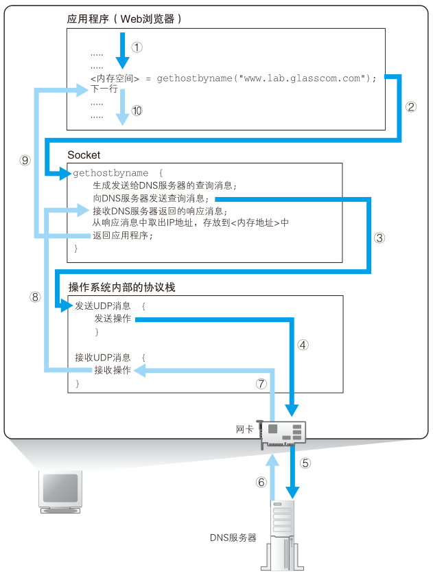
</figure>


实际上解析器会把IP地址写入应用程序指定的内存里，即用指针来表达。

不仅仅是这个过程，计算机内部结构就是这样一层一层，彼此分工合作，每一层对上层负责，使用下层的接口，每层完成一部分工作，将剩下的部分委派到下层完成。

当然向DNS服务器发送消息时，我们也需要知道DNS服务器的IP地址，只不过这个 IP 地址是作为 TCP/IP 的一个设置条目设置好的。

一些 DNS 服务器 IP
- 电信做的国内免费 DNS 114.114.114.114; 114.114.115.115
- 谷歌 DNS 8.8.8.8; 8.8.4.4
- 江苏电信 DNS 218.2.2.2; 218.4.4.4

<figure>
    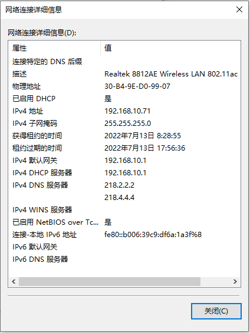
</figure>

```note
协议栈：操作系统内部的网络控制软件。也叫做“协议驱动”“TCP/IP驱动”。

```

### dns服务器

前面给了一些dns服务器的IP，dns服务器收到的消息有这些：
- 域名：服务器的名称
- Class：最早设计DNS方案时，DNS在互联网以外的其他网络中的应用也被考虑到了。然而，至今为止这个值都只有IN
- 记录类型：如当类型为A时，表示域名对应IP地址；当类型为MX，表示域名对应邮件服务器。

DNS服务器上事先保存了这些东西。

<figure>
    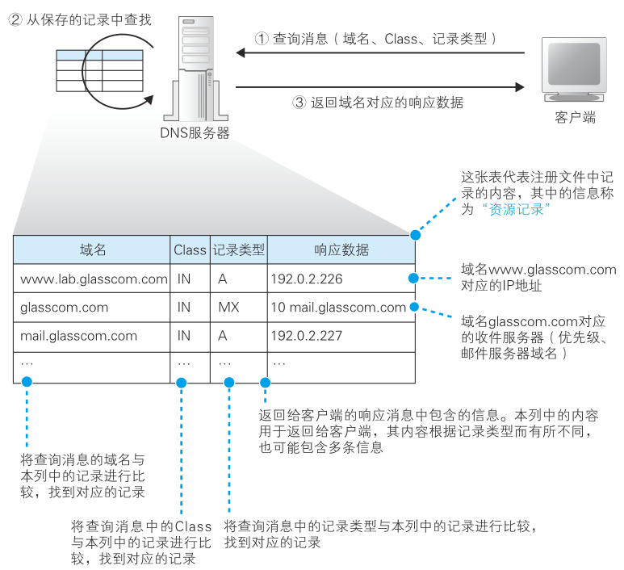
</figure>

比如查询www.lab.glasscon.com的IP地址，客户端向DNS发送这些消息：
- 域名 = www.lab.glasscon.com
- Class = IN
- 记录类型 = A

然后，DNS查找全部匹配的记录，将记录值192.0.2.226返回去。

如果要搭一个自己的主页，并使用自己的域名，那么有个步骤就是要配置DNS服务器的解析设置：

<figure>
    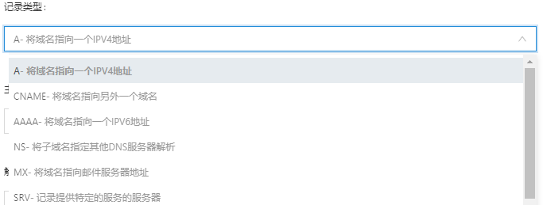
</figure>


### 域名的层次结构

小规模网络，所有信息保存在一台DNS服务器里，工作方式完全符合前面的情况。

然而互联网里存在着不计其数的服务器，保存在一台DNS服务器不大可能。因此一定会出现在某一台DNS服务器找不到数据的情况。这里就要看看DNS服务器如何工作。

数据分布保存在多台DNS服务器中，这些DNS服务器相互接力配合，找出要查询的信息。不过接力的机制有点复杂，所以先看信息是怎么注册到DNS服务器上的。

DNS中的数据按照域名以分层次的结构来保存的。域名用'.'来分割，越靠右的层级越高。比如map.baidu.com 这个域名，最高层级com，下一层级baidu，再下一层map。一个层级是一个域，因此com域的下一层是baidu域，再下一层是map域。

这种层次结构的域名信息注册到DNS服务器里，每个域按照一个整体来处理，即每个域的信息作为整体存放在DNS服务器里，不能把一个域拆开来存放在多台DNS服务器里。倒是多个域的数据可以放到一个DNS服务器里。

这里假设一个DNS服务器只放了一个域的信息。于是DNS服务器也有了像域名一样的层次结构，每个域的信息都存放在相应层级的DNS服务器里。

比如njust.edu.cn，
- cn代表分配给中国的顶级域(地理顶级域)
- edu教育系统的域
- njust分给学校的域

到这一层并没有结束，还可以不同学院继续分配，子域。

比如
- au.njust.edu.cn 自动化学院分配了au
- cs.njust.edu.cn 计算机学院分配了cs
- eoe.njust.edu.cn 电子工程与光电技术学院分配了eoe

### 寻找DNS服务器获得IP地址

关键在于找到要访问的web服务器的信息存放在哪一台DNS服务器。

互联网中有数万台DNS服务器，肯定不能一台一台遍历。可以先把负责管理下级域的DNS服务器的IP地址注册到他们的上级DNS服务器里，然后上级DNS服务器的IP地址注册到更上级的DNS服务器里。

也就是说，负责管理njust.edu.cn这个域的DNS服务器的IP地址要注册到edu.cn域的DNS服务器，而edu.cn域的DNS服务器的IP地址又需要注册到cn域的DNS服务器中。

这样就可以同上上级的DNS服务器查询出下级DNS服务器的IP地址，这样可以先下级DNS服务器发送查询请求。

似乎cn就是最顶层了，事实上并非如此，com和cn的上面还有一级域，称为根域。根域不想cn有自己的名字，书写的时候一般也忽略，如果要明确表示根域，要加一个点 njust.edu.cn. 不过一般不写最后的点，因此根域的存在往往被忽略。

<figure>
    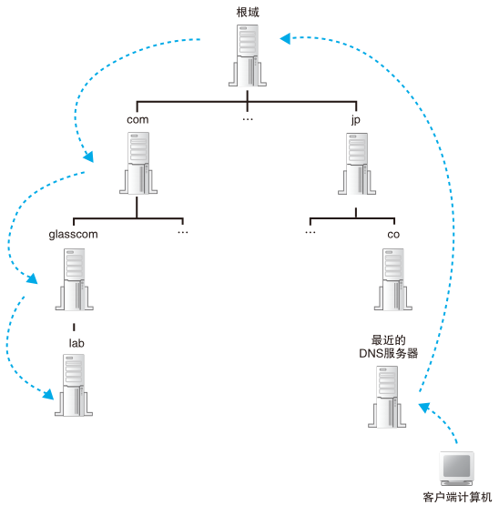
</figure>

但是根据毕竟是真实存在的，根域的DNS服务器里保存着com、cn等DNS服务器的信息，所以我们可以从根域开始一路顺藤摸瓜找到任一个域的DNS服务器。

此外还需要另一个工作，把根域的DNS服务器信息保存在互联网所有的DNS服务器里，这样任何DNS服务器都可以找到并访问根域DNS服务器。

分配给根域DNS服务器的IP地址在全世界只有13个。

举个例子，我们要查询www.lab.glasscom.com这台web服务器的相关信息。客户端先访问最近的一台DNS服务器，也就是网络设置在TCP/IP中填写的DNS地址，由于最近的服务器里没有存放 www.lab.glasscom.com 这一域名对应的信息，所以我们需要从顶层开始向下查找。最近的DNS服务器中保存了根域DNS服务器的信息，它会将来自客户端的查询消息转发给根域DNS服务器。根域服务器中也没有www.lab.glasscom.com这个域名，但根据域名结构可以判断这个域名属于com域，因此根域DNS服务器会返回它所管理的com域中的DNS服务器的IP地址，意思是“虽然我不知道你要查的那个域名的地址，但是我知道这里能找到”。接下来，最近的DNS服务器又会向com域的DNS服务器发送查询消息，com域中也没有www.lab.glasscom.com这个域名的信息，和刚才一样，com域服务器会返回它下面的glasscom.com域的DNS服务器的IP地址。以此类推，只要重复前面的步骤，就可以顺藤摸瓜找到目标DNS服务器，只要向目标DNS服务器发送查询消息，就能够得到我们需要的答案，也就是www.lab.glasscom.com的IP地址了。

<figure>
    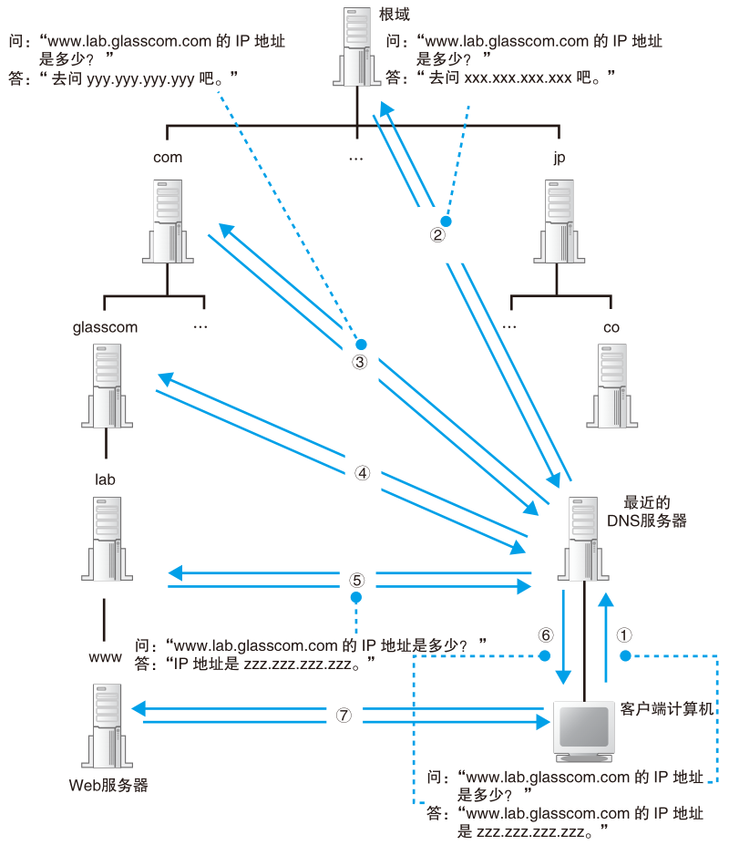
</figure>

### 通过缓存加快DNS服务器响应

真实的互联网中工作方式和上面说的还是略有区别。

一台DNS服务器可以管理多个域的信息，上级域和下级域也可以使用同一台服务器。

有时候不需要从最上面的根域开始查找，因为DNS服务器有缓存功能，可以记住之前查询过的域名。如果要查询的域名相关信息已经放在缓存中，那么可以直接返回属于。

当要查询的域名不存在时，“不存在”这个结果也会被缓存。

缓存机制有一点要注意，原本注册信息发生改变时，缓存里的信息就有可能不正确。因此DNS服务器中保存的信息都设置有一个有效期，国企会自动删除。而且在查询时，DNS服务器也会告知客户端响应结果来自缓存还是来自管理该域名的DNS服务器。

## 协议栈

知道了IP地址之后，就可以委托操作系统内部的协议栈向这个目标IP（web服务器）发送消息了。

收发数据这一操作并不仅限于浏览器，对于各种要使用网络的应用程序来说都是一样的。

收发数据也需要使用Socket库中的程序组件。前面向DNS服务器查询IP地址调用一个组件就行，这里需要按照指定的顺序调用多个程序组件，还挺复杂。发送数据时一系列操作结合起来实现的，先看全貌，就能理解每个具体操作的含义了。


```c
int main()
{
    //创建套接字
    int sock = socket(AF_INET, SOCK_STREAM, 0);
    //向服务器（特定的IP和端口）发起请求
    struct sockaddr_in serv_addr;
    memset(&serv_addr, 0, sizeof(serv_addr));  //每个字节都用0填充
    serv_addr.sin_family = AF_INET;  //使用IPv4地址
    serv_addr.sin_addr.s_addr = inet_addr("127.0.0.1");  //具体的IP地址
    serv_addr.sin_port = htons(1234);  //端口
    connect(sock, (struct sockaddr*)&serv_addr, sizeof(serv_addr));
   
    //读取服务器传回的数据
    char buffer[40];
    read(sock, buffer, sizeof(buffer)-1);
   
    printf("Message form server: %s\n", buffer);
   
    //关闭套接字
    close(sock);
    return 0;
}
```


### 数据收发操作全貌

使用Socket库来收发数据的过程如下图：

<figure>
    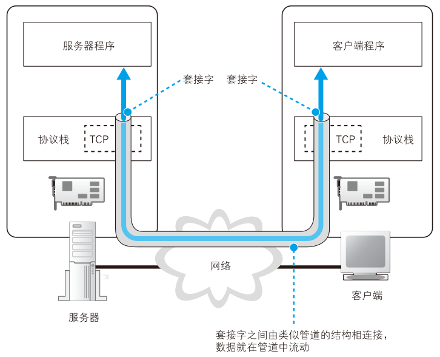
</figure>

简单来说，收发数据的两台计算机之间连接了一条数据通道，数据沿着这条通道流动。数据从一端进去就会到达另一端出来，而且是双向的。

从图里来看，这个管道好像一开始就有，其实并不是。在进行收发之前，双方需要先建立起这个管道。实际过程：
- 服务器创建**套接字**，等待客户端向该套接字连接管道
- 将管道连接到服务器的套接字上
- 收发数据
- 断开管道并删除套接字

每个过程都会用到Socket库中的组件。这4个操作都是由操作系统中的协议栈来执行，浏览器等应用程序并不会自己去做管道连接、放入数据的操作，而是委托协议栈代劳。

这部分的内容只是研究如何如何“委托”，协议栈收到委托之后连接管道和放入数据会在后面说。


### 创建套接字阶段

访问DNS服务器调用`gethostbyname()`，也叫解析器。而这里要按照一定顺序调用若干个组件。

<figure>
    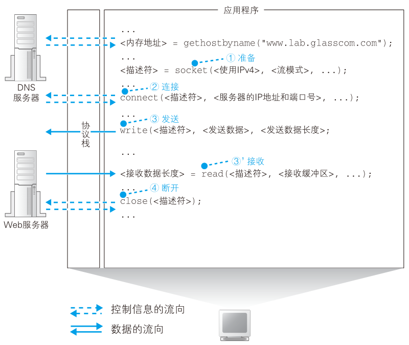
</figure>


```c
int sock = socket(AF_INET, SOCK_STREAM, 0);
```

创建套接字完成后，协议栈会返回一个**描述符**`sock`。描述符用来识别不同的套接字，计算机中会同时进行多个数据的通信操作（比如打开两个浏览器窗口），就需要两个套接字。

创建套接字后，只要出示描述符，协议栈就可以判断使用哪一个套接字来连接或者收发数据。

```note
- Socket：表示库
- socket：程序组件
- 套接字：管道两端的接口。虽然英文也是socket
```

### 连接：把管道接上

接下来委托协议栈将客户端创建的套接字和服务器的套机字连接起来。应用程序调用Socket库里的`connect()`组件。

调用connect的时候，需要指定描述符、服务器IP地址和端口号这3个参数。

```c
/* 暂存控制参数的结构体 */
struct sockaddr_in serv_addr;
memset(&serv_addr, 0, sizeof(serv_addr));

/* 使用IPv4类型 */
serv_addr.sin_family = AF_INET;
/* 指定IP地址 */
serv_addr.sin_addr.s_addr = inet_addr("127.0.0.1");
/* 指定端口号 */
serv_addr.sin_port = htons(1234);
/* 通过上述参数连接管道 */
connect(sock, (struct sockaddr*)&serv_addr, sizeof(serv_addr));
```


```note
描述符：应用程序来识别套接字的机制。

IP和端口号：客户管和服务器之间用来识别对方套接字的机制。
```

### 通信阶段：传递消息

套接字连接后，把数据送入套接字，对方就能从自己的套接字里读取数据了。这里体会**管道**这种感觉，还有套接字是管道的出入口。

剩下的通信就很容易了，同样使用Socket库提供的组件。


应用程序在内存里准备好要发送的数据，调用`write`函数即可，调用时还需指定描述符。

```c
char str[] = "http://c.biancheng.net/socket/";
write(clnt_sock, str, sizeof(str));
```

因此只要通过描述符，就能确定要使用的套接字，识别出通信对象。

接收消息时，使用`read`来完成，调用时要指定用于存放数据的内存地址

```c
char buffer[40];
read(sock, buffer, sizeof(buffer)-1);
```

### 断开阶段：收发结束

```C
close(sock);
```

在协议层，断开就是一个函数。

在引用曾，web使用的HTTP规定：当web服务器发送完响应消息后，应该主动断开，因此web服务器首先调用`close`。断开操作传达到客户端后，客户端的套接字也会进入断开阶段。后面当浏览器调用read执行接收数据操作时，也会得知连接断开。

这就是HTTP的工作过程。HTTP协议把HTML文档和图片都作为单独对象来处理，每获取一次数据，就要执行一次连接、发送请求消息、接收响应消息、断开的过程。因此网页里如果有很多图片，就必须重复进行很多次连接收发断开。

对于一台服务器来讲，重复连接断开的效率很低，因此后来人们又设计出了在一次连接中收发多个请求和相应的方法。HTTP版本1.1中就可以使用这种方法，这种情况下所有数据请求完成后，浏览器会主动触发断开连接的操作。


