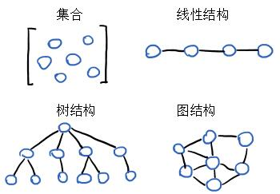

# 数据和算法

- 数据结构
- 抽象数据类型
- 文件结构
- 算法
- 数据库
- 数据压缩

早期计算机主要干数值计算的活，现在计算机好多都干非数值计算了，比如处理字符、表格、图像。这些东西是数据，但是有组织、有结构的，清楚数据的内在联系（数据结构），针对数据类型设计高效的算法，这就是数据结构课程要研究的问题。两个词概括这部分内容：**合理组织数据，高效处理数据**。

数值计算就是根据实际问题，搞出数学模型，设计解题算法。比如天气预报需要求解一组球面坐标下的二阶椭圆微分方程，人口增长需要算常微分方程。这些问题的算法是数学的范畴，如有限元法、高斯消元法等。

数据结构主要针对非数值计算问题，比如库存管理系统（线性表）、人机对弈问题（数）、最短路径问题（图）。这类问题的数学模型不是方程了，而是数据结构。

早些年，“数据结构”的内容零散的出现在操作系统、编译原理等课程，1968年作为独立课程被列入美国一些大学计算机系的教学计划，同年计算机科学家D.E.Knuth发表《计算机程序设计艺术》第一卷《基本算法》，系统阐述了数据结构。后来计算机的进步和大型程序的出现，**结构化程序设计**成为程序设计方法学的主要研究方向。普遍认为程序设计的实质是对处理的问题选择一种好的数据结构，并施加一种好的算法。这种观点的精简表达：  
**程序=算法+数据结构**。

编程就是在和数据打交道，计算机程序总是在接收数据、操作数据、返回数据。

“数据”是个很广泛的词，leetcode里最基本的数字和字符串、编译好的二进制可执行文件都可以认为是数据。无论多复杂的数据，都可以拆成一堆数字和字符串来看待，因此leetcode里有大量的处理字符串的题目。

数据结构不仅用来组织数据，还影响着代码的运行速度。一旦对各种数据结构有了深刻的理解，并明白其对程序性能的影响，就能写处快速优雅的代码。

首先简单建立数据和算法以及好坏评价指标的概念。


## 基本概念和术语

**数据结构**(Data Structure)是指存在关系的数据。数据结构有**逻辑结构**和**存储结构**两个层次。

逻辑结构是数学模型，需要有两个要素：数据元素、关系。通常有四类：集合结构、线性结构、数结构、图结构。

<figure>
    
    <figcaption>数据基本逻辑结构</figcaption>
</figure>

其中集合、树、图都为非线性结构，线性结构有线性表、栈、队列、字符串、数组。非线性结构有数、二叉树、有向图、无向图。

存储结构也称物理结构，为计算机中数据的存储方式，既要保存数据，又要保存数据之间的逻辑关系。基本存储结构有两种：顺序存储、链式存储。

顺序存储和数组类似，数据放在连续的存储空间里。链式存储借助指针联系起散落在各处的数据。

**数据类型**(Data Type)是高级程序语言的概念，比如C语言的`int`、`float`。此外还有**抽象数据类型**(Abstract Data Type, ADT)用来实现更符合人类思考方式的数据结构，其设计和面向对象的思想是一致的。

比如说用C语言定义一个复数类型及其操作：
```c
typedef struct 
{
    float real;
    floar image;
} complex;

typedef struct complex* complex_t;

/* 构造一个复数 */
void creat(complex_t c, float r, float i)
{
    c->real = r;
    c->image = i; 
}

complex_t add(complex_t c1, complex_t c2)
{
    complex_t c = (complex_t)malloc(sizeof(struct complex));
    c->real = c1->real + c2->real;
    c->image = c1->image + c2->image;
    return c;
}
```
这样定义后，在主程序里就可以调用`creat`去创建一个新的复数，调用`add`实现加法。

## 数据结构与操作效率

编程就是在和数据打交道，计算机程序总是在接收数据、操作数据、返回数据。

“数据”是个很广泛的词，leetcode里最基本的数字和字符串、编译好的二进制可执行文件都可以认为是数据。无论多复杂的数据，都可以拆成一堆数字和字符串来看待，因此leetcode里有大量的处理字符串的题目。

数据结构不仅用来组织数据，还影响着代码的运行速度。一旦对各种数据结构有了深刻的理解，并明白其对程序性能的影响，就能写处快速优雅的代码。

### 数组

一个基础的数据结构是数组。比如说一个数组的定义：

```c
int array[] = {12,21,4,16,31,17};
```

这个数组包含6个项目，我们用索引来标识每个数据在数组里的位置，大多数编程语言是从0开始数的，在这个例子里，`‘4’`对应的索引为`2`。

想了解某个数据结构的性能，需要知道程序如何去操作这个数据结构，一般数据结构都有一下4种操作，或者叫用法：
- 读取：查看某一位置的数据
- 查找：给一个数据找到索引
- 插入：增加一个数据值
- 删除：移走一个数据值

我们研究这些操作在数组上执行的速度。一个重要理论是：**操作的速度并非按照时间计算，而是按照步数计算**。

操作的速度也常被称为**时间复杂度**，这几个概念**速度、时间复杂度、效率、性能**其实都指的是步数。

#### 读取

对于读取数组来说，一步就完成了，CPU可以进行基址+偏移地址进行寻址，一步找到对应地址的值。更细致的讲，能一步找到数组内任意索引位置的值的条件：
- CPU可以一步找到任意内存地址
- 数组会记录首地址，并且数据在RAM里连续存储
- 数组索引从0开始

比如我们要找到`array[2]`，CPU实际上做的事情就是直接读取`array+2`地址处的值。数组的读取是一种非常高效的操作。

#### 查找

我们想知道`17`是否在数组里，如果在，还要返回索引值。这个例子人倒是一眼可以看出来，但是计算机需要一步一步找。

对于这个例子，数组长度`sizeof(array)`为6，很不幸需要从头找到最后一个，共需要找6次。这就是最基本的查找方法**线性查找**。

对于一个有N个元素的数组，线性查找最多的步数就是N。可见对于一个数组，查找都要比读取慢。

#### 插入

插入到末尾是可以一步完成的，和赋值一样。但是插入到中间或开头就不一样了，需要移动其他元素腾出空间，花费额外步数。

如果是插入到数组开头，那么需要移动所有的N个元素，然后再多一步赋值，即最坏情况要花N+1步。

#### 删除

删除是插入的反向操作，删除以后要移动数据补上空出来的内存地址。

最坏的情况是删除第一个，然后移动剩下的N-1个数据需要N-1步，总共需要N步。


以上就是对4种操作时间复杂度的一个简单分析。后面会强化这个思路

### 集合

集合是不同于数组的一种数据结构，集合内不允许有重复的值。比如集合`{'a','b','c'}`，如果想插入一个`'b'`，这是不可以的。

还是上面4种操作，我们来看看处理集合的效率。

集合的读取和数组一样，一步完成。查找也一样，最多需要N步。删除也一样需要N步完成删除和左移。

对于集合来说，插入之间先要判断数据是否已经存在于集合里。

对于N个元素的集合，查找一遍需要N步，如果不幸要插在第一个，需要花N步移动元素腾出第一个内存空间，然后再来一步插入，总共需要花2N+1步。

### 总结

这里简单分析了数据结构的时间复杂度，理解数据结构的性能关键在于分析操作需要的步数。类似地，算法也有时间复杂度，有了前面的思路，过渡到算法的时间复杂度是很容易的。

## 算法与操作效率初步

合适的数据结构会提升代码性能，但是数据结构确定了，还有算法这个重要因素也会影响代码性能。

简单的讲，算法是解决某个问题的一套流程。比如说把冰箱装进大象需要的操作。这里使用**有序数组**来建立算法的初步之间。

有序数组和前面的数据差不多，唯一多了一个要求是有顺序。比如`{3, 17, 80, 202}`，如果是常规数组插入数据，直接放到最后面就行，但是作为有序数据，需要找到一个合适位置，使得前小后大。

虽然有序数组的插入性能比较低，但是再查找上要有优势。

### 线性查找

常规数组最坏需要进行N次比较，对于有序数组，实可以提前停止查找的。比如`{3, 17, 80, 202}`要查找`20`，到`80`就可以停止了，因为右边不可能出现`20`。

```c
int find(int * a, int length, int f_num)
{
    int i;
    for(i=0; i<length; i++)
    {
        if (*(a+i) == f_num)
            return 1;
        else if (*(a+i) > f_num)
            break;
    }
    return 0;
}
```

前面简单提了一下这种查找方法为**线性查找**。有序数组的线性查找一般是快于常规数组的，但如果不幸被查找的数据在最后一个，那就和常规数组一样了。

似乎这两种数组在性能上没啥区别，但是还没有释放算法的潜能。线性查找只不过是查找算法的一种，我们可以使用二分查找。

### 二分查找

二分查找用比大小来加速确定一个元素是否在有序数组中。对于一个100元素的有序数组，线性查找需要100步，但二分查找第一次就能排除左边50个值。元素翻倍，线性查找次数要翻倍，但是二分查找只是增加一步。

### 总结

有序数组并非所有性能都比常规数组好，他的插入就比较慢。得根据使用场景来确定数据结构以及相应算法。

在前面的比较里，模糊的感觉到比较算法的性能就是比较各自的步数，因此我们需要一个更规范的方式表述数据结构和算法的时间复杂度，给出数字指标。

## 大O记法

记录一个算法最有效的方式：**对于具有N个元素的数组，线性查找最多需要N步**。

这听起来很啰嗦，这里借鉴了数学上的一种方式，大O记法。这个记法不关注时间，只关注步数。对于前面的数组读取，不论多大只需要1步，用大O记法表示为：$$ O(1) $$ 。数组末尾的插入和删除的时间复杂第也是 $$ O(1) $$ 。对于线性查找，最坏需要N步，那么时间复杂度就是 $$ O(N) $$ 。

这种记法基于要处理的数据量来描述，或者说描述的是数据增长时步数的变化。$$ O(N) $$ 的含义是数据多一个，步数就多一步。这就是线性时间，相对的 $$ O(1) $$ 就是常数时间。所以即使一个算法恒定步数是3，其时间复杂度也用 $$ O(1) $$ 来表示。

还有个小细节，线性查找最好情况是 $$ O(1) $$ ，最坏情况才是 $$ O(N) $$ ，没有特别说明，一般都用最坏情况。

对于二分查找，他是介于 $$ O(1) $$ 和 $$ O(N) $$ 之间的。叫作对数时间，记为 $$ O(\log N) $$ ，其含义是数据量翻倍步数加1。实际上这个记法指的是 $$ O(\log_2 N) $$ 

