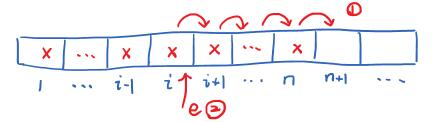
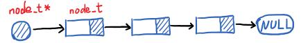
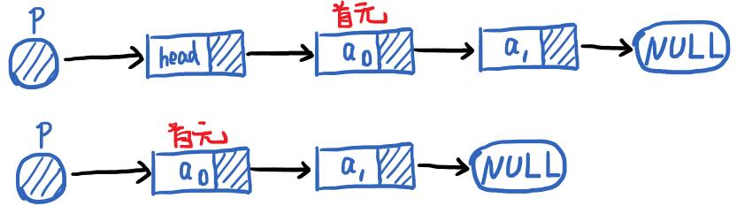
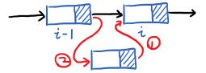

# 线性表

线性表有头有尾穿成一串。


## 顺序表

顺序存储的线性表称为**顺序表**(Sequential List)。顺序存储指的是在线性表在存储空间内连续存放，这种存储方式就是顺序存储结构，逻辑上相邻的元素在物理存储上也相邻。

数组就是一种顺序表，定义一个顺序表结构：
```c
/* 最大长度 */
#define MAXSIZE 100

/* 元素数据类型 */
typedef int element_t;

/* 顺序表类型 */
struct _sq_list{
    element_t *base;    /* 顺序表基地址 */
    int length;         /* 表长 */
};

typedef struct _sq_list *sq_list_t;

/* 定义一个顺序表 */
sq_list_t sq_list;
```

这时候就有一个类型为`sq_list_t`的顺序表`sq_list`了，**这是一个指针，在使用的时候还需要为其分配内存空间**。可以用`sq_list.base[i*sizeof(element_t)]`来访问第`i`个元素。可以看出，求表长、判断表是否为空、等操作的时间复杂度都是 $$ O(1) $$ ，下面讨论顺序表主要操作实现。

注意：**元素计数按照C语言习惯从0开始，但是长度`length`就是元素个数**。

```note
关于数据结构为何最终都要用指针的问题。

本质上是形式参数和实际参数的问题，如果使用结构体作为参数传入函数，这是在函数内部操作一番，退出以后实际参数没啥变化。
```

### 初始化

顺序表的初始化：
- 1.为顺序表分配内存空间
- 2.将表的长度设置为0
```c
status_t sq_list_init(sq_list_t ls)
{
    ls->base = (element_t *) malloc(MAXSIZE * sizeof(element_t));
    if (ls->base == NULL) return ERROR;
    ls->length = 0;
    return OK;
}
```
代码里`malloc()`函数用于申请内存空间，大小需要我们进行计算，其返回类型为`(void*)`，因此需要强制转换为目标类型。使用完毕要及时释放空间。

### 取值

从顺序表里取出第`i`个数据，从0开始计数。算法步骤：
- 1.判断标号是否合理
- 2.取值数据

```c
status_t sq_list_get(sq_list_t ls, int i, element_t *e)
{
    if (i < 0 || i > (ls->length)) return ERROR;
    *e = ls->base[i];
    return OK;
}
```

### 查找


```c
int locate_element(sq_list_t *ls, element_t e)
{
    for (int i=0; i<(ls->length); i++ )
    {
        if ( ls->base[i] == e ) return i;
    }
    return NOT_FOUND;
}
```

### 插入

在第`i`个位置插入新元素`e`，并让长度加1，这时候就要考虑搬动元素了。

<figure>
    
</figure>

算法步骤：
- 1.判断插入位置是否合法
- 2.判断顺序表是否已满
- 3.搬动元素
- 4.插入新元素
- 5.表长+1

```c
status_t sq_list_insert(sq_list_t ls, int i, element_t e)
{
    if (i < 0 || i > (ls->length)) return ERROR;
    if (ls->length == MAXSIZE) return ERROR;
    for (int j = ls->length; j > i; j--) {
        ls->base[j] = ls->base[j-1];
    }
    ls->base[i] = e;
    ls->length++;
    return OK;
}
```

这个算法没有处理表的动态扩充，表长到达预设最大长度时，就无法插入新元素了。这个算法主要的时间耗费在移动元素上，假设插入n个元素具有的n+1个位置是等概率的，概率为 $$ p_i = 1/(n+1) $$ ，那么移动次数的期望值为：

$$ A = \sum_{i=0}^{n-1} p_i (n-i) = \frac{n}{2} $$

平均时间复杂度为 $$ O(n) $$ 。或者简单一点考虑，最差情况下，n个数据需要移动n次，那么最坏时间复杂度为 $$ O(n) $$ 。

### 删除

删除是插入的逆操作，直接后面覆盖前面就行，在操作上没有明显的删除这个行为，算法步骤：
- 1.判断删除位置是否合法
- 2.移动元素
- 3.表长减1

```c
status_t sq_list_delete(sq_list_t ls, int i)
{
    if (i < 0 || i > (ls->length - 1))
        return ERROR;
    for (int j = i; j < ls->length; j++)
    {
        ls->base[j] = ls->base[j + 1];
    }
    ls->length--;
    return OK;
}
```
同样的这个算法的主要时间也是耗费在搬动元素上，最坏情况下n个元素需要搬动n-1次，那么时间复杂度为 $$ O(n) $$ 。

### 总结

顺序表读取很快，但是插入删除不快，并且是静态的。有时候我们想要更好的插入删除性能，并且长度可以动态增加，这时候就要设计一种新的数据结构了。

**线性表的链式存储结构**，这种东西叫链表。一个元素除了存储信息，还要存储前后信息，这两部分合起来称为节**结点**(node)。结点包含**数据域**和**指针域**，根据一个结点所含的指针数、指针连接方式可以分为单链表、循环链表、双向链表、十字链表、邻接表、邻接多重表等。

## 单链表

一个单链表的结构如下图：

<figure>
    
</figure>

单链表结点的定义：

```c
/* 结点数据结构定义 */
typedef struct node {
    element_t val;
    struct node *next;
} node_t;

/* 头指针 */
typedef node_t *link_list_t;

/* 定义一个头指针 */
link_list_t list;
```

### 初始化

结点的数据类型为`node_t`，这里使用了一个数据类型别名为`link_list_t`，本质上是指向结点类型的一个指针，可以用来定义头指针，头指针需要初始化，或者叫作链表初始化，算法步骤为：
- 1.头指针指向一个新的`node_t`类型的内存空间（新结点）
- 2.新结点的指针设置为空

```c
/* 链表初始化 */
status_t list_init(link_list_t ls)
{
    ls = (link_list_t)malloc(sizeof(node_t));
    ls->next = NULL;
    return OK;
}
```

```note
首元结点：链表里第一个存放数据的结点。

头节点：在首元结点之前的一个结点。

头指针：链表里指向第一个结点的指针。

<figure>
    
</figure>

这些概念到是不用去背，在首元结点前搞这些东西是为了更好的使用，写程序会遇到计数变量的问题，链表是否为空的问题，有了头指针活头节点会简化编程思路。

实际写程序怎么方便怎么来，甚至头节点可以单独定义一个类型，除了指向首元结点再加上链表长度信息。
```

### 取值

取出第`i`个结点的数据，假设从0开始计数

```c
/* 链表取值 */
status_t get_element(link_list_t ls, int i, element_t *e)
{
    node_t *p = ls;
    int j;
    for (j=0; ( (j<=i) && (p!=NULL) ); j++ )
        p = p->next;
    if ( p==NULL )    return ERROR;
    *e = p->val;
    return OK;
}
```

这个算法的基本操作是比较ij并移动指针，最坏时间复杂度为 $$ O(n) $$ ，等概率读取下平均时间复杂度为 

$$ A = \sum_{i=0}^{n-1}\frac{1}{n} \cdot i = \frac{ n-1 }{2} $$

则平均时间复杂度为 $$ O(n) $$ 。

### 查找

查找给定元素是否在链表上，如果在则返回地址，否则最后返回了`NULL`

```c
/* 链表查找 */
node_t *locate_element(link_list_t ls, element_t e)
{
    node_t *p = ls->next;
    while ( (p!=NULL) && (p->val!=e) )
        p = p->next;
    return p;
}
```

平均时间复杂度计算核上面差不多都为 $$ O(n) $$。

### 插入

在第`i`个位置插入一个新节点（从0开始计数）

<figure>
    
</figure>

```c
status_t list_insert(link_list_t ls, int i, element_t e)
{
    node_t *p = ls->next;
    node_t *new;
    int j;
    for (j=0; ((p!=NULL) && (j<i)); j++)
    {
        p = p->next;
    }
    if (p==NULL || j>i-1) return ERROR;
    new = (node_t *)malloc(sizeof(node_t)); 
    new->val = e;
    new->next = p->next;
    p->next = new;
    return OK;
}
```

### 删除

```c
status_t list_delete(link_list_t ls, int i)
{
    node_t *p = ls;
    node_t *temp;
    int j;
    for (j=0; ((j<i) && (p->next!=NULL)); j++)
    {
        p = p->next;
    }
    if ( p->next == NULL ) return ERROR;
    temp = p->next;
    p->next = p->next->next;
    free(temp);
    return OK;
}
```

## 单向循环表


## 双向链表


## 顺序表和链表性能比较


## 应用


