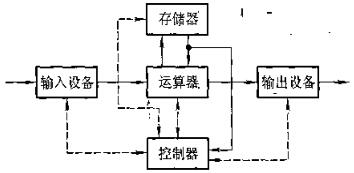
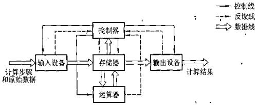
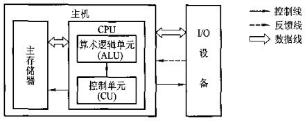

# 计算机简介

## 1简介

>感觉基本上是为了书的完整性安排的章节，有点常识的感觉。

计算机：软件+硬件。

软件也是数据，存放在计算机的主存或辅存。分成系统软件和应用软件。

系统软件直接叫造作系统也没啥问题，后面会学到。

程序员写的高级语言程序翻译成机器语言，实现人对计算机这个工具的使用。实际上写高级程序语言是件复杂的事，翻译也是一件复杂的事，机器语言更是。

早期出现了汇编语言，但是注意计算机无法直接执行汇编程序，计算机劲可以执行机器语言（磁环程序、纸带程序），只是汇编离机器码很近，一步之遥，查表可以人工翻译成机器码。

汇编是个巨大的进步，想一下用字符‘0’代替‘30H’，可读性简直太好了。

后来又有了高级一点的，比如C，这就更好使了，只专注解决问题就完事了，不同平台一个程序两次编译，最后效果一样。

（计算机层次结构问题，未完待续，M0-M4）

## 2计算机基本组成

### 冯·诺伊曼机
这里的组成讲的是**冯·诺伊曼**计算机，他提出了“程序存储”的概念，以此概念作为基础的称为冯·诺伊曼机。特点如下：
- 计算机由运算器、存储器、控制器、输入设备和输出设备五大部件组成。指令和数据以同等地位存放于存储器内，并可按地址寻访。
- 指令和数据均用二进制数表示。
- 指令由操作码和地址码组成，操作码用来表示操作的性质，地址码用来表示操作数在存储器中的位置。
- 指令在存储器内按顺序存放。通常，指令是顺序执行的，在特定条件下可根据运算结果或根据设定的条件改变执行顺序。
- 机器以运算器为中心，输入输出设备与存储器间的数据传送通过运算器完成。

典型的冯·诺伊曼机的结构参考下面这张图（从逻辑功能上划分的应该有的，不是按照现在电脑物理模块分的）

<figure>
    
    <figcaption>典型冯诺伊曼机</figcaption>
</figure>

现代计算机转化以存储器为中心，结构如下图（同样以逻辑功能划分的结构图）

<figure>
    
    <figcaption>现代计算机结构</figcaption>
</figure>

运算器用来完成算术运算和逻辑运算，并将运算的中间结果暂存在运算器内。存储器用来存放数据和程序。控制器用来控制指挥程序和数据的输入、运行以及处理运算结果。输入设备用来将人们熟悉的信息形式转换为机器能识别的信息形式，常见的有键盘、鼠标等。输出设备可将机器运算结果转换为人们熟悉的信息形式，如打印机输出，显示器输出等。

运算器可控制器在逻辑关系和电路结构上关系密切，超大规模集成电路工艺成熟后，往往做在一块芯片上，被叫做中央处理器（Central Processing Unit，CPU），这也是前面注释的框图是按照逻辑功能画的，不是物理模块。在外观上看，控制器和运算器两个逻辑功能模块在一块CPU里。输入输出设备简称为I/O设备（Input/Output Equipment）。

现代计算机的三大部分就有了：CPU、主存储器、I/O设备。

<figure>
    
    <figcaption>现代计算机组成</figcaption>
</figure>

ALU和CU是CPU的核心，I/O也受CU控制。整个一台电脑是在CU的指挥下跑起来的，ALU是个打工的，只算数据。

### 计算机工作步骤

这里的“工作步骤”比较广泛，不单单指计算机自己的工作步骤，还包含了人使用计算机的部分。书上用一个数学问题举例的，这里换成一个工程问题

遇到实际问题以后，建立数学模型，确定计算方法，设计程序。

接下来到计算机了，设计好的程序放在存储器里，只要知道程序的首地址，采用程序计数器+1的方式，机器就能实现自动帮我算题了。数据和指令都放在存储器中，对CPU来说都是数据没区别，操作完全相同，可以用一套控制线路完成。

为了能实现按照地址读写主存储器，必须要有两个寄存器MAR（Memory Address Register）和MDR（Memory Date Register）

运算器最少包含3个寄存器和一个算术逻辑单元（ALU）。ACC（Accumulator）累加器，MQ（Multiplier-Quotient Register）乘商寄存器，X为操作数寄存器。有的机器用MDR取代X。

控制器作为计算机最重要的东西，指挥各部件自动、协调工作。首先取指，然后分析、最后执行。分析阶段先看指令要完成啥操作，然后按指定的寻址方式去对应地址找操作数。这就是一条指令执行的三个阶段。

控制器由

