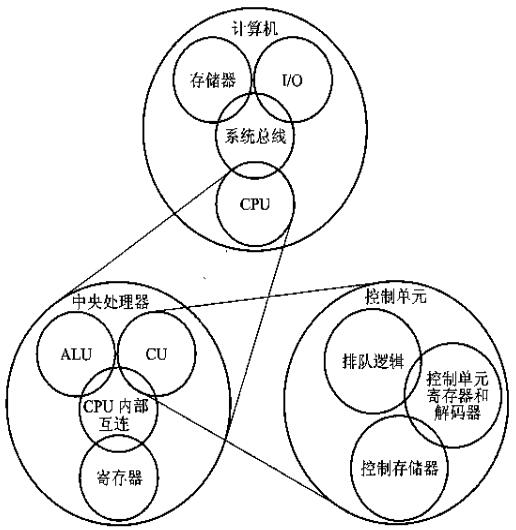

# 计算机组成原理

这一部分的知识我是跟着《计算机组成原理（第2版）》唐朔飞学的，好像知乎有不太友好地声音。因为我本科学过《微机原理》，所以学这本书还是没什么压力的，也有人推荐计《算机体系结构：量化研究方法（第五版）》，也会参考这本书的内容。

《组成原理》有四篇，四个板块，这四个板块不是并列关系，是逐步深入的一个过程。第一篇是概论，主要在讲故事，为了教材的完整性。第二篇是整个计算机硬件，第三篇拿出了硬件中的CPU单独学，第四篇则是拆开CPU看里面的控制模块是怎么回事。

<figure>
    
    <figcaption>章节关系</figcaption>
</figure>

知识上越来越深入计算机“计算”的核心，从硬件上来看研究的东西越来越小、越来越靠近CPU内部。

