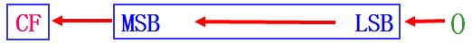
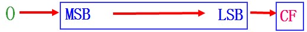
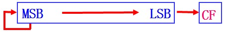
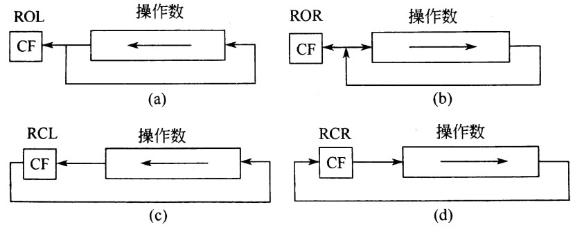

# x86指令集与汇编程序

从高级语言来看程序由语句组成比如`do{ … } whille;`，从汇编语言角度看程序由指令组成。指令直接由CPU执行，因此不同CPU会有不同指令，全部指令称为指令系统（指令集）。

机器指令为二进制数，与CPU设计有关，为了方便人工编写有符号指令。一条指令通常有两部分：`操作码 操作数`。**寻找操作数的方式就是寻址方式**。这一部分内容可以对照8086/8088CPU的编程结构学习，深入理解CPU内部寄存器的作用。

这一章的内容比较琐碎，先介绍了寻址方式，然后分6类介绍了指令集，这一章是汇编程序设计和CPU实际应用（接口技术）的基础。

## 1. 寻址方式

在寻址方式之前，先说一条指令`MOV`其含义是把数据搬动到一个位置，因此由从哪里搬，搬去哪里的问题。

在介绍寻址方式的时候，把数据搬动到AX寄存器，我们只关注从哪里搬动，即如何去找到这个我们要搬动的数据。

- **立即寻址**：去代码段找数据。操作数在操作码后，操作数称为立即数。

立即数存放在代码段，汇编中可以使用二进制、十进制、十六进制、字符、符号常量。

- **寄存器寻址**：去寄存器找数据。操作数存放在寄存器里。
- **存储器寻址**：去存储器找数据  
操作数在存储器中。程序设计时用逻辑地址表示，段地址默认或使用段超越前缀指定。x86指令系统设计了以下几种存储器寻址方式：
  - **直接寻址**  
    数据在地址`[xxxxH]`处，直接给出。默认段地址DS。
    ```nasm
    MOV AX, [2000H]  	;AX ← DS:[2000H]
    MOV AX, ES:[2000H]  ;AX ← ES:[2000H]
    ```
  - **寄存器间接寻址**  
    数据的地址存在寄存器里。默认段地址：BX、SI、DI为DS；BP为SS。
  
  - **变址寻址**  
    数据地址和寄存器里的地址差个偏移量。默认段地址：BX、SI、DI为DS；BP为SS。  
    一个典型的例子，数组，定义了`char a[0]`，寄存器里的地址是`&a[0]`，也就是`a`，偏移量根据数据类型确定。
    ```nasm
    MOV AX, [SI + 06H]	
    MOV AX, 06H[SI]
    ```
  - **基址加变址寻址**  
    数据地址的偏移量也用寄存器表示，更灵活。基址寄存器（BX、BP）加上变址寄存器（SI或DI）形成。默认段地址：BX为DS；BP为SS。
    ```nasm
    MOV AX, [BX + SI]
    MOV AX, [BX][SI]
    ```

  - **相对基址变址寻址**  
    这个断句：相对/基址加变址/寻址。  
    数据地址在基址变址的基础上再来个常量。有这个寻址能力，但是写程序不一定要这么用。基址寄存器（BX、BP）加上变址寄存器（SI或DI）+有符号数形成。
    ```nasm
    MOV AX, [BX+DI+6]
    MOV AX, 6[BX+DI]
    MOV AX, 6[BX][DI]
    ```

## 2. x86指令集简介

指令集分为6组：数据传送指令、算术运算指令、逻辑运算指令、串操作指令、程序控制指令、CPU控制指令。

## 3. 数据传送指令

- `MOV OPRD1, OPRD2`  
`MOV`指令可以用于寄存器之间传送（除了CS，IP）；寄存器与存储器之间；立即数→寄存器（除段）；立即数→存储器。
    ```nasm
    mov byte ptr [bx+si] , 255
    mov word ptr [bx+si] , 255
    ```

- `PUSH  r16/m16/seg`  
先 `SP = SP - 2` ，然后`r16/m16/seg→SS:[SP]`

- `POP r16/m16/seg`  
先 `SS:[SP]→r16/m16/seg` ，然后`SP=SP+2`	

- `XCHG reg, reg/mem`  
用于交换两个操作数内容。可以在寄存器之间；寄存器与存储器之间进行。
    ```nasm
    XCHG AL, BYTE PTR wvar+1 ;指定类型 
    ```

- `IN AL/AX, DX`  
这个指令和CPU设计有关，执行时，DX直接接通到地址总线，AL/AX直接接通到数据总线。0~255端口可以用立即数。

- `OUT  DX, AL/AX`  
同IN指令，AL/AX直接接通数据总线，DX直接接通地址总线。

- `XLAT`  
查表指令，把`ds:[bx+al]`地址处的数据移动到al寄存器。可以指定段`XLAT  ES：table`

- `LEA r16, mem`  
取存储器偏移地址到寄存器。  
区别OFFSET在汇编过程中得到偏移地址。

- `LDS r16, mem`  
指针传送指令。把mem地址开始的4byte作为基址和便宜地址。  
r16←[ mem ]，DS←[ mem＋2 ]

- `LES r16, mem`  
r16←[ mem ]，ES←[ mem＋2 ]

- `LAHF`  
标志寄存器中的低8位→AH

- `SAHF`  
AH→标志寄存器中的低8位

- `PUSHF`

- `POPF`

## 4. 算术运算指令

8086/8088CPU提供加减乘除四种运算指令，带符号数用补码表示，也可进行10进制校正，这些都和CPU设计有关。  
ADD ADC INC；SUB SBB DEC NEG CMP；MUL IMUL；DIV IDIV CBW CWD；DAA DAS AAA AAS AAM AAD。

- 加法指令：
  - `ADD  dest, src`  
  不带进位加法，`dest ← dest+src`，结果影响（全部）标志位。
  - `ADC  dest, src`  
  带进位加法，`dest ← dest+src+CF`，结果影响（全部）标志位。
  - `INC  reg/mem`  
  不影响CF, 影响PF, AF, ZF, SF, OF。  
  存储器操作要指出数据类型

- 减法指令：
  - `SUB  dest, src`  
  不带借位减法，`dest ← dest - src`，结果影响（全部）标志位。
  - `SBB  dest, src`  
  带借位减法，`dest←dest-src-CF`，结果影响（全部）标志位。
  - `DEC  reg/mem`  
  不影响CF, 影响PF, AF, ZF, SF, OF。  
  存储器操作数显式说明变量类型。
    ```nasm
    dec byte ptr [si]
    ```
  - `NEG  reg/mem`  
  对操作数取补码后送回；影响CPAZSO。当有操作数CF=0。
  - `CMP  dest, src`  
  不送回结果，只影响CPAZSO。  
  对无符号数，借位CF=1，OPRD1<OPRD2  
  对带符号数，则可根据OF与SF异或运算，结果为1，则OPRD1<OPRD2

除INC和DEC不影响CF标志外，其他按定义影响全部状态标志位

- 乘法指令：
  - `MUL   reg/mem`  
  无符号，当乘积高半部分不为0，CF=OF=1; 否则，CF=OF=0
  - `IMUL  reg/mem`  
  有符号，乘积高半部分每位与低半部分最高位相同时：CF=OF=0;  
  `AL × r8/m8 → AX`  
  `AX × r16/m16 → DX.AX`  
  结果影响CF和OF。AF, PF, SF, ZF标志位无意义。

- 除法指令：
  - `DIV r8/m8`  
  16位除8位，`AX ÷ r8/m8`的商送入`AL`，余数送入`AH`
  - `DIV r16/m16`
  32位除16位，`DX.AX÷r16/m16`的商送入`AX`，余数送入`DX`

- 压缩BCD码调整
  - `DAA`  
  ADD或ADC将两个两位BCD码相加，结果在AL中，此时执行该指令。
  - `DAS`  
  SUB或SBB将两个两位BCD码相减，结果在AL中，此时执行该指令。
  - `AAA`  
  加法执行后，将AL内容变换为非压缩十进制数，AH.AL。   
  - `AAS`  
  减法十进制调整   
  - `AAM`  
  乘法十进制调整   
  - `AAD`  
  除法十进制调整   

## 5. 逻辑运算指令

NOT AND TEST OR XOR，SAL/SHL SAR/SHR ，ROL RCL RCL RCR。
- 逻辑指令
  - `NOT  reg/mem`  
  不影响标志位
  - `AND  dest, src`  
  - `OR  dest, src`
  - `XOR  dest, src`
  - `TEST  dest, src`  
  结果不送回，只影响PSZ，CF=OF=0。
- 移位指令：移动数大于1用CL
  - `SHL  reg/mem, CL`  
  逻辑左移，左移1/CL位，低位补0高位进CF。
  - `SAL  reg/mem, CL`  
  算术左移，与SHL相同

<figure>
  
</figure>

  - `SHR  reg/mem, CL`  
  逻辑右移，不管符号位。

<figure>
  
</figure>

  - `SAR  reg/mem, CL`  
  算术右移，符号位不变。

<figure>
  
</figure>

- 循环移位指令：影响CF，不影响SF、ZF、PF、AF标志。

<figure>
  
</figure>
 
双操作数逻辑指令AND、OR、XOR和TEST设置CF＝OF＝0，根据结果设置SF、ZF和PF状态，而对AF未定义；

## 6. 程序控制指令

程序控制指令不影响标志位，分为段内转移、段间转移。

JMP，LOOP，CALL RET，INT n  IRET，串操作指令。
- `JMP oprd ;无条件转移`
  ```nasm
  ;直接转移
  JMP  SHORT  OPRD	    ;短程：－128～＋127
  JMP  NEAR  PTR  OPRD  ;近程：在当前代码段64KB范围内转移，NEAR可省略
  JMP  FAR  PTR  OPRD   ;远程：目标为32位数，送到CS:IP

  ;间接转移
  JMP  WORD  PTR  [SI]  ;段内，[SI]开始连续两个字节直接送IP
  JMP  DWORD  PTR  [SI] ;段间，[SI]开始连续四个字节直接送CS:IP
  ```
- `条件转移`              
条件转移为短转移-128~127，根据标志位来确定转移
  ```nasm
  JZ/JE
  JNZ/JNE
  JNS
  JP/JPE
  JNP/JPO
  JO
  JNO
  JC/JB/JNAE
  JNC/JNB/JAE
  JBE/JNA
  JNBE/JA
  JL/JNGE
  JNL/JGE
  JLE/JNG
  JNLE/JG
  ```
- `循环指令`  
  - `LOOP    label`  
  CX计数，CX=0顺序执行  
  `LOOPZ/LOOPE/ LOOPNZ/LOOPNE`
  - `JCXZ   label`  
  CX=0，转移

- 子程序调用与返回
  - `CALL   label`  
  调用，有好多种寻址方式，段内调用IP入栈，段间调用SS:IP入栈，为后面返回做准备。
    ```nasm
    CALL label		      ;段内调用、直接寻址
    CALL r16/m16	      ;段内调用、间接寻址
    CALL far ptr label	;段间调用、直接寻址
    CALL far ptr r16/m16;段间调用、间接寻址
    ```
  - `RET`  
  `IP←(SP+1,SP); SP=SP+2;`
  - `RET  N`  
  段内返回，从栈内取2字节，栈指针+2，段间返回，从栈内取4字节，栈指针+4  
  带立即数返回SP还要加上立即数

- 中断和返回
  - `INT  N`  
  中断调用
  - `INTO`  
  对溢出进行响应
  - `IRET`  
  比RET多了恢复标志寄存器内容

## 7. 串操作指令

- `REP  MOVSB ;串操作指令`
  CX计数，源地址DS:[SI]，目的地址ES:[DI]  
  DF=1，地址减，DF=0地址加  
  `ES:[DI] ← DS:[SI]`

## 8. 标志处理与CPU控制

- CPU控制指令  
CLC  STC  CMC  CLD  STD  CLI  STI
HLT  WAIT  NOP

指令使用注意点：单操作数指令中操作数无法区分字量还是字节量时一定要有显式说明。

## 9. x86汇编语言程序设计

汇编语言中用到了指令集，此外还有一些在程序运行时CPU不执行的源码语句（伪指令）用来定义变量和程序框架等。

汇编语言中有两类汇编指令：指令性语句、指示性语句。（真指令、伪指令）。**真指令在汇编程序汇编后可产生机器指令代码；伪指令在编译时起作用，告诉汇编程序对源程序中的执行性指令应该如何产生代码，或分配存储区**。

汇编语句典型格式：`(标识符) 指令助记符 (操作数) (;注释)`

标识符有**变量名**和**标号**，就是个地址，可理解为指针名，不带冒号为变量名，带冒号为标号（理解为函数指针）。标识符不用数字打头。

变量和标号都是存储器操作数。变量和标号的三个属性：**段地址、偏移地址、类型**。变量的类型表示变量长度（字节数）；标号类型表示在跳转时NEAR或FAR属性。

下面介绍汇编程序除指令集之外的另外三个基础：运算符、表达式和伪指令，然后开始正式迈入汇编程序设计的大门。

### 9.1 汇编语言运算符

运算符区别于运算指令，运算指令在CPU运行时起作用，运算符与伪指令类似在汇编时就会得出结果。

- 算术运算符  
`+ 、 – 、×、／、MOD`

- 逻辑运算符  
`AND、OR、NOT 、XOR``

- 关系运算符  
`EQ、NE、LT、GT、LE、GE`
  >相等EQ(Equal)、不等NE(Not Equal)、小于LT(Less Than)、大于GT (Greater Than)、小于等于LE(Less Than or Equal)、大于等于GE(Greater Than or Equal)

- 取值运算符  
`SEG、OFFSET、TYPE、SIZE、LENGTH`  
取值运算符获得的都是字操作数，即结果为16位
```nasm
MOV  AX, SEG  SLOT   ;将SLOT的段地址送入AX寄存器
MOV  AX, OFFSET  SLOT;将SLOT的偏移地址送入AX寄存器
```
TYPE返回表示存储器操作数内存变量和标号类型的数值。  
SIZE取得并返回由DUP定义的内存变量的字节数  
LENGTH 取得并返回由DUP定义的内存变量基本单元的个数。  
SIZE=LENGTH×TYPE  

- 属性运算符  
`类型  PTR  操作数表达式`  
  ```nasm
  JMP  WORD  PTR  [SI]
  ```
取PTR右侧的段地址和偏移地址数据，作为PTR左侧的类型。

### 9.2 表达式

由运算符和操作数组成的语句，在汇编时产生一个确定值。

**存储器操作数**是一个地址操作数，即该操作数代表一个存储单元的地址，通常以标识符的形式出现。三方面属性为：段地址、偏移地址、类型（NEAR FAR）。

### 9.3 伪指令

指示性语句，是给汇编程序的指令，用来控制**数据存储空间、实现条件汇编、设定段寄存器**等。
定义数据
定义段
定义段寄存器
过程定义伪指令
宏指令
定位伪指令
汇编结束

### 9.4 程序设计
至少三段：代码段、数据段、堆栈段。  
编程结构：顺序、分支、循环。

子程序设计，参数传递方法：利用寄存器，利用存储单元，利用堆栈。

分析子程序与宏调用的区别和联系：子程序汇编后为一段目标代码，每次调用跳转执行，不占空间。宏调用在汇编时插入展开到调用处，生成多段目标代码，占用空间，但不需要跳转执行。

分析子程序的设计中，应该注意的属性：子程序的名称，功能，入口参数，出口参数，用到的寄存器和存储单元。


汇编程序的完整结构
```nasm
;数据段
DATA SEGMENT
      X 	DB	 3
      ;······其他数据
DATA ENDS

;堆栈段
STACK SEGMENT
      DB 100 DUP (?)
STACK ENDS

;代码段
CODE SEGMENT
      ASSUME CS:CODE, DS:DATA, SS:STACK
BEGIN:
      MOV AX, DATA
      MOV DS, AX
      ;······用户程序
      ;······
      MOV AH, 4CH
      INT 21H
CODE ENDS
END BEGIN

;子程序
DELAY PROC
      MOV BL, 10
LL:
  MOV CX, 2801H
L1:
  LOOP LL
      DEC BL
      JNZ LL
      RET
DELAY ENDP

;宏定义
SHIFT MACRO	X, Y
    MOV CL, Y
    SAL X, CL
ENDM
```

