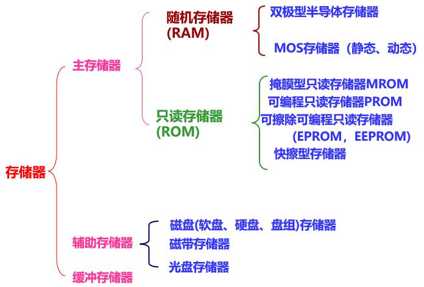
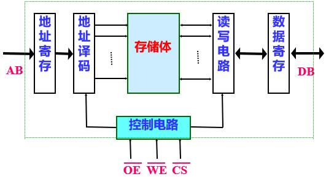
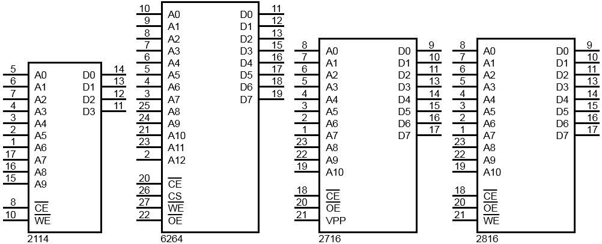
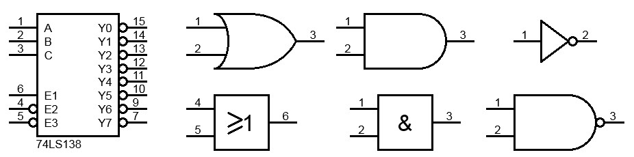

# x86存储系统

这一章先介绍了存储器的分类，然后介绍了常用的存储器芯片和8086系统中的扩展，最后从提升数据读取速度的角度出发介绍了三级存储结构。

## 1. 存储器概述与分类

衡量存储器的性能指标主要有三个：**容量、速度、成本**。

为了兼顾三个方面的指标，通常采用三级存储器结构：**主存储器、辅助存储器、高速缓冲存储器**。

从整体看，其速度接近高速缓存的速度；其容量接近辅存的容量；位成本接近廉价慢速的辅存平均价格。

<figure>
    
</figure>

储存器芯片按照存储介质分类：半导体存储器、光电存储器、磁表面存储器、光盘存储器等。储存器芯片按照存取方式分类：随机存储器RAM、只读存储器ROM。存储器芯片按在计算机中的作用分类：主存储器、辅助存储器、缓冲存储器。按照掉电数据是否丢失分类：易失性存储器、非易失性存储器。

## 2. 存储芯片结构与常用芯片介绍

存储器的组成部分：存储体、地址译码器、片选与读／写控制电路、I/O电路。

<figure>
    
</figure>

地址译码有单译码（线性译码）和双译码（矩阵译码）两种方式。

- RAM  
RAM有SRAM和DRAM，静态RAM(SRAM)是以双稳态元件作为基本的存储单元来保存信息，而动态RAM (DRAM)是靠电容来存放信息的，使得这种存储器中存放的信息容易丢失，必须定时进行刷新。
- ROM  
由于它和读写存储器共用同一个地址空间，故仍属于主存储器的一部分。ROM有PROM、EPROM、EEPROM、Flash Memory等。

常用的芯片：

<figure>
    
    <figcaption>存储器芯片</figcaption>  
</figure>

Intel 2114为1K×4位SRAM，Intel6264为8K×8位SRAM。  
Intel2716 为2K×8位EPROM，还有同系列不同容量的2732、2764等。  
Intel2816为2K×8位EEPROM，此外又有串行AT24C01。

## 3. 存储器的扩展

存储芯片与CPU连接主要考虑以下三个部分：数据线、地址线、片选线、读写控制线。

存储器扩展时要注意的问题：
- ①（驱动）CPU总线的负载能力；
- ②（时序）CPU的时序和存储器的存取速度之间的配合问题；
- ③（地址）存储器的地址分配和片选问题。

存储器扩展的方式：
- ①位扩充；
- ②字扩充（或地址扩充）；
- ③位扩充字扩充一起。

译码方式：
- ①全译码：所有地址线都参与对存储单元的寻址，存储单元物理地址唯一，不存在地址重叠，但是译码电路复杂且连线多。
- ②部分译码：只有部分高位地址线参与对存储芯片的译码。译码电路简单，但是存在地址重复，部分地址空间浪费。
- ③线选译码：用高位地址线直接选择存储芯片。构成简单，但是地址空间浪费严重。

在译码时常用的由3-8译码器以及各种逻辑门。

<figure>
    
    <figcaption>常用译码器件</figcaption>  
</figure>

 
举个例子，加深对于存储器地址与硬件连接的理解

位8088CPU扩展存储器。ROM为12K，使用4K×8位的EPROM2732芯片。RAM为8K，选用2K×8位的6216芯片，地址空间从1000H开始，ROM在低地址，RAM在高地址，地址连续。

地址分配很简单，软件上的事情

|$$ A_{15} - A_{12} $$|$$ A_{11} -  A_8 $$|$$ A_7 - A_4 $$|$$ A_3 - A_0 $$| $$ \overline {y}_i $$ |地址范围|
|:-:|:-:|:-:|:-:|:-:|:-:|
|$$\text{0 0 0 1}$$|$$\times\times\times\times$$|$$\times\times\times\times$$|$$\times\times\times\times$$|$$ \overline {y}_1 $$ | $$ \text{1000H-1FFFH} $$ | 
|$$\text{0 0 1 0}$$|$$\times\times\times\times$$|$$\times\times\times\times$$|$$\times\times\times\times$$|$$ \overline {y}_2 $$ | $$ \text{2000H-2FFFH} $$ | 
|$$\text{0 0 1 1}$$|$$\times\times\times\times$$|$$\times\times\times\times$$|$$\times\times\times\times$$|$$ \overline {y}_3 $$ | $$ \text{3000H-3FFFH} $$ | 
|$$\text{0 1 0 0}$$|$$0\times\times\times$$|$$\times\times\times\times$$|$$\times\times\times\times$$|$$ \overline {y}_4 $$ | $$ \text{4000H-47FFH} $$ | 
|$$\text{0 1 0 0}$$|$$1\times\times\times$$|$$\times\times\times\times$$|$$\times\times\times\times$$|$$ \overline {y}_4 $$ | $$ \text{4800H-4FFFH} $$ | 
|$$\text{0 1 0 1}$$|$$0\times\times\times$$|$$\times\times\times\times$$|$$\times\times\times\times$$|$$ \overline {y}_5 $$ | $$ \text{5000H-57FFH} $$ | 
|$$\text{0 1 0 1}$$|$$1\times\times\times$$|$$\times\times\times\times$$|$$\times\times\times\times$$|$$ \overline {y}_5 $$ | $$ \text{5800H-5FFFH} $$ | 

硬件连线就更简单了。跟着表接就好了。

## 4. 高速缓冲存储器Cache

Cache存在的原因：DRAM价格较低但相对CPU而言存储速度较慢，SRAM存取速度可与CPU处于同一数量级，但贵且体积较大。因此在主存储器与CPU之间会设计一个SRAM作为高速缓冲存储器（Cache）。现代PC中，主存储器主要指内存条（如DDR4全名DDR SDRAM），Cache会分为好几级，CPU和主板上都会有

程序访问的局部性：在一个较短时间内，对局部范围的存储器地址访问频繁，而对此范围以外的地址空间则访问甚少的现象。  
因此根据程序的局部性原理，在主存和CPU之间设置Cache，把正在执行的指令地址附近的一部分指令或数据的副本从主存装入Cache中，供CPU在一段时间内使用提高系统速度。

命中：Cache控制器把来自CPU的数据读写请求，转向Cache存储器，如果数据在Cache中，则CPU直接对Cache进行操作，称为一次命中。命中时不需要插入等待周期。

Cache写操作：
- ①直达法，命中时将新内容同时写入Cache和主存储器；
- ②回写法，只写入Cache，直到Cache中块要被替换时才一次性写会主存。

地址映像方式（Cache地址对应主存地址）：**直接映像、全相连映像、组相连映像**。

替换策略（Cache中来新的内容）：先进先出策略（FIFO）、近期最少使用策略（LRU）。

三级存储结构：三级存储结构为主存-高数缓存-辅存，解决了价格、容量、存取速度的问题。
 
