# 定时与计数

这一部分介绍这个芯片以及接口技术，因此端口的概念放在了这里。IBM5150板上有一个定时\计数芯片8253。

定时和计数事一回事，计数就是数脉冲数，定时就是数周期一致的脉冲数。

定时功能实现的三种方法：软件延时、不可编程硬件延时、可编程硬件延时。

## 1. 端口

实际计算机系统里最少也要有CPU和存储器，有了这两个东西就可以用起来了。除了这两个，还有各种扩展芯片（如定时器、并行输出口、模数芯片等），CPU与这类芯片的通信通过端口实现。每个部件（或接口）内都有一组寄存器，称为“端口”，每个端口都有一个端口地址。

端口分为三类：数据端口、状态端口、控制端口。在硬件连接上，使用地址线获得片选信号，8086系统中，用户可以通过输入输出指令对端口进行操作。


## 2. 8253编程结构与引脚

<figure>
    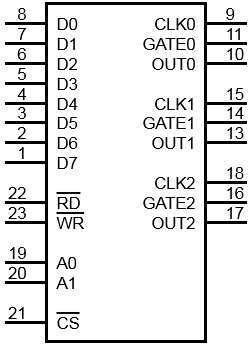
    <figcaption>8253引脚</figcaption>
</figure>

<figure>
    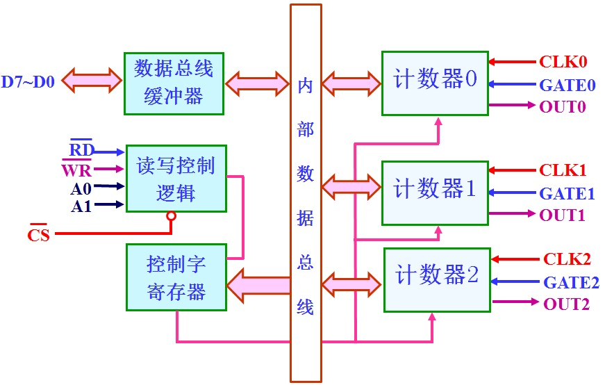
    <figcaption>8253编程结构</figcaption>
</figure>

<figure>
    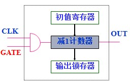
    <figcaption>8253一个通道</figcaption>
</figure>

Intel 8253特点：3个16位计数器通道；每个计数器6种工作方式；按二进制或十进制（BCD码）减一计数。每个计数器内部都有初值寄存器、减一计数器、输出锁存器。

计数初值存于初值寄存器； $$ CLK $$ 每个下降沿计数器减一；可以用 $$ GATE $$ 信号（电平或上升沿）控制计数器工作。

## 3. 初始化编程

编程一般步骤：
- ①写控制字；
- ②写计数初值；
- ③读取计数值。

计数范围：二进制0000H-FFFFH，十进制0-9999。写入控制字后，要紧跟着写入计数初值（由控制字确定写入顺序）。对三个通道的控制都写入控制端口。

<figure>
    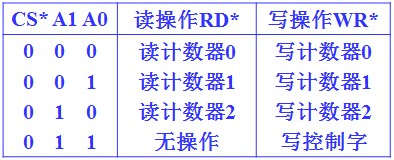
    <figcaption>8253端口地址</figcaption>
</figure>

<figure>
    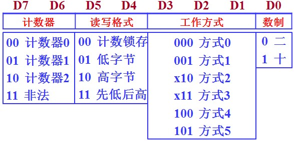
    <figcaption>8253控制字(A1A0=11)</figcaption>
</figure>

【例】（8253初始化）设8253地址为`70H-73H`。使用T0的方式2进行二进制计数，计数初值为100，仅使用低8位，进行初始化编程。

```x86asm
MOV  AL,  14H	  ; 0001 0100B
OUT  73H, AL
MOV  AL,  100
OUT  70H, AL
```

【例】（8253读计数值）设8253地址为`70H-73H`。读取T0当前计数值存储到BX。

```x86asm
MOV  AL,  0	   ;0000 0000B 锁定
OUT  73H, AL
IN   AL,  70H  ;先低
MOV  BL,  AL
IN   AL,  70H  ;后高
IN   BH,  AL
;锁存后要连着读两次，先读的是低字节，后读的是高字节。
```

## 4. 8253工作方式

8253共有6种方式，04为软件触发，15为硬件触发，23为周期信号。

- 方式0：计数结束中断

<figure>
    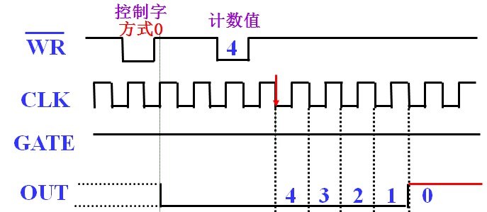
    <figcaption>8253方式0计数时序图</figcaption>
</figure>

- 方式4：软件触发选通

<figure>
    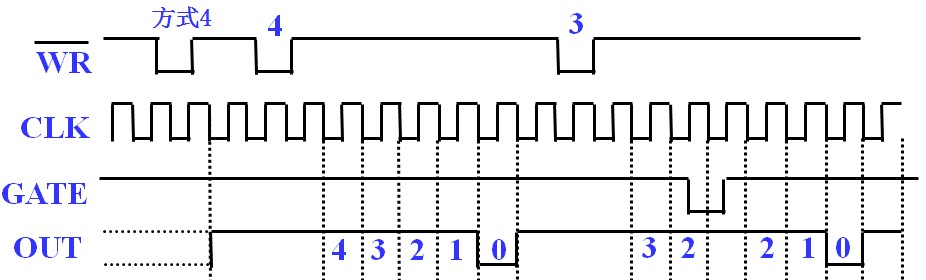
    <figcaption>8253方式4计数时序图</figcaption>
</figure>


- 方式1：可编程单稳脉冲

<figure>
    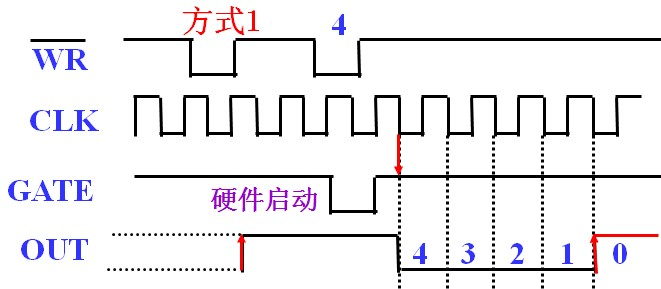
    <figcaption>8253方式1计数时序图</figcaption>
</figure>

- 方式5：硬件触发选通信号

<figure>
    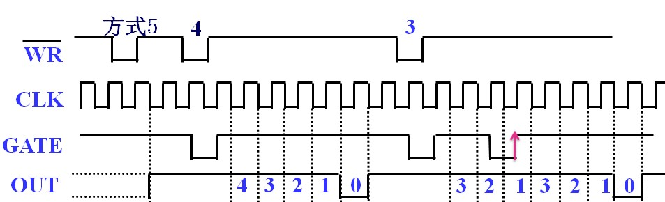
    <figcaption>8253方式5计数时序图</figcaption>
</figure>

写入控制字与初值后，只有在GATE上升沿触发下开始计数，每次上升沿都重新开始计数，故称硬件触发。

- 方式2：频率发生器

<figure>
    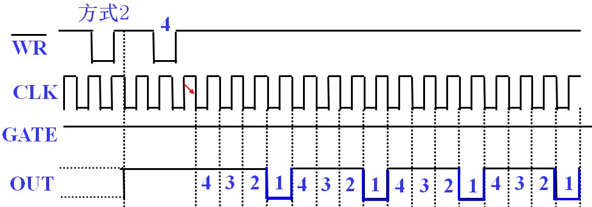
    <figcaption>8253方式2计数时序图</figcaption>
</figure>

- 方式3：方波发生器
  
<figure>
    
    <figcaption>8253方式2计数时序图</figcaption>
</figure>

写入初值自动开始周期计数，GATE变0又变高后，从初值开始重新计数。

总结：不同方式下要注意的点：OUT的变化，GATE的影响。

<figure>
    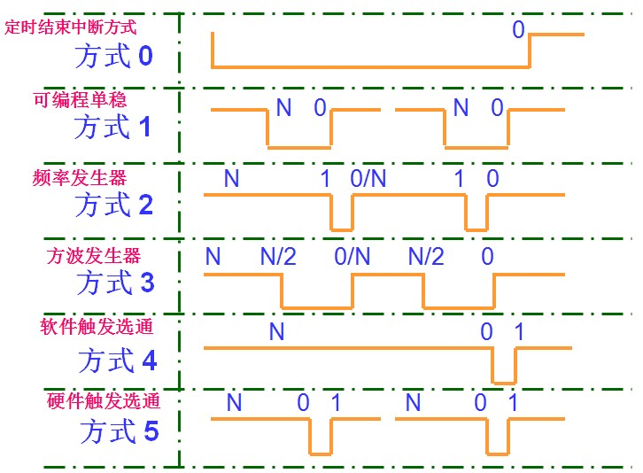
    <figcaption>定时对比</figcaption>
</figure>

典型应用：以2MHz输入8253，实现每5秒定时中断（设8253端口地址40H-43H），对于比较长时间的定时，需要去考虑定时器串联。


