# 输出输入数据

## 输入输出控制方式

（数据）输入输出对计算机来讲是必可不少的。由于外设速度各不相同，因此CPU与外设之间传输数据的三种控制方式有：**程序方式、中断方式、DMA方式**。
- 程序方式：简单但是降低CPU效率；
- 中断方式：效率高与CPU并行工作，但中断现场恢复过程；
- DMA方式：传输效率高，CPU不直接参与，但设备开销大。

对于8086来讲，使用IO指令通过数据总线读写都可以算作输入输出，并不特指并口或者串口。

（书上写的是CPU和外设之间传送有DMA方式，可是我仔细想了一下，DMA一般指外设-外设、外设-存储器之间传送，不经过CPU，这里的表达是不是不严谨呢？写成“数据传送的控制方式”会不会好一点。先应付考试，后面把表达改的严谨一点）。

### 程序传送方式

程序控制方式是指用程序来控制数据输入输出，纯软件控制方式。根据程序控制的方法分为<font color = "red">无条件传送</font>和<font color = "red">条件传送（查询方式）</font>。无条件传送方式的前提是外设必须**随时准备就绪**，适用于简单设备如数码管、按键、拨码开关等。条件传送有**查询环节和传送环节**，对应状态端口和数据端口。

无条件传送举个例子，按键和指示灯，地址为`8000H`，通过读写信号区分输入输出。

<figure>
    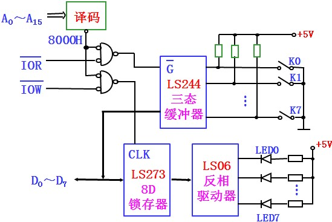
    <figcaption>无条件传送电路</figcaption>
</figure>

电路设计上把写信号作为`CLK`，很巧妙。


- 条件传送输入  
①输入ready信号；②查询端口查询DB上的状态信号；③如果数据准备好，选通数据端口，数据送上数据总线，同时D触发器复位。

<figure>
    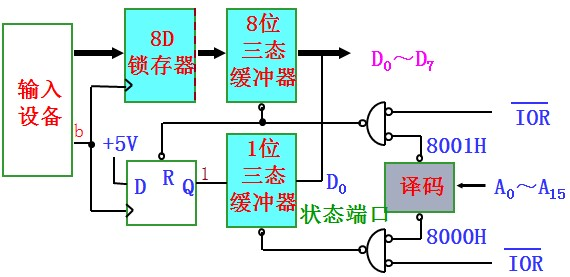
    <figcaption>条件传送输入电路</figcaption>
</figure>

上面这个输入电路设计也很精妙，输入设备的就绪信号作为时钟，所存数据并且同时将就绪状态信号用D触发器保存下来。当CPU查询状态的时候，状态是送到$$ \color{ff00ff}D_0 $$上的。在读数据时，读信号同时复位了D触发器的状态信号。


- 条件传送输出接口  
①查询状态端口；②若空闲，数据送上数据锁存器；③外设取走数据$$ \overline {ACK} $$复位。

<figure>
    
    <figcaption>条件传送输出电路</figcaption>
</figure>

这个接口电路的分析从数据送上总线开始，CPU把数据送上总线的同时通过D触发器将数据就绪信号保存下来。CPU查询输出状态时，状态信号在$$ \color{ff00ff}D_7 $$。设备如果未取走，D触发器为1，若取走，应答信号会复位D触发器。

条件传送的优先级：大系统设备较多时，可以用轮流查询的方式来分配优先级，先查询的设备有较高的优先级。这是一种程序控制优先级的方式。

## 中断传送方式

### 8086CPU中断

中断传送数据需要CPU功能上的配合，因此在x86指令集中有中断相关的指令。  
中断过程：(1)中断请求；(2)中断响应；(3)关中断；(4)断点保护；(5)中断源识别；(6)现场保护；(7)中断服务；(8)恢复现场；(9)开中断；(10)中断返回。  
8086CPU中断检测：每条指令的最后一个时钟周期采样中断请求输入引脚。

<figure>
    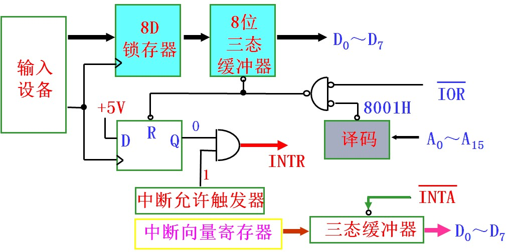
    <figcaption>中断接口电路</figcaption>
</figure>

一个中断接口如图，输入设备发出中断信号，CPU应答时选通中断向量寄存器获得中断号，根据中断号跳转相应程序读数据的同时复位中断信号。

中断优先权的判定方法：软件查询、简单硬件电路、专用硬件。

8086CPU中断操作  
8086/8088系统中，中断分为<font color="red">硬件中断</font>和<font color="red">软件中断</font>。硬件中断又可分为可屏蔽中断（INTR）和不可屏蔽中断（NMI），`IF = 1`响应可屏蔽中断。软件中断由运算或中断指令`INT n`产生。  
中断向量：中断服务子程序的入口地址；
中断向量表：所有的中断向量按照一定的规律排列存放到0000H-03FFH；

向量号为`N`的中断服务程序的物理地址为`N*4`，CPU响应中断获取中断号后就可以找到中断服务程序的入口地址。每个中断向量地位为4Byte，`CS:IP`，低址低位存放。8086的中断类型码为0~255，256个中断服务程序的入口地址共占用1KB空间。
 
<figure>
    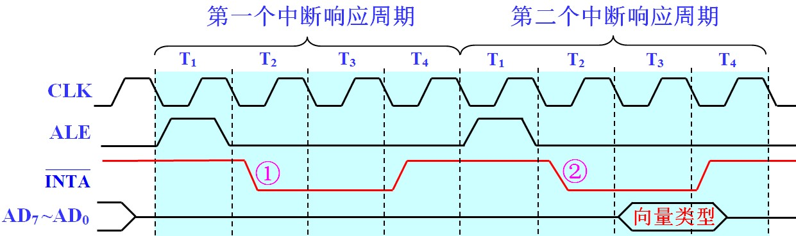
    <figcaption>中断响应时序</figcaption>  
</figure>

INTR信号是一个电平信号，并且要维持2个时钟周期。CPU在每一条指令的最后一个时钟周期T采样INTR。


中断向量表的建立方法：**绝对地址置入、DOS调用法**。

```nasm
;绝对地址置入
INT_TAB SEGMENT AT 0   ;段定位到0000H 

      ORG  40H*4       ;偏移定位40H*4
INT40 DW 2640H, 4000H  ;40号中断入口地址

      ORG 43H*4
INT43 DW 4620H, 4000H  ;43号中断入口地址

INT_TAB ENDS
```

```nasm
;DOS功能调用来设置中断
PUSH DS;
MOV DX, SEG INT60    ;取中断段地址
MOV DS, DX
MOV DX, OFFSET INT60 ;DS:DX,段：偏移
MOV AL, 60H	         ;AL放中断向量号
MOV AH, 25H	         ;AH被调用功能号
INT 21H		         ; 21H软件中断功能
POP DS
;INT60为中断服务程序标号
```
8086/8088响应的优先级：当前指令>软件中断>非屏蔽中断>可屏蔽中断>单步中断>下条指令。

### 可编程中断控制器8259A

一片8259A可以管理8级中断。最多可以用9片8259A来构成64级的主从式中断管理系统。

**编程结构和引脚**

<figure>
    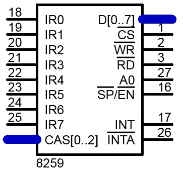
    <figcaption>8259A引脚</figcaption>  
</figure>

<figure>
    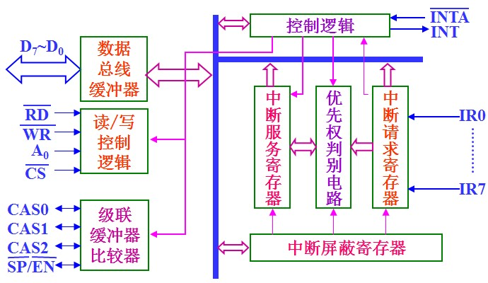
    <figcaption>8259A内部逻辑</figcaption>  
</figure>

- **CAS0 - CAS2** ：级联信号。主片输出，从片输入。
- $$ \overline{SP}/\overline{EN} $$：从设备编程/允许缓冲器。作输入信号使用时，为SP主片/从片的选择控制信号。
  
A0=0时，对应ICW1，OCW2和OCW3；  
A0=1时，对应ICW2，ICW3，ICW4和OCW1。

中断请求寄存器IRR：接收IR0-IR7中断请求，并按中断请求的方式在IRR的相应位置位。  
当前服务寄存器ISR：存放当前正在处理的中断请求。相应位的置位来实现。ISR的置位是在中断响应的第一个INTA有效时完成的。  
中断屏蔽寄存器IMR：置位屏蔽。

8259A中IRR、中断优先权电路、ISR、IMR配合工作方式：8259A的一条或几条IRi信号高电平有效表示请求中断，使IRR的Di位置位；8259A对这些请求进行分析，如果中断允许（未被屏蔽IMi=0）则向CPU发出INT信号；CPU在允许响应可屏蔽中断状态时对INTR作出响应，产生中断响应周期；8259A收到第一个INTA有效信号后，使最高优先权的ISR位置位，对应的IRR位复位；8259A在第二个INTA有效时，把中断向量号送上数据总线，供CPU读取；中断服务结束送EOI结束中断ISR复位，若为自动结束模式，第二个INTA时ISR复位。

<figure>
    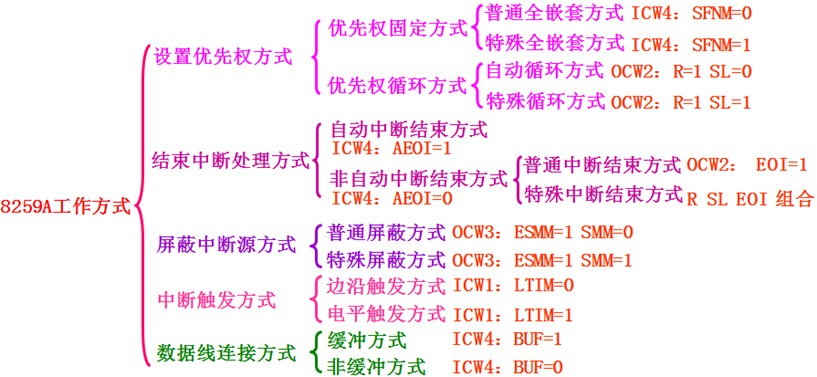
    <figcaption>8259A工作方式</figcaption>  
</figure>


**工作方式**

普通全嵌套：中断优先权顺序固定不变，从高到低依次为IR0，IR1，IR2，…，IR7。  
特殊全嵌套：只有主片可以设置为特殊全嵌套，允许主片同级中断的嵌套，用于级联。  
优先权自动循环方式：一个中断得到响应后，它的优先权自动降为最低。  
优先权特殊循环方式：初始最低优先权是由编程确定。  
自动中断结束方式：一进入中断过程，自动将中断服务寄存器中的对应位清除。  
普通中断结束方式： 
特殊中断结束方式：级连系统的从片在一个中断服务程序结束时，都必须发两次中断结束命令。  
普通屏蔽方式：IMR的Di位置1，则对应的中断IRi就被屏蔽。  
特殊屏蔽方式：将IMR的Di位置1，就会同时使ISR的Di位置0。  
边沿触发方式：上升沿作为中断请求信号。  
电平触发方式：高电平是有效的中断请求信号。  
缓冲方式：SP/EN 引脚作为输出端，输出允许信号，用以锁存或开启缓冲器。  
非缓冲方式：SP/EN 引脚为输入端，级连由其确定是主片或从片。  


```tip
8259A对优先级的管理方式有哪几种？各是什么含义？

优先权固定：普通全嵌套方式、特殊全嵌套方式；优先权循环：自动循环、特殊循环。  
普通全嵌套方式优先权顺序固定不变，从高到低依次为IR0，IR1，IR2，…，IR7，仅允许高优先级中断嵌套；特殊全嵌套方式允许同级中断的嵌套，多用于级联系统主片（只用于主片）；优先权循环自动循环在一个中断得到响应后，它的优先权自动降为最低；优先权特殊循环方式初始最低优先权可由程序设置。
```

**初始化编程**

<figure>
    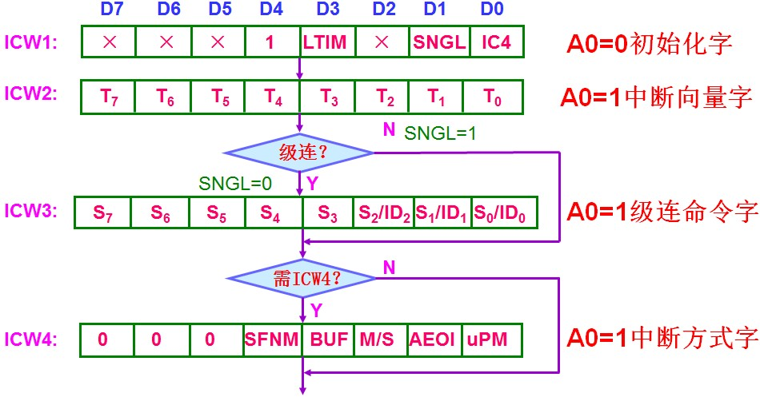
    <figcaption>8259初始化编程</figcaption>  
</figure>

开始工作前，必须进行初始化编程。也就是给8259A写入初始化命令字（ICW）。工作期间，可以通过写入操作命令字（OCW）将选定的操作传送给8259A。  
**ICW1-ICW4必须按顺序写入**，ICW1和ICW2必须写入，ICW3和ICW4是由工作方式决定。通过A0和特征位D4D3区分ICW1、ICW2、ICW3、ICW4还是OCW1

- 1.ICW1写入8259A的偶地址端口（A0=0）

<figure>
    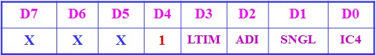
    <figcaption>ICW1</figcaption>  
</figure>

D7-D5：在8086/8088系统中不可用，可随意设置；  
D4：1写入的是ICW1特征位。OCW2、OCW3此位为0；  
D3：LTIM设置中断触发方式。0边沿触发，1电平触发；   
D2：ADI调用地址间隔。8086/8088系统中无意义，随便设置；  
D1：SNGL单片/级联。1单片方式无需ICW3，0级联方式需要ICW3；  
D0：IC4是否写入ICW4。1写入ICW4，0不写入ICW4

- 2.ICW2中断向量字写入8259A的奇地址端口（A0=1）

<figure>
    
    <figcaption>ICW2</figcaption>  
</figure>

用于设置中断向量号，只有D7-D3编程决定，D2-D0由中断引脚确定。

- 3.ICW3级联命令字写入8259A的奇地址端口（A0=1）  
主片：接从片的引脚对应位为是1  
从片：D2-D0指明该从片接到主片的哪一个引脚  

- 4.ICW4中断方式字写入8259A的奇地址端口（A0=1）

<figure>
    
    <figcaption>ICW4</figcaption>  
</figure>

D7-D5：000，ICW4特征位；  
D4：SFNM优先权。1特殊全嵌套，0普通全嵌套；  
D3：BUF缓冲方式。1缓冲方式，0非缓冲方式；  
D2：M/S主片/从片，缓冲方式下设置主从片。1主片，0从片（非缓冲方式无效，用SP=0确定从片）；  
D1：AEOI。1自动中断结束，0非自动中断结束；  
D0：μPM。1 8086/8088CPU，0。

**中断操作编程**

8259A工作期间，可以随时接受操作命令字OCW1~OCW3，写入没有顺序要求，但应注意写入的端口地址和特征位。

- 1.OCW1屏蔽命令字写入奇地址（A0=1）

<figure>
    
    <figcaption>8259OCW1</figcaption>  
</figure>

这个命令字存放在寄存器IMR，1禁止中断，0允许中断。

- 2.OCW2中断结束和优先权循环命令字（A0=0）

<figure>
    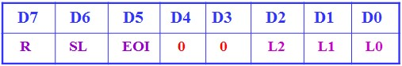
    <figcaption>8259OCW2</figcaption>  
</figure>

R（循环），SL（设置优先权）和 EOI（中断结束）3位配合使用，用以产生中断结束EOI命令和改变优先权顺序。

D7：R（循环），R=1自动循环，R=0不自动循环；  
D6：SL（设置优先权），SL=1，控制命令对特定中断源进行的，需要用到L2-L0编码；  
D5： EOI（中断结束），操作位中断结束命令；


- 3.OCW3屏蔽和读状态命令字（A0=0）

<figure>
    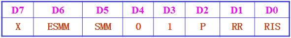
    <figcaption>8259OCW3</figcaption>  
</figure>

ESMM和SMM两位用于设置中断屏蔽方式。P，RR和RIS用于规定随后读取的状态字含义。  
ESMM：允许设定屏蔽方式。  
SMM： 屏蔽方式位。0普通屏蔽， 1特殊屏蔽。  
P：1读中断查询字  

无论何时读8259A的奇地址端口，都读取中断屏蔽寄存器IMR的内容

<figure>
    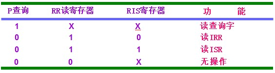
    <figcaption>8259OCW3查询</figcaption>  
</figure>

【例】一片8259A的端口地址为80H，查询中断请求状态字、IRR、ISR与IMR

```x86asm
;查询中断请求状态
MOV  AL, 0000 1100B
OUT  80H, AL
IN   AL, 80H	

;查询IRR
MOV  AL, 0000 1010B
OUT  80H, AL
IN   AL, 80H	   ;IRR

;查询ISR
MOV  AL, 0000 1011B
OUT  80H, AL
IN   AL, 80H	   ;ISR
```

## DMA传送方式

DMA方式适用于高速外设及大量数据块传输的场合。

DMA传送工作过程：
- ①DMA初始化设置（工作方式，缓冲区首址，字节数）；
- ②总线让出；
- ③数据传送；
- ④自动增减地址计数判断完成。


DMA与CPU的两个确认信号：HOLD与HOLDA。  
DMA传送的实现方式：CPU停机方式、周期挪用方式、周期扩展方式。  

可编程DMA控制器8237A
4个独立的DMA传输通道，每个通道独立的地址寄存器和字节计数器，每次传送最大数据块长度64KB
4种工作模式：单字节传输、数据块传输、请求传输、级联模式。
可用5片扩展16个DMA传输通道
