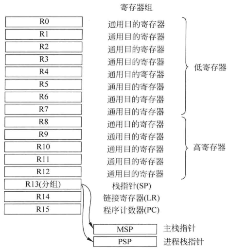
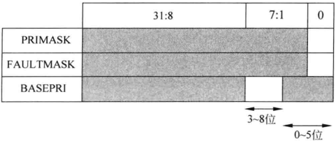
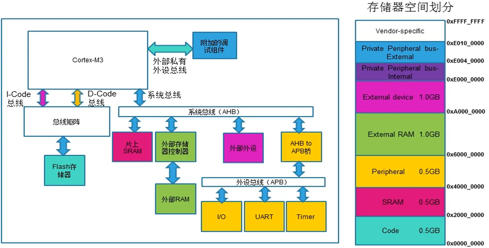

# 编程模型

## CPU 操作模式和状态

M 内核有两个**操作状态**和两个**操作模式**，此外还区分访问等级
- 操作状态
  - **调试状态**：仅在调试下，单步执行之类的，CPU 暂停
  - **Thumb 状态**：正常的执行代码的状态
- 操作模式
  - **处理模式**：执行 ISR 等异常处理，总是有特权访问等级
  - **线程模式**：普通状态，访问等级由寄存器 CONTROL 控制


软件可以将线程特权模式主动切换为非特权线程模式，必须借助异常机制才能从非特权模式切换到特权模式。

特权与非特权等级使得可以保护关键存储区域，这有助于开发出更健壮的嵌入式系统。

```note
两种访问等级：特权等级、非特权等级(用户等级)。

特权状态既 CPU 想干什么干什么。非特权状态(用户状态)无法读写某些存储器区域。
```

区分特权等级主要是为了 RTOS 使用。如嵌入式 OS 内核运行在特权访问等级，应用任务运行在非特权等级，这样可以避免应用破坏 OS 内核的运行。

特权等级和非特权等级的编程模型基本相同，除了存储器访问权限和几个指令的区别。

线程模式和处理模式的编程模型也类似，现成模式可以使用独立的 PSP，和 OS 内核的栈空间独立，避免应用任务栈溢出对 OS 的影响。

M3 内核启动后处于特权线程模式以及 Thumb 状态(不调试)。对于裸机开发，一直就是这样的了，非特权线程模式用不到，PSP 也用不到。


## 寄存器

<figure>
    
</figure>

Cortex-M3 处理器里有 R0 - R15 的寄存器组和 5 个特殊寄存器。

这里的所有寄存器无地址映射，只能使用 MSR MRS 和寄存器名字进行操作。

### R0-R15

- 通用寄存器 13 个，R0 - R12 通用寄存器，复位值为 unknown
  - R0 - R7 低寄存器，16 位指令只能访问这些寄存器
  - R8 - R12 高寄存器，32 位指令可以访问这些寄存器
- SP(stack pointer) 为栈指针寄存器，实际上有两个MSP(main SP)、PSP(process SP)
  - SP 就是 R13，在 thread mode 下，CONTROL 寄存器的 bit1 位控制具体的使用：0为MSP(复位默认)，1 为 PSP
  - MSP 的值为地址 0x0000 0000 处的值，也即 CPU 第一件事就是从 0 地址搬运 4byte 数据到MSP
  - PSP 复位值为 unknown
  - 最低两位总是 0，即地址字对齐
- LR(link register) 存放返回地址，复位值为 0xFFFF FFFF
  - R14，函数结束，将 LR 加载到 PC 返回调用处继续执行
  - 调用子函数时，用来保存返回地址
  - 中断处理时，保存中断返回值
  - 调用函数 LR 值自动更新，因此需要入栈保护
  - 地址为偶数，最低位有时会用 1 表示 Thumb 状态
- PC(program counter) 为程序计数器，R15，bit0 永远是0，即地址 2byte 对齐。复位时，值为地址 0x00000004 的值，此处为复位函数的入口地址。
  - R15 ，有些跳转指令更新 PC 时会将最低位置 1 表示 Thumb状态

由此，m3内核芯片的启动流程：上电后，0x00000000 处的 4byte 加载到 MSP，然后 0x00000004 处的值加载到 PC，这里是复位程序的首地址，这些行为是电路自动完成，不需要程序控制，也是硬件和软件约定好的入口。

```note
STM32 内部 flash 的起始地址为 0x0800 0000，那么芯片的 0x00000000 处是什么呢？

实际上 0x00000000 被映射到了 0x08000000，使用 keil 调试时可以看到这两部分存储空间的内容完全一致。

后面的存储器映射部分。
```

### 特殊寄存器

使用 C 语言开发时，这些寄存器几乎不用去考虑。在开发嵌入式 OS 时需要用着这些寄存器实现一些特性。

特殊寄存器有
- 程序状态寄存器 PSR
- 中断/异常屏蔽寄存器
- 处理器控制寄存器


### 程序状态寄存器

程序状态状态寄存器(program status register)也可以写成 xPSR，有 3 个寄存器：ASPR、ISRP、ESPR，application、interrupt、execution。这三个寄存器可以通过一个组合寄存器来访问。

<figure>
  
  <figcaption>APSR、IPSR、EPSR</figcaption>
</figure>


<figure>
  
  <figcaption>组合 PSR 寄存器</figcaption>
</figure>

寄存器位域编号

<figure>
  
  <figcaption>位域描述</figcaption>
</figure>


```armasm
MRS   r0, PSR     ;读 PSR
MSR   PSR, r0     ;写 PSR

;单独访问
MRS   r0, APSR
MSR   APSR, r0
MRS   r0, IPSR    ; IPSR 只可读
```

```note
代码无法直接使用 `MSR` 或 `MRS` 直接访问 EPSR

GE 位仅在 M4 内核中存在，M3 内核中没有。
```

### 中断/异常屏蔽寄存器


寄存器有
- PRIMASK
- FAULTMASK
- BASEPRI

这些寄存器用于异常或中断的屏蔽，这些寄存器基于优先等级屏蔽异常，只在特权等级下可以操作，默认全都为 0，即不屏蔽任何异常。

<figure>
  
  <figcaption>屏蔽寄存器</figcaption>
</figure>

- PRIMASK 只有 1 位，为 1 时，除了 NMI 和 HardFault，其他全都屏蔽
  - 实现上，是把当前优先级提升为 0
- FAULTMASK 只有 1 位，为 1 时，除了 NMI，全都屏蔽
- BASEPRI 根据优先等级屏蔽
  - 位数由 MCU 厂商设计实现，需要参考手册


汇编代码访问这些寄存器
```armasm
MRS   r0, BASEPRI
MSR   BASEPRI, r0

MRS   r0, PRIMASK
MSR   PRIMASK, r0

MRS   r0, FAULTMASK
MSR   FAULTMASK, r0
```

除了 MRS MSR 指令，还有修改处理器状态指令，使用起来也很方便
```armasm
CPSIE   I   ; 开启中断，清除 PRIMASK
CPSID   I   ; 关闭中断，设置 PRIMASK

CPSIE   F   ; 开启中断，清除 FAULTMASK
CPSID   F   ; 关闭中断，设置 FAULTMASK
```


### 控制寄存器

CONTROL 寄存器的功能
- 选择栈指针(MSP/PSP)
- 线程模式的特权等级控制
- M4 处理器，有一位表示当前上下文是否使用浮点单元

此寄存器只能在特权等级进行修改，


<figure>
  
  <figcaption>CONTROL 寄存器</figcaption>
</figure>

- nPRIV 定义线程模式下特权等级
  - 0 特权等级
  - 1 非特权等级
- SPSEL 定义栈指针的选择
  - 0 线程模式使用 MSP
  - 1 线程模式使用 PSP，处理模式此位始终为0且不可写


复位后次寄存器默认为 0，即处于线程模式、具有特权等级、使用 MSP。此时可以写 CONTROL 切换为 PSP 并且退出特权等级。

处于非特权等级，就无法主动切换回特权等级了，这种设计提供了一个基本的安全模型。此时想有线程非特权等级切换到线程特权等级，需要借助异常机制。

<figure>
  
  <figcaption>模式切换</figcaption>
</figure>

使用嵌入式 OS 时，每次上下文切换都可以重新设置 CONTROL，以满足不同应用的需要。

嵌入式 OS 下，线程使用 PSP ，中断和OS内核使用 MSP。

读写 CONTROL 寄存器也是用 MSR MRS 指令

```armasm
MRS   r0, CONTROL
MSR   CONTROL, r0
```


## 总线连接

<figure>
  
  <figcaption>总线连接</figcaption>
</figure>

不同总线能访问的地址范围是不同的。


