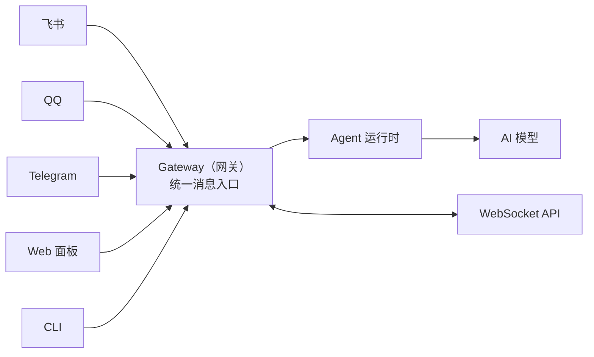

# openclaw 


## 基本使用

最基本的。

安装，

配置模型，和 聊天平台

就能做点简单的事情了。

安装，然后装完了运行一个配置向导，onboard。
```sh
curl -fsSL https://openclaw.ai/install.sh | bash
```

或者可以手动配置两个就可以了。
```sh
curl -fsSL https://openclaw.ai/install.sh | bash -s -- --no-onboard

# 手动运行配置向导
openclaw onboard --install-daemon
```

正常后，可以试着对话，
```sh
openclaw tui
```

>你好。。。

基本的管理

```sh
openclaw dashboard

# No GUI detected. Open from your computer:
ssh -N -L 18789:127.0.0.1:18789 ubuntu@10.0.0.213
```

把本地的 18789 转发到 ssh-server(10.0.0.213) 上 127.0.0.71 的 18789

也是一种内网穿透。


版本升级
```sh
curl -fsSL https://openclaw.ai/install.sh | bash
openclaw doctor           # 迁移配置 + 健康检查
openclaw gateway restart  # 重启网关
```


## 模型管理

主模型，备用模型，图片模型。


## 智能体管理

openclaw 有性格，记忆，能力
- 人设文件
- 工作区文件
- 工具

默认情况下 OpenClaw 运行一个 Agent，id 为 main。工作区存放着所有的东西，

~/.openclaw/workspace

这里全是 md 文件。


Gateway 是 OpenClaw 的后台服务，所有消息经过 Gateway 处理后转发。





workspace 身份、性格、记忆、技能全都存放在这里。


一些文件以及加载时机。

| 文件/路径 | 作用说明 | 加载时机 |
|----------|----------|----------|
| AGENTS.md | 操作指令：告诉龙虾“怎么做事”和如何使用记忆 | 每次会话开始 |
| SOUL.md | 人设：性格、语气、边界 | 每次会话开始 |
| USER.md | 用户资料：你是谁、怎么称呼你 | 每次会话开始 |
| IDENTITY.md | 龙虾身份：名字、风格、表情符号 | 每次会话开始 |
| TOOLS.md | 工具使用备注（不控制工具开关，只是使用建议） | 每次会话开始 |
| HEARTBEAT.md | 心跳任务清单（可选，保持简短） | 心跳运行时 |
| BOOT.md | 启动清单（可选，Gateway 重启时执行） | Gateway 启动时 |
| BOOTSTRAP.md | 首次引导仪式（完成后删除） | 仅首次运行 |
| MEMORY.md | 长期记忆（可选） | 仅主会话 |
| memory/YYYY-MM-DD.md | 每日记忆日志 | 今天+昨天：会话开始；其余按需读取 |
| skills/ | 工作区级技能（可选） | 按需加载 |


