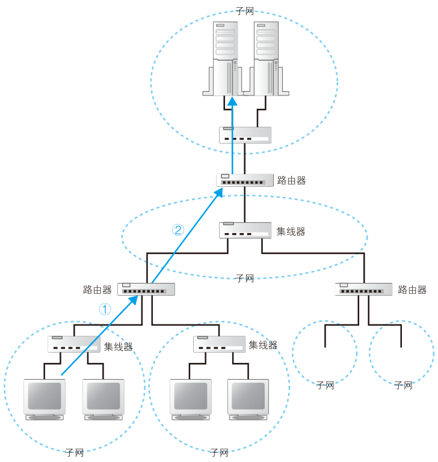
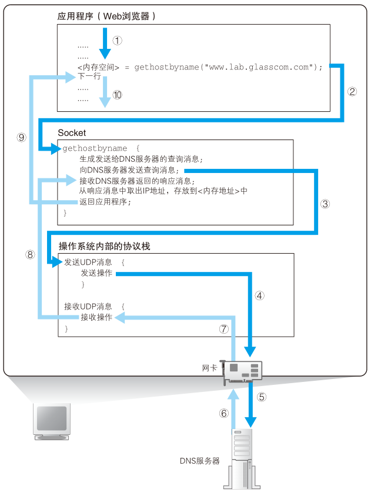
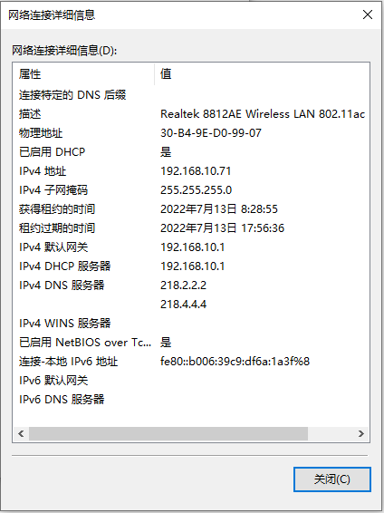
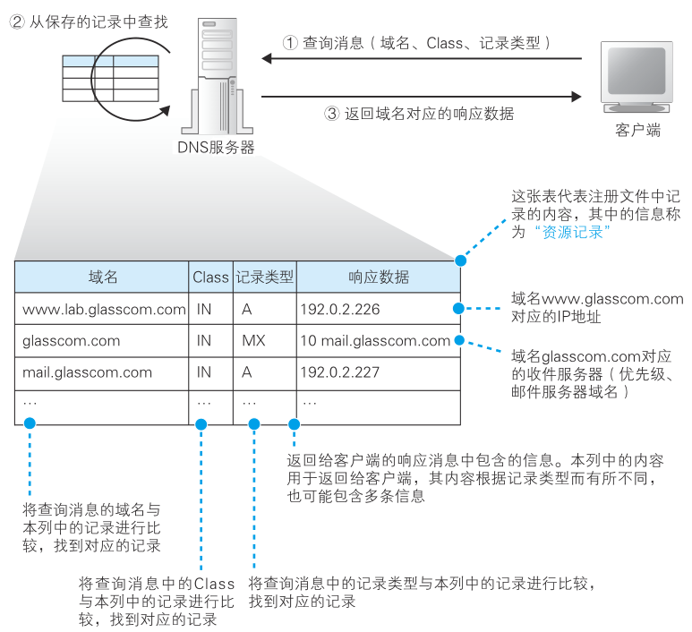
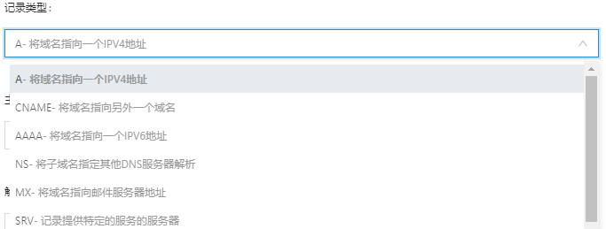
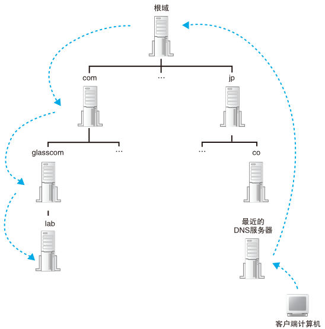
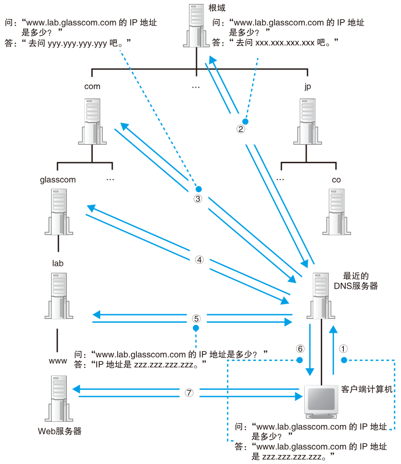

# DNS 服务器

有了http消息，接下来要委托操作系统将消息发送给web服务器，浏览器能解析网址生成http消息，但是本身并不具备将消息发送到网络中的功能。

不仅仅浏览器需要发送消息，QQ，下载软件，游戏等都需要发送消息，因此这个功能让操作系统来实现更合适。

在发送消息前，还有件事情要做，查询网址中服务器域名对应的IP地址。在委托操作系统发送消息时，给的不是域名而是IP地址，因此需要根据域名查询IP地址。

## IP地址

互联网和公司内部的局域网都是基于TCP/IP的思路来设计的，一些小的子网连接起来组成大的网络。结构如下图：

<figure>
    
</figure>

子网可以理解为用集线器连接起来的几台计算机，将子网通过路由器连接起来，就形成了一个网络。

```note
集线器是一种对包进行转发的设备，分为中继式集线器和交换式集线器两种。

路由器是一种对包进行转发的设备。

交换机也是一种对包进行转发的设备。

具体区别，后面说。
```

网络中，所有设备都会被分配一个IP地址。地址分割为**网络号**和**主机号**。网络号是分配给整个子网的，主机号是给子网中的一台计算机的。

通过IP地址可以判断访问对象服务器的位置，从而将消息发送到服务器。后面会更加详细的说整个过程，这里简单看看。消息先经过子网的集线器，到达距离最近的路由器，路由器根据消息的目的地判断下一个路由器位置，经过子网的集线器发送到下一个路由器，知道传送到目的地为止。

实际的IP地址是一串32bit的数字，1Byte一个组分为4组，写成10进制后圆点隔开就是常见的IP格式。I

192.168.10.11

仅靠IP地址无法区分哪部分是网络号，哪部分是主机号。这两部分总共32bit但是并不固定，可以自己分配，因此需要**子网掩码**来指出网络号占用的bit位。

子网掩码为1的部分表示网络号，为0的部分表示主机号。IP地址的主机号为0代表的是整个子网而非单台计算机，主机号全为1代码向子网所有设备发送消息即广播。


## 域名与IP共存

TCP/IP网络通过IP地址来确定通信对象，不知道IP就无法发送消息。

既然如此，在网址中直接写IP地址就好了，IP地址代替网址是可以正常工作的，下面这个IP地址指向baidu

http://202.108.22.5/

然而这并不好记忆，这就和电话号码与联系人的关系一样。如果在互联网中不用IP地址，直接使用名称确定通信对象呢？这并不是个好方法，效率上可能并不高。毕竟使用IP地址只需要4Byte就能解决，使用字符串保存名称的话，4Byte显然不太够用。何况，域名不仅仅长，长度还是不固定的。

于是，有了现在的方案，让人来使用域名，让路由器使用IP地址，为了联系人和机器，需要一个机制来把域名和IP地址对应起来，在人和机器都不做出牺牲的前提下完美解决，这就是DNS(Domain Name System)域名服务系统。

DNS功能并不仅限于把服务器名和IP地址关联，它还可以将邮件地址和邮件服务器进行关联，以及为各种信息关联相应的名称。

## Socket 库提供查询IP地址的方法

查询IP地址很容易，询问最近的DNS服务器就行。浏览器如何向DNS服务器发出请求呢？来探索一下这个事情。

向DNS服务器发出查询，也就是向DNS服务器发送查询消息，接收返回的消息。也就是说有DNS服务器，在我们的计算机上一定有对应的DNS客户端。相当于DNS客户端的部分称为**DNS解析器**（简称解析器）。通过DNS查询IP地址的操作称为**域名解析**(resolution)，因此负责执行解析的这一操作就叫解析器(resolver)了。

解析器是一段程序，包含在操作系统的Socket库中。Socket库里包含的程序组件可以让其他应用程序调用操作系统的网络功能，解析器就是这个库里的一种程序组件。

## 通过解析器向DNS服务器发出查询

解析器用起来很简单，调库嘛，都很容易的。

```c
#include <stdio.h>
#include <stdlib.h>
#include <netdb.h>
#include <sys/socket.h>
#include <netinet/in.h>
#include <arpa/inet.h>
 
int main()
{
    struct hostent *host = gethostbyname("www.baidu.com");
    if(!host)
    {
        puts("Get IP address error!");
        exit(0);
    }
 
    //别名
    for(int i=0; host->h_aliases[i]; i++)
    {
        printf("Aliases %d: %s\n", i+1, host->h_aliases[i]);
    }
 
    //地址类型
    printf("Address type: %s\n", (host->h_addrtype==AF_INET) ? "AF_INET": "AF_INET6");
 
    //IP地址
    for(int i=0; host->h_addr_list[i]; i++)
    {
        printf("IP addr %d: %s\n", i+1, inet_ntoa( *(struct in_addr*)host->h_addr_list[i] ) );
    }
 
    return 0;
}
```

## 解析器的内部原理

网络应用程序（浏览器）调用解析器时，调用解析器代码。解析器会生成发送给DNS服务器的查询消息（和浏览器生成发送给web服务器的http消息过程类似），根据DNS的规则，生成一条“告诉我xxx.com的IP地址”的消息，发送出去。

发送消息这个操作不是有解析器完成，同样委托给操作系统内部的协议栈来完成。解析器本身不具备使用网络收发数据的功能。解析器调用协议栈，协议栈执行真正的发送操作，通过网卡把消息发送给DNS服务器。

DNS服务器收到查询消息，如果要访问的web服务器在DNS服务器上注册过，那么这条记录就可以找到，然后web服务器的IP地址被写入响应消息返回到客户端，电信号到达网卡，经过协议栈传递给解析器，解析器读取IP地址，返回给应用程序。

<figure>
    
</figure>


实际上解析器会把IP地址写入应用程序指定的内存里，即用指针来表达。

不仅仅是这个过程，计算机内部结构就是这样一层一层，彼此分工合作，每一层对上层负责，使用下层的接口，每层完成一部分工作，将剩下的部分委派到下层完成。

当然向DNS服务器发送消息时，我们也需要知道DNS服务器的IP地址，只不过这个IP地址时作为TCP/IP的一个设置条目设置好的。

一些DNS服务器IP
- 电信做的国内免费DNS 114.114.114.114; 114.114.115.115
- 谷歌DNS 8.8.8.8; 8.8.4.4
- 江苏电信DNS 218.2.2.2; 218.4.4.4

<figure>
    
</figure>

```note
协议栈：操作系统内部的网络控制软件。也叫做“协议驱动”“TCP/IP驱动”。

```

## dns服务器

前面给了一些dns服务器的IP，dns服务器收到的消息有这些：
- 域名：服务器的名称
- Class：最早设计DNS方案时，DNS在互联网以外的其他网络中的应用也被考虑到了。然而，至今为止这个值都只有IN
- 记录类型：如当类型为A时，表示域名对应IP地址；当类型为MX，表示域名对应邮件服务器。

DNS服务器上事先保存了这些东西。

<figure>
    
</figure>

比如查询www.lab.glasscon.com的IP地址，客户端向DNS发送这些消息：
- 域名 = www.lab.glasscon.com
- Class = IN
- 记录类型 = A

然后，DNS查找全部匹配的记录，将记录值192.0.2.226返回去。

如果要搭一个自己的主页，并使用自己的域名，那么有个步骤就是要配置DNS服务器的解析设置：

<figure>
    
</figure>


## 域名的层次结构

小规模网络，所有信息保存在一台DNS服务器里，工作方式完全符合前面的情况。

然而互联网里存在着不计其数的服务器，保存在一台DNS服务器不大可能。因此一定会出现在某一台DNS服务器找不到数据的情况。这里就要看看DNS服务器如何工作。

数据分布保存在多台DNS服务器中，这些DNS服务器相互接力配合，找出要查询的信息。不过接力的机制有点复杂，所以先看信息是怎么注册到DNS服务器上的。

DNS中的数据按照域名以分层次的结构来保存的。域名用'.'来分割，越靠右的层级越高。比如map.baidu.com 这个域名，最高层级com，下一层级baidu，再下一层map。一个层级是一个域，因此com域的下一层是baidu域，再下一层是map域。

这种层次结构的域名信息注册到DNS服务器里，每个域按照一个整体来处理，即每个域的信息作为整体存放在DNS服务器里，不能把一个域拆开来存放在多台DNS服务器里。倒是多个域的数据可以放到一个DNS服务器里。

这里假设一个DNS服务器只放了一个域的信息。于是DNS服务器也有了像域名一样的层次结构，每个域的信息都存放在相应层级的DNS服务器里。

比如njust.edu.cn，
- cn代表分配给中国的顶级域(地理顶级域)
- edu教育系统的域
- njust分给学校的域

到这一层并没有结束，还可以不同学院继续分配，子域。

比如
- au.njust.edu.cn 自动化学院分配了au
- cs.njust.edu.cn 计算机学院分配了cs
- eoe.njust.edu.cn 电子工程与光电技术学院分配了eoe

## 寻找DNS服务器获得IP地址

关键在于找到要访问的web服务器的信息存放在哪一台DNS服务器。

互联网中有数万台DNS服务器，肯定不能一台一台遍历。可以先把负责管理下级域的DNS服务器的IP地址注册到他们的上级DNS服务器里，然后上级DNS服务器的IP地址注册到更上级的DNS服务器里。

也就是说，负责管理njust.edu.cn这个域的DNS服务器的IP地址要注册到edu.cn域的DNS服务器，而edu.cn域的DNS服务器的IP地址又需要注册到cn域的DNS服务器中。

这样就可以同上上级的DNS服务器查询出下级DNS服务器的IP地址，这样可以先下级DNS服务器发送查询请求。

似乎cn就是最顶层了，事实上并非如此，com和cn的上面还有一级域，称为根域。根域不想cn有自己的名字，书写的时候一般也忽略，如果要明确表示根域，要加一个点 njust.edu.cn. 不过一般不写最后的点，因此根域的存在往往被忽略。

<figure>
    
</figure>

但是根据毕竟是真实存在的，根域的DNS服务器里保存着com、cn等DNS服务器的信息，所以我们可以从根域开始一路顺藤摸瓜找到任一个域的DNS服务器。

此外还需要另一个工作，把根域的DNS服务器信息保存在互联网所有的DNS服务器里，这样任何DNS服务器都可以找到并访问根域DNS服务器。

分配给根域DNS服务器的IP地址在全世界只有13个。

举个例子，我们要查询www.lab.glasscom.com这台web服务器的相关信息。客户端先访问最近的一台DNS服务器，也就是网络设置在TCP/IP中填写的DNS地址，由于最近的服务器里没有存放 www.lab.glasscom.com 这一域名对应的信息，所以我们需要从顶层开始向下查找。最近的DNS服务器中保存了根域DNS服务器的信息，它会将来自客户端的查询消息转发给根域DNS服务器。根域服务器中也没有www.lab.glasscom.com这个域名，但根据域名结构可以判断这个域名属于com域，因此根域DNS服务器会返回它所管理的com域中的DNS服务器的IP地址，意思是“虽然我不知道你要查的那个域名的地址，但是我知道这里能找到”。接下来，最近的DNS服务器又会向com域的DNS服务器发送查询消息，com域中也没有www.lab.glasscom.com这个域名的信息，和刚才一样，com域服务器会返回它下面的glasscom.com域的DNS服务器的IP地址。以此类推，只要重复前面的步骤，就可以顺藤摸瓜找到目标DNS服务器，只要向目标DNS服务器发送查询消息，就能够得到我们需要的答案，也就是www.lab.glasscom.com的IP地址了。

<figure>
    
</figure>

## 通过缓存加快DNS服务器响应

真实的互联网中工作方式和上面说的还是略有区别。

一台DNS服务器可以管理多个域的信息，上级域和下级域也可以使用同一台服务器。

有时候不需要从最上面的根域开始查找，因为DNS服务器有缓存功能，可以记住之前查询过的域名。如果要查询的域名相关信息已经放在缓存中，那么可以直接返回属于。

当要查询的域名不存在时，“不存在”这个结果也会被缓存。

缓存机制有一点要注意，原本注册信息发生改变时，缓存里的信息就有可能不正确。因此DNS服务器中保存的信息都设置有一个有效期，国企会自动删除。而且在查询时，DNS服务器也会告知客户端响应结果来自缓存还是来自管理该域名的DNS服务器。


