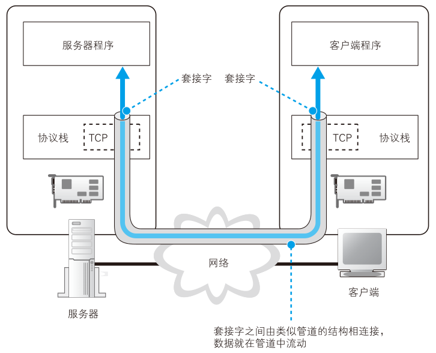
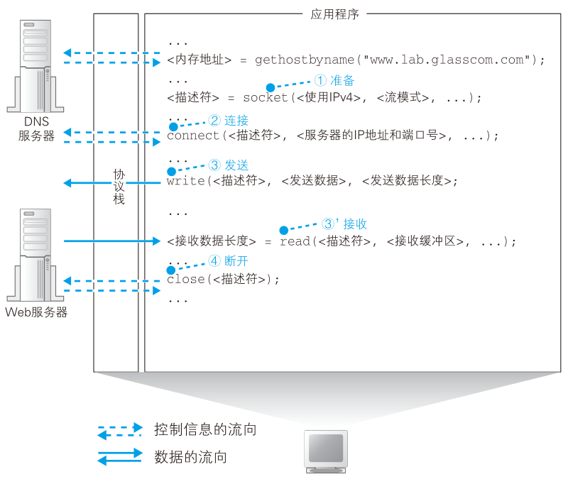

# 协议栈

知道了IP地址之后，就可以委托操作系统内部的协议栈向这个目标IP（web服务器）发送消息了。

收发数据这一操作并不仅限于浏览器，对于各种要使用网络的应用程序来说都是一样的。

收发数据也需要使用Socket库中的程序组件。前面向DNS服务器查询IP地址调用一个组件就行，这里需要按照指定的顺序调用多个程序组件，还挺复杂。发送数据时一系列操作结合起来实现的，先看全貌，就能理解每个具体操作的含义了。


```c
int main()
{
    //创建套接字
    int sock = socket(AF_INET, SOCK_STREAM, 0);
    //向服务器（特定的IP和端口）发起请求
    struct sockaddr_in serv_addr;
    memset(&serv_addr, 0, sizeof(serv_addr));  //每个字节都用0填充
    serv_addr.sin_family = AF_INET;  //使用IPv4地址
    serv_addr.sin_addr.s_addr = inet_addr("127.0.0.1");  //具体的IP地址
    serv_addr.sin_port = htons(1234);  //端口
    connect(sock, (struct sockaddr*)&serv_addr, sizeof(serv_addr));
   
    //读取服务器传回的数据
    char buffer[40];
    read(sock, buffer, sizeof(buffer)-1);
   
    printf("Message form server: %s\n", buffer);
   
    //关闭套接字
    close(sock);
    return 0;
}
```


## 数据收发操作全貌

使用Socket库来收发数据的过程如下图：

<figure>
    
</figure>

简单来说，收发数据的两台计算机之间连接了一条数据通道，数据沿着这条通道流动。数据从一端进去就会到达另一端出来，而且是双向的。

从图里来看，这个管道好像一开始就有，其实并不是。在进行收发之前，双方需要先建立起这个管道。实际过程：
- 服务器创建**套接字**，等待客户端向该套接字连接管道
- 将管道连接到服务器的套接字上
- 收发数据
- 断开管道并删除套接字

每个过程都会用到Socket库中的组件。这4个操作都是由操作系统中的协议栈来执行，浏览器等应用程序并不会自己去做管道连接、放入数据的操作，而是委托协议栈代劳。

这部分的内容只是研究如何如何“委托”，协议栈收到委托之后连接管道和放入数据会在后面说。


## 创建套接字阶段

访问DNS服务器调用`gethostbyname()`，也叫解析器。而这里要按照一定顺序调用若干个组件。

<figure>
    
</figure>


```c
int sock = socket(AF_INET, SOCK_STREAM, 0);
```

创建套接字完成后，协议栈会返回一个**描述符**`sock`。描述符用来识别不同的套接字，计算机中会同时进行多个数据的通信操作（比如打开两个浏览器窗口），就需要两个套接字。

创建套接字后，只要出示描述符，协议栈就可以判断使用哪一个套接字来连接或者收发数据。

```note
- Socket：表示库
- socket：程序组件
- 套接字：管道两端的接口。虽然英文也是socket
```

## 连接：把管道接上

接下来委托协议栈将客户端创建的套接字和服务器的套机字连接起来。应用程序调用Socket库里的`connect()`组件。

调用connect的时候，需要指定描述符、服务器IP地址和端口号这3个参数。

```c
/* 暂存控制参数的结构体 */
struct sockaddr_in serv_addr;
memset(&serv_addr, 0, sizeof(serv_addr));

/* 使用IPv4类型 */
serv_addr.sin_family = AF_INET;
/* 指定IP地址 */
serv_addr.sin_addr.s_addr = inet_addr("127.0.0.1");
/* 指定端口号 */
serv_addr.sin_port = htons(1234);
/* 通过上述参数连接管道 */
connect(sock, (struct sockaddr*)&serv_addr, sizeof(serv_addr));
```


```note
描述符：应用程序来识别套接字的机制。

IP和端口号：客户管和服务器之间用来识别对方套接字的机制。
```

## 通信阶段：传递消息

套接字连接后，把数据送入套接字，对方就能从自己的套接字里读取数据了。这里体会**管道**这种感觉，还有套接字是管道的出入口。

剩下的通信就很容易了，同样使用Socket库提供的组件。


应用程序在内存里准备好要发送的数据，调用`write`函数即可，调用时还需指定描述符。

```c
char str[] = "http://c.biancheng.net/socket/";
write(clnt_sock, str, sizeof(str));
```

因此只要通过描述符，就能确定要使用的套接字，识别出通信对象。

接收消息时，使用`read`来完成，调用时要指定用于存放数据的内存地址

```c
char buffer[40];
read(sock, buffer, sizeof(buffer)-1);
```

## 断开阶段：收发结束

```C
close(sock);
```

在协议层，断开就是一个函数。

在引用曾，web使用的HTTP规定：当web服务器发送完响应消息后，应该主动断开，因此web服务器首先调用`close`。断开操作传达到客户端后，客户端的套接字也会进入断开阶段。后面当浏览器调用read执行接收数据操作时，也会得知连接断开。

这就是HTTP的工作过程。HTTP协议把HTML文档和图片都作为单独对象来处理，每获取一次数据，就要执行一次连接、发送请求消息、接收响应消息、断开的过程。因此网页里如果有很多图片，就必须重复进行很多次连接收发断开。

对于一台服务器来讲，重复连接断开的效率很低，因此后来人们又设计出了在一次连接中收发多个请求和相应的方法。HTTP版本1.1中就可以使用这种方法，这种情况下所有数据请求完成后，浏览器会主动触发断开连接的操作。


