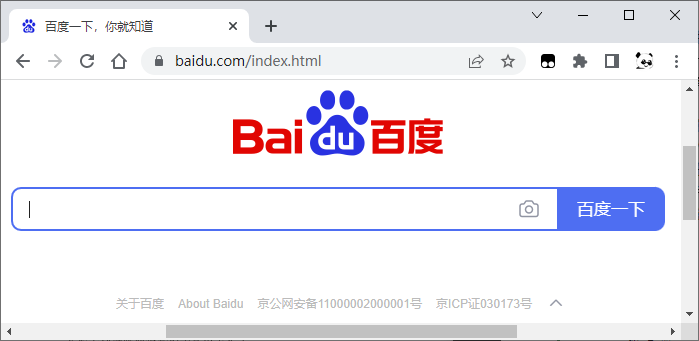

# 浏览器生成消息

<figure>
    
</figure>

开始上网。

网上冲浪从在浏览器中输入网址(URL)开始。

<figure>
    
</figure>

在地址栏输入 **http://baidu.com/index.html**

然后回车，浏览器会生成一个请求：“给我index.html这和个文件”。这就是http的请求消息。

有了请求消息，浏览器委托操作系统向web服务器发送请求，但是网址是帮助人记忆的，在计算机之间是用IP地址来寻找对方的，这就需要浏览器先向DNS服务器查询域名对应的IP地址。而全世界有上万台DNS服务器，这些服务器需要互相接力才能完成域名对应IP地址的查询。

查询到IP地址后，浏览器才真正把消息委托给操作系统发送。委托也挺复杂的，但是只有写这些程序的人需要精通这些规则。

- http消息
- dns服务器
- 发送消息

