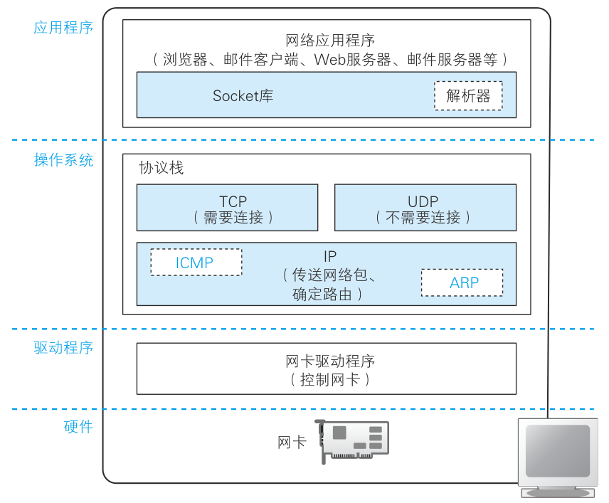
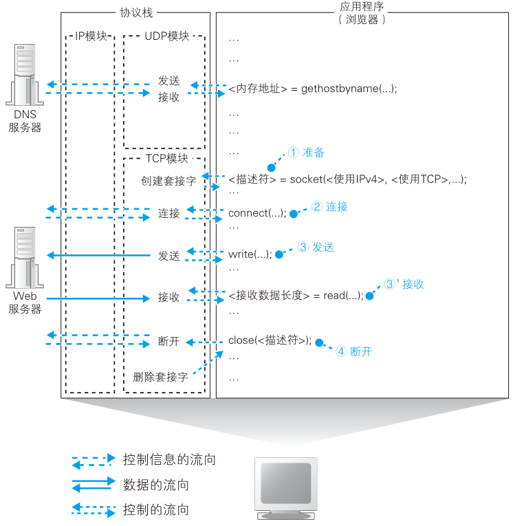

# 创建套接字


## 协议栈内部

操作系统里的**网络控制软件**（协议栈）和**网络硬件**（网卡）。

协议栈的工作从表面上是看不到的，在探索之前，先简单看看协议栈里有些啥。

<figure>
    
</figure>

最上面是网络应用程序，他们的数据收发工作会委托给下层来完成。应用程序的下面是Socket库，其中就有解析器，查找域名对应的IP的那个功能。

应用程序的下一层是操作系统，其中包括协议栈。协议栈的上半部分有两块，分别是负责用TCP协议收发数据的部分和负责用UDP协议收发数据的部分，它们会接受应用程序的委托执行收发数据的操作。下面一半是用IP协议控制网络包收发操作的部分。在互联网上传送数据时，数据会被切分成一个一个的网络包，而将网络包发送给通信对象的操作就是由IP来负责的。此外，IP中还包括ICMP协议和ARP协议。ICMP用于告知网络包传送过程中产生的错误以及各种控制消息，ARP用于根据IP地址查询相应的以太网MAC地址。

再下一层驱动程序，负责控制网卡硬件。最下层硬件的网卡则负责完成实际的收发操作，也就是对网线中的信号执行发送和接收的操作。

```note
- TCP: Transmisson Control Protocol
- UDP: User Datagram Protocol
- ICMP: Internet Control Message Protocol
- ARP: Address Resolution Protocol
- IP: Internet Protocol

TCP和UDP：像浏览器、邮件等一般的应用程序都是使用TCP收发数据的，而像DNS查询等收发较短的控制数据的时候则使用UDP。

后面细说。

网络包：网络中的数据会被切分成几十字节到几千字节的小块，每一个小数据块被称为一个包。后面也细说。
```

## 套接字的实体

**协议栈是根据套接字中记录的控制信息来工作的**。

在数据收发中扮演关键角色的套接字，让我们来看看它具体是个怎样的东西。

在协议栈内部有一块用于存放控制信息的内存空间，这里记录了用于控制通信操作的控制信息，例如通信对象的IP地址、端口号、通信操作的进行状态等。本来套接字就只是一个概念而已，并不存在实体，如果一定要赋予它一个实体，我们可以说这些控制信息就是套接字的实体，或者说存放控制信息的内存空间就是套接字的实体。

协议栈在执行操作时需要参阅这些控制信息。例如，在发送数据时,需要看套接字中的通信对象IP地址和端口号，以便向指定的IP地址和端口发送数据。在发送数据之后，协议栈需要等待对方返回收到数据的响应信息，但数据也可能在中途丢失，永远也等不到对方的响应。在这样的情况下，我们不能一直等下去，需要在等待一定时间之后重新发送丢失的数据，这就需要协议栈能够知道执行发送数据操作后过了多长时间。为此，套接字中必须要记录是否已经收到响应，以及发送数据后经过了多长时间，才能根据这些信息按照需要执行重发操作。

上面说的只是其中一个例子。套接字中记录了用于控制通信操作的各种控制信息，协议栈则需要根据这些信息判断下一步的行动，这就是套接字的作用。

```note
windows中使用

netstat -ano

命令，可以看到套接字的信息。
```

## 调用socket时的操作

调用Socket库里的程序组件时，协议栈内部时怎么工作的。

再来看看从应用程序出发，进行网络通信时做的一系列事情。

<figure>
    
</figure>

首先是创建套接字的阶段，应用程序调用`socket()`申
请创建套接字，协议栈根据传入的参数进行创建套接字的操作。在这个过程中，协议栈首先会分配用于存放一个套接字所需的内存空间，然后向其写入初始状态。

`socket()`组件返回这个套接字的描述符。

应用程序在向协议栈进行收发数据委托时要提供这个描述符。套接字中记录了通信双方的信息以及通信处于怎样的
状态，所以只要通过描述符确定了相应的套接字，协议栈就能够获取所有的相关信息，这样一来，应用程序就不需要每次都告诉协议栈应该和谁进行通信了。
