# IP与以太网的包收发

## 包的基本知识

TCP 模块在执行连接、收发、断开等各阶段操作时，都需要委托 IP 模块将数据封装成包发送给通信对象。我们在 TCP 的讲解中也经常提到 IP，下面就来讨论一下 IP 模块是如何将包发送给对方的。

正式开始这个话题之前，我们先来介绍一下关于网络包的一些基本知识。

首先，包是由头部和数据两部分构成的。头部包含目的地址等控制信息，快递单；头部后面就是委托方要发送给对方的数据，快递包裹里的东西。

<figure>
    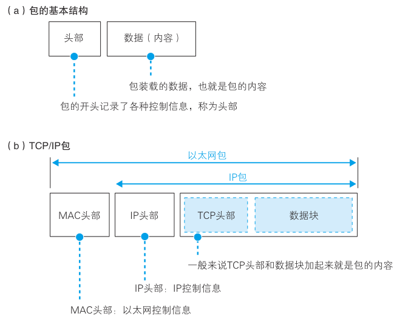
</figure>

一个包发往目的地的过程如下图。

<figure>
    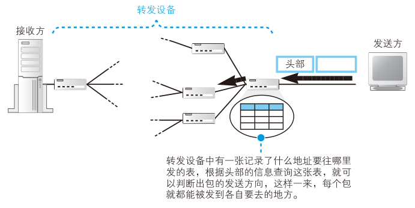
</figure>

首先，发送方的网络设备会负责创建包，创建包的过程就是生成含有正确控制信息的头部，然后再附加上要发送的数据。接下来，包会被发往最近的网络转发设备。当到达最近的转发设备之后，转发设备会根据头部中的信息判断接下来应该发往哪里。这个过程需要用到一张表，这张表里面记录了每一个地址对应的发送方向，也就是按照头部里记录的目的地址在表里进行查询，并根据查到的信息判断接下来应该发往哪个方向。比如，如果查表的结果是“目标地址为 ×××× 的包应该发到 ×××× 号线路”，那么转发设备就会把这个包发到 ×××× 号线路去。接下来，包在向目的地移动的过程中，又会到达下一个转发设备，然后又会按照同样的方式被发往下一个转发设备。就这样，经过多个转发设备的接力之后，包最终就会到达接收方的网络设备。当然，发送方向接收方发送一个包，接收方可能也会向发送方返回一个包，此时的发送方到了接下来的某个时刻就会变成接收方。因此，我们不需要把发送方和接收方明确区分开来，在这里我们把发送方和接收方统称为终端节点。

前面介绍的这些基本知识，对于各种通信方式都是适用的，当然也适用于 TCP/IP 网络。不过，TCP/IP 包的结构是在这个基本结构的基础上扩展出来的，因此更加复杂。前面，我们讲过子网的概念，还讲过网络中有路由器和集线器两种不同的转发设备，它们在传输网络包时有着各自的分工。

- 路由器根据目标地址判断下一个路由器的位置
- 集线器在子网中将网络包传输到下一个路由

实际上，集线器是按照以太网规则传输包的设备，而路由器是按照 IP 规则传输包的设备，因此我们也可以作如下理解。

- IP 协议根据目标地址判断下一个 IP 转发设备的位置
- 子网中的以太网协议将包传输到下一个转发设备

具体来说，TCP/IP 包包含如下两个头部。

- MAC 头部（用于以太网协议）
- IP 头部（用于 IP 协议）

这两个头部分别具有不同的作用。首先，发送方将包的目的地，也就是要访问的服务器的 IP 地址写入 IP 头部中。这样一来，我们就知道这个包应该发往哪里，IP 协议就可以根据这一地址查找包的传输方向，从而找到下一个路由器的位置，也就是图 2.16 中的路由器 R1。接下来，IP 协议会委托以太网协议将包传输过去。这时，IP 协议会查找下一个路由器的以太网地址（MAC 地址），并将这个地址写入 MAC 头部中。这样一来，以太网协议就知道要将这个包发到哪一个路由器上了。

网络包在传输过程中会经过集线器，集线器是根据以太网协议工作的设备。为了判断包接下来应该向什么地方传输，集线器里有一张表（用于以太网协议的表），可根据以太网头部中记录的目的地信息查出相应的传输方向。这张图中只有一个集线器，当存在多个集线器时，网络包会按顺序逐一通过这些集线器进行传输。接下来，包会到达下一个路由器。路由器中有一张 IP 协议的表，可根据这张表以及 IP 头部中记录的目的地信息查出接下来应该发往哪个路由器。为了将包发到下一个路由器，我们还需要查出下一个路由器的 MAC 地址，并记录到 MAC 头部中，大家可以理解为改写了 MAC 头部。这样，网络包就又被发往下一个节点了。

再往后的过程图上就没有画出来了。网络包会通过路由器到达下一个路由器 R2。这个过程不断重复，最终网络包就会被送到目的地，当目的地设备成功接收之后，网络包的传输过程就结束了。

前面介绍的就是在 TCP/IP 网络中，一个网络包从出发到到达目的地的全过程。虽然看起来有点复杂，不过设计这样的分工是有原因的。前面讲了 IP 和以太网的分工，其中以太网的部分也可以替换成其他的东西，例如无线局域网、ADSL、FTTH 等，它们都可以替代以太网的角色帮助 IP 协议来传输网络包。因此，将 IP 和负责传输的网络分开，可以更好地根据需要使用各种通信技术。像互联网这样庞大复杂的网络，在架构上需要保证灵活性，这就是设计这种分工方式的原因。

## 包收发操作

了解了整体流程之后，下面来讲一讲在协议栈中 IP 模块是如何完成包收发操作的。尽管我们说 IP 模块负责将包发给对方，但实际上将包从发送方传输到接收方的工作是由集线器、路由器等网络设备来完成的，因此 IP 模块仅仅是整个包传输过程的入口而已。即便如此，IP 模块还是有很多工作需要完成，首先我们先粗略地整理一下。

<figure>
    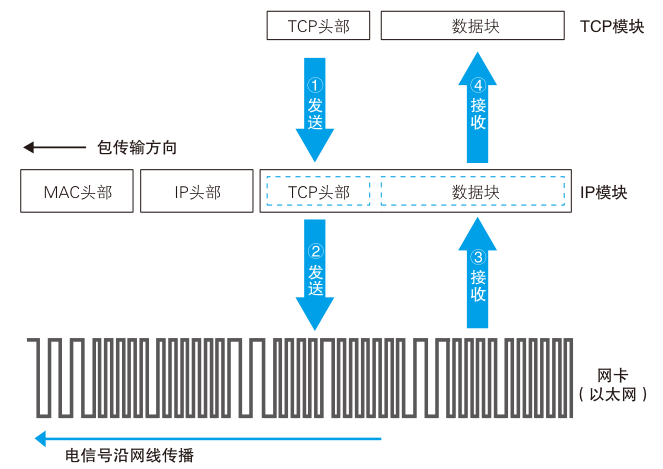
</figure>

包收发操作的起点是 TCP 模块委托 IP 模块发送包的操作（上图“①发送”）。这个委托的过程就是 TCP 模块在数据块的前面加上 TCP 头部，然后整个传递给 IP 模块，这部分就是网络包的内容。与此同时，TCP 模块还需要指定通信对象的 IP 地址，也就是需要写清楚“将什么内容发给谁”。

收到委托后，IP 模块会将包的内容当作一整块数据，在前面加上包含控制信息的头部。刚才我们讲过，IP 模块会添加 IP 头部和 MAC 头部这两种头部。IP 头部中包含 IP 协议规定的、根据 IP 地址将包发往目的地所需的控制信息；MAC 头部包含通过以太网的局域网将包传输至最近的路由器所需的控制信息。关于 IP 头部和 MAC 头部的区别以及其中包含的控制信息的含义，我们将稍后介绍。总之，加上这两个头部之后，一个包就封装好了，这些就是 IP 模块负责的工作。

接下来，封装好的包会被交给网络硬件（“②发送”），例如以太网、无线局域网等。网络硬件可能是插在计算机主板上的板卡，也可能是笔记本电脑上的 PCMCIA 卡，或者是计算机主板上集成的芯片，不同形态的硬件名字也不一样，本书将它们统称为网卡。传递给网卡的网络包是由一连串 0 和 1 组成的数字信息，网卡会将这些数字信息转换为电信号或光信号，并通过网线（或光纤）发送出去，然后这些信号就会到达集线器、路由器等转发设备，再由转发设备一步一步地送达接收方。

包送达对方之后，对方会作出响应。返回的包也会通过转发设备发送回来，然后我们需要接收这个包。接收的过程和发送的过程是相反的，信息先以电信号的形式从网线传输进来，然后由网卡将其转换为数字信息并传递给 IP 模块（“③接收”）。接下来，IP 模块会将 MAC 头部和 IP 头部后面的内容，也就是 TCP 头部加上数据块，传递给 TCP 模块。接下来的操作就是我们之前讲过的 TCP 模块负责的部分了。

## 生成包含接收方 IP 地址的 IP 头部

下面来看一看 IP 模块的具体工作过程。IP 模块接受 TCP 模块的委托负责包的收发工作，它会生成 IP 头部并附加在 TCP 头部前面。IP 头部包含的内容下表所示

<figure>
    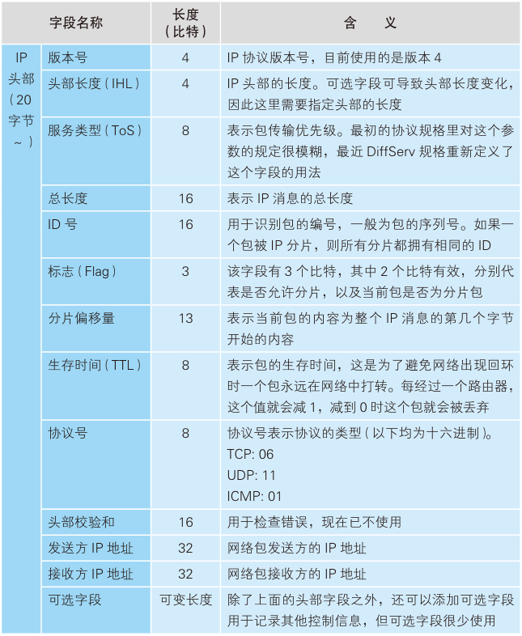
</figure>

其中最重要的内容就是 IP 地址，它表示这个包应该发到哪里去。这个地址是由 TCP 模块告知的，而 TCP 又是在执行连接操作时从应用程序那里获得这个地址的，因此这个地址的最初来源就是应用程序。IP 不会自行判断包的目的地，而是将包发往应用程序指定的接收方，即便应用程序指定了错误的 IP 地址，IP 模块也只能照做。当然，这样做肯定会出错，但这个责任应该由应用程序来承担。

头部中还需要填写发送方的 IP 地址，大家可以认为是发送方计算机的 IP 地址，实际上“计算机的 IP 地址”这种说法并不准确。一般的客户端计算机上只有一块网卡，因此也就只有一个 IP 地址，这种情况下我们可以认为这个 IP 地址就是计算机的 IP 地址，但如果计算机上有多个网卡，情况就没那么简单了。IP 地址实际上并不是分配给计算机的，而是分配给网卡的，因此当计算机上存在多块网卡时，每一块网卡都会有自己的 IP 地址。很多服务器上都会安装多块网卡，这时一台计算机就有多个 IP 地址，在填写发送方 IP 地址时就需要判断到底应该填写哪个地址。这个判断相当于在多块网卡中判断应该使用哪一块网卡来发送这个包，也就相当于判断应该把包发往哪个路由器，因此只要确定了目标路由器，也就确定了应该使用哪块网卡，也就确定了发送方的 IP 地址。

那么，我们应该如何判断应该把包交给哪块网卡呢？其实和路由器使用 IP 表判断下一个路由器位置的操作是一样的。因为协议栈的 IP 模块与路由器中负责包收发的部分都是根据 IP 协议规则来进行包收发操作的，所以它们也都用相同的方法来判断把包发送给谁。

这个“IP 表”叫作路由表，我们将在第 3 章探索路由器时详细介绍它的用法，这里先简单讲个大概。在windows的cmd里，输入`route print`命令显示路由表。如图所示，

<figure>
    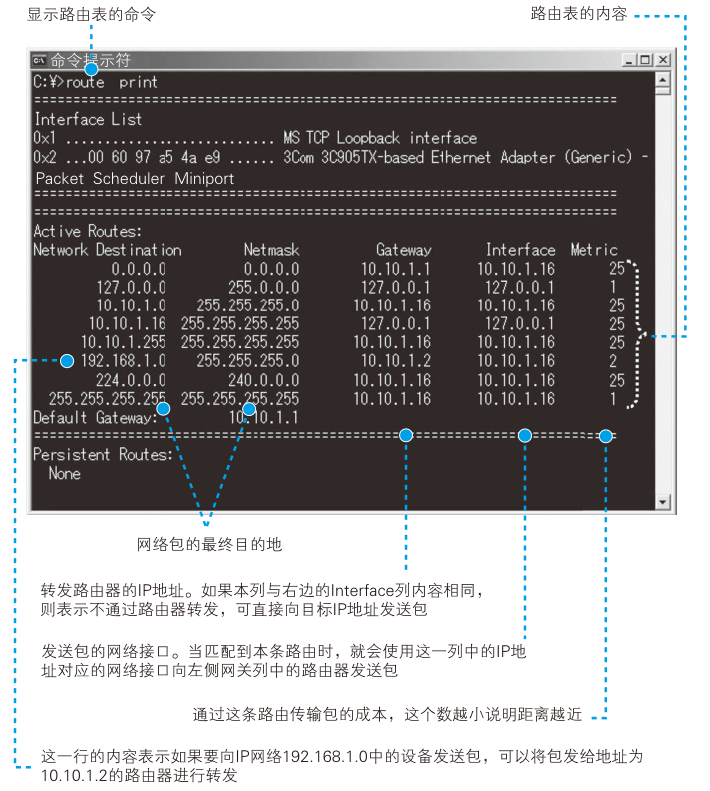
</figure>

首先，我们对套接字中记录的目的地 IP 地址与路由表左侧的 Network Destination 栏进行比较，找到对应的一行。例如，TCP 模块告知的目标 IP 地址为 192.168.1.21，那么就对应图中的第 6 行，因为它和 192.168.1 的部分相匹配。如果目标 IP 地址为 10.10.1.166，那么就和 10.10.1 的部分相匹配，所以对应第 3 行。以此类推，我们需要找到与 IP 地址左边部分相匹配的条目，找到相应的条目之后，接下来看从右边数第 2 列和第 3 列的内容。右起第 2 列，也就是Interface 列，表示网卡等网络接口，这些网络接口可以将包发送给通信对。此外，右起第 3 列，即 Gateway 列表示下一个路由器的 IP 地址，将包发给这个 IP 地址，该地址对应的路由器就会将包转发到目标地址。路由表的第 1 行中，目标地址和子网掩码都是 0.0.0.0，这表示默认网关，如果其他所有条目都无法匹配，就会自动匹配这一行。

这样一来，我们就可以判断出应该使用哪块网卡来发送包了，然后就可以在 IP 头部的发送方 IP 地址中填上这块网卡对应的 IP 地址。

接下来还需要填写协议号，它表示包的内容是来自哪个模块的。例如，如果是 TCP 模块委托的内容，则设置为 06（十六进制），如果是 UDP 模块委托的内容，则设置为 17（十六进制），这些值都是按照规则来设置的。在现在我们使用的浏览器中，HTTP 请求消息都是通过 TCP 来传输的，因此这里就会填写表示 TCP 的 06（十六进制）。

其他字段内也需要填写相应的值，但对大局没什么影响，我们会在第 3 章进行介绍，这里就先省略了。

## 生成以太网用的 MAC 头部

生成了 IP 头部之后，接下来 IP 模块还需要在 IP 头部的前面加上MAC 头部。

<figure>
    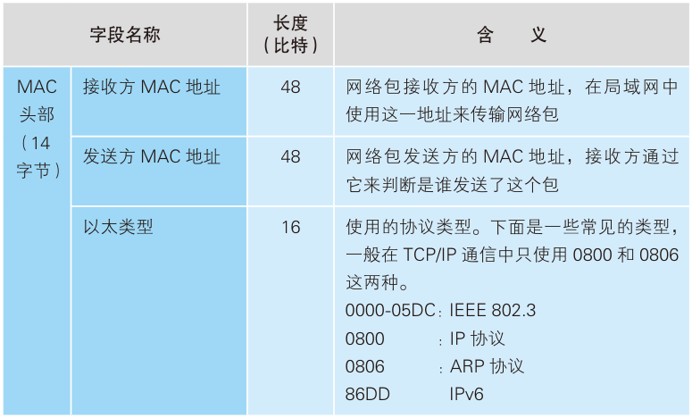
</figure>

IP 头部中的接收方 IP 地址表示网络包的目的地，通过这个地址我们就可以判断要将包发到哪里，但在以太网的世界中，TCP/IP 的这个思路是行不通的。以太网在判断网络包目的地时和 TCP/IP 的方式不同，因此必须采用相匹配的方式才能在以太网中将包发往目的地，而 MAC 头部就是干这个用的。

IP 模块在生成 IP 头部之后，会在它前面再加上 MAC 头部。MAC 头部是以太网使用的头部，它包含了接收方和发送方的 MAC 地址等信息。关于以太网的结构我们稍后会进行介绍，但下面的内容需要一些 MAC 头部的相关知识才能理解，因此先介绍一些最基础的。MAC 头部的开头是接收方和发送方的 MAC 地址，大家可以认为它们和 IP 头部中的接收方和发送方 IP 地址的功能差不多，只不过 IP 地址的长度为 32 比特，而 MAC 地址为 48 比特。此外，IP 地址是类似多少弄多少号这种现实中地址的层次化的结构，而 MAC 地址中的 48 比特可以看作是一个整体。尽管有上述差异，但从表示接收方和发送方的意义上来说，MAC 地址和 IP 地址是没有区别的，因此大家可以暂且先把它们当成是一回事。第 3 个以太类型字段和 IP 头部中的协议号类似。在 IP 中，协议号表示 IP 头部后面的包内容的类型；而在以太网中，我们可以认为以太网类型后面就是以太网包的内容，而以太类型就表示后面内容的类型。以太网包的内容可以是 IP、ARP等协议的包，它们都有对应的值，这也是根据规则来确定的。

生成 MAC 头部时，只要设置上表中的 3 个字段就可以了。方便起见，我们按照从下往上的顺序来对表进行讲解。首先是“以太类型”，这里填写表示 IP 协议的值 0800（十六进制）。接下来是发送方 MAC 地址，这里填写网卡本身的 MAC 地址。MAC 地址是在网卡生产时写入 ROM 里的，只要将这个值读取出来写入 MAC 头部就可以了。对于多块网卡的情况，请大家回想一下设置发送方 IP 地址的方法。设置发送方 IP 地址时，我们已经判断出了从哪块网卡发送这个包，那么现在只要将这块网卡对应的 MAC 地址填进去就好了。

前面这些还比较简单，而接收方 MAC 地址就有点复杂了。只要告诉以太网对方的 MAC 的地址，以太网就会帮我们把包发送过去，那么很显然这里应该填写对方的 MAC 地址。然而，在这个时间点上，我们还没有把包发送出去，所以先得搞清楚应该把包发给谁，这个只要查一下路由表就知道了。在路由表中找到相匹配的条目，然后把包发给 Gateway 列中的IP 地址就可以了。

既然已经知道了包应该发给谁，那么只要将对方的 MAC 地址填上去就好了，但到这里为止根本没有出现对方的 MAC 地址，也就是说我们现在根本不知道对方的 MAC 地址是什么。因此，我们还需要执行根据 IP 地址查询 MAC 地址的操作。

## 通过 ARP 查询目标路由器的 MAC 地址

这里我们需要使用 ARP，它其实非常简单。在以太网中，有一种叫作广播的方法，可以把包发给连接在同一以太网中的所有设备。ARP 就是利用广播对所有设备提问：“×× 这个 IP 地址是谁的？请把你的 MAC 地址告诉我。”然后就会有人回答：“这个 IP 地址是我的，我的 MAC 地址是××××。”

<figure>
    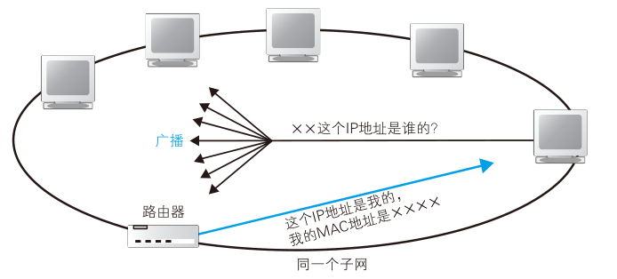
</figure>

如果对方和自己处于同一个子网中，那么通过上面的操作就可以得到对方的 MAC 地址。然后，我们将这个 MAC 地址写入 MAC 头部，MAC 头部就完成了。

不过，如果每次发送包都要这样查询一次，网络中就会增加很多 ARP 包，因此我们会将查询结果放到一块叫作 ARP 缓存的内存空间中留着以后用。也就是说，在发送包时，先查询一下 ARP 缓存，如果其中已经保存了对方的 MAC 地址，就不需要发送 ARP 查询，直接使用 ARP 缓存中的地址，而当 ARP 缓存中不存在对方 MAC 地址时，则发送 ARP 查询。显示 ARP 缓存的方法和 MAC 地址的cmd指令为`arp -a`

有了 ARP 缓存，我们可以减少 ARP 包的数量，但如果总是使用 ARP 缓存中保存的地址也会产生问题。例如当 IP 地址发生变化时，ARP 缓存的内容就会和现实发生差异。为了防止这种问题的发生，ARP 缓存中的值在经过一段时间后会被删除，一般这个时间在几分钟左右。这个删除的操作非常简单粗暴，不管 ARP 缓存中的内容是否有效，只要经过几分钟就全部删掉，这样就不会出问题了。当地址从 ARP 缓存中删除后，只要重新执行一次 ARP 查询就可以再次获得地址了。

上面这个策略能够在几分钟后消除缓存和现实的差异，但 IP 地址刚刚发生改变的时候，ARP 缓存中依然会保留老的地址，这时就会发生通信的异常。

将 MAC 头部加在 IP 头部的前面，整个包就完成了。到这里为止，整个打包的工作是由 IP 模块负责的。有人认为，MAC 头部是以太网需要的内容，并不属于 IP 的职责范围，但从现实来看，让 IP 负责整个打包工作是有利的。如果在交给网卡之前，IP 模块能够完成整个打包工作，那么网卡只要将打好的包发送出去就可以了。对于除 IP 以外的其他类型的包也是一样，如果在交给网卡之前完成打包，那么对于网卡来说，发送的操作和发送 IP 包是完全相同的。这样一来，同一块网卡就可以支持各种类型的包。至于接收操作，我们到后面会讲，但如果接收的包可以原封不动直接交给 IP 模块来处理，网卡就只要负责接收就可以了。这样一来，一块网卡也就能支持各种类型的包了。与其机械地设计模块和设备之间的分工，导致网卡只能支持 IP 包，不如将分工设计得现实一些，让网卡能够灵活支持各种类型的包。

## 以太网的基本知识

完成 IP 模块的工作之后，下面就该轮到网卡了，不过在此之前，我们先来了解一些以太网的基本知识。

以太网是一种为多台计算机能够彼此自由和廉价地相互通信而设计的通信技术，它的原型如下图(a)所示。

<figure>
    
</figure>

从图上不难看出，这种网络的本质其实就是一根网线。图上还有一种叫作收发器的小设备，它的功能只是将不同网线之间的信号连接起来而已。因此，当一台计算机发送信号时，信号就会通过网线流过整个网络，最终到达所有的设备。这就好像所有人待在一个大房间里，任何一个人说话，所有人都能够听到，同样地，这种网络中任何一台设备发送的信号所有设备都能接收到。不过，我们无法判断一个信号到底是发给谁的，因此需要在信号的开头加上接收者的信息，也就是地址。这样一来就能够判断信号的接收者了，与接收者地址匹配的设备就接收这个包，其他的设备则丢弃这个包，这样我们的包就送到指定的目的地了。为了控制这一操作，我们就需要使用前面表里列出的 MAC 头部。通过 MAC 头部中的接收方 MAC 地址，就能够知道包是发给谁的；而通过发送方 MAC 地址，就能够知道包是谁发出的；此外，通过以太类型就可以判断包里面装了什么类型的内容。以太网其实就这么简单。

这个原型后来变成了图（b）中的结构。这个结构是将主干网线替换成了一个中继式集线器，将收发器网线替换成了双绞线。不过，虽然网络的结构有所变化，但信号会发送给所有设备这一基本性质并没有改变。

后来，图（c）这样的使用交换式集线器的结构普及开来，现在我们说的以太网指的都是这样的结构。这个结构看上去和（b）很像，但其实里面有一个重要的变化，即信号会发送给所有设备这一性质变了，现在信号只会流到根据 MAC 地址指定的设备，而不会到达其他设备了。当然，根据 MAC 地址来传输包这一点并没有变，因此 MAC 头部的设计也得以保留。

尽管以太网经历了数次变迁，但其基本的 3 个性质至今仍未改变，即将包发送到 MAC 头部的接收方 MAC 地址代表的目的地，用发送方 MAC 地址识别发送方，用以太类型识别包的内容。因此，大家可以认为具备这 3 个性质的网络就是以太网。

以太网中的各种设备也是基于以太网规格来工作的，因此下面的内容不仅适用于客户端计算机，同样也适用于服务器、路由器等各种设备。此外，以太网和 IP 一样，并不关心网络包的实际内容，因此以太网的收发操作也和 TCP 的工作阶段无关，都是共通的。

## 将 IP 包转换成电或光信号发送出去

下面来看看以太网的包收发操作。IP 生成的网络包只是存放在内存中的一串数字信息，没有办法直接发送给对方。因此，我们需要将数字信息转换为电或光信号，才能在网线上传输，也就是说，这才是真正的数据发送过程。

负责执行这一操作的是网卡，但网卡也无法单独工作，要控制网卡还需要网卡驱动程序。驱动程序不只有网卡才有，键盘、鼠标、显卡、声卡等各种硬件设备都有。当然，不同厂商和型号的网卡在结构上有所不同，因此网卡驱动程序也是厂商开发的专用程序。

网卡的内部结构如图所示，这是一张网卡主要构成要素的概念图，并不代表硬件的实际结构，但依然可以看清大体的思路。

<figure>
    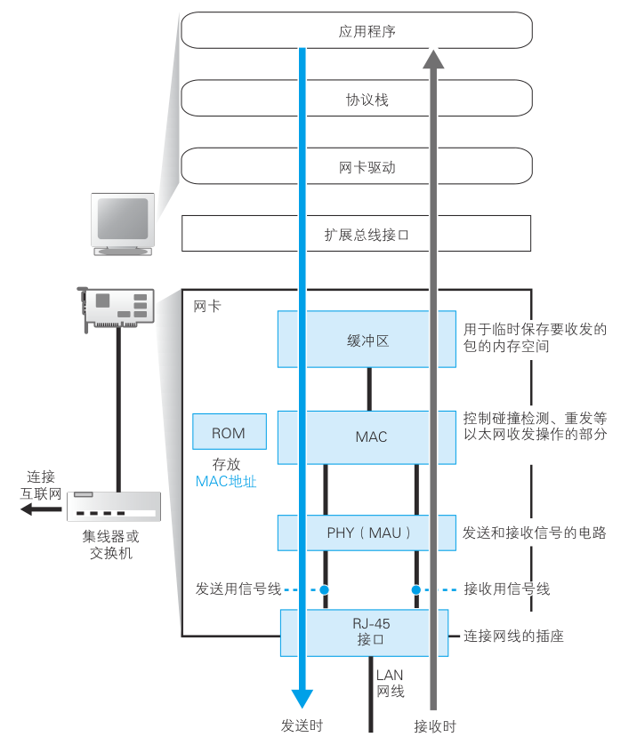
</figure>

记住这一内部结构之后，我们再来介绍包收发的操作过程，现在，我们先来讲讲网卡的初始化过程。

网卡并不是通上电之后就可以马上开始工作的，而是和其他硬件一样，都需要进行初始化。也就是说，打开计算机启动操作系统的时候，网卡驱动程序会对硬件进行初始化操作，然后硬件才进入可以使用的状态。这些操作包括硬件错误检查、初始设置等步骤，这些步骤对于很多其他硬件也是共通的，但也有一些操作是以太网特有的，那就是在控制以太网收发操作的 MAC 模块中设置 MAC 地址。

网卡的 ROM 中保存着全世界唯一的 MAC 地址，这是在生产网卡时写入的，将这个值读出之后就可以对 MAC 模块进行设置，MAC 模块就知道自己对应的 MAC 地址了。也有一些特殊的方法，比如从命令或者配置文件中读取 MAC 地址并分配给 MAC 模块。这种情况下，网卡会忽略 ROM 中的 MAC 地址。有人认为在网卡通电之后，ROM 中的 MAC 地址就自动生效了，其实不然，真正生效的是网卡驱动进行初始化时在 MAC 模块中设置的那个 MAC 地址。在操作系统启动并完成这些初始化操作之后，网卡就可以等待来自 IP 的委托了。

## 给网络包再加 3 个控制数据

好了，下面来看一看网卡是如何将包转换成电信号并发送到网线中的。网卡驱动从 IP 模块获取包之后，会将其复制到网卡内的缓冲区中，然后向 MAC 模块发送发送包的命令。接下来就轮到 MAC 模块进行工作了。

首先，MAC 模块会将包从缓冲区中取出，并在开头加上报头和起始帧分界符，在末尾加上用于检测错误的帧校验序列。

<figure>
    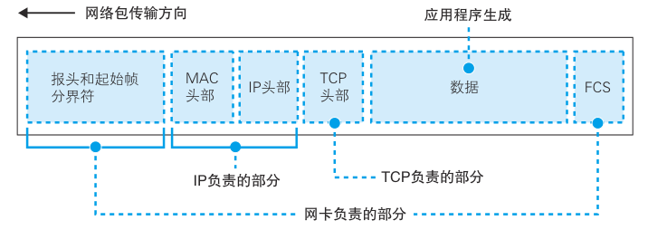
</figure>

报头是一串像 10101010…这样 1 和 0 交替出现的比特序列，长度为 56 比特，它的作用是确定包的读取时机。当这些 1010 的比特序列被转换成电信号后，会形成如下图这样的波形。

<figure>
    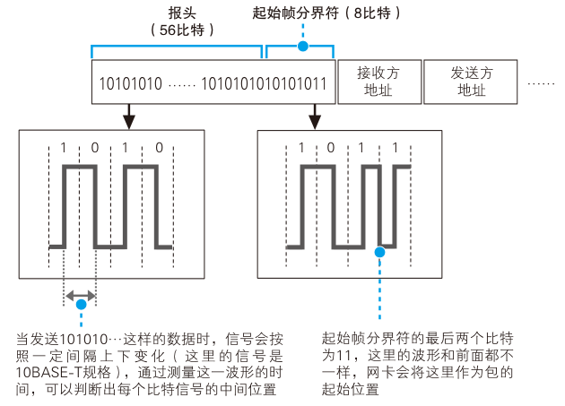
</figure>

接收方在收到信号时，遇到这样的波形就可以判断读取数据的时机。关于这一块内容，我们得先讲讲如何通过电信号来读取数据。

<figure>
    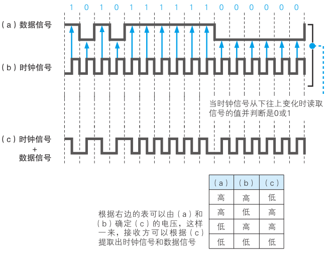
</figure>

用电信号来表达数字信息时，我们需要让 0 和 1 两种比特分别对应特定的电压和电流，例如上图（a）这样的电信号就可以表达数字信息。然而，实际的信号并不像所示的那样有分隔每个比特的辅助线，因此在测量电压和电流时必须先判断出每个比特的界限在哪里。要解决这个问题，最简单的方法就是在数据信号之外再发送一组用来区分比特间隔的时钟信号。如上图（b）所示，当时钟信号从下往上变化时读取电压和电流的值，然后和 0 或 1 进行对应就可以了。但是这种方法存在问题。当距离较远，网线较长时，两条线路的长度会发生差异，数据信号和时钟信号的传输会产生时间差，时钟就会发生偏移。

要解决这个问题，可以采用将数据信号和时钟信号叠加在一起的方法。这样的信号如上图（c）所示，发送方将这样的信号发给接收方。由于时钟信号是像（b）这样按固定频率进行变化的，只要能够找到这个变化的周期，就可以从接收到的信号（c）中提取出时钟信号（b），进而通过接收信号（c）和时钟信号（b）计算出数据信号（a），这和发送方将数据信号和时钟信号进行叠加的过程正好相反。然后，只要根据时钟信号（b）的变化周期，我们就可以从数据信号（a）中读取相应的电压和电流值，并将其还原为 0 或 1 的比特了。

这里的重点在于如何判断时钟信号的变化周期。时钟信号是以 10 Mbit/s 或者 100 Mbit/s 这种固定频率进行变化的，就像我们乘坐自动扶梯一样，只要对信号进行一段时间的观察，就可以找到其变化的周期。因此，我们不能一开始就发送包的数据，而是要在前面加上一段用来测量时钟信号的特殊信号，这就是报头的作用。

以太网根据速率和网线类型的不同分为多种派生方式，每种方式的信号形态也有差异，并不都是像本例中讲的这样，单纯通过电压和电流来表达 0 和 1 的。因此，101010…这样的报头数字信息在转换成电信号后，其波形也不一定都是前面那个样子，而是根据方式的不同而不同。但是，报头的作用和基本思路是一致的。

报头后面的起始帧分界符在前面的图里也画出来了，它的末尾比特排列有少许变化。接收方以这一变化作为标记，从这里开始提取网络包数据。也就是说，起始帧分界符是一个用来表示包起始位置的标记。

末尾的 FCS（帧校验序列）用来检查包传输过程中因噪声导致的波形紊乱、数据错误，它是一串 32 比特的序列，是通过一个公式对包中从头到尾的所有内容进行计算而得出来的。具体的计算公式在此省略，它和磁盘等设备中使用的 CRC 错误校验码是同一种东西，当原始数据中某一个比特发生变化时，计算出来的结果就会发生变化。在包传输过程中，如果受到噪声的干扰而导致其中的数据发生了变化，那么接收方计算出的 FCS 和发送方计算出的 FCS 就会不同，这样我们就可以判断出数据有没有错误。

## 向集线器发送网络包

加上报头、起始帧分界符和 FCS 之后，我们就可以将包通过网线发送出去了。发送信号的操作分为两种，一种是使用集线器的半双工模式，另一种是使用交换机的全双工模式。

在半双工模式中，为了避免信号碰撞，首先要判断网线中是否存在其他设备发送的信号。如果有，则需要等待该信号传输完毕，因为如果在有信号时再发送一组信号，两组信号就会发生碰撞。当之前的信号传输完毕，或者本来就没有信号在传输的情况下，我们就可以开始发送信号了。首先，MAC 模块从报头开始将数字信息按每个比特转换成电信号，然后由 PHY，或者叫 MAU 的信号收发模块发送出去。在这里，将数字信息转换为电信号的速率就是网络的传输速率，例如每秒将 10 Mbit 的数字信息转换为电信号发送出去，则速率就是 10 Mbit/s。

接下来，PHY（MAU）模块会将信号转换为可在网线上传输的格式，并通过网线发送出去。以太网规格中对不同的网线类型和速率以及其对应的信号格式进行了规定，但 MAC 模块并不关心这些区别，而是将可转换为任意格式的通用信号发送给 PHY（MAU）模块，然后 PHY（MAU）模块再将其转换为可在网线上传输的格式。大家可以认为 PHY（MAU）模块的功能就是对 MAC 模块产生的信号进行格式转换。当然，以太网还有很多不同的派生方式，网线传输的信号格式也有各种变化。此外，实际在网线中传输的信号很复杂，我们无法一一介绍，但是如果一点都不讲，大家可能对此难以形成一个概念，所以就举一个例子，大家感受一下就好。图 2.27 就是这样一个例子，我们这里就不详细解释了，总之，网线中实际传输的信号就是这个样子的。

<figure>
    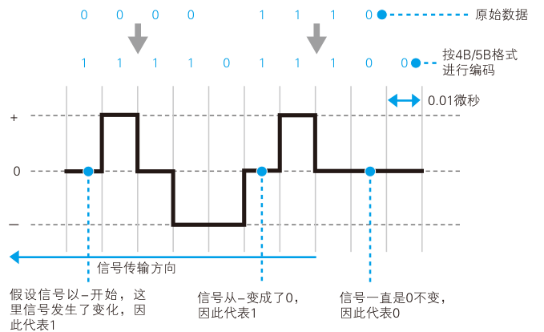
</figure>

PHY（MAU）的职责并不是仅仅是将 MAC 模块传递过来的信号通过网线发送出去，它还需要监控接收线路中有没有信号进来。在开始发送信号之前，需要先确认没有其他信号进来，这时才能开始发送。如果在信号开始发送到结束发送的这段时间内一直没有其他信号进来，发送操作就成功完成了。以太网不会确认发送的信号对方有没有收到。根据以太网的规格，两台设备之间的网线不能超过 100 米，在这个距离内极少会发生错误，万一发生错误，协议栈的 TCP 也会负责搞定，因此在发送信号时没有必要检查错误。

在发送信号的过程中，接收线路不应该有信号进来，但情况并不总是尽如人意，有很小的可能性出现多台设备同时进行发送操作的情况。如果有其他设备同时发送信号，这些信号就会通过接收线路传进来。

在使用集线器的半双工模式中，一旦发生这种情况，两组信号就会相互叠加，无法彼此区分出来，这就是所谓的信号碰撞。这种情况下，继续发送信号是没有意义的，因此发送操作会终止。为了通知其他设备当前线路已发生碰撞，还会发送一段时间的阻塞信号，然后所有的发送操作会全部停止。

等待一段时间之后，网络中的设备会尝试重新发送信号。但如果所有设备的等待时间都相同，那肯定还会发生碰撞，因此必须让等待的时间相互错开。具体来说，等待时间是根据 MAC 地址生成一个随机数计算出来的。

当网络拥塞时，发生碰撞的可能性就会提高，重试发送的时候可能又会和另外一台设备的发送操作冲突，这时会将等待时间延长一倍，然后再次重试。以此类推，每次发生碰撞就将等待时间延长一倍，最多重试 10 次，如果还是不行就报告通信错误。

另一种全双工模式我们会在后面探索交换机时进行介绍，在全双工模式中，发送和接收可以同时进行，不会发生碰撞。因此，全双工模式中不需要像半双工模式这样考虑这么多复杂的问题，即便接收线路中有信号进来，也可以直接发送信号。

## 接收返回包

网卡将包转换为电信号并发送出去的过程到这里就结束了，既然讲到了以太网的工作方式，那我们不妨继续看看接收网络包时的操作过程。

在使用集线器的半双工模式以太网中，一台设备发送的信号会到达连接在集线器上的所有设备。这意味着无论是不是发给自己的信号都会通过接收线路传进来，因此接收操作的第一步就是不管三七二十一把这些信号全都收进来再说。

信号的开头是报头，通过报头的波形同步时钟，然后遇到起始帧分界符时开始将后面的信号转换成数字信息。这个操作和发送时是相反的，即PHY（MAU）模块先开始工作，然后再轮到 MAC 模块。 首先，PHY（MAU）模块会将信号转换成通用格式并发送给 MAC 模块，MAC 模块再从头开始将信号转换为数字信息，并存放到缓冲区中。当到达信号的末尾时，还需要检查 FCS。具体来说，就是将从包开头到结尾的所有比特套用到公式中计算出 FCS，然后和包末尾的 FCS 进行对比，正常情况下两者应该是一致的，如果中途受到噪声干扰而导致波形发生紊乱，则两者的值会产生差异，这时这个包就会被当作错误包而被丢弃。

如果 FCS 校验没有问题，接下来就要看一下 MAC 头部中接收方MAC 地址与网卡在初始化时分配给自己的 MAC 地址是否一致，以判断这个包是不是发给自己的。我们没必要去接收发给别人的包，因此如果不是自己的包就直接丢弃，如果接收方 MAC 地址和自己 MAC 地址一致，则将包放入缓冲区中。到这里，MAC 模块的工作就完成了，接下来网卡会通知计算机收到了一个包。

通知计算机的操作会使用一个叫作中断的机制。在网卡执行接收包的操作的过程中，计算机并不是一直监控着网卡的活动，而是去继续执行其他的任务。因此，如果网卡不通知计算机，计算机是不知道包已经收到了这件事的。网卡驱动也是在计算机中运行的一个程序，因此它也不知道包到达的状态。在这种情况下，我们需要一种机制能够打断计算机正在执行的任务，让计算机注意到网卡中发生的事情，这种机制就是中断。

具体来说，中断的工作过程是这样的。首先，网卡向扩展总线中的中断信号线发送信号，该信号线通过计算机中的中断控制器连接到 CPU。当产生中断信号时，CPU 会暂时挂起正在处理的任务，切换到操作系统中的中断处理程序。然后，中断处理程序会调用网卡驱动，控制网卡执行相应的接收操作。

中断是有编号的，网卡在安装的时候就在硬件中设置了中断号，在中断处理程序中则将硬件的中断号和相应的驱动程序绑定。例如，假设网卡的中断号为 11，则在中断处理程序中将中断号 11 和相应的网卡驱动绑定起来，当网卡发起中断时，就会自动调用网卡驱动了。现在的硬件设备都遵循即插即用规范自动设置中断号，我们没必要去关心中断号了，在以前需要手动设置中断号的年代，经常发生因为设置了错误的中断号而导致网卡无法正常工作的问题。

网卡驱动被中断处理程序调用后，会从网卡的缓冲区中取出收到的包，并通过 MAC 头部中的以太类型字段判断协议的类型。现在我们在大多数情况下都是使用 TCP/IP 协议，但除了 TCP/IP 之外还有很多其他类型的协议，例如 NetWare 中使用的 IPX/SPX，以及 Mac 电脑中使用的 AppleTalk 等协议。这些协议都被分配了不同的以太类型，如 0080（十六进制）代表IP 协议，网卡驱动就会把这样的包交给 TCP/IP 协议栈；如果是 809B 则表示 AppleTalk 协议，就把包交给 AppleTalk 协议栈，以此类推。

按照探索之旅的思路，大家可能会认为向 Web 服务器发送包之后，后面收到的一定是 Web 服务器返回的包，其实并非如此。计算机中同时运行了很多程序，也会同时进行很多通信操作，因此收到的包也有可能是其他应用程序的。不过，即便如此也没问题，网卡不会关心包里的内容，只要按照以太类型将包交给对应的协议栈就可以了。接下来，协议栈会判断这个包应该交给哪个应用程序，并进行相应的处理。

## 将服务器的响应包从 IP 传递给 TCP

下面我们假设 Web 服务器返回了一个网络包，那么协议栈会进行哪些处理呢？服务器返回的包的以太类型应该是 0800，因此网卡驱动会将其交给 TCP/IP 协议栈来进行处理。接下来就轮到 IP 模块先开始工作了，第一步是检查 IP 头部，确认格式是否正确。如果格式没有问题，下一步就是查看接收方 IP 地址。如果接收网络包的设备是一台 Windows 客户端计算机，那么服务器返回的包的接收方 IP 地址应该与客户端网卡的地址一致，检查确认之后我们就可以接收这个包了。

如果接收方 IP 地址不是自己的地址，那一定是发生了什么错误。客户端计算机不负责对包进行转发，因此不应该收到不是发给自己的包。当发生这样的错误时，IP 模块会通过 ICMP 消息将错误告知发送方（第一个图）。ICMP 规定了各种类型的消息，如下表所示。

<figure>
    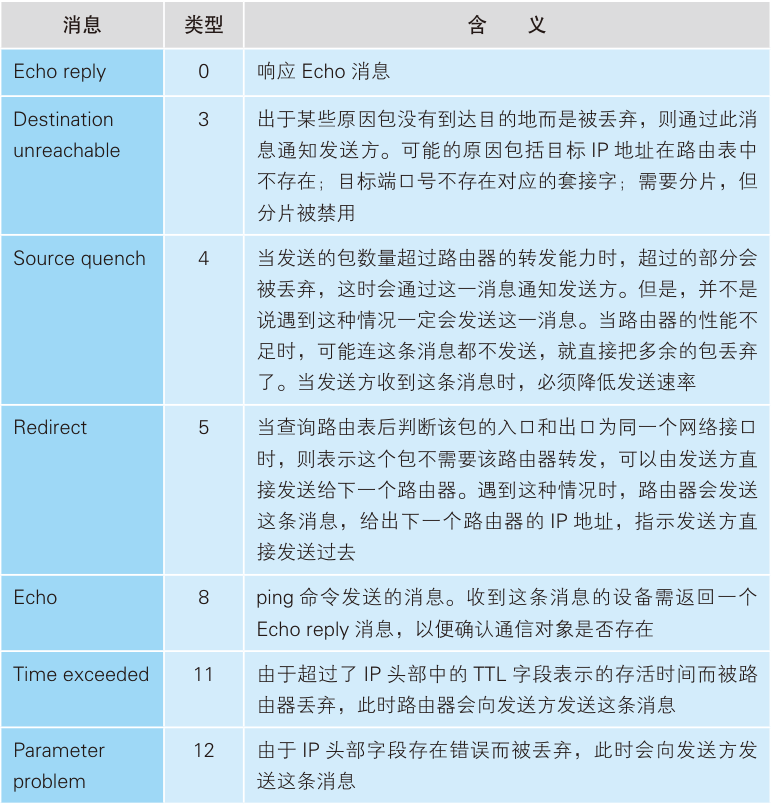
</figure>

当我们遇到这个错误时，IP 模块会通过 Destination unreachable 消息通知对方。从这张表的内容中我们可以看到在包的接收和转发过程中能够遇到的各种错误。

如果接收方 IP 地址正确，则这个包会被接收下来，这时还需要完成另一项工作。IP 协议有一个叫作分片的功能，具体的内容我们将在第 3 章探索路由器时进行介绍。简单来说，网线和局域网中只能传输小包，因此需要将大的包切分成多个小包。如果接收到的包是经过分片的，那么 IP 模块会将它们还原成原始的包。分片的包会在 IP 头部的标志字段中进行标记，当收到分片的包时，IP 模块会将其暂存在内部的内存空间中，然后等待 IP 头部中具有相同 ID 的包全部到达，这是因为同一个包的所有分片都具有相同的 ID。此外，IP 头部还有一个分片偏移量（fragment offset）字段，它表示当前分片在整个包中所处的位置。根据这些信息，在所有分片全部收到之后，就可以将它们还原成原始的包，这个操作叫作分片重组。

到这里，IP 模块的工作就结束了，接下来包会被交给 TCP 模块。TCP 模块会根据 IP 头部中的接收方和发送方 IP 地址，以及 TCP 头部中的接收方和发送方端口号来查找对应的套接字。找到对应的套接字之后，就可以根据套接字中记录的通信状态，执行相应的操作了。例如，如果包的内容是应用程序数据，则返回确认接收的包，并将数据放入缓冲区，等待应用程序来读取；如果是建立或断开连接的控制包，则返回相应的响应控制包，并告知应用程序建立和断开连接的操作状态。

