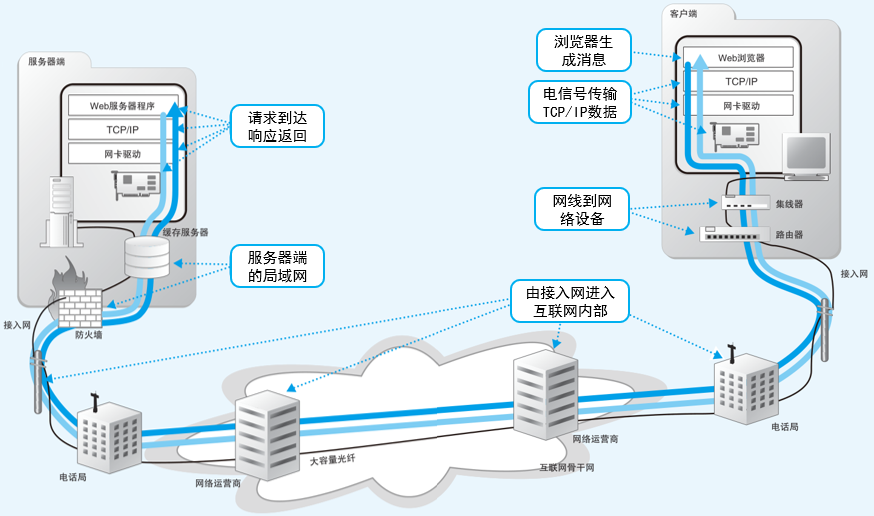

# 协议栈和网卡

使用电信号传输TCP/IP数据。

<figure>
    
</figure>

操作系统中的网络控制软件叫作**协议栈**。这部分研究协议栈的内部。这个软件会将从浏览器接收到的消息打包，然后加上目的地址等信息（给包裹贴上运输单）。

这个软件还有其他一些功能，例如当发生通信错误时重新发送包，或者调节数据发送的速率等，全自动快递员。协议栈会将包交给网卡(负责以太网或无线网络通信的硬件)，网卡会将包转换为电信号并通过网线发送出去。

这部分就是关于协议栈内部的事情，关于协议栈如何用电信号传输TCP/IP数据。分成这几部分

- 创建套接字
- 连接服务器
- 收发数据
- 从服务器断开连接并删除套接字
- IP与以太网的包收发操作
- 用UDP协议收发数据的操作

