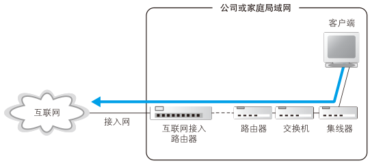
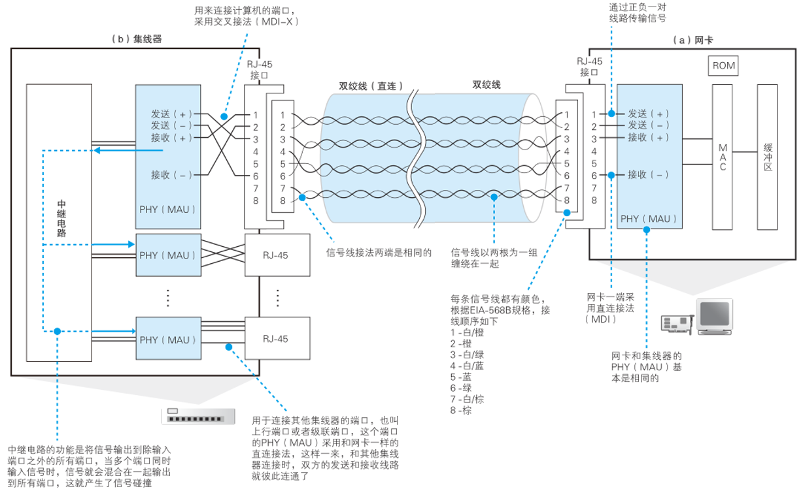
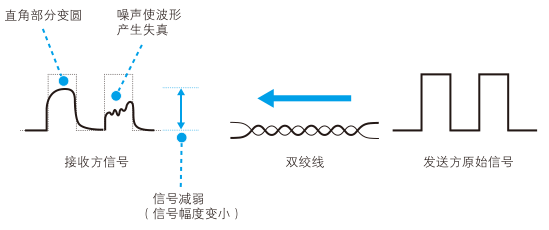
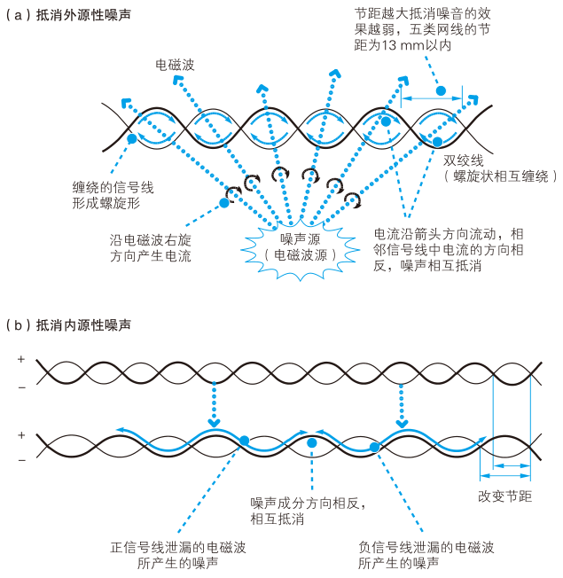
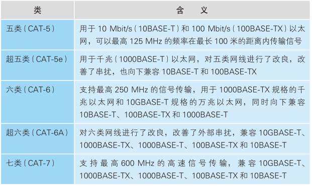
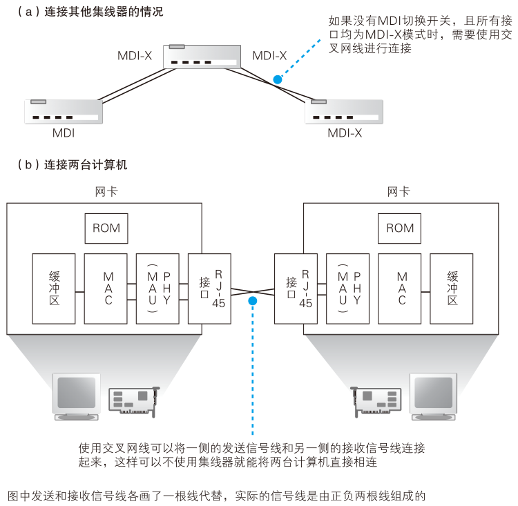
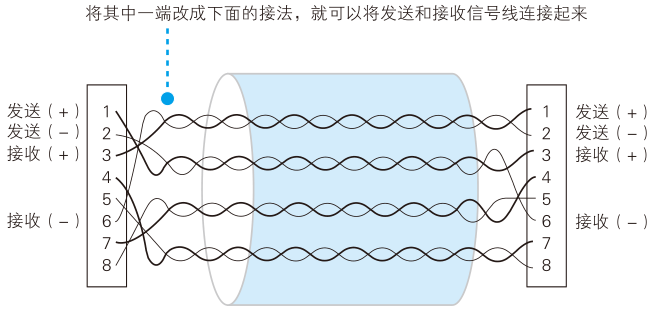

# 网线与集线器

## 每个包都是独立传输的

从计算机发送出来的网络包会通过集线器、路由器等设备被转发，最终到达目的地。转发设备会根据包头部中的控制信息，在转发设备内部一个写有转发规则的表中进行查询，以此来判断包的目的地，然后将包朝目的地的方向进行转发。快递员在送快递时只看快递单，不看里面的内容，同样地，转发设备在进行转发时也不看数据的内容。因此，无论包里面装的是应用程序的数据或者是 TCP 协议的控制信息，都不会对包的传输操作本身产生影响。换句话说，HTTP 请求的方法，TCP 的确认响应和序号，客户端和服务器之间的关系，这一切都与包的传输无关。因此，所有的包在传输到目的地的过程中都是独立的，相互之间没有任何关联。

**每个包都是独立传输的**

有了这个概念之后，这部分探索一下网络包在进入互联网之前经历的传输过程。这里假设客户端计算机连接的局域网结构是像下图这样的。

<figure>
    
</figure>

也就是说，网络包从客户端计算机发出之后，要经过集线器、交换机和路由器最终进入互联网。实际上，我们家里用的路由器已经集成了集线器和交换机的功能，像图上这样使用独立设备的情况很少见。不过，把每个功能独立出来更容易理解，而且理解了这种模式之后，也就能理解集成了多种功能的设备了，因此我们这里将所有功能独立出来，逐个来进行探索。

## 防止网线中的信号衰减很重要

本章的探索从信号流出网卡进入网线开始。网卡中的 PHY（MAU）模块负责将包转换成电信号，信号通过 RJ-45 接口进入双绞线，这部分的放大图如下图右侧部分所示。

<figure>
    
    <figcaption>网卡与集线器连接</figcaption>
</figure>

以太网信号的本质是正负变化的电压，可以认为网卡的 PHY（MAU）模块就是一个从正负两个信号端子输出信号的电路。PHY（MAU）模块直接连接上图右侧中的 RJ-45 接口，信号从这个接口中的 1 号和 2 号针脚流入网线。然后，信号会通过网线到达集线器的接口，这个过程就是单纯地传输电信号而已。

但是，信号到达集线器的时候并不是跟刚发送出去的时候一模一样。集线器收到的信号有时会出现衰减。信号在网线的传输过程中，能量会逐渐损失。网线越长，信号衰减就越严重。

<figure>
    
</figure>

而且，信号损失能量并非只是变弱而已。以太网中的信号波形是方形的，但损失能量会让信号的拐角变圆，这是因为电信号的频率越高，能量的损失率越大。信号的拐角意味着电压发生剧烈的变化，而剧烈的变化意味着这个部分的信号频率很高。高频信号更容易损失能量，因此本来剧烈变化的部分就会变成缓慢的变化，拐角也就变圆了。

即便线路条件很好，没有噪声，信号在传输过程中依然会发生失真，如果再加上噪声的影响，失真就会更厉害。噪声根据强度和类型会产生不同的影响，无法一概而论，但如果本来就已经衰减的信号再进一步失真，就会出现对 0 和 1 的误判，这就是产生通信错误的原因。

## 双绞是为了抑制噪声

局域网网线使用的是双绞线，其中“双绞”的意思就是以两根信号线为一组缠绕在一起，这种拧麻花一样的设计是为了抑制噪声的影响。

那么双绞线为什么能够抑制噪声呢？首先，我们来看看噪声是如何产生的。产生噪声的原因是网线周围的电磁波，当电磁波接触到金属等导体时，在其中就会产生电流。因此，如果网线周围存在电磁波，就会在网线中产生和原本的信号不同的电流。由于信号本身也是一种带有电压变化的电流，其本质和噪声产生的电流是一样的，所以信号和噪声的电流就会混杂在一起，导致信号的波形发生失真，这就是噪声的影响。

影响网线的电磁波分为两种。一种是由电机、荧光灯、CRT 显示器等设备泄漏出来的电磁波，这种电磁波来自网线之外的其他设备，我们来看看双绞线如何抑制这种电磁波的影响。首先，信号线是用金属做成的，当电磁波接触到信号线时，会沿电磁波传播的右旋方向产生电流，这种电流会导致波形发生失真。如果我们将信号线缠绕在一起，信号线就变成了螺旋形，其中两根信号线中产生的噪声电流方向就会相反，从而使得噪声电流相互抵消，噪声就得到了抑制（图（a））。当然，即便信号线变成螺旋形，里面的信号依然可以原样传输，也就是说，信号没有变，只是噪声被削弱了。

另一种电磁波是从网线中相邻的信号线泄漏出来的。由于传输的信号本身就是一种电流，当电流流过时就会向周围发出电磁波，这些电磁波对于其他信号线来说就成了噪声。这种内部产生的噪声称为串扰crosstalk）。

这种噪声的强度其实并不高，但问题是噪声源的距离太近了。距离发生源越远，电磁波就会因扩散而变得越弱，但在同一根网线中的信号线之间距离很近，这些电磁波还没怎么衰减就已经接触到了相邻的信号线。因此，尽管信号线产生的电磁波十分微弱，也能够在相邻的信号线中产生感应电流。

要抑制这种噪声，关键在于双绞线的缠绕方式。在一根网线中，每一对信号线的扭绞间隔（节距）都有一定的差异，这使得在某些地方正信号线距离近，另一些地方则是负信号线距离近。由于正负信号线产生的噪声影响是相反的，所以两者就会相互抵消（图（b））。从网线整体来看，正负的分布保持平衡，自然就会削弱噪声的影响。

<figure>
    
</figure>

通过将信号线缠绕在一起的方式，噪声得到了抑制，从结果来看提升了网线的性能，除此之外还有其他一些工艺也能够帮助提升性能。例如在信号线之间加入隔板保持距离，以及在外面包裹可阻挡电磁波的金属屏蔽网等。有了这些工艺的帮助，我们现在可以买到性能指标不同的各种网线。网线的性能是以“类”来区分的，现在市售双绞线的主要种类如表所示。

<figure>
    
</figure>

## 集线器将信号发往所有线路

当信号到达集线器后，会被广播到整个网络中。以太网的基本架构就是将包发到所有的设备，然后由设备根据接收方 MAC 地址来判断应该接收哪些包，而集线器就是这一架构的忠实体现，它就是负责按照以太网的基本架构将信号广播出去。下面来看看它的工作方式。

集线器的内部结构如图左侧部分所示。

<figure>
    
    <figcaption>网卡与集线器连接</figcaption>
</figure>

首先，在每个接口的后面装有和网卡中的 PHY（MAU）功能相同的模块，但如果它们像网卡端一样
采用直连式接线，是无法正常接收信号的。要正常接收信号，必须将“发送线路”和“接收线路”连接起来才行。在图中，集线器中的 PHY（MAU）模块与接口之间采用交叉接线的原因正是在于此。

集线器的接口中有一个 MDI/MDI-X 切换开关，现在你应该知道它是干什么用的了吧？ MDI 就是对 RJ-45 接口和信号收发模块进行直连接线，而 MDI-X 则是交叉接线。由于集线器的接口一般都是 MDI-X 模式，要将两台集线器相连时，就需要将其中一台改成 MDI 模式（图 （a））。

<figure>
    
</figure>

如果集线器上没有 MDI 切换开关，而且所有的接口又都是 MDI-X 时，可以用交叉网线连接两台集线器。所谓交叉网线，就是一种将发送和接收信号线反过来接的网线（图 3.6）。

<figure>
    
</figure>

此外，交叉网线也可以像图（b）这样用于将两台计算机直接连接起来。网卡不仅可以连接集线器，因为网卡的 PHY（MAU）模块和集线器都是一样的，所以两台计算机的网卡也可以相互连接，只要将一侧的发送信
号线和另一侧的接收信号线连起来就可以收发数据了。

信号到达集线器的 PHY（MAU）模块后，会进入中继电路。中继电路的基本功能就是将输入的信号广播到集线器的所有端口上。当然，也有一些产品具有信号整形、错误抑制等功能，但基本上就是将输入的信号原封不动地输出到网线接口。

接下来，信号从所有接口流出，到达连接在集线器上的所有设备。然后，这些设备在收到信号之后会通过 MAC 头部中的接收方 MAC 地址判断是不是发给自己的，如果是发给自己的就接受，否则就忽略。这样，网络包就能够到达指定 MAC 地址的接收方了。

由于集线器只是原封不动地将信号广播出去，所以即便信号受到噪声的干扰发生了失真，也会原样发送到目的地。这时，接收信号的设备，也就是交换机、路由器、服务器等，会在将信号转换成数字信息后通过 FCS 校验发现错误，并将出错的包丢弃。当然，丢弃包并不会影响数据的传输，因为丢弃的包不会触发确认响应。因此协议栈的 TCP 模块会检测到丢包，并对该包进行重传。

