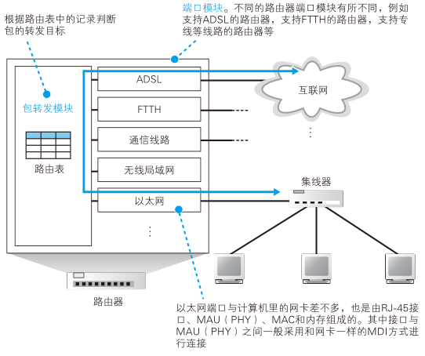
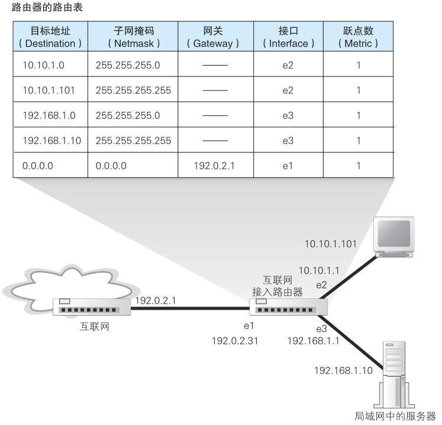
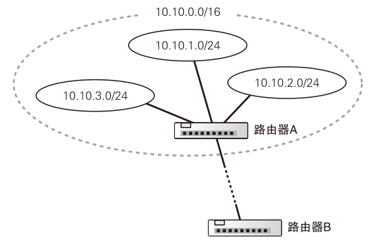
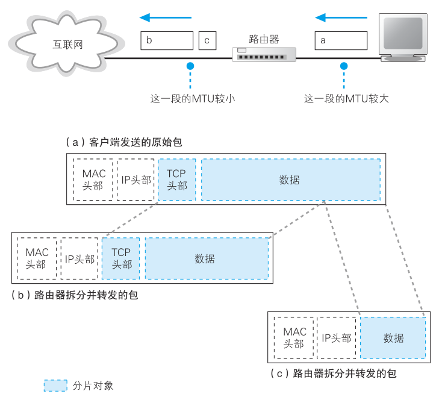
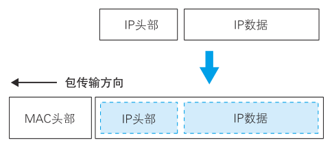

# 路由器

## 路由器的基本知识

<figure>
    
</figure>

网络包经过集线器和交换机之后，现在到达了路由器，并在此被转发到下一个路由器。这一步转发的工作原理和交换机类似，也是通过查表判断包转发的目标。不过在具体的操作过程上，路由器和交换机是有区别的。因为路由器是基于 IP 设计的，而交换机是基于以太网设计的。IP 和以太网的区别在很多地方都会碰到，我们稍后再具体讲，现在先来看看路由器的概况。

首先，路由器的内部结构如图所示。这张图已经画得非常简略了，大家只要看明白路由器包括转发模块和端口模块两部分就可以了。

<figure>
    
</figure>

其中转发模块负责判断包的转发目的地，端口模块负责包的收发操作。这一分工模式在前面介绍计算机内部结构的时候也出现过，换句话说，路由器转发模块和端口模块的关系，就相当于协议栈的 IP 模块和网卡之间的关系。因此，大家可以将路由器的转发模块想象成 IP 模块，将端口模块想象成网卡。

通过更换网卡，计算机不仅可以支持以太网，也可以支持无线局域网，路由器也是一样。如果路由器的端口模块安装了支持无线局域网的硬件，就可以支持无线局域网了。此外，计算机的网卡除了以太网和无线局域网之外很少见到支持其他通信技术的品种，而路由器的端口模块则支持除局域网之外的多种通信技术，如 ADSL、FTTH，以及各种宽带专线等，只要端口模块安装了支持这些技术的硬件即可。

看懂了内部结构之后，大家应该能大致理解路由器的工作原理了吧。路由器在转发包时，首先会通过端口将发过来的包接收进来，这一步的工作过程取决于端口对应的通信技术。对于以太网端口来说，就是按照以太网规范进行工作，而无线局域网端口则按照无线局域网的规范工作，总之就是委托端口的硬件将包接收进来。接下来，转发模块会根据接收到的包的 IP 头部中记录的接收方 IP 地址，在路由表中进行查询，以此判断转发目标。然后，转发模块将包转移到转发目标对应的端口，端口再按照硬件的规则将包发送出去，也就是转发模块委托端口模块将包发送出去的意思。

这就是路由器的基本原理，下面再做一些补充。刚才我们讲到端口模块会根据相应通信技术的规范来执行包收发的操作，这意味着端口模块是以实际的发送方或者接收方的身份来收发网络包的。以以太网端口为例，路由器的端口具有 MAC 地址，因此它就能够成为以太网的发送方和接收方。端口还具有 IP 地址，从这个意义上来说，它和计算机的网卡是一样的。当转发包时，首先路由器端口会接收发给自己的以太网包，然后查询转发目标，再由相应的端口作为发送方将以太网包发送出去。这一点和交换机是不同的，交换机只是将进来的包转发出去而已，它自己并不会成为发送方或者接收方。

```note
路由器的各个端口都具有 MAC 地址和 IP 地址。
```

## 路由表中的信息

在“查表判断转发目标”这一点上，路由器和交换机的大体思路是类似的，不过具体的工作过程有所不同。交换机是通过 MAC 头部中的接收方 MAC 地址来判断转发目标的，而路由器则是根据 IP 头部中的 IP 地址来判断的。由于使用的地址不同，记录转发目标的表的内容也会不同。

关于细节我们留到后面再讲，现在先来大致介绍一下。路由器中的表叫作路由表，其中包含的信息如下图所示。

<figure>
    
</figure>

最左侧的目标地址列记录的是接收方的信息。这里可能不是很容易理解，实际上这里的 IP 地址只包含表示子网的网络号部分的比特值，而表示主机号部分的比特值全部为 0。路由器会将接收到的网络包的接收方 IP 地址与路由表中的目标地址进行比较，并找到相应的记录。交换机在地址表中只匹配完全一致的记录，而路由器则会忽略主机号部分，只匹配网络
号部分。打个比方，路由器在转发包的时候只看接收方地址属于哪个区，×× 区发往这一边，×× 区发往那一边。

在匹配地址的过程中，路由器需要知道网络号的比特数，因此路由表中还有一列子网掩码。通过这个值就可以判断出网络号的比特数。

上面这些介绍可以帮助大家大致理解路由器的工作方式，如果要进一步深入，还需要再思考一些问题。刚才我们说过，目标地址列中的 IP 地址表示子网，但也有一些例外，有时地址本身的子网掩码和路由表中的子网掩码是不一致的，这是路由聚合的结果。路由聚合会将几个子网合并成一个子网，并在路由表中只产生一条记录。

要搞清楚这个问题，我们还是看一个例子。如图 3.14 所示，

<figure>
    
</figure>

我们现在有 3 个子网，分别为10.10.1.0/24、10.10.2.0/24、10.10.3.0/24，路由器 B 需要将包发往这 3 个子网。在这种情况下，路由器 B 的路由表中原本应该有对应这 3 个子网的 3 条记录，但在这个例子中，无论发往任何一个子网，都是通过路由器 A 来进行转发，因此我们可以在路由表中将这 3 个子网合并成 10.10.0.0/16，这样也可以正确地进行转发，但我们减少了路由表中的记录数量，这就是路由聚合。经过路由聚合，多个子网会被合并成一个子网，子网掩码会发生变化，同时，目标地址列也会改成聚合后的地址。

```note
10.10.1.0/24，这个24的意思是子网掩码的高24位都是一。即

- 10.10.1.0/24 = 10.10.1.0/255.255.255.0
- 10.10.2.0/24 = 10.10.2.0/255.255.255.0
- 10.10.3.0/24 = 10.10.3.0/255.255.255.0
- 10.10.0.0/16 = 10.10.0.0/255.255.0.0
```

相对地，还有另外一些情况，如将一个子网进行细分并注册在路由表中，然后拆分成多条记录。

从结果上看，路由表的子网掩码列只是用来在匹配目标地址时告诉路由器应该匹配多少个比特。而且，目标地址中的地址和实际子网的网络号可能并不完全相同，但即便如此，路由器依然可以正常工作。

此外，通过上述方法，我们也可以将某台具体计算机的地址写入路由表中，这时的子网掩码为 255.255.255.255，也就是说地址中的全部 32 个比特都为 1。这样一来，主机号部分比特全部为 0 可以表示一个子网，主机号部分比特不全部为 0 可以表示某一台计算机，两种情况可以用相同的规则来处理。

关于目标地址和子网掩码我们先讲到这里。接下来在子网掩码的右边还有网关和接口两列，它们表示网络包的转发目标。根据目标地址和子网掩码匹配到某条记录后，路由器就会将网络包交给接口列中指定的网络接口（即端口），并转发到网关列中指定的 IP 地址。

最后一列是跃点计数，它表示距离目标 IP 地址的距离是远还是近。这个数字越小，表示距离目的地越近；数字越大，表示距离目的地越远。

路由表记录维护的方式和交换机也有所不同。交换机中对 MAC 地址表的维护是包转发操作中的一个步骤，而路由器中对路由表的维护是与包转发操作相互独立的，也就是说，在转发包的过程中不需要对路由表的内容进行维护。

对路由表进行维护的方法有几种，大体上可分为以下两类。
- （a）由人手动维护路由记录
- （b） 根据路由协议机制，通过路由器之间的信息交换由路由器自行维护路由表的记录

其中（b）中提到的路由协议有很多种，例如 RIP、OSPC、BGP 等都属于路由协议。


## 路由器的包接收操作

下面我们来看一看路由器的整个工作过程。首先，路由器会接收网络包。路由器的端口有各种不同的类型，这里我们只介绍以太网端口是如何接收包的。以太网端口的结构和计算机的网卡基本相同，接收包并存放到缓冲区中的过程也和网卡几乎没有区别。

首先，信号到达网线接口部分，其中的 PHY（MAU）模块和 MAC 模块将信号转换为数字信息，然后通过包末尾的 FCS 进行错误校验，如果没问题则检查 MAC 头部中的接收方 MAC 地址，看看是不是发给自己的包，如果是就放到接收缓冲区中，否则就丢弃这个包。如果包的接收方 MAC 地址不是自己，说明这个包是发给其他设备的，如果接收这个包就违反了以太网的规则。

**路由器的端口都具有 MAC 地址，只接收与自身地址匹配的包，遇到不匹配的包则直接丢弃**。

## 查询路由表确定输出端口

完成包接收操作之后，路由器就会丢弃包开头的 MAC 头部。MAC 头部的作用就是将包送达路由器，其中的接收方 MAC 地址就是路由器端口的 MAC 地址。因此，当包到达路由器之后，MAC 头部的任务就完成了，于是 MAC 头部就会被丢弃。

接下来，路由器会根据 MAC 头部后方的 IP 头部中的内容进行包的转发操作。转发操作分为几个阶段，首先是查询路由表判断转发目标。关于具体的工作过程，我们还是来看一个实际的例子，还是这个例子

<figure>
    
</figure>

假设地址为 10.10.1.101 的计算机要向地址为 192.168.1.10 的服务器发送一个包，这个包先到达图中的路由器。判断转发目标的第一步，就是根据包的接收方 IP 地址查询路由表中的目标地址栏，以找到相匹配的记录。就像前面讲过的一样，这个匹配并不是匹配全部 32 个比特，而是根据子网掩码列中的值判断网络号的比特数，并匹配相应数量的比特。例如，图的第 3 行，子网掩码列为 255.255.255.0，就表示需要匹配从左起 24 个比特。网络包的接收方 IP 地址和路由表中的目标地址左起 24 个比特的内容都是192.168.1，因此两者是匹配的，该行记录就是候选转发目标之一。

按照这样的规则，我们可能会匹配到多条候选记录。在这个例子中，第 3、4、5 行都可以匹配。其中，路由器首先寻找网络号比特数最长的一条记录。网络号比特数越长，说明主机号比特数越短，也就意味着该子网内可分配的主机数量越少，即子网中可能存在的主机数量越少，这一规则的目的是尽量缩小范围，所以根据这条记录判断的转发目标就会更加准确。

第 3 行 192.168.1.0/255.255.255.0 表示一个子网，第 4 行 192.168.1.10/255.255.255.255 表示一台服务器。相比服务器所属的子网来说，直接指定服务器本身的地址时范围更小，因此这里应该选择第 4 行作为转发目标。

按照最长匹配原则筛选后，如果只剩一条候选记录，则按照这条记录的内容进行转发。然而，有时候路由表中会存在网络号长度相同的多条记录，例如考虑到路由器或网线的故障而设置的备用路由就属于这种情况。这时，需要根据跃点计数的值来进行判断。跃点计数越小说明该路由越近，因此应选择跃点计数较小的记录。

如果在路由表中无法找到匹配的记录，路由器会丢弃这个包，并通过 ICMP 消息告知发送方。这里的处理方式和交换机不同，原因在于网络规模的大小。交换机连接的网络最多也就是几千台设备的规模，这个规模并不大。如果只有几千台设备，遇到不知道应该转发到哪里的包，交换机可以将包发送到所有的端口上，虽然这个方法很简单粗暴，但不会引发什么问题。然而，路由器工作的网络环境就是互联网，它的规模是远远大于以太网的，全世界所有的设备都连接在互联网上，而且规模还在持续扩大，未来的互联网里到底会有多少设备，我们谁都说不准。在如此庞大的网络中，如果将不知道应该转发到哪里的包发送到整个网络上，那就会产生大量的网络包，造成网络拥塞。因此，路由器遇到不知道该转发到哪里的包，就会直接丢弃。

## 找不到匹配路由时选择默认路由

既然如此，那么是不是所有的转发目标都需要配置在路由表中才行呢？如果是公司或者家庭网络，这样的做法也没什么问题，但互联网中的转发目标可能超过 20 万个，如果全部要配置在路由表中实在是不太现实。

其实，大家不必担心，因为之前的 路由表中的最后一行的作用就相当于把所有目标都配置好了。这一行的子网掩码为 0.0.0.0，关键就在这里，子网掩码 0.0.0.0 的意思是网络包接收方 IP 地址和路由表目标地址的匹配中需要匹配的比特数为 0，换句话说，就是根本不需要匹配。只要将子网掩码设置为 0.0.0.0，那么无论任何地址都能匹配到这一条记录，这样就不会发生不知道要转发到哪里的问题了。

只要在这一条记录的网关列中填写接入互联网的路由器地址，当匹配不到其他路由时，网络包就会被转发到互联网接入路由器。因此这条记录被称为默认路由，这一行配置的网关地址被称为默认网关。在计算机的 TCP/IP 设置窗口中也有一个填写默认网关的框，意思是一样的。计算机上也有一张和路由器一样的路由表，其中默认网关的地址就是我们在设置窗口中填写的地址。

这样一来，无论目标地址是表示一个子网还是表示某台设备，都可以用相同的方法查找出转发目标，而且也避免了不知道转发到哪里的问题。

## 包的有效期

从路由表中查找到转发目标之后，网络包就会被转交给输出端口，并最终发送出去，但在此之前，路由器还有一些工作要完成。

第一个工作是更新 IP 头部中的 TTL（Time to Live，生存时间）字段（前面的某个表里有）。TTL 字段表示包的有效期，包每经过一个路由器的转发，这个值就会减 1，当这个值变成 0 时，就表示超过了有效期，这个包就会被丢弃。

这个机制是为了防止包在一个地方陷入死循环。如果路由表中的转发目标都配置正确，应该不会出现这样的情况，但如果其中的信息有问题，或者由于设备故障等原因切换到备用路由时导致暂时性的路由混乱，就会出现这样的情况。

发送方在发送包时会将 TTL 设为 64 或 128，也就是说包经过这么多路由器后就会“寿终正寝”。现在的互联网即便访问一台位于地球另一侧的服务器，最多也只需要经过几十个路由器，因此只要包被正确转发，就可以在过期之前到达目的地。


## 通过分片功能拆分大网络包

路由器的端口并不只有以太网一种，也可以支持其他局域网或专线通信技术。不同的线路和局域网类型各自能传输的最大包长度也不同，因此输出端口的最大包长度可能会小于输入端口。即便两个端口的最大包长度相同，也可能会因为添加了一些头部数据而导致包的实际长度发生变化，ADSL、FTTH 等宽带接入技术中使用的 PPPoE 协议就属于这种情况。无论哪种情况，一旦转发的包长度超过了输出端口能传输的最大长度，就无法直接发送这个包了。

遇到这种情况，可以使用 IP 协议中定义的分片功能对包进行拆分，缩短每个包的长度。需要注意的是，这里说的分片和第 2 章介绍的 TCP 对数据进行拆分的机制是不同的。TCP 拆分数据的操作是在将数据装到包里之前进行的，换句话说，拆分好的一个数据块正好装进一个包里。从 IP 分片的角度来看，这样一个包其实是一个未拆分的整体，也就是说，分片是对一个完整的包再进行拆分的过程。

分片操作的过程如图所示。

<figure>
    
</figure>

首先，我们需要知道输出端口的 MTU ，看看这个包能不能不分片直接发送。最大包长度是由端口类型决定的，用这个最大长度减掉头部的长度就是 MTU，将 MTU 与要转发的包长度进行比较。如果输出端口的 MTU 足够大，那么就可以不分片直接发送；如果输出端口的 MTU 太小，那么就需要将包按照这个 MTU 进行分片，但在此之前还需要看一下 IP 头部中的标志字段，确认是否可以分片。

如果查询标志字段发现不能分片，那么就只能丢弃这个包，并通过 ICMP 消息通知发送方。否则，就可以按照输出端口 MTU 对数据进行依次拆分了。在分片中，TCP 头部及其后面的部分都是可分片的数据，尽管 TCP 头部不属于用户数据，但从 IP 来看也是 TCP 请求传输的数据的一部分。数据被拆分后，每一份数据前面会加上 IP 头部，其大部分内容都和原本的 IP 头部一模一样，但其中有部分字段需要更新，这些字段用于记录分片相关的信息。

## 路由器的发送操作和计算机相同

到这里，发送前的准备工作就完成了，接下来就会进入包的发送操作。

这一步操作取决于输出端口的类型。如果是以太网端口，则按照以太网的规则将包转换为电信号发送出去；如果是 ADSL 则按照 ADSL 的规则来转换，以此类推。在家庭网络中，路由器后面一般连接 ADSL 等线路接入互联网，因此路由器会根据接入网的规则来发送包。不过，要理解具体的操作过程，需要先理解相应的通信线路，比较复杂，因此我们留到下一章探索互联网内部时再讲解。这里，我们假设路由器位于公司等局域网的内部，即输出端口也是以太网，看看这种情况是如何操作的。

以太网的包发送操作是根据以太网规则来进行的，即便设备种类不同，规则也是相同的。也就是说，其基本过程和协议栈中的 IP 模块发送包的过程是相同的，即在包前面加上 MAC 头部，设置其中的一些字段，然后将完成的包转换成电信号并发送出去。下面来简单复习一下这个过程。

首先，为了判断 MAC 头部中的 MAC 地址应该填写什么值，我们需要根据路由表的网关列判断对方的地址。如果网关是一个 IP 地址，则这个 IP 地址就是我们要转发到的目标地址；如果网关为空，则 IP 头部中的接收方 IP 地址就是要转发到的目标地址。知道对方的 IP 地址之后，接下来需要通过 ARP 根据 IP 地址查询 MAC 地址，并将查询的结果作为接收方 MAC 地址。路由器也有 ARP 缓存，因此首先会在 ARP 缓存中查询，如果找不到则发送 ARP 查询请求。接下来是发送方 MAC 地址字段，这里填写输出端口的 MAC 地址。

还有一个以太类型字段，填写 0080（十六进制）。网络包完成后，接下来会将其转换成电信号并通过端口发送出去。这一步的工作过程和计算机也是相同的。例如，当以太网工作在半双工模式时，需要先确认线路中没有其他信号后才能发送，如果检测到碰撞，则需要等待一段时间后重发。如果以太网工作在全双工模式，则不需要确认线路中的信号，可以直接发送。

如果输出端口为以太网，则发送出去的网络包会通过交换机到达下一个路由器。由于接收方 MAC 地址就是下一个路由器的地址，所以交换机会根据这一地址将包传输到下一个路由器。接下来，下一个路由器会将包转发给再下一个路由器，经过层层转发之后，网络包就到达了最终的目的地。

## 路由器与交换机的关系

关于路由器的基本工作，也就是包转发，到这里就全部讲完了，下面来整理一下路由器与交换机的关系。

<figure>
    
</figure>

要理解两者之间的关系，关键点在于计算机在发送网络包时，或者是路由器在转发网络包时，都需要在前面加上 MAC 头部。之前的讲解都是说在开头加上 MAC 头部，如果看图 3.16 大家可以发现，准确的说法应该是将 IP 包装进以太网包的数据部分中。也就是说，给包加上 MAC 头部并发送，从本质上说是将 IP 包装进以太网包的数据部分中，委托以太网去传输这些数据。IP 协议本身没有传输包的功能，因此包的实际传输要委托以太网来进行。路由器是基于 IP 设计的，而交换机是基于以太网设计的，因此 IP 与以太网的关系也就是路由器与交换机的关系。换句话说，路由器将包的传输工作委托给交换机来进行。当然，这里讲的内容只适用于原原本本实现 IP 和以太网机制的纯粹的路由器和交换机，实际的路由器有内置交换机功能的，比如用于连接互联网的家用路由器就属于这一种，对于这种路由器，上面内容可能就不适用了。但是，如果把这种“不纯粹”的路由器拆分成“纯粹”的路由器和“纯粹”的交换机，则它们各自都适用上面的内容。

从包的转发目标也可以看出路由器和交换机之间的委托关系。IP 并不是委托以太网将包传输到最终目的地，而是传输到下一个路由器。在创建 MAC 头部时，也是从 IP 的路由表中查找出下一个路由器的 IP 地址，并通过 ARP 查询出 MAC 地址，然后将 MAC 地址写入 MAC 头部中的，这表示 IP 对以太网的委托只是将包传输到下一个路由器就行了。当包到达下一个路由器后，下一个路由器又会重新委托以太网将包传输到再下一个路由器。随着这一过程反复执行，包就会最终到达 IP 的目的地，也就是通信的对象。

到这里我们已经梳理了路由器与交换机之间的关系。简单来说，IP（路由器）负责将包发送给通信对象这一整体过程，而其中将包传输到下一个路由器的过程则是由以太网（交换机）来负责的。当然，网络并非只有以太网一种，还有无线局域网，以及接入互联网的通信线路，它们和 IP 之间的关系又是什么样的呢？其实只要将以太网替换成无线局域网、互联网线路等通信规格就可以了。也就是说，如果和下一个路由器之间是通过无线局域网连接的，那么就委托无线局域网将包传输过去；如果是通过互联网线路连接的，那么就委托它将包传输过去。除了这里列举的例子之外，世界上还有很多其他类型的通信技术，它们之间的关系也是一样的，都是委托所使用的通信技术将包传输过去。IP 本身不负责包的传输，而是委托各种通信技术将包传输到下一个路由器，这样的设计是有重要意义的，即可以根据需要灵活运用各种通信技术，这也是 IP 的最大特点。正是有了这一特点，我们才能够构建出互联网这一规模巨大的网络。
