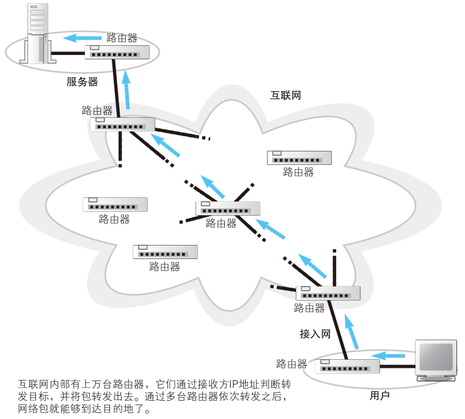

# ADSL 接入网

## 互联网的基本结构和家庭、公司网络是相同的

互联网是一个遍布世界的巨大而复杂的系统，但其基本工作方式却出奇地简单。和家庭、公司网络一样，互联网也是通过路由器来转发包的，而且路由器的基本结构和工作方式也并没有什么不同。因此，我们可以将互联网理解为家庭、公司网络的一个放大版。

<figure>
    
</figure>

当然，互联网也有一些和家庭、公司网络不同的地方，其中之一就是与转发设备间的距离。在家庭、公司网络中，与转发设备之间的距离不过几十米到几百米，在这种情况下，只要延长以太网线就可以到达相邻的转发设备了。然而，互联网可不能这么搞，因为你家到最近的电话局至少也有几公里的距离，而从日本连接到美国甚至要跨越太平洋，用以太网线是无法实现这种连接的。

除了距离之外，路由器在如何控制包的转发目标上也不一样。尽管从基本原理来看，互联网也是根据路由表中的记录来判断转发目标的，但路由表记录的维护方式不同。互联网中的路由器上有超过 10 万条路由记录，而且这些记录还在不断变化，当出现线路故障时，或者新的公司加入互联网时，都会引发路由的变化。人工维护这些路由信息是不现实的，必须实现自动化。公司的路由器也有自动维护路由表的机制，但出于各种原因，互联网中采用的机制和公司有所区别。

距离的不同和路由的维护方式，就是互联网与家庭、公司网络之间最
主要的两个不同点。

