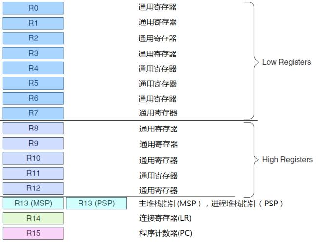

# Cortex-M3概览

## 介绍

Cortex-M3是一个32位处理器，采用了哈佛结构，有独立的指令总线和数据总线，取指和数据访问并行操作。因此CM3内部有好几条总线接口，但是指令和数据总线共享同一个存储器空间，可寻址空间仍然是4GB。

比较复杂的应用可能需要更多的存储系统功能，CM3提供一个可选的MPU，也可以使用外部cache，小端模式和大端模式都支持。


<figure>
    
</figure>


## 寄存器组

CM3处理器拥有寄存器R0-R15，其中R13最为堆栈指针SP，有两个，但是同一时刻只能看到一个。

<figure>
    
</figure>

R0-R12为通用寄存器，用户数据操作。

R13为堆栈指针，R13的最低两位永远是0，即堆栈为4Byte对齐。实际上包含了两个寄存器，但是同一时刻只能使用一个。
- 主堆栈指针MSP：复位后使用，用于操作系统内核以及异常处理
- 进程堆栈指针PSP：用户应用程序代码使用

R14为连接寄存器，当调用一个子程序时，由R14存储返回地址。

```note
ARM为了减少访问内存次数，把返回地址直接放在寄存器里，提高调用效率。在子程序里调用子程序时，把上一级R14值压栈。

ARM作为RISC的代表，编程时应该尽量使用寄存器存储中间值，避免访问内存。

为了强调访问内存越过了处理器的界限，带来对性能的不利影响，娶了一个专业术语：溅出。
```

R15为程序计数器，修改可以改变程序执行顺序，许多高级编程技巧就使用了这个寄存器。

此外还有一些特殊功能寄存器

<figure>
    
</figure>


- xPSR：记录ALU标志、执行状态、当前服务中断号
  - APSE：应用状态寄存器
  - IPSR：中断状态寄存器
  - EPSR：执行状态寄存器
- 中断屏蔽寄存器
  - PRIMASK：
  - FAULTMASK：
  - BASEPRI：
- CONTROL：定义特权状态，决定堆栈指针

## 操作模式和特权级别

CM3处理器支持两种处理器的操作模式，支持两级特权操作。

两种操作模式分别为：handler mode（异常模式）和thread mode（普通模式）。这两个模式是为了区别普通代码和异常服务代码。

两级特权为用户级和特权级。分级提供了存储器访问的保护机制，这使得用户不可以恶意执行一些操作。特权级程序可以访问所有范围的存储器，执行所有指令。

|          |  特权级  |  用户级  |
| :------: | :------: | :------: |
| 异常模式 | 特权异常 | 错误用法 |
| 普通模式 | 特权普通 | 用户普通 |


<figure>
    
</figure>

系统复位后为有特权的普通模式，修改CONTROL可以进入用户级普通模式。

普通模式只要触发异常就进入特权级异常模式，异常返回可以为任意两种模式。

一旦进入用户级普通模式，回到特权级只能执行系统调用指令触发SVC异常，异常服务程序接管，如果批准，那么修改CONTROL寄存器，才能进入特权级。也就是说，用户级普通模式无法直接修改CONTROL寄存器。

## 中断控制器

CM3在内核级别继承了中断控制器：**嵌套中断向量控制NVIC**。NVIC与内核紧密联系，提供这些功能：
- 中断嵌套
- 中断向量表
- 动态优先级跳转
- 中断屏蔽

## 地址映射

CM3支持4GB地址空间，预先大致地划分了各个地址段的用途。

<figure>
    
</figure>

通过把外设的寄存器映射到外设区，可以使用访问内存的方式来访问寄存器。

CM3内部有个总线设施来优化这种存储器结构。此外也允许这些区域“越权使用”，比如说数据存储器也可以放在代码区，代码也可以在外部RAM区运行，只是速度会慢一些。

最大地址为系统外设，包括NVIC、MPU、以及调试组件。

## 总线


## 存储器保护单元MPU

CM3可选MPU，有了之后可以对特权级和用户级进行不同的访问限制。超出允许范围会产生fault异常。

MPU在操作系统里可以发挥巨大作用。

## 指令集

CM3只使用Thumb-2指令集。

过去，做ARM开发必须处理好两个状态：32位ARM状态和16位Thumb状态。在ARM状态下，所有指令为32位，性能很高。在Thumb状态下，指令为16位，代码密度翻倍。Thumb状态下指令功能是ARM下的一个子集，结果可能需要更多指令完成相同工作。

很多程序混合使用了ARM和Thumb，在状态切换时有了额外的开销，此外编译方式也不同，增加了软件开发的复杂度。

Thumb-2指令集解决了切换问题。事实上，CM3内核都不支持ARM指令，中断也是在Thumb下处理，以前的ARM是在ARM状态下处理中断和异常的。

旧的应用程序需要移植，对于大多数C语言程序，只需要重新编译就行，汇编代码可能得大面积修改。


## 中断和异常

CM3的所有中断都由NVIC实现。

| 编号 | 类型       | 优先级 | 介绍         |
| ---- | ---------- | ------ | ------------ |
| 0    | N/A        | N/A    | 无异常       |
| 1    | 复位       | -3     | 系统复位     |
| 2    | NMI        | -2     | 不可屏蔽中断 |
| 3    | hard fault | -1     |              |
| ···  | ···        |        |              |
| 16   | IRQ #0     | 可编程 | 外中断#0     |
| ···  | ···        |        |              |
| 255  | IRQ #239   | 可编程 | 外中断#239   |


CM3支持240个外部中断，但是具体使用多少由芯片厂家决定。


## 其他

低功耗高性能。CM3提供了睡眠模式和深度睡眠模式。

在内核水平上提供了许多调试支持。入程序执行控制：停机、单步执行、断点、数据观察、寄存器访问、存储器访问等。


