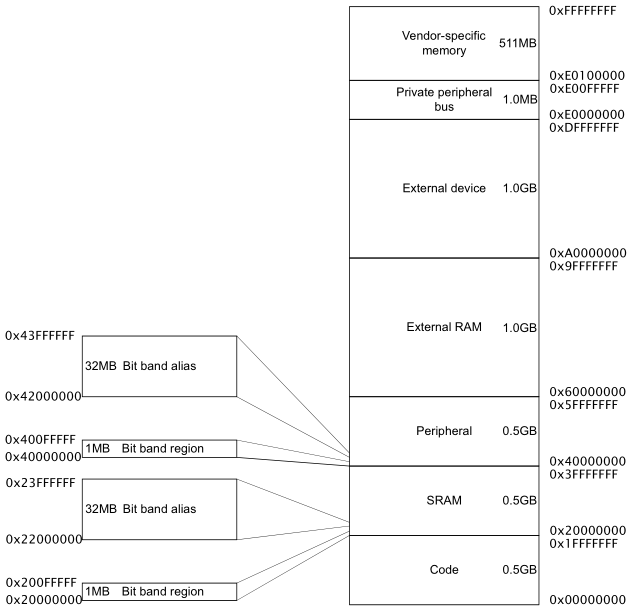

# 内存模型

<figure>
  
</figure>

CM3 支持 4GB 地址空间，预先大致地划分了各个地址段的用途。

通过把外设的寄存器映射到外设区，可以使用访问内存的方式来访问寄存器。

CM3 内部有个总线设施来优化这种存储器结构。此外也允许这些区域“越权使用”，比如说数据存储器也可以放在代码区，代码也可以在外部RAM区运行，只是速度会慢一些。

最大地址为系统外设，包括NVIC、MPU、以及调试组件。

