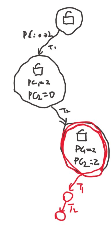
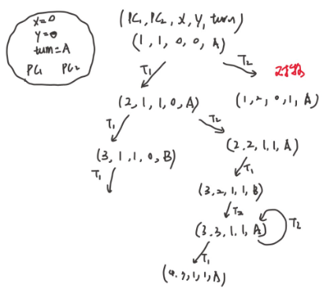
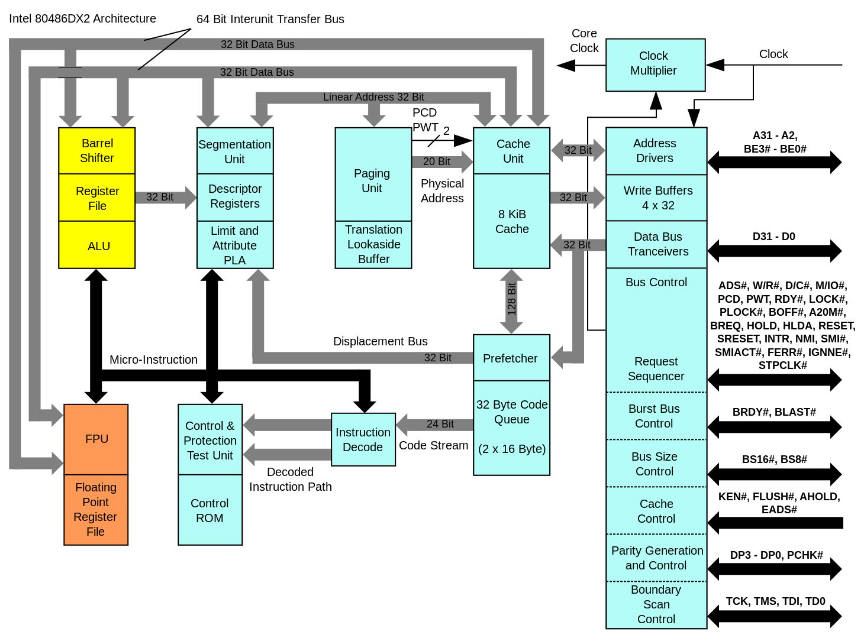

# 解决并发思路与相关概念

基于程序是顺序执行的假设，我们遇到了前面的问题，如果我们作为这个问题的发现者，会如何尝试去解决这个问题？从软件上 or 硬件上？问题总是需要解决，为了卖钱，为了共呢个好的工具。

并发编程困难不代表我们只能摆烂——我们还可以创造出新的手段，帮助我们编写正确的并发程序：
- 互斥问题和 Peterson 算法
- Peterson 算法的正确性和模型检验
- Peterson 算法在现代多处理器系统上的实现
- 实现并发控制的硬件和编译器机制

```note
peterson算法是后面内容的铺垫，为了帮助理解而存在。和现在操作系统里的实际代码还有差距。
```

解决并发问题的思路以及互斥概念的提出。如果我们是当时的工程师，我们会做出什么样的尝试，计算机科学是人造科学，软硬件共同发展，为了更好的解决问题，硬件上做出了原子指令，后面依托这些硬件上的改进，进一步有了现代的并发问题解决方法。

## 回退到顺序执行：互斥


人类是 sequential creature，编译优化以及现代CPU导致了难以理解的并发执行。有多难理解呢？比想象的还要困难。比如，我们想通过每个线程的独立行为推测整个时间顺序发生的事情。

比如两个线程

- T1 
  - 1. R(x) = 1 读x
  - 2. W(y) = 2 写y
- T2
  - 3. R(y) = 1
  - 4. R(y) = 2

1234这个顺序不是时间顺序发生的事情。1324是时间顺序发生的，此外线程自己内部的顺序要保持。这个例子我们可以一眼看出这个问题的解。

```note
理解操作系统可以从现实世界出发，每个人就是一个线程，write就是对物理世界做一个操作，read就是看一眼发生了什么，read这个行为只是在看的时刻有效，然后立马闭上眼睛。
```

每个人有自己对这个世界的观测，我们想把他合并成一个全局的世界的观测，事实上，这是一个 NP Compelete(NP 完全) 的问题。总之这是最难的一类。这需要指数级的时间才能做到。这个是可以证明的。总之，排序这个东西很难。

那么如何解决并发这个问题？这是个理论上可以证明很难解决的问题，我们就想办法不要让出现问题的并发程序出现。

因此，尝试去解决这个问题
  - 从野蛮并发的状态，使得原来并发的程序不再并发

比如说处理器执行上面的 T1 T2 的时候，自动的记录下顺序，这就不会出现后面需要排序的问题了。再或者，我们可以尝试把有问题的代码弄出来，不允许重要的代码并发。

```c
void Tsum() 
{
  stop_the_world();     // 临界区 critical section
  sum++;                // 记录执行顺序

  resume_the_world();
}
/* 回退到顺序执行：互斥，即插入神秘代码是的包裹起来的代码不可以并发。 */
```

包裹起来的部分不允许同时在多个 CPU 上执行，这就可以记录执行的顺序了。

这个前后神秘代码的实现，就是互斥问题，被神秘代码包裹起来的代码就是临界区。

当然也要注意，如果所有的代码都包起来了，这就意味着，不管有多少 CPU 只有一个能动，那么就没必要用多处理器了，多处理器就没意义了。

```note
并行加速的原理就是如此。GPU ，人工智能的成功离不开大规模并行计算。

临界区的代码时可能访问共享状态的代码，临界区外的代码不需要访问共享状态，因此可以并行运算
```
这些包起来的代码是需要访问共享状态的代码。有很多代码不需要访问共享状态，比如拿到了传感器数据，对数据作进一步算法，就可以用局部变量了，用栈上的变量来完成。

虽然我们把一部分代码退回了顺序执行，但只要还有代码可以并行，那么代码还是可以加速运行的。

这个 `stop_the_world` 真的是可能的，一些实现思路
- Java 里的 stop the world GC
- 单个处理器可以关闭中断
- 多个处理器可以发送核间中断

这就是互斥的代码实现问题

## 互斥算法的一个失败的尝试

有了互斥的想法，尝试着用代码实现出来

```c
int locked = UNLOCK;

void critical_section() 
{
    /* acquire lock */
    while( locked == LOCK);

    locked = LOCK;

    // critical section

    locked = UNLOCK;
}

```

想法很好，这个事情物理世界也会发生，比如厕所包厢，锁上门外面就会变成红色。这和山寨支付宝的错误一样，两个线程同时进入判断是有可能的。这种不等于的判断和比大小的判断没什么本质区别。

如何证明？画个状态机，

<figure>
  
</figure>

因为load和store不能原子的完成。如果状态机可以一步完成这个事情，那么就可以办到了，然而不是。

上面这段程序实际上并不友善，我们需要做 LOCK 这个宏定义概念上的翻译，有些程序用01来表示，也增加了阅读的难度。

```note
更易用的模型检验工具，2023年课程上自动实现状态测试的工具，甚至可以画出状态机来。

```
 
事实上，这个算法(想法)在很早很早以前，刚刚有并发的时候，人们就知道了。

## 另一个算法(Peterson)

我们要严肃、严谨的解决这个问题，在设计之间，要看看假设时什么，即处理器时什么样子，如果 CPU 是乱序执行的，算法设计上会很困难，因此我们先要约定好 CPU 是什么样子。

### 算法对 CPU 做出的假设

上面的程序正确与否还和处理器有关系。现代多处理器上无法实现。

因此我们需要确定假设，再设计算法。

假设：内存的读/写可以保证顺序、原子完成
- `val = atomic_load(ptr)`
  - 🔒我们都假设硬件帮助我们上锁了，可以一下子完成
  - 看一眼某个地方的字条 (只能看到瞬间的字)
  - 刚看完就可能被改掉
- `atomic_store(ptr, val)`
  - 🔒，这个过程也上锁了，一下子完成
  - 对应往某个地方 “贴一张纸条” (必须闭眼盲贴)
  - 贴完一瞬间就可能被别人覆盖

如果类比承物理世界，我们无法像物理世界一样，看着一个东西把他拿起来。

对应于 model checker
- 每一行可以执行一次全局变量读或写
- 每个操作执行之后都(可能)发生 `sys_sched()`

### Peterson 算法

提出了一种互斥的协议。

他的模型是共享内存模型，每次可以 store 一个变量，或者 load 看一个变量的值。
- store 改变状态，比如举起旗子，贴个牌子
- load 看一眼旗子，便签

当然还有个根本的假设，看到的东西是过去发生的，只代表过去某个时候的历史，回过头就有可能变化。

比如说，两个人去争抢厕所包厢。如果同时进去了，就比较麻烦，所以设计一种方法，可以一个人安全的进入。

- 想进入包厢之前，A/B 都要先举起自己的旗子
  - A 确认旗子举好以后，往厕所门上贴上 “B 正在使用” 的标签
  - B 确认旗子举好以后，往厕所门上贴上 “A 正在使用” 的标签
- 然后，如果看到对方的旗子举起来，且门上的名字不是自己，等待
  - 否则可以进入包厢
- 出包厢后，放下自己的旗子

用旗子来表明谁想上厕所，用标签来决定谁可以上厕所。

如何证明这个协议是正确的呢？如果对，如何给证明？如果不对怎么给反例？

首先，如果我举了旗子，贴了标签，舍友没举旗子，那没有任何问题。

问题在我和舍友都举起了旗子，两人闭着眼把标签往门上贴。所以精髓是，谁手快，谁就可以上厕所。

这些文字是不太正式的证明。但是如果出一份试卷，搞上来这么多答案，这好像不太行。这本来就是一个 NP 完全问题，靠几句话证明是不是不太行？

还有更多的细节：先后顺序的问题，先举旗后贴标签？先看旗向看标签？这些都是写并发程序要考虑的问题，这些问题比较麻烦。

如果需要给个证明更好的办法，来确保程序一定是正确的，这时候要从数学上证明，程序是对的，这就是要模型证明

```note
把状态机所有可能的状态都画出来，所有的状态里如果都没有两个线程同时执行一个代码，那么就会说这个算法是正确的。

然而这段代码会触发错误，指令重排了。

再加上barrier看起来不会出问题。但是如果没有barrier就会看到运行了一定次数会出错。

可以看到，并发编程还是挺困难的。
```

<figure>
  
</figure>

画状态机是一种数学上的证明方式，但是能不能有更好的方式？自动化的方式？

## 自动化测试

并发编程并不容易，一个公认的正确的并发算法 [dekkers-algorithm](https://series1.github.io/blog/dekkers-algorithm/) ，这个 blog 详细的论证了为什么这个算法是正确的，当然，也使用了状态机。

自动化测试在这里就很重要了，大大的提高生产力。手画状态机是非常容易出错的。

比如是否存在两个人都无法进入临界区的问题，比如死锁，有了状态机，这就是一个能否全部遍历的问题。我们需要这种自动化的实现方式，自动遍历状态空间，给出结果。真正用计算机解决问题。

模型检查工具把算法证明的问题变成了图上的问题。

我们还有更多的想法
- 如果结束后把门上的字条撕掉，算法还正确吗？
  - 在放下旗子之前撕
  - 在放下旗子之后撕
- 如果先贴标签再举旗，算法还正确吗？
- 我们有两个 “查看” 的操作
  - 看对方的旗有没有举起来
  - 看门上的贴纸是不是自己
  - 这两个操作的顺序影响算法的正确性吗？
- 是否存在 “两个人谁都无法进入临界区” (liveness)、“对某一方不公平” (fairness) 等行为？
  - 都转换成图 (状态空间) 上的遍历问题了！


电脑为什么叫 “电脑”，就是因为它能替代部分人类的思维活动，任何机械的思维活动都可以用计算机替代，AI 还可以替代启发式/经验式的决策。

## C 语言实现

从模型回到现实……，我们的假设在现代多处理器上不成立。
- 原子操作，读写单个全局变量并不是原子的，这个假设在多处理器上不成立
- 所以按照模型直接写 Peterson 算法应该是错的

但是实现这个 Peterson 算法是一个合理的需求，一定有方法实现，这是个合理的要求。计算机应该不能阻止我实现这个算法，反过来说，处理器或者编译器应该有方法让我写对这个算法。

- Compiler barrier/volatile 保证不被优化的前提下
  - 处理器提供特殊指令保证可见性
  - 编译器提供 `__sync_synchronize()` 函数
    - x86: mfence; ARM: dmb ish; RISC-V: fence rw, rw
    - 同时含有一个 compiler barrier


```c
#include "thread.h"

#define A 1
#define B 2

#define BARRIER __sync_synchronize()

atomic_int nested;
atomic_long count;

void critical_section() {
  long cnt = atomic_fetch_add(&count, 1);
  int i = atomic_fetch_add(&nested, 1) + 1;
  if (i != 1) {
    printf("%d threads in the critical section @ count=%ld\n", i, cnt);
    assert(0);
  }
  atomic_fetch_add(&nested, -1);
}

int volatile x = 0, y = 0, turn;

void TA() {
  while (1) {
    x = 1;                   BARRIER;
    turn = B;                BARRIER; // <- this is critcal for x86
    while (1) {
      if (!y) break;         BARRIER;
      if (turn != B) break;  BARRIER;
    }
    critical_section();
    x = 0;                   BARRIER;
  }
}

void TB() {
  while (1) {
    y = 1;                   BARRIER;
    turn = A;                BARRIER;
    while (1) {
      if (!x) break;         BARRIER;
      if (turn != A) break;  BARRIER;
    }
    critical_section();
    y = 0;                   BARRIER;
  }
}

int main() {
  create(TA);
  create(TB);
}
```

使用编译器的 barrier `#define BARRIER asm volatile("" ::: "memory")` 即一条空指令，假设读写任意内存，优化不可以穿过。

如果用神奇指令 `#define BARRIER asm volatile("mfence" ::: "memory")` 在很长的时间内，几天，几年，应该是不会出错了，更对

**测试只能证明程序有问题，无法证明没有问题**。长时间不出错只能证明有可能更对，但也无法说明不出错。

一个更强的 `__sync_synchronize()` 

所以想实现一个正确的协议很难。

还有更难的问题，哪些 barrier 可以去掉？当然可以试，但是有限时间内不出错就是对的吗？

我们还想知道编译器到底做了什么，一个工具 godbolt.org，


## 原子指令

为什么这么一个符合直觉的程序，不能再现在的处理器上工作呢？

物理世界，看着一个东西，然后把他拿走，这个事情在现代多处理器上做不到。

普通变量读写在编译器+处理器的双重优化下行为变得更加复杂。如果编译器和硬件共同提供一个不可优化、不被打断的指令，那么我们的想法就能实现。
- 原子指令 +  compiler barrier

x86 提供的

```c
#include "thread.h"

#define N 100000000

long sum = 0;

void atomic_inc(long *ptr) {
  asm volatile(
    "lock incq %0"  // Atomic + memory fence
    : "+m"(*ptr)
    :
    : "memory"
  );
}

void Tsum() {
  for (int i = 0; i < N; i++) {
    atomic_inc(&sum);
  }
}

int main() {
  create(Tsum);
  create(Tsum);
  join();
  printf("sum = %ld\n", sum);
}
```


80386 就有了这种指令 lock，在 80486 就推出了民用双核 CPU，今天讲到的这些问题当年就有了，486 cpu上有根线就是 lock，这个cpu就有了内存的独占访问权，其他cpu要想访问内存，就得等这个信号结束。这个指令在 386 就有了，intel 就得把它兼容到现在。这个指令在当时实现很容易，然后现在这个包袱甩不掉了。


原子指令，处理器会去保证所有带 `lock` 的指令会排出一个先后顺序。
- 保证之前的 store 都写入内存
- 保证 load/store 不与原子指令乱序

原子指令如何在CPU上实现呢？

在 486 时代，支持 dual-socket 了，一块主板上插两个 CPU，这时候想想如何处理两个 CPU 同时访问内存的问题。只需要在 memory 上上一把🔒就行，两个CPU同时加锁，总线会决定。

<figure>
  
</figure>

因此，lock这个前缀的设计是有道理的，读到lock指令，先上锁，这个设计非常自然。

所以这也有了今天的lock指令。

这条指令也让现在的CPU设计很有负担，486时代，cache在主板上，现代CPU自己有cache，甚至一级和二级，还有三级，这时候 `lock` 实现起来就很麻烦。

今天intel处理器，缓存的一致性是体系结构的很大包袱，所有的L1缓存都是连起来的。

与此相比，RISC-V 有一种更聪明的实现方法。原子指令的需求是，一个 读(load)，一个写，比如常见的一些原子操作
- atomic test-and-set
  - reg = load(x); if (reg == XX) {store(x,YY);}
- lock xchg
  - reg = load(x); store(x, XX)
- lock add
  - t = load(x); t++; store(x,t);

他们的本质都是load，寄存器操作，store。原子的本质就是原子的一读一写。

聪明设计：Load-Reserved/Store-Conditional(LR/SC)

做一次读和做一次写，读完做一个标记，本地计算算完后会去真正的写他，写的时候只有在标记还在的时候才去做。

发现标记被破坏了，那就重复一次。

这就可以实现任何一个原子的读写操作。这个方法还可以检测原子操作的拥堵。失败了就代表有人在和我并发的做这个事情。

