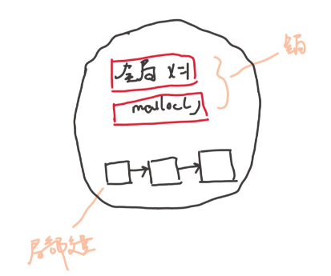
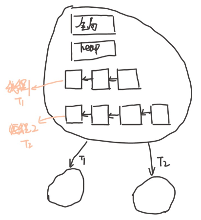
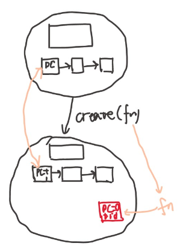
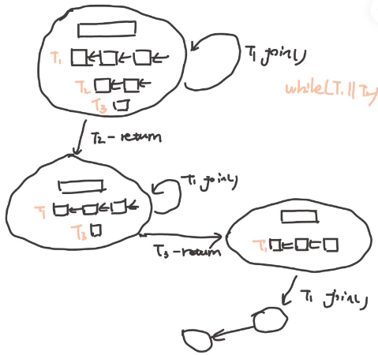
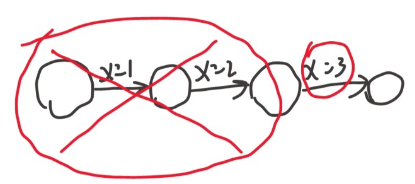
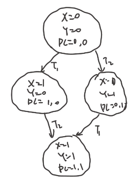

# 并发

前面理解了硬件是个状态机，程序也是个状态机，操作系统是状态机的管理者。

当然，操作系统本身肯定也是个状态机。

```note
应用程序只能做到纯粹的计算，各种复杂功能靠系统调用实现。

正常来说，操作系统课本到这里应该开始进程了。

但是这里顺着状态机视角往下，会使得并发的提出很自然。提问题
```

操作系统是状态机的管理者，这意味着操作系统引入了共享的状态，如操作系统里的文件，所有进程可以访问。所以操作系统是世界上最早的并发程序之一。共享的状态会带来什么问题？

这部分回答：在多处理器时代，“操作系统是个状态机”的理解应该作出什么样的变化？

今天能买到的消费级别的产品，电脑，手机，几乎都是多处理器的。前面讲的是单线程的程序，如何变成多线程。

多处理器编程，正确理解并发程序执行，以及并发里存在的问题，首先理解并发程序，然后提出并发程序存在的问题。

正式学习并发控制前，先得会并发编程，了解并发编程存在的问题，才好学这些解决问题的方法。
- 并发编程：多线程编程库
- 并发问题：原子性、可见性、顺序

## 多线程编程入门

操作系统是状态机的管理者，这意味着操作系统引入了共享的状态，如操作系统里的文件，所有进程可以访问。所以操作系统是世界上最早的并发程序之一。共享的状态会带来什么问题？

## Three Easy Pieces : 并发的初步理解

**Concurrent**: existing, happening, or done *at the same time*.

In computer science, concurrency refers to the ability of different parts or units of a program, algorithm, or problem to be executed out-of-order or in partial order, without affecting the final outcome. (Wikipedia)

多处理器程序没法像顺序程序一样，

必须要接受并发，操作系统是最早的并发程序之一，系统调用的代码就是世界上最早的并发程序。

写并发程序，用好处理器。

并发的基本单位：线程。多个执行流一起往前走。
- 执行流拥有独立的堆栈/寄存器
- 共享全部的内存(指针可以互相引用)

还是要用状态机的视角来理解。单线程的状态机如何改称多线程的状态机？共享如何用状态机来刻画？

<figure>
    
    <figcaption>单线程的状态机</figcaption>
</figure>

单线程的状态机，全局变量和堆内存+栈帧，语句的执行，状态发生变化。

如果想要把单线程扩展成多线程，每个线程有自己的局部状态，自己的PC，

<figure>
    
    <figcaption>单线程的状态机</figcaption>
</figure>

内存是共享的，除此之外每个线程有自己的栈帧，这个时候并发程序的状态已经定义好了。

状态机如何执行呢？并发体现在哪里？我们的状态机在外面好像有一个选择器(switcher)来选择每个状态是T1执行还是T2执行，也就是说并发程序的每一步都是不确定的，(单线程随机数的不确定)
- 当选择T1执行的时候，把全局的状态+T1栈帧的状态，T2完全看不到，执行一步
- 选择T2执行时，全局的状态+T2栈帧的状态，T1完全看不到，执行一步

这个过程不断往复下去，并发程序的可怕之处在于，每一步都是不确定的。

人是顺序的，做完一件事再做另一件事。这就相当于强迫一个人去考虑所有的事情，人的思想负担会增加。

这个说法，看起来很简单，但是要理解还是要花点时间的。不过没关系，慢慢来。

## 并发编程：多线程库

有一个简单的多线程测试的封装好的库。

- `create(fn)` 
  - 创建一个入口函数是个fn 的线程，并立即开始执行
    - `void fn(int tid) {...}`
    - 参数从 `1` 开始
  - 语义：在状态中新增 stack frame 列表并初始化为 fn(tid)

<figure>
  
</figure>


- `join()`
  - 等待所有运行线程的 fn 返回
  - 在 main 返回时会自动等待所有线程结束
  - 语义：在有其他线程未执行完时死循环，否则返回

<figure>
  
</figure>

编译时需要增加 -lpthread

```c
#include "thread.h"

void Ta() { while (1) { printf("a"); } }
void Tb() { while (1) { printf("b"); } }

int main() {
  create(Ta);
  create(Tb);
}
```

编译 `gcc -1.c -lpthread`

这个程序和以往所有的程序都是不太一样，这个程序可以把线程 1 放到 CPU1 上，线程 2 放到 CPU2 上，不仅仅是单个 CPU 线程之间的切换。

同时执行。

去掉 printf，空的循环运行起来，可以把 CPU 跑到1 00%，打开资源管理器，可以看到有两个 CPU 跑满了。使用 `top` 也可以看到有个程序的 CPU 占用超过了 100% 达到了200%。

- 操作系统自动的把线程放在了不同的CPU上执行
- 在后台运行，可以看到CPU使用率超过了100%！


很自然的会问，所有的东西，在同一个地址空间里吗？能问出问题，自然可以用小程序去证明。

```c
#include "thread.h"

int x = 0;

void Thello(int id) {
  x++;
  printf("%d\n", x);
}

int main() {
  for (int i = 0; i < 10; i++) {
    create(Thello);
  }
}
```

```c
void Thello(int id) {
  int x = 0;
  x++;
  printf("%d\n", x);
}
```
局部变量不共享，这也符合预期。

那么如何证明线程都独立的堆栈呢？如何确定堆栈的范围？多线程程序有独立的堆栈，在内存空间的哪里呢？

最早的操作系统里没有线程，只有进程，就是栈、堆、代码区这种结构。后来有了线程，每个线程有自己的栈，那么这些栈在哪里呢？每个线程的栈有多大呢？想一个办法写程序确定栈的范围。无穷的递归，让程序crash。

```c
#include "thread.h"

void * volatile low[64];
void * volatile high[64];

void update_range(int T, void *ptr) {
    if (ptr < low[T]) low[T] = ptr;
    if (ptr > high[T]) high[T] = ptr;
}

void probe(int T, int n) {
  update_range(T, &n);
  long sz = (uintptr_t)high[T] - (uintptr_t)low[T];
  if (sz % 1024 < 32) {
    printf("Stack(T%d) >= %ld KB\n", T, sz / 1024);
  }
  probe(T, n + 1);  // Infinite recursion
}

void Tprobe(int T) {
  low[T] = (void *)-1;
  high[T] = (void *)0;
  update_range(T, &T);
  probe(T, 0);
}

int main() {
  setbuf(stdout, NULL);
  for (int i = 0; i < 4; i++) {
    create(Tprobe);
  }
}
```

有一行代码 是设置缓冲区为0，使得所有输出都能在屏幕上显示。

来一个小程序，去故意栈溢出，不断打印栈的大小。对于输出的结果可以用脚本稍加处理 `./a.out | sort -nk 6` 或者把输出丢到vim 里 `./a.out | vim -`

可以看出，在靠近8192kb的位置，栈溢出了。

更多的想法：
- 创建线程的是哪个系统调用？strace看一下，clone系统调用
- 能否gdb调试？

一些更多的猜想，完全可以通过gdb来看。

关于thread.h背后的东西：POSIX Threads

进一步配置线程，设置更大的线程栈，设置detach运行。POSIX为我们提供了线程库，可以查看手册 `man 7 threads`

一个小练习，改写therad，让线程有更大的栈，有1MB，或者1GB的栈。这件事情是可以做到的。

多线程有好玩的地方，但是一些麻烦也在靠近。
- 多处理器系统中的线程的代码可能同时执行
  - 两个线程同时执行 `x++` 会发生什么？
  - 同时向链表里insert，链表的结构还可以保持吗？

## 问题 1 ：原子性

状态机的隐含假设，没有其他人能干涉程序的状态
  
如

```c
int Tworker() {
  printf("%d\n", x);  // Global x
  printf("%d\n", x);
}
```
我们认为这是同一个，每次读的时候返回的都是上次写的值。但是对于全局共享内存来说，这个假设被推翻了，其他线程可以随时修改 x。

事情变得麻烦起来。
```c
#include "thread.h"

unsigned long balance = 100;

void Alipay_withdraw(int amt) {
  if (balance >= amt) {
    usleep(1); // unexpected delays
    balance -= amt;
  }
}

void Talipay(int id) {
  Alipay_withdraw(100);
}

int main() {
  create(Talipay);
  create(Talipay);
  join();
  printf("balance = %lu\n", balance);
}
```

现在有两个线程。

可以看到结果，有时候是对的。有时候是一个特别大的数， $$ 2^{64} - 100 $$

实际软件也有这种例子，比如红色警戒“印度重工”。甚至可以现象到背后的那个全局变量。

不管是因为线程导致的，还是事件导致的，结果很像。总之是编程不当导致的。

因为并发，求和程序都写不对
```c
#include "thread.h"

#define N 100000000

long sum = 0;

void Tsum() {
  for (int i = 0; i < N; i++) {
    sum++;
  }
}

int main() {
  create(Tsum);
  create(Tsum);
  join();
  printf("sum = %ld\n", sum);
}
```
讲道理，就算是并发，总的加的次数应该也是200000000，然而结果是100257129，执行很多次，也差的很多。

甚至直接用汇编 `asm volatile("add $1, %0": "+m"(sum));` 也是这个结果。

这个事情是无法理解的，我们假设CPU每次执行一条指令，但是用汇编写了，结果看起来这一条指令都不是一条指令，就像是好多步一样。因此 每次执行一条指令是概念模型。这种情况也是在多处理器里发生的，。

并发带来的问题是连最简单的+1的原子性都做不到。我们想的是执行一条指令再接下来下一条。

**“程序 (甚至是一条指令) 独占处理器执行” 的基本假设在现代多处理器系统上不再成立。**

原子性：
- 在单处理器多线程上，线程运行时可能被终端，切换另一个线程
- 多处理器多线程，线程根本就是并行的
但是用这条指令

单处理器的话(把程序限制到一个CPU上)用一条ADD指令实现+1就正确了。但是现在的CPU都是多处理器的。

(历史)在1960s，大家争先恐后的在共享内存上实现原子性(互斥)，但几乎所有的都是错的，直到 Dekker's Algorithm，还只能保证两个线程的互斥

所以原子性是第一个在写并发程序的时候遇到的问题。

printf是有缓冲区的，如果执行 buf[pos++] 缓冲区岂不是被破坏了。

再来看看第一个例子printf出a和b，为什么没出现问题，没出现奇怪的结果，诡异的字符，这是因为printf是线程安全的，标准库考虑到了多线程的情况，他自己会保证多线程的原子性，他里面有buffer。 手册 `man 3 printf` 查找线程 `/thread` 可以看到相关内容。库函数已经考虑到这种情况了。

互斥和原子性是重要的话题。

```note
`asm volatile("lock add $1, %0": "+m"(sum));`  会使结果正确，然而程序执行的速度显著下降。

`lock(&lk)` 和 `unlock(&lk)` 实现临界区 (critical section) 之间的绝对串行化，程序的其他部分依然可以并行执行。

并发程序的复杂性从根本上来说对人类是 “失控” 的。但从另一个角度，人类有在另外一个维度解决这个问题的 (工程) 办法：

**作出合适的抽象，并且只写自己能控制得了的代码。**

某种程度上说，这是我们和现实世界复杂性的妥协。例如，在并发编程时总是使用线程池、队列、Map-Reduce 等容易理解的并发编程工具。此外，人类还发明了很多工具来帮助我们理解并发程序，model checker 就是其中之一。

99% 的并发问题都可以用一个队列解决
- 把大任务切分成可以并行的小任务
- worker thread 去锁保护的队列里取任务
- 除去不可并行的部分，剩下的部分可以获得线性的加速

线程池，在java里有这样的类。而且只要程序的并行度足够高，效率就会提高。

```

## 问题 2 ：执行顺序

再回到sum.c最简单的求和，前面没加优化， `-O0`

```bash
➜  2 git:(main) ✗ gcc -O1 sum.c 
➜  2 git:(main) ✗ ./a.out 
sum = 100000000
➜  2 git:(main) ✗ gcc -O2 sum.c
➜  2 git:(main) ✗ ./a.out      
sum = 200000000
```

这个东西，就越发离谱了。

- -O1优化先读，在寄存器里加，最后写
- -O2 编译器直接算出了结果，加给了sum

多处理器的打断，加上编译器的优化，程序的优化更加琢磨不透。编译器的优化假设是单线程的，因此编译器仅对**顺序程序**的假设来优化程序的，C语言代码是状态机。为了让顺序执行的程序变得更快，当编译器知道变量 `x` 将来一定会是3的时候，为了加速程序运行，中间的没用状态就直接删除掉了。编译器认为系统调用是不可优化的东西，编译对内存可以做一些操作。

不过不这么假设，程序是没法做优化的。

<figure>
  
</figure>

可以看看 gcc 把程序处理成什么样子了 `gcc -c -O1 sum.c -o 1.o -g` ，不链接，反汇编 `objdump -d 1.o | less`

反汇编看一下 
- `-O1` : 同一个值往同一个地址被两个线程写了两次
- `-O2` : 彻底的优化成一条加指令，直接编译器帮忙算出了结果，两条指令靠在一起的概率比较小


另一个例子

```c
extern int done;

void join()
{
  while(!done);
}
```

只编译不链接 `gcc -O2 -c while.c` ，反汇编查看 `objdump -d while.o | less`

```nasm
0000000000000000 <join>:
   0:   f3 0f 1e fa             endbr64 
   4:   8b 05 00 00 00 00       mov    0x0(%rip),%eax        # a <join+0xa>
   a:   85 c0                   test   %eax,%eax
   c:   75 02                   jne    10 <join+0x10>
   e:   eb fe                   jmp    e <join+0xe>
  10:   c3                      ret   
```
先把done读到寄存器，然后test，不等就跳到返回，等的话死循环。优化成了

```c
if (!done)
  while(1);
```

当然如果希望每次都去从内存读取数据，编译器不要去做这个事情。那就需要一个 compiler barrier

使用 `volatile` 保持C语义和汇编语义一致
```c
extern int volatile done;

while(!done);
```

或者，

```c
extern int done;

void join()
{
  while(!done);
  {
    asm volatile("":::"memory");
  }
}
```

这时候反汇编回去就会发现每次都会读内存。

这个东西告诉编译器，这条语句的东西，可能会有别人改内存的值，不可以优化。

```tip
原子性的丧失告诉我们，程序独占处理器执行这个假设在现代CPU多线程编程上已经不成立了

顺序的丧失是编译器对内存的优化，导致共享内存作为线程通信的工具也失效了

这些还不是最大的麻烦
```

## 问题 3 ：处理器间的可见性

一个程序

```c
int x = 0, y = 0;

void T1() {
  x = 1;
  asm volatile("" : : "memory"); // compiler barrier
  printf("y = %d\n", y);
}

void T2() {
  y = 1;
  asm volatile("" : : "memory"); // compiler barrier
  printf("x = %d\n", x);
}
```

这段代码，初始的时候 `x = 0, y = 0;` ，状态机


<figure>
  
</figure>

因为在赋值和 `printf` 之间有 barrier ，所以输出一定在赋值之后。

这段代码的结果应该是 01/10/11 此外看不到其他结果。

实际程序想实现这个还稍稍有点麻烦。

实现了以后，看结果有点麻烦，想得到统计结果

```bash
(main)> ./a.out | head -n 10000000 | sort | uniq -c
   3255 0 0 
9763033 0 1 
 233711 1 0 
      1 1 1 
```

unix的设计哲学
- head 取前n个
- sort 排序
- uniq 统计

查看结果，发现居然有00，而且还不少，这个事情该如何解释呢？

从反汇编来看，没有任何问题。

现代 CPU 也是个编译器。

单个处理器把汇编代码(用电路)编译成更小的 $$ \mu \text{ops} $$

处理器把汇编在做一次编译，uops 都有 Fetch, Issue, Execute, Commit 四个阶段。

在任何时刻，处理器都维护一个 uop 的 “池子”，没有数据依赖关系的指令可以随便执行。

一个时钟周期可以挑出可以同时执行的指令，一起执行。不违反编译正确性就行。

这就是《计算机体系结构》，木桶效应，内存慢了补内存就有了缓存，取指令慢了就要有分支预测，哪里是短板就补哪里，然后就得到了今天的高性能处理器。Intel 和 arm 都是如此。

这样的动态调度满足单处理器 eventual memory consistency 的执行，在多处理器上可能无法序列化。

如果写 x 发生了 cache miss，那么可以让读y先执行。

控制线程的XOR(3)导致几乎每次都是cache miss 的，但是处理器还可以看到下一条指令，我们看到的效果就是，读在写之前。就出现了00的结果。

这就有了宽松内存模型。

x86已经是市面上能买到的最强的内存模型了。

<figure>
  
</figure>

如果x86也是个状态机的话，那么和前面的状态机不太一样。他的模型是每个CPU都有buffer，在延时后才写入共享内存。

如果去看ARM/RISCV的话，每个线程都有一个内存副本，副本之间可以任意同步数据，这都没有一致性可言。

<figure>
  
</figure>

当然，处理器想要恢复顺序也不是不可能。两条指令之间加上 `"mfence;"` 就可以了。

再执行就可能是对的。

至于为什么说可能，因为并发是不确定的，至少我们看到了前面的结果是正确的。


## 总结

如何理解多处理器系统？

多处理器编程：放弃对 “程序” 的旧理解
- 不原子、能乱序、不立即可见
- 来自于编译优化 (处理器也是编译器)


