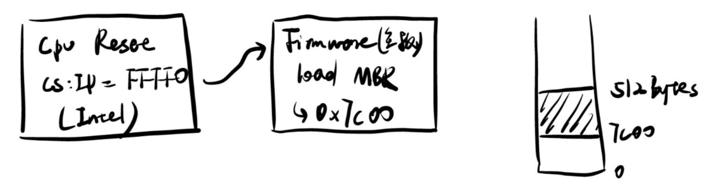

# 硬件视角的操作系统


操作系统有三条主线：“软件 (应用)”、“硬件 (计算机)”、“操作系统 (软件直接访问硬件带来麻烦太多而引入的中间件)”。我们已经理解了操作系统上的应用程序的本质 (状态机)。而程序最终是运行在计算机硬件上的；因此有必要理解什么是计算机硬件，以及如何为计算机硬件编程。

本讲内容：计算机硬件的状态机模型；回答以下问题：
- 什么是计算机硬件？
- 计算机硬件和程序员之间是如何约定的？
- 听说操作系统也是程序。那到底是鸡生蛋还是蛋生鸡？

硬件和软件之间的约定，直接在计算机硬件上编程。用IDE编程，许多细节是隐藏的，但是如何写一段能直接在硬件上运行的代码呢？

## 数字电路与计算机

数字电路是什么？
- 一个非常简单的公里系统（导线、始终、逻辑门、触发器）
- 建立在公理体系上的数字系统设计

公理很简单，一个星期学会，接下来就是写 Verilog，数字系统和数学像，再公理系统上可以建立好玩的东西，做出好玩的东西不简单。比如编程语言语法不难，但是实现一个花里胡哨的东西还是挺难的，这就是经验。

整个计算机系统和数字逻辑电路是有深刻的等价性的。

数字电路里会特别强调状态机这个东西。举个简单的例子：

<figure>
  
</figure>

态机，每个状态的转移就是个时钟周期。从这个角度来看

状态就是寄存器和内存里的值，初始状态就是系统 RESET 的值。FPGA里搞的话，reset成 undefined 或者 0 都没问题。状态迁移就是组合逻辑电路计算寄存器下一周期的值。

计算机系统基础学到了，状态机的行为一方面可以用数学表达式，或者**状态转移图**来表示。此外还可以用一段程序来严格的表达。

用C语言去模拟数字电路，状态机的思路

### 1

一个状态机可以用状态转换图来表达，同样也可以用代码来表达：
```c
#define REGS_FOREACH(_)  _(X) _(Y)
#define RUN_LOGIC        X1 = !X && Y; \
                         Y1 = !X && !Y;
#define DEFINE(X)        static int X, X##1;
#define UPDATE(X)        X = X##1;
#define PRINT(X)         printf(#X " = %d; ", X);

int main() {
  REGS_FOREACH(DEFINE);
  while (1) { // clock
    RUN_LOGIC;
    REGS_FOREACH(PRINT);
    REGS_FOREACH(UPDATE);
    putchar('\n'); sleep(1);
  }
}
```

这段代码用了一点 X-micro 。

拿到这种代码第一步是编译，如果C语言基础不太好，可以选择用 GCC 输出预处理文件。
```bash
gcc -E 1.c -o 1.i
```
这是一段容易写出来的代码
```c
int main()
{
  static int X, X1; static int Y, Y1;;
  while (1)
  {
    X1 = !X && Y; Y1 = !X && !Y;;
    printf("X" " = %d; ", X); printf("Y" " = %d; ", Y);;
    X = X1; Y = Y1;;
    putchar('\n'); sleep(1);
  }
}
```
上面是个很小的计算机系统模拟器。

### 2

把他变得更大一点，做一个更好玩的东西：

```c
#include <stdio.h>
#include <unistd.h>

#define REGS_FOREACH(_)  _(X) _(Y)
#define OUTS_FOREACH(_)  _(A) _(B) _(C) _(D) _(E) _(F) _(G)
#define RUN_LOGIC        X1 = !X && Y; \
                         Y1 = !X && !Y; \
                         A  = (!X && !Y) || (X && !Y); \
                         B  = 1; \
                         C  = (!X && !Y) || (!X && Y); \
                         D  = (!X && !Y) || (X && !Y); \
                         E  = (!X && !Y) || (X && !Y); \
                         F  = (!X && !Y); \
                         G  = (X && !Y); 

#define DEFINE(X)   static int X, X##1;
#define UPDATE(X)   X = X##1;
#define PRINT(X)    printf(#X " = %d; ", X);

int main() {
  REGS_FOREACH(DEFINE);
  OUTS_FOREACH(DEFINE);
  while (1) { // clock
    RUN_LOGIC;
    OUTS_FOREACH(PRINT);
    REGS_FOREACH(UPDATE);
    putchar('\n');
    fflush(stdout);
    sleep(1);
  }
}
```

做一个小的后端，接收程序，可视化出来

```py
import fileinput
 
TEMPLATE = '''
\033[2J\033[1;1f
     AAAAAAAAA
    FF       BB
    FF       BB
    FF       BB
    FF       BB
    GGGGGGGGGG
   EE       CC
   EE       CC
   EE       CC
   EE       CC
    DDDDDDDDD
''' 
BLOCK = {
    0: '\033[37m░\033[0m', # STFW: ANSI Escape Code
    1: '\033[31m█\033[0m',
}
VARS = 'ABCDEFG'

for v in VARS:
    globals()[v] = 0
stdin = fileinput.input()

while True:
    exec(stdin.readline())
    pic = TEMPLATE
    for v in VARS:
        pic = pic.replace(v, BLOCK[globals()[v]]) # 'A' -> BLOCK[A], ...
    print(pic)
```

```bash
./a.out | python3 2-2.py
```
上面完成了一个简单数字电路模拟，同时岩石了两个程序之间的通信，完成了一次配合工作。

这就是程序。

很简单，但是好像创造了一些从没见过的东西。

顺便，体验了 unix 的哲学：
- Make each program do one thing well
- Expect the output of every program to become the input to another

这就代表了整个计算机系统。

### 3

更接近业务的实现

```c
#include <stdio.h>
#include <stdbool.h>
#include <unistd.h>

typedef bool wire; // Wires
typedef struct {
  bool value;
  wire *in, *out;
} reg; // Flip-flops

// Circuit constructs
#define CLOCK       for (; ; END_CYCLE)
#define NAND(X, Y)  (!((X) && (Y)))
#define NOT(X)      (NAND(X, 1))
#define AND(X, Y)   (NOT(NAND(X, Y)))
#define OR(X, Y)    (NAND(NOT(X), NOT(Y)))

// Circuit emulation helpers
#define END_CYCLE ({ end_cycle(); putchar('\n'); fflush(stdout); sleep(1); })
#define PRINT(X) printf(#X " = %d; ", X)

// Wire and register specification
wire X, Y, X1, Y1, A, B, C, D, E, F, G;
reg b1 = {.in = &X1, .out = &X};
reg b0 = {.in = &Y1, .out = &Y};

// Dump wire values at the end of each cycle
void end_cycle() {
  PRINT(A); PRINT(B); PRINT(C); PRINT(D);
  PRINT(E); PRINT(F); PRINT(G);
}

int main() {
  CLOCK {
    // 1. Wire network specification (logic gates)
    X1 = AND(NOT(X), Y);
    Y1 = NOT(OR(X, Y));
    A = D = E = NOT(Y);
    B = 1;
    C = NOT(X);
    F = Y1;
    G = X;

    // 2. Lock data in flip-flops and propagate output to wires
    b0.value = *b0.in;
    b1.value = *b1.in;
    *b0.out = b0.value;
    *b1.out = b1.value;
  }
}
```

### 小总结

unix 哲学，我们做了一个外设，接受c程序的输出。

模拟数字电路的意义
- 程序是“严格的数学对象”
- 实现模拟器意味着“完全掌握系统行为”

不仅仅是程序，整个计算机系统也是一个状态机。
- 状态：内存和寄存器数值
- 初始状态(reset)：手册规定
- 状态迁移
  - 任意选择一个处理器
  - 相应处理器外部中断
  - 从cpu.pc处取指令

初始状态决定了我们是否可以把自己的程序放在机器上执行。老的电脑的热启动，单独的一个键，就叫reset。

数字电路都带有 reset 的。

复位时候的状态建立起了硬件和程序员的桥梁。

## CPU 复位与固件


### CPU reset

为了让 “操作系统” 这个程序能够正确启动，计算机硬件系统必定和程序员之间存在约定——首先就是 Reset 的状态，然后是 Reset 以后执行的程序应该做什么。这么想，计算机硬件和操作系统就一点也不神秘了。

CPU Reset 后的状态 (寄存器值)
- 厂商自由处理这个地址上的值
- Memory-mapped I/O


厂商为操作系统开发者提供 Firmware
- 管理硬件和系统配置
- 把存储设备上的代码加载到内存
  - 例如存储介质上的第二级 loader (加载器)
  - 或者直接加载操作系统 (嵌入式系统)

固件更新就是在更新firmware，进入一个和操作系统完全不同的界面。


CPU厂家和主板厂家不是同一家，电脑刚启动的时候会有一个logo，这显然不是CPU厂家做的事情。logo是主板厂家做的事情，主板按下reset，和数字电路一样，让整个状态机回到初始状态，这个状态是人设计好的，是确定的。

这就是 Bare-metal 与程序员的约定。硬件和软件的约定。计算机硬件也是状态机，CPU reset 后，处理器(里的寄存器)处于一个确定的状态。这个状态可以去 datasheet 上去查询。

这个状态，厂商制造出来就是这样的。更具体地讲，x86 情况加，cs、ip的指针值，这些东西会写在手册里。CPU 是无情的执行指令的机器(计算机系统基础)。想要把硬件和软件连起来，就是让 reset 后的 pc 可以读到一条有效的指令。即启动后执行的第一条指令。

看intel的手册，x86 启动后
- 寄存器有确定的初始状态
  - EIP = 0x0000fff0
  - CR0 = 0x60000010
    - 处于16bit模式
  - EFLAGS = 0x00000002
    - Interrupt disabled


```note
在1980年，创业去做计算机，买intel的手册，焊电路板，就能把电脑启动起来。2000年，在网上找个论坛。今天去开发操作系统，直接去问chatgpt吧。学会利用工具。
```

其它平台的CPU Reset 后处理器都从固定地址 (Reset Vector) 启动

- MIPS: 0xbfc00000
  - Specification 规定
- ARM: 0x00000000
  - Specification 规定
  - 允许配置 Reset Vector Base Address Register
- RISC-V: Implementation defined
  - 给厂商最大程度的自由

x86和mips放在一个比较高的位置，arm放在比较低的位置，冷启动以后还允许设一个reset跳转地址，可以不从0启动。

CPU启动后，立马执行固件，Firmware 负责加载操作系统
- 开发板：直接把加载器写入 ROM
- QEMU：-kernel 可以绕过 Firmware 直接加载内核 (RTFM)

开发板比如树莓派，如果想开发自己的操作系统，把自己的加载器烧到ROM，或者用开源的uboot，执行自己的操作系统。

如果是模拟器更容易，直接加载内核。

```note
x86 复位后，会处于一个 16bit 实模式。x86完全向前兼容。不像 ARM，v8的时候把v7全部扔了。

所以8086时代，复位时就是这个地址。
```

### BIOS

CPU reset后，x86平台 主板厂商的代码 firmware就开始执行了，根据x86手册，pc = ffff0h。

一般来讲这里是个跳转指令，这时候状态机已经跑起来了。跑的还不是linux、windows，他们是灵活的，计算机可以启动u盘里的linux，u盘是主板厂商不知道的。这时候跑的是主板厂商的代码，厂商的代码是在 ROM 里写死的代码，不能随便改。这段代码会扫描计算机上所有的设备，可以配置一些东西比如启动项，从U盘启动还是硬盘启动，也可以配置CPU的东西比如关闭超线程、硬件虚拟化、大小核调频率。这个软件就叫 Firmware 固件。

如果想配置硬件，比如CPU是可以配置的，比如超线程，关闭大小核这些可配置的功能。这个功能的配置不是操作系统完成的，是操作系统运行前配置完成的。这就是BIOS。

BIOS 可以配置和主板相关的信息，和硬件相关的东西，和主板厂商相关的，启动顺序。

firmware 可以理解为一个小的操作系统，功能有限，更多是帮助厂商管理和配置硬件，以及识别操作系统，加载操作系统。

CPU 执行的第一个软件是主板厂商提供的，因为主板厂商知道自己的主板用了什么芯片。

BIOS 除了负责启动，还可以给启动以后的程序提供一些功能。比如加载512byte加载到内存里，这512byte的东西可以调用bios的接口，输出一些东西，设置屏幕啥的。bios的接口是开放的，实现是私有的，兼容机。


Firmware 有两种 老的计算机 Legacy BIOS (Basic I/O System) ，现在系统更复杂了，是 UEFI (Unified Extensible Firmware Interface)，我们甚至可以直接在 UEFI 上写操作系统，也挺好玩。

从学习的角度讲，学 BIOS 稍微简单一点，当然还是比 ARM RISC-V 复杂。CPU reset 程序就跑了，自己可以定义一块 ROM ，没有 firmware 我们写的程序就是 firmware。

Legacy BIOS，一些约定的东西。

Firmware 是计算机运行的第一个软件，必须提供机制，将用户数据载入内存

主要需要做的事情
- 扫描系统里的硬件
- 找到一个有操作系统的硬件
- 加载操作系统

老的 Legacy BIOS 的启动方式：对于一块磁盘，flash、ssd、hhd。操作系统和firmware之间的约定是：启动磁盘的第一个 512 Byte 叫主引导扇区(MBR)，这 512 Byte 要由 firmware 搬动到内存的一个确定的物理地址 `7c00`。这就是firmware和操作系统第一次也是唯一一次握手。

可以直接看看物理磁盘的前 512 Byte，最后两个字节是 55aa ，表示可以启动。这也是 IBM 时代留下来的约定。当时是按顺序磁盘的前512，是55aa代表可执行，不是就读下一个。如果全部没找到，那么就启动失败了，没找到可启动的设备(press any key to continue)。

今天的机器，即插即用，usb键盘插上就可以了。

所以 firmware 做的事情(bios的话)，内存的 `7c00` 是磁盘的前512 字节，PC也指向了 `7c00`
- Legacy BIOS 把第一个可引导设备的第一个扇区加载到物理内存的 7c00 位置
  - 此时处理器处于 16-bit 模式
  - 规定 CS:IP = 0x7c00, (R[CS] << 4) | R[IP] == 0x7c00
    - 可能性1：CS = 0x07c0, IP = 0
    - 可能性2：CS = 0, IP = 0x7c00
  - 其他没有约束

这 512 B 的代码就可以做更多事情了，再加载 1M 代码啥的，启动保护模式。最后把操作系统加载上。

<figure>
  
</figure>


```note
事实上，可用的小于512byte，结尾有两个 magic number 55 aa。

此外还有 64 Bytes 的分区表。实际上能用的也就剩 446 Byte 了，就这些，控制权已经回到程序员手里了。

我们可以试着实现一个 mbr 上的汇编。
```


以前 IBM PC 成功，因为无专利，每个人都可以造自己的兼容计算机。BIOS也很成功。

### UEFI

今天的firmware面临更复杂的硬件。需要把启动变得更安全。

以前设备接口是确定的，比如鼠标的PS/2接口。后来，有了USB鼠标，甚至USB接个蓝牙适配器，用蓝牙鼠标。这都不是标准设备。再比如USB指纹锁，需要在系统启动时就要能用。不能说操作系统能用再验证，这就晚了。

再比如，usb hub上连了个装系统的U盘，如何启动。热插拔，

这些设备都需要驱动程序。

所以，有了 UEFI。

UEFI 上的操作系统加载，也变复杂了。机器先从UEFI启动，有额外要求
- 磁盘必须按 GPT (GUID Partition Table) 方式格式化
- 有个 FAT32 (指令格式) 的分区
- Firmware 加载任意大小的 PE 可执行文件 .efi
  - 没有 legacy boot 512 字节限制
  - EFI 应用可以返回 firmware


有了前面的系统启动后，操作系统就可以来了。

## 调试 MBR 代码

MBR 主引导扇区。

讲概念，都是这样的，所有的这些东西，理论，能不能看看代码？看看reset后的每一条指令，真实的看到内存里的数据。

如何去看这个代码呢？这也是专业人士该考虑的事情。有前人想到了，两种方案：qemu模拟和真机jtag调试(arm 开发板或者 risc-v)。

这里给出一段主引导扇区的代码：

```c
#define SECT_SIZE  512

.code16  // 16-bit assembly

// Entry of the code
.globl _start
_start:
  lea   (msg), %si   // R[si] = &msg;

again:
  movb  (%si), %al   // R[al] = *R[si]; <--+
  incw  %si          // R[si]++;           |
  orb   %al, %al     // if (!R[al])        |
  jz    done         //   goto done; --+   |
  movb  $0x0e, %ah   // R[ah] = 0x0e;  |   |
  movb  $0x00, %bh   // R[bh] = 0x00;  |   |
  int   $0x10        // bios_call();   |   |
  jmp   again        // goto again; ---+---+
                     //                |
done:                //                |
  jmp   .            // goto done; <---+

// Data: const char msg[] = "...";
msg:
  .asciz "This is a baby step towards operating systems!\r\n"

// Magic number for bootable device
.org SECT_SIZE - 2
.byte 0x55, 0xAA
```

16bit 模式下，int 指令请求bios帮忙做一些事，此时 firmware 还是在内存里的。`int $0x10` 的行为是打印一个字符。  

编译的时候需要控制一下，链接到 0x7c00，然后拷贝出前512byte 打包成一个img给qemu。

```bash
gcc -ggdb -c mbr.S # 增加了 GDB 调试信息
ld mbr.o -Ttext 0x7c00 # 指定链接位置
objcopy -S -O binary -j .text a.out mbr.img # 拷贝出来处理成img镜像
```
qemu 安装 `sudo apt install qemu-system`，使用指令 `qemu-system-x86_64 mbr.img ` 可以看到这个程序的运行。

这时候我们就有了一个最小的程序，能走完启动流程。我们可以使用 gdb 工具更细致的查看。连接 gdb 和 qemu 去调试。

关于指令选项的含义，当然是去查手册 `man qemu`，-S 停下，-s启动一个本地的端口。

进入gdb，target remote localhost:1234

- `p $rip`
- `p/x $cs`
- `p/x $cs * 16 + $rip`
- `si` 单步执行
- `b *0x7c00` 打个断点
- `c` 继续执行
- `layout asm` 汇编视角查看代码

如果不小心调过了，又得重来。事实上我们有更好的办法，这些手动的步骤是可以用自动化脚本来解决。

(学习gdb调试，调试启动代码，体验自动化脚本)


此外，如果我们还想知道MBR是谁加载的，使用wa来调试即可。
```
# Kill process (QEMU) on gdb exits
define hook-quit
  kill
end

# Connect to remote
target remote localhost:1234
file a.out
wa *0x7c00
break *0x7c00
layout src
continue
```

qemu使用的是 seaBIOS，这时候的代码是16位的，gdb支持的不行。

所以写这部代码的人也会想办法把这里的工具链做好，这里并不是重点。

(调试工具，经验的区别，这些重要的机制，对于程序很重要)

firmwre 去加载一个 efi 文件，启动分区，这个启动分区没有大小限制，这个efi可执行文件最终加载操作系统。

这就解决了鸡和蛋的问题。
- 主板上有个芯片，firmware代码存在里面
- CPU reset 后加载 firmware

还有个很重要的用途，这个firmware还要给512Byte代码提供一些支持，比如说打印字符，有异常要有东西显示出来。也即提供一些api，帮助512读磁盘之类的。

```note
一个小故事。1998 年，固件上的病毒。

一般来说病毒只影响软件，最多让操作系统崩溃。

然后，Intel 430TX 芯片组允许写。ROM可写给firmware留了更新通道。

写某个芯片的寄存器就行，而且，似乎不是不困难发现这个。那时候的验证机制也不完善，无法验证固件都不是由可信任的发布商发布。

然后，有人搞了这个东西。每到4.26都会执行一段代码，打开 Bios 的写保护，写垃圾值。

这电脑就变砖了。而且没法用软件恢复，因为启动 CPU reset 后就执行这里。解决方案，换掉原来 ROM 的芯片。

另一种方式，自己用FPGA实现一个CPU，按照病毒的方法，也写BIOS。写一个对的。
```

## 编译运行操作系统内核

前面介绍了固件，主板厂商写的代码。这部分的代码给了我们直接为硬件编程的能力。
- 可以让机器运行任意不超过 510 字节的指令序列
- 编写任何指令序列 (状态机)
  - 只要能问出问题，就可以 RTFM/STFW/ChatGPT 找到答案
  - 比如如何在会百年成

操作系统就一个 C 程序，这512Byte的指令完成操作系统从磁盘到内存的加载。

操作系统就开始运行了！

道理上就这么简单。

教科书：512 里面有 bootloader，启动加载器。

所以现在，试着写这么一个程序，跑起来。写一个 bare-metal 上的 C 代码。

```c
int main()
{
  printf("hello world\n");
}

```

为了让这个程序运行起来，我们需要准备启动加载器，此外，printf这个函数也有问题，需要手工实现这些东西。细节有点多，但也不是不可能。

在裸机上跑起来这些后，操作系统这个C程序没有不同。

从另外一个角度，如果想看看这个项目是怎么编译出来的

(关于学习方法，工具的细节，编译细节)


