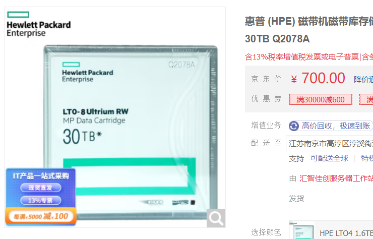

# 存储设备原理

为什么会有内存和外存？我们的状态机的状态是内存和寄存器。寄存器未必一定要作为状态，如写 C 代码的时候，寄存器对我们是不可见的。

如果能够实现一种计算机的体系结构，能从内存里取出数据进行运算，然后写回内存，寄存器本身不是绝对必要的，但是从计算机诞生依赖就存在了。为什么？

当我们谈抽象状态机，谈一个计算模型，根本不需要分内存和寄存器，比如图灵机，生命游戏。对于存储状态的需求：对于计算机来说，真正关心的是如何表示一个状态。表示状态还有个需求：一定要快。

暂存当前状态的需求：
- 可以寻址
  - 根据编号读写数据
- 访问速度尽可能快
  - 越快就意味着越难 persist
  - 甚至为了快，不惜断电丢失(这个并不是必须的，可以造出断电不丢失的计算机)
    - 机械玩具图灵机就没有这个烦恼

```note
如果一个 flash 可以用并行总线访问，那完全可以用来存放程序执行的中间运算数据。

但是 RAM 的速度要比 flash 快的多的多的多。断电丢失也是无奈之举，妥协方案。
```

早期的计算机并不是用电路来存储数据。用机械波的方式，delay line。再后来，磁芯内存，Magnetic core，所以代码报错、存储错误会提示 core dump，这种存储器接近今天的 DRAM 了，但这种存储器有机械运动，所以注定速度快不起来。

计算机原则上有内存就能计算了，算完输出，关机，下次再开机重新算就行。但是随着计算机能力的增长，我们希望这次计算的结果能断电保存，下次通电也还能用。我们可以用特殊指令取出，慢一点也没关系。此外如果发生了 crash，RAM和 reg 的东西没有了，但是持久化存储的数据不变。除了有限的 “当前状态”丢失，我们希望更大、更多的数据能 “留下来” (并且被操作系统有效地管理起来)。

```note
人没了，那么人的记忆就在世界上消失了，这就是无法持久化的东西。

所以得记点笔记，持久化的保存下来。
```

这就是操作系统里持久化的问题。持久化的第一课，持久存储介质。

存储介质是一切文件的基础。存储介质在逻辑上就是一个 bit/byte array，所有的都是。一个存储设备理解成一个数组没有任何问题。
但是呢，根据局部性原理，我们按块读写，可以降低成本加快速度，比如 512Byte 4kB 2MB 这样的块。

存储介质评价方法：价格、容量、速度、可靠性（多快好省）。

```note
现在个人 PC 用的存储设备，也是这些指标经过妥协的结果。

2022年9月，我组了一台台式机，硬盘用的三星的980PRO，当时500人名币500GB，2023年5月，我帮朋友组台式机，同款固态硬盘，500人民币能买1TB。读速度能到7000MB/s

技术的发展还是很快的，我记得2016年我刚上本科，花12000买的笔记本固态硬盘只有128GB。读速度也只有几百MB/s这个样子。
```

接下来再走一下存储设备的发展道路，看看人类历史上计算机科学与技术的人类高光时刻。

## 存储介质：磁

用磁实现持久化相对来说还是比较容易的。对于 1bit，我们需要一个能反复改写的状态。要能寻址+用电路改写。

比较早的存储介质，磁带，magnetic tape。1928 年的存储设备。
- 非常便宜，容量巨大，用于重要数据冷备份。现在在京东也能买到。HP 的 30TB 磁带只要 ￥700.
- 读写速度还可以，顺序读写 400MB/s，但是随机读写几乎做不到。

<figure>
  
</figure>

磁鼓 magnetic drum
- 用旋转的二维平面存储数据。读写延迟不会超过旋转周期。

磁盘 hard disk
- 价格低，容量高，顺序读取还行，随机读取勉强也能做。现在是计算机系统的主力数据存储设备。

为了读写一个扇区，读写头要到对应的磁道。

也有一些算法，比如“电梯”调度算法。早期这些算法是操作系统做的，但是现代 HDD 都有很好的 firmware 管理磁盘 IO 调用(磁盘里面的操作系统)。

HDD 上也有 CPU ，甚至有缓存，对于操作系统来说，现在完全不必理会磁盘的细节。一些调度读优先，写的话，晚一点也行。现在的操作系统已经不自作聪明去管这些了，因为磁盘里的操作系统了解自己的全部。

上个时代流行的设备：软盘。用来搬数据。现在有网盘，U盘。软盘的思路是把盘片和读写磁头分开。所以一个软盘就是一个磁片。今天的应用场景：博物馆。

## 存储介质：坑

最早，追溯到纸带机

CD，这上面是真有坑的。一个完美的反射面，挖坑使得反射光线能力下降，这就区分出01了。一个CD700MB，DVD4.7G，Blue ray 100GB 巨大的容量。然而只能读不能写。当然也可以复杂的做到，但是多方面综合考虑，不划算。

光盘复制超级快，压盘复制。顺序读写速度高。

## 持久化存储：电

前面都是历史。被淘汰的东西。前面的设备的致命缺陷是存在机械上的结构。机械部件至少有 ms 级别的延迟。想要彻底的解决存储的问题，必须是电路。跟上CPU速度的东西也就是电路了。

一个相对比较新的东西 flash memory闪存(1991)。大概的原理是通过充放电保存 1-bit 信息的存储。这个东西几乎都是优点。价格低，虽然生产线的价格高，但是只要生产量上来，单片的价格还是可以做的很低(大规模集成电路)，容量大(3D空间每个坐标都是1bit)，读写速度快(直接通过电路读写，而且容量越大速度越快电路级并行)，甚至快到淘汰了旧的 SATA 接口，使用了 M.2 接口(NVMe协议)，而且可靠性高，没有机械部件，随便摔。

但是有个致命缺点。

1999年，发明了U盘，91 年只是有了闪存这个介质和技术，99年朗科注册了这个专利，把USB接口直接连接到存储上，使得数据的移动变得非常容易，彻底干死了软盘。但是，肯定也听说过“不要在U盘里放重要数据”。同样来自于这个缺陷。

由于闪存的原理，放电无法放干净，放多了，放到最后就放不出来了，那么这个bit就坏了，就永远就是这个值了。也即放电数千或数万次后，就好像是“充电”状态了。

然而文件的同一个位置写几千次是一个很正常的需求，比如日志。不管是 SSD 还是 U 盘，这是一个固有缺陷，只要用了闪存作为介质，这是一个必须要解决的问题。

U盘，SSD，SD卡，都是NAND Flash。

现在的最新的SSD，已经是相当于一台计算机了，有 CPU，on-chip RAM，缓存，store buffer，操作系统，···，很长一段时间内SSD的结构是公司的商业机密。这样的 SSD 可以有大概 1PB 数据写入的能力。

<figure>
  
</figure>

而 SD 卡，标准没有规定SD卡里要有什么，所以最便宜的SD卡可能只做一个最简单的分发数据，良心的厂家会在 SD 卡上也放一个 ARM 芯片。如果标准不规定，那么就一定有人追逐利润，然而从外表看不出任何区别。

所以U盘和SSD的区别。SSD是软件定义磁盘，即每一个 SSD 里都藏了一个完整的计算机系统。

管理这个闪存的软件叫 FTL(Flash Translation Layer)，闪存翻译层，里面有个技术叫 “Wear Leveling”，即软件管理那些可能出问题的 blocks。根据写入的负载，把写入均匀的分到每个闪存块上。闪存管理的核心和内存管理差不多，把 Logical block address 翻译成 Physical block address，道理简单，实现很困难。

SSD 有 Page 和 Block 两层结构。Page 是读的最小单位如4KB，Block 是写入的最小单位如 4MB。有最小的读写限制，就有了 read/write amplification ，读写放大，即读写不必要的内容。

存储介质的抽象，最终都是一个巨大的字节数组，操作系统写入数据，对 SSD 来说，会均匀的写入使用少的块上。

这也就可以理解为什么 SSD 刚出现的时候争议很大，2010 年市场上有消费级的 SSD 出现，也有人有怀疑，到底能不能把“均匀写入”这件事情做好。

此外，读写放大也有影响，因此有了缓存，SSD得到操作系统要写入的数据不着急写进入，先放进缓存，攒够了再写入磁盘。因此可以观察到一个现象，刚开始写入的时候速度很快，过一会儿速度会明显的慢下来。不管是U盘还是SSD，都是这样，刚拿到数据立即返回操作系统“继续给我东西”，然后才慢慢的偷偷一点点把数据真的写进入。这部分也非常的复杂。所以现在的 SSD 也不简单。


FTL 也带来了很多有趣的问题，性能、可靠性、安全性问题。写时复制，如果数据不想让别人看到，删除掉数据，格式化磁盘，并没有真实的删掉数据。在理解了 FTL 之后，即便格式化后写入数据(不写满)也有可能数据还存在原来的physical block。(copy on write机制)因为刚写过的cell，可能要等很久以后才写下一次，这也是 FTL 的机制决定的。由此带来的新的研究问题，文件系统加密。


