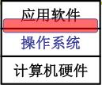
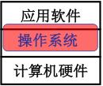
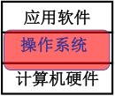

# 操作系统原理(哈尔滨工业大学)

## 什么是操作系统

计算机硬件有了。

在屏幕上出现hello world。

前面学过了，CPU把hex码在总线上搬来搬去，看到hello了很开心，计算机帮人解决问题了。

事实上，程序员坐在电脑前面，写了个程序
```c
#include <stdio.h>
int main()
{
    printf("hello world\n");
    return 0;
}
```
压根没考虑总线上搬数据的问题。凭什么呢？凭啥不是直接搞硬件？当然是操作系统了。

只有硬件的机器叫裸机，学嵌入式单片机的比较喜欢裸机，很大一部分程序是在裸机上的跑的。

操作系统是包裹在硬件上的一层软件，这个词挺合适的。实际上是处于计算机硬件和应用软件的一层软件。

操作系统方便使用硬件，所以其实MCU开发可以尝试一下小型操作系统的，不懂没关系，因为使用不需要会写（调用接口工程师😂）。

操作系统实现CPU管理、内存管理、终端管理、磁盘管理、文件管理、

## 学操作系统的层次

- 学习层次1

<figure>
    
</figure>

从应用软件出发摸到了操作系统，集中在使用计算机的接口上，比如使用显示器：printf；使用CPU：fork；使用文件：open、read

- 学习层次2

<figure>
    
</figure>

从应用软件出发进入到操作系统，fork做了啥事，一段文字怎么写在磁盘上的。学到了这个位置，能做到扩充操作系统、改变操作系统，写个新的驱动为上层提供接口。

- 学习层次3

<figure>
    
</figure>

从硬件出发设计并实现一个操作系统，给了一块板子，对着芯片手册配一个操作系统。

对于我个人来说，希望能学到层次3。硬件出身肯定是是我的优势，那么在层次3更能发挥出我的优势。


>哈工大的这门课到层次2

学完课程的目标：改CPU管理、改屏幕输出、改系统接口、改内存管理。

“Learn OS concepts by coding them!”

看到原理想到代码，看到代码明白原理。


## 参考

[操作系统（哈工大李治军老师）32讲（全）超清](https://www.bilibili.com/video/BV1d4411v7u7)

https://yifengyou.github.io/linux-0.12/

https://yifengyou.gitbooks.io/linux-0-12/content/


解决单核CPU的问题。实际上没到现代操作系统的层次，但是这些东西全部在MCU操作系统中能找到。
