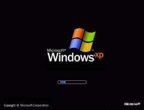

# 操作系统的启动


接下来就要开始入手操作系统了，就从按下开机键开始。按下开机到到进入桌面发生了什么呢？

>复习回顾
>计算机组成原理，图灵机→通用图灵机。微机原理，8088
>究极进化：冯·诺伊曼，程序存储。CS:IP，控制指令顺序执行

系统启动画面，发生了什么？

<figure>
    
	<figcaption>Windows XP启动</figcaption>
</figure>

画面是现象，想知道发生了什么，还是得看程序，因此来分析一下按下开机键，计算机执行的指令。

对于Intel x86 PC，启动以后的事情：
- (1)x86 PC开机时CPU处于实模式（和保护模式对应，实模式物理地址为CS:IP）
- (2)上电，`CS=0xFFFF`， `IP=0x0000`;
- (3)寻址0xFFFF0（ROM BIOS映射区）
- (4)检查RAM、键盘、显示器、软硬磁盘
- (5)从磁盘的 0磁道 0扇区读入`0x7C00`处
- (6)设置`CS=0x07C0`，`IP=0x0000`。

>BIOS(Basic Input Output System)，上电跳转到这这是设计好的。
>一个扇区512Byte，0磁道 0扇区是操作系统的“引导扇区”，跳转后开始执行的就是可以自己写的代码了。

>8088时代就是这样，兼容性。


## 0x7C00处的代码bootsect.S

[bootsect.S详细注释](https://github.com/xym-ee/Linux-0.11/blob/main/boot/bootsect.s)

这里的代码是从磁盘引导扇区读入的512Byte，引导扇区就是启动设备的第一个扇区，硬盘的第一个扇区上存放着开机后执行的第一段我们可以控制的程序。

>装系统，开机按住F12或者各种指定按键，可以进入启动设备设置界面。第一段可控程序的意思是前面不可控没法改，是写死到CMOS上的，存着硬件配置信息，不过现在高端主板也可以更新升级BIOS程序了。

`bootsect.S`引导扇区的代码是一段汇编代码，为啥不用c呢？因为不好控制机器码在内存的位置，在这种需要精确控制的地方需要用到汇编。这个文件在linux源码中有。

7c00移动到90000腾出空间，然后用中断读setup.S的4个扇区，这时候显示一行字缓解焦虑，然后加载内核。然后就推出了，要把控制权交给setup.S

<figure>
    
	<figcaption>启动盘代码结构</figcaption>
</figure>

刚上电的时候，OS是在磁盘上，计算机取值执行，要想运行系统，要把代码放到内存里，所以先要把磁盘上的操作系统读到内存里。这就是引导扇区完成的工作`bootsect.S`。先读了`setup.S`，显示loading system，调用13号中断，然后分段读system，然后操作就在内存里了，`bootsect.S`的使命姐完成了。

## setup.S

[setup.S源码详细注释](https://github.com/xym-ee/Linux-0.11/blob/main/boot/setup.s)

看名字，setup完成OS启动前的设置。还是汇编，需要严格控制地址。

关于这段代码，比较长放在加上注释放在Github里了

这个程序首先上来取出各种硬件参数保存起来，为啥要取出呢？操作系统要管理这些硬件。

| 内存地址 | 长度 | 名称         |
| -------- | ---- | ------------ |
| 0x90000  | 2    | 光标位置     |
| 0x90002  | 2    | 扩展内存大小 |
| 0x9000C  | 2    | 显卡参数     |
| 0x901FC  | 2    | 根设备号     |

>为啥叫扩展内存呢？IBM5150自己出厂带的内存是1MB，多出来的叫扩展内存

然后后面把所有操作系统的代码移动到了0地址，覆盖了中断向量表。

现在需要跳转到操作系统程序去执行了，这时候要换成保护模式了。实模式下CS左移4位+IP，保护模式下，根据CS查表作为基地址+IP。这个表就是GPT()。现在换成32位了，寄存器也扩展到32位了，现在地址也是32位了。

到这里setup彻底结束了。

为什么这么设计呢？兼容性，为了老的还能用

现在想想这段代码为啥叫setup。操作系统要想管理硬件，先得了解硬件的情况，知道计算机是个什么情况，然后操作系统会形成个数据结构，一个表来接管硬件了。

## system模块

system模块的目标代码和setup、bootsect不一样，是一堆文件编译出来的，怎么保证第一部分代码的位置呢？这里还有个话题，要想让整个系统好使，编译生成的代码一定顺序要对，BIOS读boot，boot读setup，setup读system的第一部分，中途一点出错就死机了，随便一动就死机了，需要程序员严格控制才能保证都对的。还要写如何编译操作系统的控制代码`Makefile`

这个区别于IDE，一键编译就完事了，集成环境帮我做了Makefile。需要完全控制一个大型软件编译合成的一个结构。所以操作系统是各种轮子的轮子，真轮子，每个部分都要自己控制。

通过`Makefile`编译一堆源码出来的东西叫`Image`镜像，这个镜像必须要长成下面这个样子。

| boot | setup | system | ····· |
| ---- | ----- | ------ | ----- |

把这个镜像放在0磁道0扇区，这个可以用指令或者工具控制的，然后开机引导的时候操作系统才顺理成章的启动起来进入桌面有了个shell，就可以用了。

Makefile是个树状结构，可以分析出，Image第三块就是system，而system的第一部分是`head.S`接着是`main.c`

```Makefile
# 部分代码
Image: boot/bootsect boot/setup tools/system tools/build
	tools/build boot/bootsect boot/setup tools/system $(ROOT_DEV) > Image
	sync

tools/system:	boot/head.o init/main.o \
		$(ARCHIVES) $(DRIVERS) $(MATH) $(LIBS)
```
[Makefile源码详细注释](https://github.com/xym-ee/Linux-0.11/blob/main/Makefile)

### 下面来看`head.S`

[head.S源码详细注释](https://github.com/xym-ee/Linux-0.11/blob/main/boot/head.s)

setup是进入保护模式，head是进入后的初始化。

又一次初始了idt、gdt，前面是临时建立的，现在是真正工作，再建立一次，还有一些细节，比如开启A20地址线，这里的汇编和前面的汇编都不一样了，32位汇编出现了，

复杂！[汇编语言](../1/1.md)
- (1)as86汇编：能产生16位代码的Intel 8086(386)汇编
  
	```nasm
	mov ax, cs  ;cs→ax
	```

- (2)GNU as汇编：产生32位代码，使用AT&T系统V语法

- (3)内嵌汇编，gcc编译x.c会产生中间结果as汇编文件x.s

>汇编也不用刻意抱着指令背，用到查就完事了。

设置完页表之后，after_page_tables，要跳出来只执行一个c函数，这事咋做到的呢？实际上这和C函数跳到另一个C函数没啥区别，c调c也是要变成汇编的。靠栈来做的，执行c函数`func(p1,p2,p3)`在执行前压栈

|          |
| :------: |
|    p3    |
|    p2    |
|    p1    |
| 返回地址 |

然后执行完`func`遇到`}`结束，编译完成是`ret`，此时弹出来的是返回地址，这就是调用的做法。这部分汇编就是这个思想，下面这几个入栈操作(pushl)用于为调用/init/main.c程序和返回作准备。前面3个入栈指令作为main的参数(argc,argv)，
;// 139 行的入栈操作是模拟调用main.c 程序时首先将返回地址入栈的操作，所以如果
;// main.c 程序真的退出时，就会返回到这里的标号L6 处继续执行下去，也即死循环。
;// 140 行将main.c 的地址压入堆栈，这样，在设置分页处理（setup_paging）结束后
;// 执行'ret'返回指令时就会将main.c 程序的地址弹出堆栈，并去执行main.c 程序去了。

```nasm
after_page_tables:
	pushl   $0			;// These are the parameters to main :-)
	pushl   $0			;// 这些是调用main 程序的参数（指init/main.c）。
	pushl   $0          ;argc,argv几个参数
	pushl   $L6			;// return address for main, if it decides to.
	pushl    $_main		;// '_main'是编译程序对main 的内部表示方法。
	jmp setup_paging
L6:
	jmp L6			;// main should never return here, but
				;// just in case, we know what happens.
```

`setup_page`执行`ret`后，会执行`main()`。`进入main()`后的张为0,0,0,L6，main的三个参数是0,0,0虽然没用到，但是保留了C语言调用的格式，如果main真的返回了，那么电脑就死机了。

### main.c

[main.c详细源码注释](https://github.com/xym-ee/Linux-0.11/blob/main/init/main.c)

然后接下来就是`main.c`了，有个问题是，这个主函数居然是`void main(void)`。函数本身都是初始化一堆东西。

看个典型`void mem_init(long start_mem, long end_mem)`内存初始化的函数，源码在`./mm/memory.c`中。

```C

void mem_init(long start_mem, long end_mem)
{
    int i;
    for (i=0 ; i<PAGING_PAGES ; i++)// 首先置所有页面为已占用(USED=100)状态，
        mem_map[i] = USED;// 即将页面映射数组全置成USED。
    i = MAP_NR(start_mem);// 然后计算可使用起始内存的页面号。
    end_mem -= start_mem;// 再计算可分页处理的内存块大小。
    end_mem >>= 12;// 从而计算出可用于分页处理的页面数。除以2^12=4k
    while (end_mem-->0)// 最后将这些可用页面对应的页面映射数组清零。
        mem_map[i++]=0;
}

```
所谓内存初始化，就是初始化了一个称为mem_map的数组，标记哪用过哪里没用。这个从哪里来呢？从0x90002来的，`setup.s`里面来的。

主函数完成了很多初始化操作，每个设备、数据结构初始化好了，操作系统不就初始化好了。


系统启动基本完成。

说了这么多系统启动做了个啥？
boot把操作系统从磁盘上读进来；setup获得了一些参数并启动保护模式；head初始化了一些GDT表和页表然后调用main；main里是一堆init初始化。合在一起就两件事：读入内存；初始化。

- 为啥读入内存：都进去才能取指执行。
- 为啥要初始化：管理计算机硬件的软件，要管理，要针对每个硬件做出一些数据结构。setup、head、main、init配合起来获得硬件参数，初始化关键重要数据结构，实现对硬件的管理。


