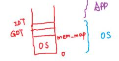
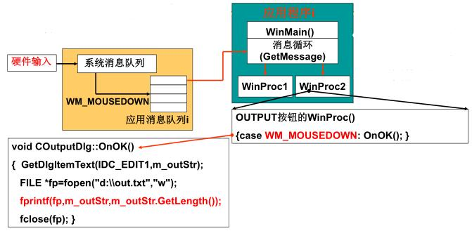
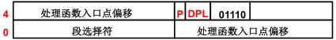
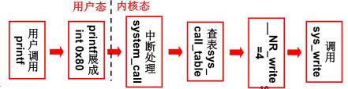

# 操作系统的接口

OS Interface

实际上是用户使用计算机系统的方式。

## 啥是系统调用

前面说的操作系统启动以后，内存里面基本上就是这么个状况。这一部分来学上层的应用是怎么穿过边界来到操作系统里面的。

<figure>
    
    <figcaption>启动后内存结构</figcaption>
</figure>

接口：连接两个东西、信号转换、屏蔽细节。上层调用是个很简单很自然的事情，但是它里面不是也不应该和调用一样这么简单。

这部分不但讲接口是什么样的，还要讲接口是怎么制造出来的。

故事又来到了hello word。使用操作系统，方便了使用，屏蔽了细节。使用计算机的形式：

- 命令行
- 图形界面
- 应用程序

要看看这些操作背后哪些是真正的接口。

### 命令行是怎么回事

命令行shell，我们来看看输入命令后到底发生了啥。命令是啥呢，是一段程序。来看下面这个程序。
```c
/* ouput.c */
#include <stdio.h>
int main(int argc, char* argv[])
{
    printf("ECHO:%s\n",argv[1]);
}
```
在命令行里编译生成可执行文件，`gcc`也是个复杂的命令，但是也是个程序。然后运行
```bash
$ gcc -o output output.c        #gcc是个命令
$ ./output "hello"              #这句话啥含义呢？这是个shell
ECHO:hello
$
```
前面将系统启动的时候讲最终shell或打开个桌面。shell也是个程序，在系统启动的最后，初始化init都跑完了，最后执行个/bin/sh，这实际上也是个程序：
```c
int main(int argc, char* argv[])
{
    char cmd[20];
    while(1)
    {
        scanf("%s", cmd);
        if(!fork())
        {
            exec(cmd);
        }
        else
        {
            wait();
        }
    }
}
```
可以看出这是个死循环，不断地等着用户输入命令，输入后`if(!fork()){exec(cmd);} else{wait();}`来执行命令，那这句又是咋执行的呢？后面进程管理再说。所以shell也是个程序。

把整个过程连在一起。

系统启动的最后会执行一个shell程序，shell程序调用scanf等待用户输入，通过`if(!fork()){exec(cmd);} else{wait();}`申请CPU运行output.c，核心是printf。

可以看出，普通c代码中调用了关键性函数实现对计算机的使用，比如fork、exec对CPU使用，scanf私用键盘，printf使用了显示器。

### 图形按钮是怎么回事

这里讲的代码主要是基于Linux0.11没有图形界面，新的有如发行版有图形界面。但是完全可以自己在Linux0.11上实现一个图形界面。

图形见面实际上并不复杂，鼠标点击、键盘按下去以后通过中断放到系统内部的消息队列里。而应用程序需要写个系统调用`GetMessage`把消息一个一个取出来，然后执行对应动作。

<figure>
    
    <figcaption>图形界面</figcaption>
</figure>

循环调用个函数，把消息取出来，执行操作，这就是消息处理机制。消息处理函数，打开了个文件。图形界面也没什么复杂的，要想写磁盘调写磁盘的函数

总结：用户使用计算机通过程序实现，就是普通C语言程序+关键的系统函数。对操作系统的使用，关键在于重要的系统函数。这些重要的函数是接通应用程序和计算机硬件的接口，表现为一些函数。很直观很自然，一调用函数就进入到操作系统里面了。

起个好听的名字：系统调用（system call），就显得比普通调用高端了。


有哪些具体的接口呢？

printf就是，可是这也是虚晃一枪，实际上不是真正的系统调用，他调用了一个系统调用。

系统调用不一定要去背，知道去哪查就好了。这个接口应该做成统一的，IEEE指定的一个统一的接口标准POSIX(Portable Operating System Interface of Unix)。但支持这个接口，上层用起来会很方便，统一接口以后，就可以在不同操作系统上跑了，应用软件都是C写的。

>POSIX采用了Unix的惯例，一般X出现就代表了Unix

一个操作系统应该给上层提供的几口，如果自己设计操作系统，那么靠椅参考这个，这样不同的应用程序可以在自己开发的操作上运行。

| 分类     | POSIX定义 |      描述      |
| -------- | :-------: | :------------: |
| 任务管理 |   fork    |    创建进程    |
| 文件系统 |   open    | 打开文件或目录 |
| 文件系统 |  EACCES   | 返回值，无权限 |


## 系统调用的实现

从一个直观问题开始，实现一个`whoami`系统调用。

用户程序需要知道用户名
```c
void main()
{
    whoami();
}
```
在操作系统内核有个字符串`"username"`（系统引导时载入的），取出来打打印。这个过程需要系统调用实现，因为这个字符串在内核中，所以有进入内核的思想。内核中、内存中有这么个字符串，为啥不能简单的实现呢？
```c
/*系统调用*/
whoami()
{
    printf();
}
```
操作系统也在内存中，应用程序也在内存中，都在内存中。应用程序想访问操作系统、直接拿出来不行吗？为啥不能这么做呢？如果能的话，操作系统里有许多很重要的东西，比如root密码。还有word里面的内容就能直接被看到了（系统里缓冲区的数据）。

- 不能随意调用数据，不能随意jmp
- 

### 如何实现不允许乱跳

怎么才能实现这个呢？怎么进入呢内核呢？

从硬件设计上直接杜绝了这种操作，这里体现了操作系统和硬件的紧密联系。

内存分割成两个区域：用户态、核心态。这是一种硬件上的设计。

对应的内存区域：内核段、用户段。汇编的时候，计算机对内存的使用都是一段一段的，内核段的内存执行在内核态下，随便折腾；用户态的内存在内存段，程序不能跳到内核段。

所有的段靠段寄存器来实现。

DPL(Descriptor Privilege Level)来描述目标内存段的特权级，要访问的目标端的特权级，上述例子，对于操作系统内核，系统初始化设置好的DP=0。DPL在GDP表中，head.S中做的。

CPL(Current Privilege Level)当前特权级。上述例子中`void main()`，用户程序由CS:IP来表示，这段的段寄存器由CS表示，于是用CS最低两位来表示。

想操作内核时比如MOV指令，比较DPL和CPL，CPL=3，DPL=0，那么当前程序特权不够，指令不能执行。

RPL(Request Privilege Level)

| CPL(CS) |
| :-----: |

| RPL(DS) |
| :-----: |

|  DPL  |
| :---: |

CPL(CS)
RPL(DS)
DPL

系统代码，用户代码。系统初始化时（head.s执行时）会根据内核态的代码和数据建立GDT表，对应的DPL=0，初始化好了。用户态，启用一个用户程序，用户程序对应的CS中的CPL=3。


### 系统调用想进去又是怎么进去的？

系统调用还是得进入内核执行一些操作的，那么是怎么进去的？硬件提供了“主动进入内核的方法”。

对于Intel x86，那就是一些中断指令int。中断是唯一可以进入内核的方式，所以系统调用实际上展开成了一段包含中断的代码。由C语言库展开的。

那么系统调用的方法就出来了
- (1)用户程序中包含了一段由int指令的代码
- (2)操作系统写中断处理，获取想调用程序的编号
- (3)操作系统根据编号执行响应代码

比如open展开，变成int指令，在中断处理函数中，根据open、read、还是write在跳去相应的地方去执行。这就是系统调用背后的操作。


### 系统调用的实现

这里以`printf`举例子

- (1)应用程序的`printf(...)`。/* 应用程序 */
- (2)变成库函数的`printf(...)`。/* C函数库 */
- (3)库函数的`write(...)`。/* C函数库 */
- (4)系统调用`write(...)`。/* OS内核 */

`printf("%s",txt)`;变成库函数的`printf`，转换一下参数格式，因为要调用`write`，转换为write需要的缓冲区个字符个数。

```C
// 该宏结构对应于函数：int write(int fd, const char * buf, off_t count)
// 参数：fd - 文件描述符；buf - 写缓冲区指针；count - 写字节数。
// 返回：成功时返回写入的字节数(0 表示写入0 字节)；出错时将返回-1，并且设置了出错号。
_syscall3(int,write,int,fd,const char *,buf,off_t,count)
```
在段代码在[./lib/write.c](https://github.com/xym-ee/Linux-0.11/blob/main/lib/write.c)这个是个宏定义，里面调用了**0x80**中断。

这个宏定义代码在[./include/unistd.h](https://github.com/xym-ee/Linux-0.11/blob/main/include/unistd.h)中。宏展开成为一段典型的C内嵌汇编代码，系统调用的细节从这个宏开始，要单独拿出来看看。

```c
#define _syscall3(type,name,atype,a,btype,b,ctype,c) \
type name(atype a,btype b,ctype c) \
{ \
    long __res; \
    __asm__ volatile ( \
        "int $0x80" \
        : "=a" (__res) \
        : "0" (__NR_##name),"b" ((long)(a)),"c" ((long)(b)),"d" ((long)(c))); \
    if (__res>=0) \
        return (type) __res; \
    errno=-__res; \
    return -1; \
}
```
这段代码怎么说呢，真是把C发挥的淋漓尽致。int write(int fd, const char * buf, off_t count)带进去展开看看。

`__NR_##name`展开后是`__NR_write`是系统调用号，中断都是0x80，区别功能就是靠这个。在上面定义了`#define __NR_write 4`。系统调用号给eax然后调用0x80中断，这块倒是和8088差不多。但是代码属实有点不好懂。这是进入内核的唯一方法，这事进入系统的一扇门。

>内嵌汇编共四个部分：汇编语句模板，输出部分，输入部分，破坏描述部分。各部分使用":"格开，汇编语句模板必不可少，其他三部分可选。使用了后面的部分而前面部分为空，也需要用":"格开，相应部分内容为空

>这个还得整理。


再来，`int 0x80`表面一句话，背后做了啥呢？这个东西和IDT有关系了。查GDT表确定跳到哪个代码段去执行，中断查IDT表来确定入口函数的地址。`int 0x80`去内核中一顿操纵，再回来时候，内核的操作已经完事了。

在[\kernel\sched.c]()中的函数`void sched_init (void)`里设置了ldt和gdt，最后还执行了`set_system_gate (0x80, &system_call)`;

这个又是个不得了的宏定义。在[.\include\asm\system.h]()

```c
#define set_system_gate(n,addr) \
_set_gate((unsigned long*)(&(idt[n])),15,3,(unsigned long)addr)
```
设置中断处理门，每个表项就是中断处理门，（中断向量表？），设置好以后遇到int
0x80就能跳到相应的中断函数了。n就是处理号，addr就是函数入口地址，写到idt表的第0x80个，3就是DPL，特权级，这个宏又调用了个不得了的宏。

```c
#define _set_gate(gate_addr,type,dpl,addr) \
__asm__ (
    "movw %%dx,%%ax\n\t" \
	"movw %0,%%dx\n\t" \
	"movl %%eax,%1\n\t" \
	"movl %%edx,%2" \
	: \
	: "i" ((short) (0x8000+(dpl<<13)+(type<<8))), \
	"o" (*((char *) (gate_addr))), \
	"o" (*(4+(char *) (gate_addr))), \
	"d" ((char *) (addr)),
    "a" (0x00080000))
```

这段又是看不懂的汇编，不是as86汇编，比上面的也难懂，学下内嵌汇编。
>`__asm__ volatile()`表示``()`里面的是汇编。volatile倒是很常见了，不要优化代码，后面指令保持原样。
>占位符，

这里""里的字母是有含义的，要去看[内嵌汇编](https://blog.csdn.net/wujianyongw4/article/details/80667965)的内容。

这里先把(0x00080000)放到eax，((char *) (addr))放到edx，然后dx送到ax，拼接成了CS:IP。

然后立即数((short) (0x8000+(dpl<<13)+(type<<8)))送dx，然后eax送到内存(*((char *) (gate_addr)))处，edx送到接下来的4个字节中。

<figure>
    
</figure>


系统调用，展开成包含int 0x80的代码，访问idt表找函数，idt表里DPL被设置是3，（CPL=3）。所以可以跳转，表里面，CS=8，IP=&system_call。这里的8和`jmpi 0,8`这两个8一样。正好就跳到了内核代码段，去找内核代码段的system_call，跳过去以后CS对应的CPL的就是0（CS最后两位是CPL），现在就能随便在内核里面折腾了。


>80号DPL设置成3，让用户代码能进来，一旦进来，就能设置成0。


接着来，看看`system_call`做了什么，函数源码在[.\kernel\system_call.s](https://github.com/xym-ee/Linux-0.11/blob/main/kernel/system_call.s)中。


```nasm
system_call:
	cmpl $nr_system_calls-1,%eax
	ja bad_sys_call
	push %ds
	push %es
	push %fs
	pushl %edx
	pushl %ecx		# push %ebx,%ecx,%edx as parameters
	pushl %ebx		# to the system call
	movl $0x10,%edx		# set up ds,es to kernel space
	mov %dx,%ds
	mov %dx,%es
	movl $0x17,%edx		# fs points to local data space
	mov %dx,%fs
	call sys_call_table(,%eax,4)
	pushl %eax
	movl current,%eax
	cmpl $0,state(%eax)		# state
	jne reschedule
	cmpl $0,counter(%eax)		# counter
	je reschedule
```

比较关键的，`movl $0x10,%edx`，然后ds=es=10h，把数据段寄存器换成内核的。

然后最终要真正跳到半实事的地方了。`call sys_call_table(,%eax,4)`根据eax跳到一个表里面去执行，eax是系统调用号，基地址+偏移号*4，因为函数入口地址是32位4Byte。稍加思索这俄格table是个函数表。

这个表的源码在[.\include\linux\sys.h]()中。

```c
fn_ptr sys_call_table[] = { sys_setup, sys_exit, sys_fork, sys_read,
  sys_write, sys_open, sys_close /* ...还有一堆 */
};

```
这第4个不就和前面的__NR_write=4对上了。这个fn_ptr是个函数指针类型，定义在[.\include\linux\sys.h]()。
```c
typedef int (*fn_ptr) ();
```
这真正到系统函数了，声明在上面的。

再接着来，extern int sys_read ();发生了啥呢？这个以后会来的，现在先不急，接口目前就到这了。

总结一下，接口调用，到目前为止是边界发生的事情，还没深入内部。用户调用printf，printf展开成包含int 0x80的代码段，此时CPL=3，int的DPL=3，进来后就是内核态了CPL=0，DPL=0。查函数表，根据中断号真正找功能，调用write。


<figure>
    
</figure>


最后，为啥不能直接跳呢？CPLDPL保护内核数据，要想进去，用终端调用号调用中断功能进入内核，CPLDPL=3，进入后CPLDPL=0，用调用号查表