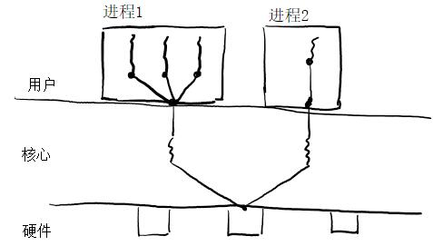
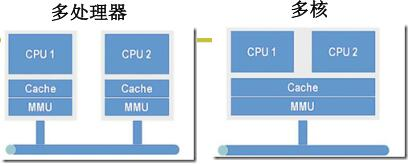
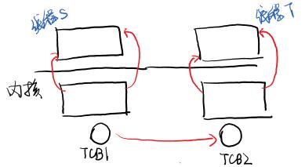
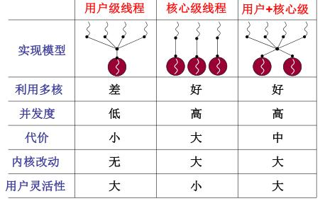

# 线程切换

## 线程和进程

这里要开始将进程的切换了。可是这里为啥是“用户级线程”呢？什么是线程呢？

一个进程执行一堆指令，地址通过映射表获得地址。进程不执行了就要切换，换的时候就是这一对指令序列换到另一堆指令序列。进程1换进程2，切换的时候，只切换指令序列，不换资源行不行？把指令序列和资源分开，这种切换法更快更省事了。既有多段指令再交替执行，切换起来又快，这就引出了线程。

>进程=资源+指令序列。这里映射表叫成资源了

进程更大， 进程里面可以启动多个指令序列。线程看起来更轻巧，还可以来回切换，但是切换的时候没进程那么复杂。

线程既保留了并发的有点，又避免了切换代价特别大。

这里讲的切换先讲线程的切换，然后学了内存，再加上映射表的切换不就是进程的切换了。

那么多个执行序列+一个地址空间是否实用呢？找个网页浏览器的例子，一个线程从服务器接收数据、一个线程显示文本、一个线程处理图片（如解压缩）、一个线程显示图片。这些同时进行，要是顺序执行的话，会慢。边下载边显示，多个指令序列同时交替执行。为啥说这事线程不是进程呢？数据是共用的，下载数据就是要处理的数据、要显示的数据。

这个例子，通过实现来理解。能把程序写出来，不就能理解了。

```c
void WebExplorer()
{
    char URL[] = "http://cms.hit.edu.cn";
    char buffer[];
    pthread_creat(...,GetData,URL,buffer);
    pthread_creat(...,Show,buffer);
}

void GetData(char *URL, char *p)    {...};
void Show(char *p)  {...};
```
首先和服务器建立socket连接，然后显示。这段代码启动了两个线程，还得交替起来。

为了交替，还得加点内容，调用`Yield`函数进行切换。

>现在的浏览器，一个标签页就是单进程多线程


## 用户级线程

User Thread


### 切换

Yield核心是能切换，要知道切换的时候是什么样子。知道了切换那就Create可以认为是第1次切换。先了解思想，再用代码实现。

先按照正常思路想想：用一段伪代码说明，序号是地址。

#### 1.栈的问题

代码段1：
```C
100:    A(){
            B();
104:    }
    /*......*/
200:    B(){
            Yield();
204:    }
```

代码段2：
```C
300:    C(){
            D();
304:    }
    
400:    D(){
            Yield();
404:    }
```

代码段1（线程1）里A调用B是普通的调用，调用B时返回地址104入栈。然后再B里面手动切换线程，要将返回地址204压栈，

Yield手动切换 
```c
void Yield()
{
    找到300;
    jmp 300;
}
```
线程2调用D，返回地址304入栈，D内再次切换遇到Yield，返回地址404入栈，思路是这么个思路。然而一个栈的化，栈里面是这么个情况：104|204|304|404。继续执行的话，应该回到线程1的Yield这才是线程切换，回去立马遇到`}`函数结束，本质上是执行个`ret`，这时候出栈的确是404，这就出问题了。
```c
void Yield()
{
    找到 ？;
    jmp ？;
}
```

两个线程共用了一个栈出现了这个问题，为了解决这个问题，两个线程两个栈。

#### 新问题的优化

两个栈，也就要在Yield的时候把栈一起切换了。这时候就要把栈指针存起来，需要个TCB(Thread Control Block)线程控制块，和PCB挺像。

来看看线程2切换线程1的函数
```c
void Yield()
{
    TCB2.esp = esp  /* esp扩展sp寄存器 */
    esp = TCB1.esp
    jmp 204
}
```
`jmp 204`跳过去，遇到了`}`，然后又弹出了个204，又来这了，再来一次ret才是104，虽然绕了一点，但是好歹在自己这绕圈子。切换到jmp导致Yield里面的`}`一直不执行，所以去了jmp 204就完事了。

从调用的角度理解，返回的时候要执行一个完整的函数，这个Yield带jmp导致函数执行的不完整，出入栈不匹配了，虽然可以正常运行，但是很不爽。所以利用`}`弹出一个栈。

两个线程的样子：两个TCB、两个栈、切换的导致在栈里。

### 创建

实现这个的目的就是制造出第一次切换的样子。

知道了切换需要什么，那就创建线程就都搞上。

```c
void ThreadCreate(A)
{
    TCB *tcb = malloc();
    *stack = malloc();
    *stack = A;
    tcb.esp = stack;
}
```
事实上，Yield中有`Next()`函数挑选下个要执行的线程，这事调度函数，对系统影响很大。


## 从用户级线程到内核级线程

用户级线程是内核级线程的一个子部分，用户级线程可以单独用而且相对简单。

Yield在用户态切来切去，操作系统感知不到其存在，但是还是有问题的。

再来看浏览器这个例子，GetData下载数据需要用到网卡IO，这是个硬件肯定要进入到内核，然而网卡慢，阻塞了，内核必然会切换到别的进程（操作系统感知不到线程的存在），。早期浏览器，一个标签页一个用户级线程，网特别卡，在内核里卡了，直接切换到别的进程了，这时候在其他标签页也不好使了。

核心级线程是个系统调用，会进入内核，内核知道TCB，内核级线程的并发性更好。内核级线程ThreadCreate是系统调用，Yield用户不可见，实际上内核里叫Schedule。


## 内核级线程

切换指令、切换指令流、切换资源。

进程必须得在内核中，实际上切换进程是在切换内核级进程。用户级线程是内核级线程切换的一个过程。

为啥没有用户级进程呢？进程在内核中，要访问资源、各种文件等。这在用户态访问不了的。

<figure>
    
    <figcaption>进程与线程</figcaption>
</figure>

一个操作系统，核心级线程也有、用户级线程、进程全都有。现在桌面CPU基本上都是多核，如果一个系统不支持核心级线程，多核是没用的。多核和多CPU啥区别呢？多处理器每个处理器有自己的一套映射。多核用的同一个MMU，用一个映射，这不就是线程。只有到了内核才能把一个进程里的线程分配在不同的核上，多线程执行在多核上，用的同一套资源，这不典型的多线程，MMU不变。所以多线程到了内核里才能充分利用多核，要多进程这MMU来回换，也好不在哪。

用户级线程操作系统看不到，也没法用多核。

<figure>
    
    <figcaption>多处理器与多核</figcaption>
</figure>

所以用多核机，还是用多核心线程比较合适。

### 从用户级线程引出

每个程序都有自己的栈，两个用户级线程两个栈。而核心级进程里是内核栈，既能在用户态跑（用户栈），又能咋内核态跑（内核栈），这就有两套栈了。

用户级线程切换是根据TCB切换用户栈，核心级线程，根据TCB切换一套栈，用户栈和内核栈都切换。

进入内核的唯一方法是中断，一旦进入内核，就要有内核栈了。INT后内核栈首先记下内核栈的地址、程序的地址。返回的时候IRET根据这些东西全部换回到用户态。

### 内核级线程切换

还是上面哪个ABCD例子。

代码段1：
```c
100:    A(){
            B();
104:    }
    /*......*/
200:    B(){
            read();
204:    }
```

代码段2：
```c
300:    read(){
            int 0x80;
304:    }
    
    system_call:
        call sys_read;
400:    D(){
            Yield();
404:    }
```

A调用B，B用了个read()，read是个库函数会展开成int指令。int了，立马用户栈的SS:SP金内核栈，CS:IP也进内核栈（IP是304）。调用完从内核返回时候`IRET`全部跳回回去用户的东西。

后面继续执行，会在内核中执行启动磁盘读了，自己变成阻塞，然后让出CPU，找下一个线程`next`，`switch_to(cur,next)`。cur是当前线程的TCB，next是当前线程的TCB，TCB里的东西和用户线程TCB一样的，找到内核栈指针，然后通过`ret`换到另一个内核线程，内核栈连着用户栈通过`又回到了用户线程，溜达一圈开始执行另一个用户线程。

<figure>
    
    <figcaption>内核级线程切换</figcaption>
</figure>

内核级线程的五步

1.中断入口：进入切换
```
push ds;
...
pusha;
```

返回地址、寄存器入栈，为中断返回做准备。

2.中断处理：引发切换

启动磁盘读写或时钟中断，这一步可能引发阻塞（时间片，分时系统）。阻塞以后schedule调度。

3.调度 内核栈切换

4.内核栈切换

switch_to完成

5.终端出口：第二级切换

iret;完成用户栈的切换

---

反正原理就上面那个图，这部分没说清楚，后面详细看完源码再分析。

学完了以后，要在Linux 0.11里面实现出来，才算真正懂了。不然也就是应付个考试。

### 内核级线程创建

知道了切换，那么就是要在创建的时候，做成这个样子。

```c
void ThreadCreate(...)
{
    TCB tcb = get_free_page();
    *krlstack = ...;
    *userstack传入；

    tcb.esp=krlstack;
    tcb.状态=就绪;
    tcb入队；
}
```
创建的时候要有用户栈、内核栈，完成TCB和内核栈的关联。

新申请一段内存TCB和内核栈，然后内核栈的东西初始化，把用户栈指针放进去，八项执行的函数地址放进去，CS放进去（实际上都是0f，后面讲），然后tcb关联内核栈，tcb就绪态，后面以ret，就开始跑了。

## 比较

<figure>
    
    <figcaption>进程线程对比</figcaption>
</figure>

Linux 0.11不支持内核级线程，但是加上资源就是了。用户级线程可以自己写Yield调度，但是核心级线程只能用系统的。

要明白进程怎么切换，这里用线程的观点讲的，这个切换是操作系统中的关键。要能在不支持线程的操作系统上实现支持用户级、核心级线程的代码。实验要在Linux0.11上实现支持内核级线程的代码。
