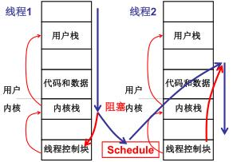

# 源码分析

Create Kernel Thread

<iframe src="//player.bilibili.com/player.html?aid=51437944&bvid=BV1d4411v7u7&cid=90022081&page=12" scrolling="no" border="0" frameborder="no" framespacing="0" allowfullscreen="true"> </iframe>

前面是讲的原理，纸上谈兵，其实还是不那么复杂的。

内核级线程的实现会了以后，再加上资源管理（主要是内存管理），就可以进程了。这完整的操作系统就不远了。

>一个完整的操作系统，不持支持内核级线程、用户级线程都可以，但是一定要支持进程。

<figure>
    
	<figcaption>内核级线程</figcaption>
</figure>

再来回顾一下内核级线程的原理：关键在于两套栈的切换，用户栈和内核栈通过int中断调用实现，内核里，tcb先切换，然后内核栈切过来，用iret实现用户栈跟着的切换。

从用户角度来看，内核里面是隐藏的，实现了用户栈的切换。

这里


用fork();这个系统调用来看看。

## 第一步，中断入口与用户的关联

先来看一个

```c
void main()
{
    A();
    B();
}
void A()
{
    fork();
}

```
系统调用的展开代码在[前面]()说过了，进入A执行fork调用，fork会展开成0x80的一个中断。
```nasm
mov %eax, __NR_fork     ;调用号
int 0x80
mov res,%eax
```
指令`int 0x80`执行完以后才进入内核，执行的时候是用户栈，进内核后找到内核栈放入当前的SS:SP（正好在mov res），还有当前CS:IP（前面强调int执行）。这就能通过内核栈找到用户栈了。

来看看int 0x80发生了啥（不是第一次看了）。中断调用了system_call。第二次回顾这个函数，源码在[.\kernel\system_call.s](https://github.com/xym-ee/Linux-0.11/blob/main/kernel/system_call.s)中。

```nasm
system_call:
	cmpl $nr_system_calls-1,%eax
	ja bad_sys_call
	push %ds
	push %es
	push %fs
	pushl %edx
	pushl %ecx		# push %ebx,%ecx,%edx as parameters
	pushl %ebx		# to the system call
	movl $0x10,%edx		# set up ds,es to kernel space
	mov %dx,%ds
	mov %dx,%es
	movl $0x17,%edx		# fs points to local data space
	mov %dx,%fs
	call sys_call_table(,%eax,4)
	pushl %eax
	movl current,%eax
	cmpl $0,state(%eax)		# state
	jne reschedule
	cmpl $0,counter(%eax)		# counter
	je reschedule
```
这一进去，就把一堆寄存器入栈了，虽然在内核态，但是寄存器的内容都是用户态的数据，因此保护起来。然后才调用fork真正干事情。

>第一步到这就完了

如果执行了一会儿，发现这个进程可以不执行，比如读磁盘，等数据的时候就可以切换了。那么就要调度了。write和read很有可能就有这种现象。

执行完sys_fork继续执行，current,给%eax，

0是运行或者就绪，非0表示阻塞。jne重新调度，schedule完成五段中间的三布，切换完了干啥呢？先不着急看中间三部分，先看看换完了干啥。

cmpl $0,state(%eax);阻塞切换。
cmpl $0,counter(%eax);看看时间片，用光了=0也要切换。


## 第五步：中断出口
```nasm
reschedule:
	pushl $ret_from_sys_call
	jmp schedule
```
reschedule是个标号，会把ret_from_sys_call这个入口地址入栈，然后调用C函数schedule，这个函数执行遇到`}`，会从栈中弹出来ret_from_sys_call去这执行了。

现在来看这段内干了些啥事。
```nasm
ret_from_sys_call:
	movl current,%eax		# task[0] cannot have signals
	cmpl task,%eax
	je 3f
	cmpw $0x0f,CS(%esp)		# was old code segment supervisor ?
	jne 3f
	cmpw $0x17,OLDSS(%esp)		# was stack segment = 0x17 ?
	jne 3f
	movl signal(%eax),%ebx
	movl blocked(%eax),%ecx
	notl %ecx
	andl %ebx,%ecx
	bsfl %ecx,%ecx
	je 3f
	btrl %ecx,%ebx
	movl %ebx,signal(%eax)
	incl %ecx
	pushl %ecx
	call do_signal
	popl %eax
3:	popl %eax
	popl %ebx
	popl %ecx
	popl %edx
	pop %fs
	pop %es
	pop %ds
	iret
```
一堆pop，前面一堆人工push意义对应。最后一个指令**iret**，把前面自动push进来的SS:SP和一起出去了，schedule已经把该换的换好了，就是下一个执行的用户栈。

这些内服复杂的原因是，散落在源码的四处，散落一地。。。


##
```nasm
reschedule:
	pushl $ret_from_sys_call
	jmp schedule
```
来看看schedule，源码在[./kernel/sched.c](https://github.com/xym-ee/Linux-0.11/blob/main/kernel/sched.c)中。
```c
void schedule(void)
{
    int i,next,c;
    struct task_struct ** p;

/* 
    通过算法找到下一个要执行的。

 */

    switch_to(next);
}
```

来看看怎么切换的switch_to
但是注意Linux-0.11不适用内核栈完成切换的，他用的是TSS(Task Structure Segment)任务结构段，这种方法进行切换。要把基于TSS的切换变到Kernel Stack的切换，可以改造一下试试。Linux 2.6以及Windows都是用的KS切换，TSS写代码简单但是效率低,IntelPC上做出来了，一句话就能做出来。

```c
#define switch_to(n)  \
    struct {long a,b;} \
    __asm__( \
        "movw %%dx, %1\n\t" \
        "ljmp %0\n\t" \
        : \
        : \
        "m" (*&__tmp.a), \
        "m" (*&__tmp.b), \
        "d" (_TSS(n)) \
    )
```
这长跳转指令是跳转段，每个段都有段描述符（指向段的指针），有描述符就有选择。这段没懂，也不怎么重要，12讲30min。


346g可用


