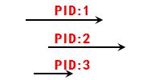
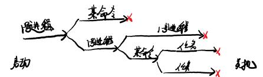
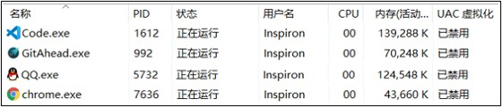
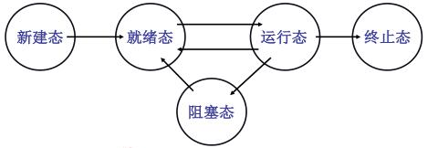

# 多进程——充分使用CPU能力

这事东西对操作系统非常重要，是操作系统的一大部分。

操作系统的核心功能就是管理计算机硬件，CPU是计算机中最核心的硬件，再管理CPU的时候引出了多进程图像。通过多进程操作系统管理明白了CPU，最核心的。

操作系统怎么管理CPU呢？

## CPU管理的直观想法

管理CPU，先要使用CPU。

CPU怎么用起来的呢？说了好多次了，计算机组成原理的东西。

图灵机，冯·诺伊曼，程序存储与程序控制。虽然说了很多次了还是来看看，

```asm
50:     mov ax,[100]
51:     mov bx,[101]
        ;...
100:    0
101:    1
```
这里是个思想。PC=50，从100处搬0去ax，PC自动+1。在这样的工作原理下，CPU怎么使用呢？CPU就是这么个不断取指、执行的过程，设置好PC初值，剩下的就不用管了。所以使用CPU最直接的方法就是把PC的初值设置为一段程序的地址。

现在CPU是可以工作了，但是也会有问题。比如

```c
int main(int argc, char* argv[])
{
    int i, to, *fp, sum = 0;
    to = atoi(argv[1]);
    for(i=1; i<=to; i++)
    {
        sum = sum + 1;
        fprintf(fp, "%d", sum);   /* 换成任一条计算指令 */
    }
}

```

对任一运算指令和fprintf这条IO指令相比，执行耗费的时间是不一样的，数量级在十万这个样子。1条IO指令执行的时间可以执行几十万条计算指令这个样子。根据不同的机器有所不同，但基本上是这么个结论。运算是在电路层次上完成，IO指令要访问到磁盘，有机械部件运行，所以时间特别长。

问题就来了，程序顺寻执行的时候，在执行IO指令的时候，绝大多时间（99.99999%）是在等磁盘准备数据的，甚至可以认为100%就是在等，最后的那条指令瞬间完成忽略不计了。这个时候CPU的能力就没有得到充分的应用。比如一段程序50000条运算指令，1条IO指令，结果这两部分花了一样的时间，CPU利用率50%。实际程序个几十条指令就会读写IO，因此这利用率几乎接近于0了。

```note
单核MCU裸机程序基本上就是这么个状态，比如，STM32使用普通GPIO模拟IIC，里面充满了大量的delay。

只要含有软件delay的地方，或者使用定时器和while等待定时结束，CPU在闲着没事干或者做没用的运算。
```

问题提出来了，怎么解决的？当然人遇到了这种情况，等外卖的时候肯定不是干等着的，外卖到之前也要吃其他零食的。这就是个提高效率的想法。

在这种思考下，在一个程序执行不下去的时候，切换到另一个程序。多个程序在内存中（多道程序）交替执行，这CPU利用率就起来了。

到这里**并发**的概念就出来了：一个CPU上交替的执行多个程序。这才是CPU工作应该有的样子，充分压榨CPU的性能。

让CPU并发的执行程序，CPU就可以特别好的工作。

如何做到并发工作呢？设置好PC寄存器，在适当的时候进行切换，想法倒是很简单的。仅仅修改寄存器PC就完事了嘛？那肯定还得知道切走的时候地址是多少，寄存器的值是啥样的，参考中断现场保护的问题，也就是说切出去啥样切回来啥样，程序才能正常。因此运行的程序和静态的程序是不一样的，程序放到磁盘上啥也不用管，一旦放到内存里运行起来，就要记录程序运行起来的样子。

如何描述这个不一样呢？用一个概念来说啥是运行起来的程序：进程。跑起来的程序就是进程，需要有个东西存放跑起来的不一样，这个数据结构就是PCB

>一些不同点：进程有开始结束程序没有、进程走走停停程序走停没意义、进程需要记录寄存器值程序不用、...

>概念不是说，拿出来，背。一个概念应该是很好的刻画一个东西，很自然的，很贴切的。

启动一个进程，让CPU跑起来，这就把CPU用起来了。启动多个进程，CPU一起跑起来，这就很好的管理起来了。多个进行一起往前跑的样子就应该是操作系统管理CPU的样子。


## 多进程概念和视图

啥是多进程图像？能不能画出来

为了实现多进程图像，操作系统应该做些什么事情？

多进程图像是啥呢？这个多进程是可以画出来的，三个箭头三个直线。

<figure>
    
    <figcaption>多进程</figcaption>
</figure>

从用户来看，计算机上跑着3个进程，比如ppt、word。从下层作系统来看，启动了3个进程，负责管理好、记录好3个进程，创建PCB(Process Control Block)进程控制块，让这几个进程合理向前推进，音乐在播放的同时鼠标还能动。用户就感觉到计算机被用起来了，有这么多进程，都还用的不错。

多进程图像从启动开始到关机结束，这是操作系统的核心图像。

现在要开始看源码了，看看到底咋回事。

main中的fork()创建了第一个进程，
```C
if (!fork()) {		/* we count on this going ok */
    init();
}
```
init()执行了shell，Windows的话就是创建了个进程启动个桌面。

<figure>
    
    <figcaption>进程图</figcaption>
</figure>


<figure>
    
    <figcaption>Window进程管理器</figcaption>
</figure>

说了一堆，要建立这个重要认识：用户使用计算机就是启动一堆进程，用户管理计算机就是管理一堆进程。


>这里是个大概轮廓，后面会展开源码分析实现。

## 多进程如何组织？——切换问题

如何组织，怎么存放的？操作系统感知进程全靠PCB，组织进程也全靠PCB，用PCB行车一些队列。只有组织好这些进程，才好管理推进这些进程。

这里考虑单核CPU，有一个进程在执行，后面一堆进程在等待执行，还有一堆进程在做准备（等磁盘数据、等打印机...）。所以进程要分类的，按照状态分为就绪态、运行态、阻塞态。状态图表达了进程状态的转化，是操作系统对进程的一种管理。

<figure>
    
    <figcaption>进程状态图</figcaption>
</figure>

阻塞态就是在等数据或者等其他东西。

这块的数据结构不是很难。视频没讲。

多进程的组织：PCB+状态+队列

## 多进程如何交替？——调度问题

当然进程正在执行，怎么切出去，然后又怎么切回来？所以切换交替也是个挺重要的事情。必须要实现交替切换才是灵魂。

```c
//某进程启动磁盘读写，要等数据
pCur.state = 'W';   //将状态变成阻塞态
schedule();         //将pCur放到DiskWaitQueue
```
切换的核心函数是`schedule();`，多进程中的灵魂函数。
```c
schedule()
{
    pNew = getNext(ReadyQueue);
    switch_to(pCur, pNew);
}
```
pCur, pNew都是PCB，从就绪队列找下一个，怎么找也很有讲究，这一块叫调度。然后根据PCB信息保存的保存恢复的恢复。

这个`getNext`该怎么找呢？就绪队列又一堆准备好的，遮盖怎么调度呢？这个很深刻，有很多算法，每年还会又新的算法，相当深刻。但是这里只要知道通常怎么做就可以了，这里说几个非常简单的。

- FIFO

这是公平的策略，但是没考虑执行任务的区别，先好的先来，食堂买饭，先来先买。

- Priority

优先级，更紧急的情况想来。

如何交替运行：队列操作+调度+切换

切换的时候怎么换？

单核CPU，保存重要的信息，现场保护。

这个挺简单的，就在`switch_to`里面，包这些CPU里面的信息保存在PCB里面。

## 多进程如何影响？——同步问题

多个进程同时在内存中内出现问题。都是在内存中，进程1代码可能会因为故意（外挂如CE修改器）、BUG导致访问了进程2的代码。

>CE修改器的原理。

是不允许这么搞的，要限制这种情况，通过映射表实现。映射表实现了进程里面随便折腾但是内存物理地址的分离。

多进程的地址空间分离也是内存管理的主要内容。

但是有时候多个进程之间还有合作完成一些事情。进程间的通信，抽象出了生产者和消费者。

共享的数据
```c
#define BUFFER_SIZE 10
typedef struct {...} item;
item buffer[BUFFER_SIZE];
int in = out = counter = 0;
```
生产者进程，如果放满了就不放了，counter的含义必须对，如果缓冲区满了，counter却不是BUFFER_SIZE，就会出问题。
```c
while(true)
{
    while(counter == BUFFER_SIZE);
    buffer[in] = item;
    in = (in+1) % BUFFER_SIZE;
    couner++;
}
```
消费者进程
```C
while(true)
{
    while(counter == 0);
    item = buffer[out];
    out = (out+1) % BUFFER_SIZE;
    couner--;
}
```

多个

| 共享数据       | 生产者进程 | 消费者进程 |
| -------------- | ---------- | ---------- |
| int counter=0; | counter++; | counter--; |

实际运行  
AX = counter;  
ADD AX,1;  
MOV counter,AX; 

如果交替过程中，切出去了，就出大问题了。也就是说不能想切就切，要在合理的时候。

>以前写MCU裸机，模拟IIC写OLED，中断接收串口，屏幕刷新到一半停了。。。转到中断服务函数了。

这时候就要给counter上锁，彻底完成了再切换。


## 总结

这一部分提出了问题。有个大概样子，接下来要做细致了。


