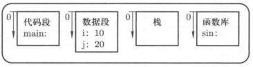
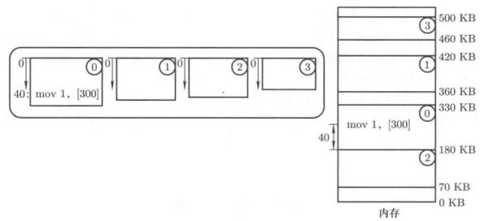

# 内存使用与分段

## 内存的使用

内存的使用，还是要从计算机如何工作开始。计算机取指执行，程序时放在内存中的，实际上内存使用的方法就是把成勋放到内存里，PC指向开始地址。

程序最后时一堆机器码，与其等价的给人看的是汇编语句，对于一个C程序来说，函数入口变成了一个汇编入口地址了，函数语句是一系列汇编语句，存在磁盘里，在计算机启动的时候，会搬到RAM里，这时候就有个地址的问题。

对于函数来说，函数体的每个指令相对于函数入口有个偏移地址，搬运到RAM的0地址是最合适的。

但是事实上，应该是找一段空闲的内存搬进去。但是这个相对地址就和物理地址对不上了，编译程序完成后的相对地址为逻辑地址，因此有个如何把逻辑地址和物理地址对应起来的关系。

程序载入到内存，有个重定位的问题，完成后，才能无错误的取值执行。

重定位可以在编译时做，也可以在载入时做。

在编译的时候重定位需要知道现在哪段地址是空闲的，这是个非常硬的做法，做好永远不改了，烧进去不变了，就是这样的，好多嵌入式系统就是这样的。这样不是很灵活。

对于现代PC太硬了不合适，在载入的时候找一段合适的空闲内存，这种方式更加灵活，当然也会慢一点，更适合通用计算机。

很多时候，程序载入以后还要移动。一个重要概念：交换(swap)。

进程阻塞以后，长时间不用，让其占着RAM就不合适了，放到磁盘里，把磁盘里合适的进程放到RAM里运行。换入换出的时候，原来的内存不一定还在了，因此重定位最合适的时机是运行的时候。

基地址放在PCB里，执行指令时先从PCB取出基地址，加上逻辑地址，可以获得物理地址。

找到空闲的内存后，找到这段空闲内存的起始地址作为基地址放到PCB里，然后PC和PCB里的基地址一起处理。

## 分段

内存的使用是真程序从ROM搬动到RAM里，搬动的时候并非将整个程序搬动到内存里。

<figure>
    
    <figcaption>分段结构</figcaption>
</figure>

程序员写的程序由若干段组成，每个段有各自的用途，数据定义在数据段中，操作部分对应代码段，函数嵌套在栈段实现。每个段分开来单独处理，都从0地址开始单独编址。

程序分段后，再把程序作为一个整体载入RAM就不合适了，应该分别处理各个段。整个程序载入RAM只需要记录一个基址，多个段分别载入就需要记录每个段的基址，多个基址会形成一个表，这就是段表。

<figure>
    
    <figcaption>分段载入</figcaption>
</figure>

对应的段表

| 段号  | 基址  | 长度  | 保护  |
| :---: | :---: | :---: | :---: |
|   0   | 180KB | 150KB |   R   |
|   1   | 360KB | 60KB  |  R/W  |
|   2   | 70KB  | 110KB |  R/W  |
|   3   | 460KB | 40KB  |   R   |

这种方式符合用户观点，可以独立考虑每个段（分治）。

具体定位方式：**<段号, 段内偏移>**，比如指令`MOV [ES:BX], AX`，把寄存器的数据移动到数据段。

每个段从0开始编址，如果步明确指出那个段，只用偏移地址是无法确定到物理地址的，<段号, 段内偏移>这种地址格式很熟悉，比如经典8086里的`CS:IP`，其中CS是代码段号，而IP就是偏移地址。

对于分段来说，逻辑地址实际上是段内偏移，分段机制下地址转换的核心就是查找段表。再系统引导时，`setup.S`的最后执行指令`jmpi 0,8`就是设置CS=8，IP=0跳转执行。

由于setup启动了保护模式，要用CS去全局描述符表(GDT)中查找，这就是个段表。GDT表背后的操作系统概念就是分段机制，启动保护模式的实质就是启动MMU来完成运行时重定位。

