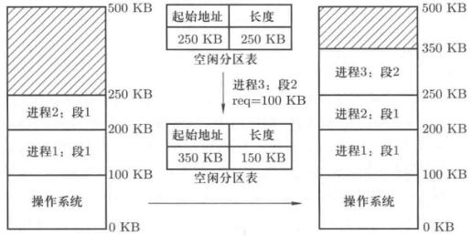
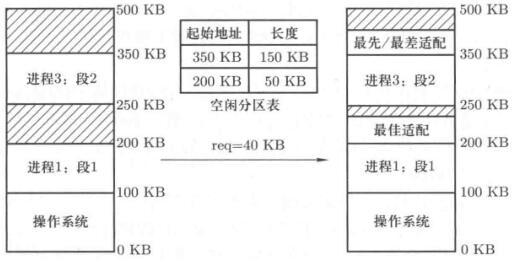
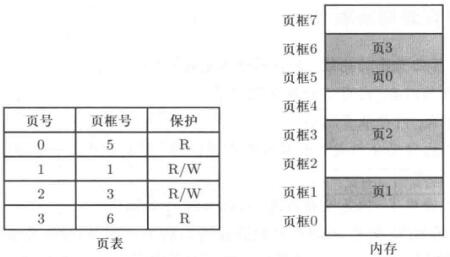
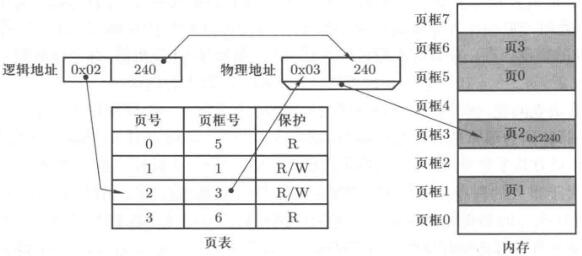

# 内存分区与分页

## 分段到内存分区

操作系统管理内存，核心思想是用起来，即把一段程序放到内存中，让CPU取指执行，这就是使用内存的过程。

程序跑起来了，内存也就跟着用起来了。

为了更高效使用，分了不同的段，如代码段、数据段、堆栈段，把不同段放到内存的方式是找一段空闲的大小合适的内存。

代码段放进去了，数据段也放进去了，内存被占用了，有东西了，接下来就是取指执行，跳转的时候，偏移地址需要转换为物理地址，这就是重定位问题。解决方式是使用段表，把基址记录下来，各个段记录在LDT表里，对应的寄存器是LDTR，把基址和偏移地址组装成物理地址。

进程1使用LDT1，对于进程2，要使用LDT2，每个LDT放在进程的PCB里。切换的时候PCB要跟着一起切换，LDT也跟着一起换掉了。

一个程序分成多个段是在编译时候做的事情。内存中划分空闲区，几个算法和数据集结构。通过磁盘读写进来，驱动的问题后面会讲。

因此内存分区的问题就来了，内存如何分割的问题，分割好以后，就可以载入程序了。

## 内存分配算法

最简单的方法，等分内存，操作系统初始化时候把内存等分成k个分区。

但是小程序需要的内存小，大程序要大，可变分区更合适一点。

要想从空闲内存区域找到一个分区来满足段请求，关键是记录和维护“内存空闲区域”信息，比如说进程3申请一块100KB的内存，那么空闲分区表上记录了从250KB开始有一块250KB的空闲内存，分割后，从350KB开始有150KB空闲内存。

<figure>
    
    <figcaption>内存分割</figcaption>
</figure>

在进程退出时候，也要释放内存，此时就会出现两块空闲区域，如果两块区域都能满足新的进程申请的内存，该如何处理呢？这就是分区适配算法要解决的问题。一般的想法是选择能满足要求并且不浪费的空闲区域，比如说进程1段1释放，新进程申请一段40KB的内存。

<figure>
    
    <figcaption>内存分割</figcaption>
</figure>

这种方法称为**最佳适配**，看起来不错。虽然这么叫，但实际上并不是最好的方法。分割剩下的空闲分区会越来越小。

为了避免这种情况，可以采用和最佳适配刚好相反的思想，选择满足要求的尺寸最大的空闲区与，即**最差适配算法**。这个算法会导致出现很多中等大小的空闲内存。

如果操作系统的内存请求没有规律，既有尺寸很大和很小的内存请求，也有中等大小的内存请求，那么可以用一个运算速度最快的算法：**最先适配**。找到一个符合的直接就用。

到这里一个最基本的操作系统就有了。

但是现代操作系统是不这么搞的。上面这种分区方法可以想象操作系统运行足够长时间后，会有许多内存碎片。

很自然的想法是隔一段时间整理一次内存，整理内存的时候所有进程都要停止执行。如果内存读写速度可以达到10GBps，处理一遍10GB内存需要2s，这个时间是不能接受的。

另一个想法是能不能把进程申请的内存离散的填充在碎片里。

这就是内存分页，把内存分割成固定大小的小片，根据请求尺寸计算出需要的小片数，在内存任意位置找出小片分配给请求进程，这就不会有碎片问题了。

每个小片就是**内存页**，分页机制是为了解决内存碎片问题提出的重要方法。

## 分页机制

操作系统初始化有个mem_map，每4K对应一项，使用为1，这就是每4K当作一个单位处理了。

这时候不需要内存紧缩了，每个进程浪费的内存<4KB。

物理内存上关心是否浪费，物理内存分页浪费的少。用户希望分段，因为程序由多个段组成。所以内存应该既支持段，又支持页，段页结合在一起。

按照分页的方式，程序载入内存了，但是得执行起来，这时候偏移地址要重新考虑了，比如指令JMP 40；该跳转到哪一页呢？

这时候需要页表了，去页表查是那一页，找出页框，各种基址偏移地址都考虑进来，计算出最终的物理地址，CPU里有个寄存器CR3。

<figure>
    
    <figcaption>分页机制</figcaption>
</figure>

物理内存按照4K分割，顺序编号为**页框**，进程的某段比如说代码段也按照4K分割，按顺序编号放到空闲的页框中，这就有了页表。

具体寻址的时候，比如说一个指令`mov [0x2240], %eax`，每个页的尺寸是4K，先去找页号，除以4K实际上右移12bit就行，页号是很显然是0x02，在第2页。通过第二页查页表在页框3。这些事情实际上直接是硬件在做的，MMU在做，只要把页表给他，电路实现这些事情。

页框3对应的起始物理地址左移12位即可，是0x3000，加上偏移页内的偏移地址，则实际的物理地址为0x3240。

<figure>
    
    <figcaption>分页机制下的地址</figcaption>
</figure>

到这里，内存的使用又往前推了一步，

## 多级页表

前面的方法理论上没有问题，但是实际用起来还是有问题。

为了提高内存空间的利用率，页应该小，但是页小了页表就大了。比如说一个16GB的内存，16G/4K=4M，这个表还是有点大了。系统中如果有10个进程，那么就需要40M内存来放页表。这是不能接受的。

实际上大部分的逻辑地址根本不会用到，对于一个32位的PC，内存空间为[0，4G]，因此看起来并不需要4M的页表。

第一种尝试，只存放用到的页，用到的逻辑页才有页表项。这样的话，页表中的页号不连续，需要比较查找，如果折半查找，需要比较10次，每执行一条指令，需要额外访问内存10次，这也不划算了。前面的方式是直接使用移位，做一个硬件加法就好了，需要占位。

所以要求必须连续，又要让页表占用内存少。这就提出了多级页表。现实中的一个例子是书或者论文目录，一级标题和二级标题。

第二种尝试：多级页表，页目录表（章）+页表（节）。

对于一个32位的PC系统，逻辑地址构成方式

|  10bit   | 10bit | 12bit  |
| :------: | :---: | :----: |
| 页目录号 | 页号  | Offset |

页目录可以包含了$$ 2^{10} $$个页表，共有$$ 2^{10} \times 4 \mathrm{KB} = 4 \mathrm{K} $$。

使用这种方法，各种编号仍然是连续的，但是占用空间小了许多。

多级页表提高了空间效率，但是时间上付出了一点点代价，首先要查页目录号，然后再查页表号。每多加一级页表，需要多查一次，很显然的事情。

如果是64位系统，页表级数会更多。也要考虑从这个事情，因此有了另一个东西：快表。

TLB是一组相连快速存储，是寄存器。记住最近使用的页号对应的物理页，采用硬件电路，根据页号一次比对，TLB命中以后直接取出页框号。如果TLB未命中（失效），那么规规矩矩去查多级页表，查出来把这个再存放到TLB里。

要想让TLB好使，得让命中率很高。命中率取决于表的大小。一般来说，TLB条目数在64-1024之间。程序的地址访问存在局部性，

