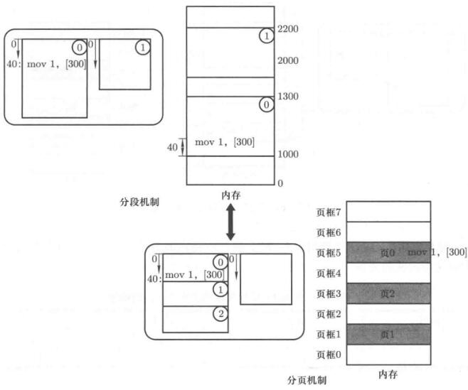
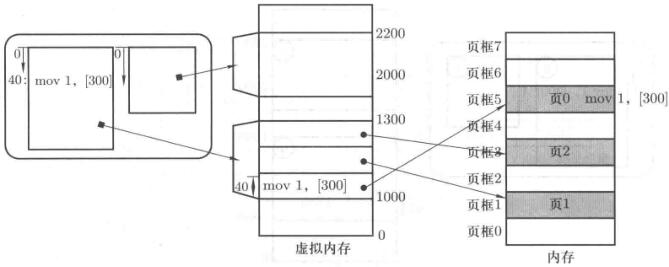
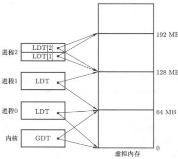

# 段页结合的实际内存管理


程序员希望使用段，物理内存希望用页。操作系统要让两个都满意，需要把两种机制结合起来。

## 段页结合的思路

在实际汇编，我们更喜欢用“代码段的第50条指令”，“数据段的第10个单元”这种方式来描述。从物理内存的角度触发，希望等分为若干页，以页为单位进行分配，以避免内存碎片的问题。

<figure>
    
    <figcaption>分段和分页</figcaption>
</figure>

由上图可以看出，分段和分页同时存在的关键是中间的双向箭头，可以设计一个结构实现这个箭头。

对于分段思路，程序分为段0和段1，载入到内存里；对于分页思路，物理内存分页，程序也分页，打散了装入内存。

这时候考虑这么个思路，把程序分段转入中间内存，再把这个中间内存分片装入物理内存。

这个中间内存不是物理内存，但是长的很像物理内存，是个地址，是个假的内存，起个很好听的名字叫**虚拟内存**。

<figure>
    
    <figcaption>虚拟内存</figcaption>
</figure>

应用程序从虚拟内存中划分出各个段装载程序，虚拟内存做一个映射，分片载入到物理内存里。

虚拟内存连接了段和页两种思维。

上面这个图是理解基本操作系统内存段页模式的核心。

段页同时存在，段面向用户，页面向硬件。

程序中使用的代码段，首先在虚拟内存里划分出一段来，从用户角度来看不知道这是假的，操作系统马上就把虚拟地址映射到对应的内存页了。操作系统隐藏起了这个映射，在用户看来这就是个完整段。

虚拟地址后面的东西对用户来说是透明的，就和没有一样。

## 地址重定位问题

对于上面的例子，进程首先建立段表来记录映射关系

| 段号 | 基址 | 长度 | 保护 |
| ---- | ---- | ---- | ---- |
| 0    | 1000 | 300  | R    |
| 1    | 2000 | 200  | R/W  |

对于编程来讲，逻辑地址为<段号，偏移>，这时候通过CS:IP获得的是虚拟地址。

这时候还要对虚拟地址做一个处理，把虚拟内存分割为页，选择物理内存中空闲的页框，把虚拟内存中的页内容放到物理页框中。

因此实际的段、页式内存管理的核心是虚拟内存。


## 真实的段页管理机制

内存的使用从进程的创建`fork()`开始，进程创建中关于内存的使用在代码上要做的核心工作就4个事情：
- 虚拟内存中分段
- 建立段表
- 虚拟页映射到空闲物理页框
- 建立页表


```c
/* linux/kernel/fork.c */
int copy_process(int nr, long ebp, ...)
{
    /* ... */
    copy_mem(nr, p);
    /* ... */
}

```
分析这个`copy_mem`函数

```c
int copy_mem(int nr, task_struct *p)
{
    unsigned long new_data_base;
    new_data_base = nr*0x400 0000;
    set_base(p->ldt[1], new_data_base);
    set_base(p->ldt[2], new_data_base);
}
```

可以看出确实是进程带动内存，一开始就是在设置基址，这一看就是在做段表。这个基址是64M*nr，nr是进程号。

意味这个操作系统比较简单，所以分配建立段表很简单就搞定了。

每个进程的代码段、数据段都是一个段，每个进程占64M虚拟地址空间，互不重叠。

<figure>
    
    <figcaption>虚拟内存分段使用</figcaption>
</figure>

这样的等分显然是一个最简单的虚拟内存分割方法，也有许多更复杂的算法，这种简单的等分方法时间效率最高，可以应用在嵌入式平台上。

分段完成以后，下面是要实现分页，建立页表了。物理内存分页在系统初始化时已经做好了，在这里要做的工作是将进程使用的虚拟内存分割成页，并建立和物理页框的关系，这也是`copy_mem`后面干的事情。

```c
/* 进程地址空间建立 */
int copy_mem(int nr, task_struct *p)
{
    unsigned long old_data_base;
    old_data_base = get_base(current->ldt[2]);
    copy_page_tables(old_data_base, new_data_base, data_limit);
    /* ..... */
}
```


