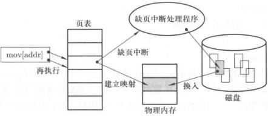

# 内存换入/换出

虚拟内存式实现分段和分页的关键，换入换出是虚拟内存的关键。

虚拟内存就是操作系统给进程提供的一个规整的、总长度为4GB(32位操作系统)的地址空间，用户可以随意访问这个空间中的任何一个地址。

实际物理内存可能比4GB要小，所以4GB的虚拟内存不可能全部映射到物理内存上。比如说物理内存只有1GB，如何用这1GB的物理内存提供给用户一个4GB的感觉呢？这就是换入换出问题。

用换入换出实现比较大的虚拟内存。

## 换入

实现换入的方法就是请求调页。

虚拟地址是0-4G随意的，当访问虚拟地址发现物理地址里没有，既缺页无法取指执行时，需要调页，MMU查页表发现缺页会产生一个缺页中断。这时候就要在中断里进行缺页处理，从磁盘里找到相应的内容，在内存里找个空闲页载入进去。然后可以继续执行前面的指令了。

<figure>
    
	<figcaption>缺页中断</figcaption>
</figure>

从用户的角度来看，无非是执行某一条指令的时候稍稍慢了一点。通过换页，让用户使用到了完整的0-4G内存。

具体程序，要从缺页中断开始考虑，从中断开始看。

比如说缺页中断为14号，Page fault，在系统初始化要设置好中断处理函数

```c
void trap_init(void)
{
    set_trap_gate(14, &page_fault)
}

```

中断处理是一段汇编函数

```nasm
.globl page_fault

page_fault:
	xchgl %eax,(%esp)
	pushl %ecx
	pushl %edx
	push %ds
	push %es
	push %fs
	movl $0x10,%edx
	mov %dx,%ds
	mov %dx,%es
	mov %dx,%fs
	movl %cr2,%edx
	pushl %edx  ;调用C函数，压入参数
	pushl %eax
	testl $1,%eax
	jne 1f
	call do_no_page
	jmp 2f
1:	call do_wp_page
2:	addl $8,%esp
	pop %fs
	pop %es
	pop %ds
	popl %edx
	popl %ecx
	popl %eax
	iret

```

```c
void do_no_page(unsigned long error_code,unsigned long address)
{
    /* ... */
	address &= 0xfffff000;
	tmp = address - current->start_code;
	if (!current->executable || tmp >= current->end_data) {
		get_empty_page(address);
		return;
	}
	if (share_page(tmp))
		return;
	if (!(page = get_free_page()))
		oom();
/* remember that 1 block is used for header */
	block = 1 + tmp/BLOCK_SIZE;
	for (i=0 ; i<4 ; block++,i++)
		nr[i] = bmap(current->executable,block);
	bread_page(page,current->executable->i_dev,nr);
	i = tmp + 4096 - current->end_data;
	tmp = page + 4096;
	while (i-- > 0) {
		tmp--;
		*(char *)tmp = 0;
	}
	if (put_page(page,address))
		return;
	free_page(page);
	oom();
}
```


## 换出

换出和换入实际上时合在一起工作的。换入换出的目的就是实现虚拟内存。

函数`get_free_page()`不一定总是有新的页，因此换出的主要问题时淘汰哪个页。

换出的代码也是在这个函数里的，有空闲的直接换入，没有空闲的，就要挑一个换出。

本质上又是算法的问题了。

最简单的方法就是FIFO。

最优置换OPT

最近最少使用原则LRU

### LRU算法实现

### clock算法

## 页框个数分配与全局置换

分配给一个进程的页框应该要合理。

换入换出(swap in, swap out)，在安装Ubuntu的时候，会要求去配置swap分区，这是实现虚拟内存的一个分区，虚拟内存时实现段页的核心，进程。


