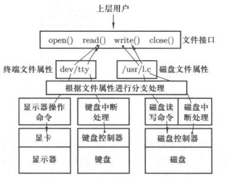

# 设备驱动

计算机如何让外设工作起来。每个外设都有个对应的控制器，比如说显示器对应的显卡，磁盘对应的磁盘控制器，键盘对应的也有，虽然不是很明显。

给这种卡上的寄存器里写内容，大概就是这么个思路。然后这个卡或者控制器内部会根据寄存器内容进行处理。一定程度上讲，这些外设和CPU是独立的，CPU下达命令后就干其他事情去了，外设执行完以后回来个中断。

最终体现在指令上，都是`OUT 80H, AL`这种形式。

这个指令就能让外设使用起来，再包裹上其他代码，让外设更简单的使用。然后等外设工作完事以后进行中断处理。

驱动学完以后最终要理解三个事情：
- OUT指令
- 中断处理
- 文件试图


文件视图是对外设的一种高度抽象，统一的结构，屏蔽了寄存器地址、内容的格式和语义。这也是计算机里另一个很重要的视图——文件视图。

上面这三件事情做好了，再开发设备驱动的时候思路就非常清晰了。

一个实际的例子，

```c
int fd = open("/dev/xxx");
for(int i=0; i<10; i++)
{
    write(fd, i, sizeof(int));
}

close(fd);
```

不论什么设备，都是open, read, write, close，这是操作系统为用户提供的统一接口。

不同的设备对应不同的设备文件(/dev/xxx)，根据设备文件找到控制器的地址、内容格式等。

<figure>
    
    <figcaption>外设文件视图</figcaption>
</figure>


