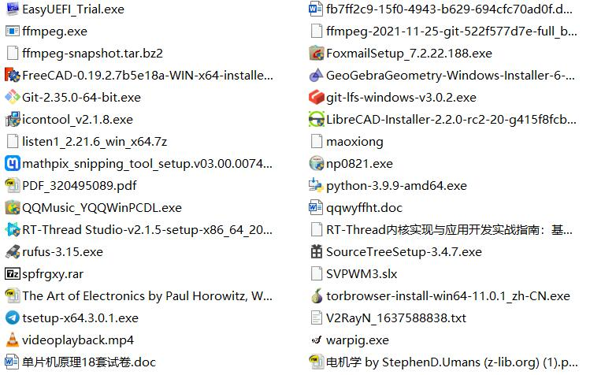
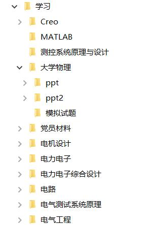
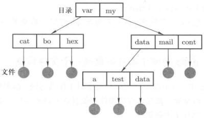
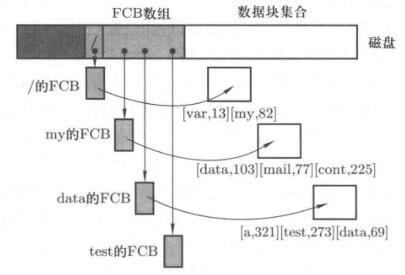
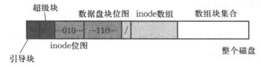

# 生磁盘到文件

## 第三层抽象：文件

让普通用户使用raw disk，不合适。引入跟高一层次的抽象概念：文件。

用户眼里的文件时字符序列，字符流。磁盘上的文件是一堆盘块接在一起。

文件的核心就是建立字符流到盘块集和的映射关系。

比如说test.c中的第200-212字符删除掉。这些字符对应盘块号789，再盘块里操作好以后，用户看这个test还是一段连续的字符流。

这就是设计这个映射的问题。一个扇区512字节，这个是有的，一个盘块如果两个扇区，那么就是1kB。

文件存放的时候，有了FCB数据结构，和TCB类似。记录了信息

| 文件名 | 起始块 | 块数  |
| :----: | :----: | :---: |
| test.c |   6    |   3   |

有了映射以后，操作系统把字符流变换成盘块号，接着上面生磁盘的内容，第三层抽象就出来了。

这是第一种方式。适合读写。速度还挺快，因为是连续的，属于是数组结构了。

如果动态增长的话，这种方式就有问题，数组删除一个，后面还要跟着移动。此外，如果后面有内容，这也不好处理了 。

也可以使用链式结构来存放，有点像链表了，实际上就是。这种方式也可以用字符的位置找到盘块号，得从头开始一路找下去。适合动态增长，但是读写要多耗点时间。


因此又提出**索引结构**，索引就是index。索引有点像目录。unix、linux文件系统都是基于索引结构改造的。

实际系统是多级索引。一般来说做到三级也够用了，小文件不需要顺序找了，直接找索引对应到盘块号。

中等大小的访问也不慢，多查一次表而已。


## 通过文件使用磁盘的实现


```c
/* fs/read_write.c */
int sys_write(int fd, const char *buf,int count)
{
    struct file *file = current->filp[fd];
    struct m_inode *inode = file->inode;

    if (S_ISREG(inode->i_mode))
        return file_write(inode, file, buf, count);
}
```
这个函数通过文件使用磁盘，入口参数并未出现块号。

file_write工作的过程就是找到盘块号，操作扇区的过程。

看代码之前如果能清楚过程，那么理清代码也不是很困难。通过代码理清思路是比较困难的。


## 目录和文件系统

不管是什么样的磁盘，最后给用户看起来的是一棵目录树。不管是在windows还是Linux上，把磁盘拔下来用到不同的地方都可以工作。

磁盘文件建立了字符流到盘块集合的映射。而文件系统是对整个磁盘的抽象。用户眼里的文件是一堆有组织的文件。

第四层抽象：文件系统


最开始所有都放在一层，一个大集合，就这种感觉

<figure>
    
    <figcaption>一种文件组织方式</figcaption>
</figure>

乱七八糟各种文件放在一起。比较乱。

后来划分一下，按照用户去划分。再后来引入目录树，分类存放就很合理了

<figure>
    
    <figcaption>树状文件管理</figcaption>
</figure>

可以将划分后的集合继续划分，树状结构扩展性好、表示清晰、符合日常使用计算机的模式。

实际上上面的图是目录，表示一个文件集和。

文件系统要做的就是维护一个数据结构使得用户看起来是个树状的结构。

来看看用户是怎么使用文件的

<figure>
    
    <figcaption>目录树</figcaption>
</figure>

用户使用`/my/data/a`来定位文件a，更准确的说，得到文件a的FCB。使用文件就是给出文件路径，通过路径获得文件的FCB，通过FCB获得盘块号，然后得到CHS直接定位到硬盘的扇区。这一整个映射就完成了。

这一整套做下来，磁盘就以一种符合现实情况的方式使用起来了。

那么现在的问题是如何根据路径去找FCB，实现目录就是通过数据结构来表达“目录包含了一些文件”。文件的基本信息存放在数据结构FCB中，所以最容易想到的目录存储结构是把目录下所有文件的FCB并列放到磁盘上。

my目录下存放文件夹的FCB，因此需要全部读进内存，和字符串进行比对，实际上匹配只是个字符串，不需要读入整个FCB，因此需要一个更有效率的方式。

<figure>
    
    <figcaption>磁盘结构</figcaption>
</figure>

`/`的FCB放在放在FCB数组的第一项，这样拔插后还能找到。

此外还需要盘块位图记录读写情况，inode位图。再前面还需要超级快和引导块，引导扇区。

引导块的大小是固定的，超级块一旦都进来就能获得位图信息。得到根目录信息，后面的东西就全能进来了。

所以需要将磁盘格式化成这个样子。

超级块记录了两个位图有多大。

<figure>
    
    <figcaption>磁盘数据结构</figcaption>
</figure>

