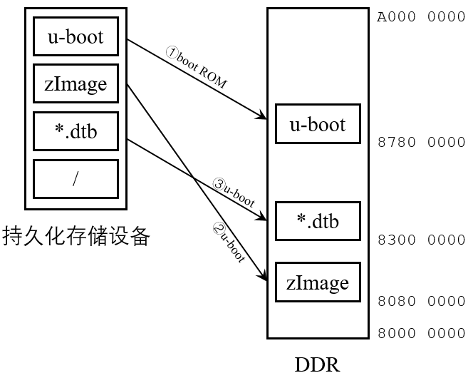

# 系统镜像构建

这部分的内容
- 一个能用的 linux 系统需要什么东西？
- bootlader 
- kernel 和 device tree
- root filesystem

## 嵌入式 linux 的构成

下面列出的这些是嵌入式 linux 的主要组件

<figure>
    
    <figcaption>嵌入式 linux 体系结构</figcaption>
</figure>

包含
- 引导加载器
- linux kernel
- C 运行时库
- 系统共享库
- 根文件系统

## 系统启动流程(imx6ull)

芯片本身有 96KB ROM 和 128KB RAM，开发板上外挂了 8GB eMMC 和 512MB DDR。

芯片 ROM 里为 NXP 的 boot ROM，根据硬件数码开关的值选择刚通电时必要的动作。再完成复位的，CPU 去 `0000 0000` 拿指令，这里是内部 ROM 的起始地址。也即这里的代码是 XIP 执行的，此芯片的内部 ROM 是 Nor Flash。

boot ROM 里的代码要根据拨码开关的配置将持久化存储设备里更大的代码搬到 DDR 中。这部分并不需要太多代码上的东西需要关注，对使用者来说，就是拨开关的事情。

<figure>
    
    <figcaption>启动流程</figcaption>
</figure>

u-boot 开始运行后，后面的启动过程由 uboot 完成。

u-boot 将内核镜像 zImage 和 设备树二进制文件 .dtb 加载到 DDR 的指定位置，并给 kernel 一些参数，然后就直接跳转到内核的启动地址开始执行了。

kernel 还要执行各种初始化，如启动 MMU 等，在 `arch/arm/kernel/head.s` 中完成，最后执行 `init/main.c` 中的 `start_kernel()` 函数。

这里会根据 u-boot 给的参数挂载根文件系统，然后执行根文件系统里的第一个用户进程 `init`

## bootloader

在 linux 启动前，需要一小段代码来初始化系统。这段代码与所用机器设备有很大的相关性。linux 对 bootloader 的要求很低。最低要求：
- 配置好 DDR
- 在正确的内存地址加载内核映像(zImage)和设备树(*.dtb)
- (非必须)在正确的内存地址加载内存磁盘设备(initrd)
- 设置内核的启动参数(bootargs)

通常，引导加载器会在启动内核前初始化一个串口输出调试信息。现在 u-boot 几乎已经成了 arm linux 的标准引导加载器。

uboot 体积小，功能丰富，启动快。最终用户对 uboot 运行并不感兴趣，甚至感觉不到 uboot 的存在。用户更希望程序在开机后尽快运行，因此 **uboot 里只对必要的硬件做初始化**就行。也就是说，如果 uboot 必须要通过网络加载 linux kernel，不得已才去初始化网卡。除非 uboot 要从磁盘或者 USB 设备中加载文件，否则不要初始化任何磁盘或 USB设备。

uboot 可以调试，他的一个重要功能是在启动阶段把信息输出到控制台(通常是一个串口，因此 uboot 需要初始化一个串口)

## linux kernel

linux 内核是 linux 系统的底层软件。它负责管理硬件，运行用户态软件，并且负责系统的整体安全性和完整性。

系统调用是应用程序和Linux内核之间的基本接口，也是用户态应用程序与内核交互的唯一途径。换句话说，它是用户态和内核态之间的桥梁。严格意义来说，用户态和内核态的根本区别是，用户态应用程序不能随意访问内核态资源，从而确保了系统的安全稳定。系统调用提升了用户进程的权限。

C 运行时库会把系统调用封装的更加易用。在这些封装函数中，有一些函数只是比系统调用函数稍微增加了些代码（仅仅进行参数检查和参数设置），而另一些函数则添加了额外的一些功能。如纯计算的数学库。

## root filesystem

根文件系统是所有文件（包括设备节点）存储的地方，这些文件以一定的文件层次结构组织在一起。通常根文件系统挂载到“/”。根文件系统包含所有的二进制文件、应用程序和数据。

根文件系统中文件夹的结构由FHS（文件系统结构标准）定义。FHS定义了很多文件类型和文件夹的名字、路径和权限。这样可以确保不同Linux发行版本的兼容性，同时允许应用程序做出预设：到哪里可以找到特定的系统文件和配置。

