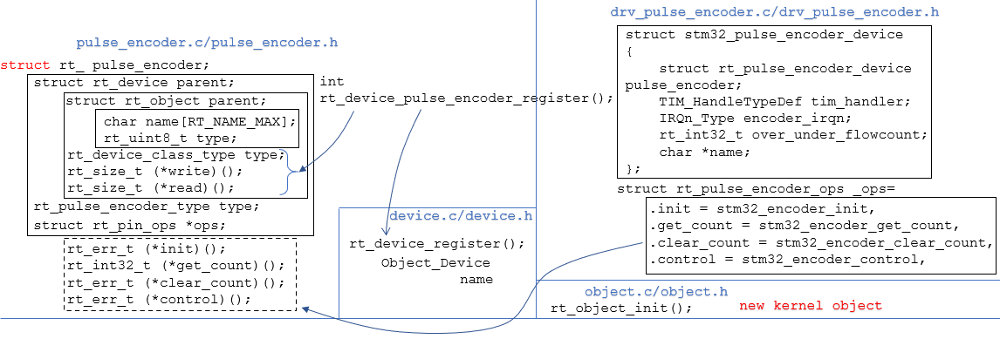

# encoder 驱动

这是个典型的 device 驱动，和 pin 不一样，没有专用的接口。而且对于芯片外设的初始化，也有一套标准的数据接口和初始化方法，很有参考意义。


<figure>
    
</figure>

对于 STM32 的 encoder，继承了encoder类。

可以对比参考 NXP i.mx rt 芯片的 encoder 设备结构体


## stm32 与 nxp i.mx rt 的 encoder 子类

```c
struct stm32_pulse_encoder_device
{
    struct rt_pulse_encoder_device pulse_encoder;
    TIM_HandleTypeDef tim_handler;
    IRQn_Type encoder_irqn;
    rt_int32_t over_under_flowcount;
    char *name;
};
```

```c
struct imxrt_pulse_encoder_device
{
    struct rt_pulse_encoder_device pulse_encoder;
    ENC_Type *base;
    char *name;
};
```


