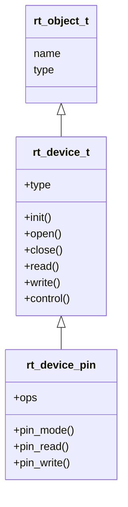

# PIN 驱动分析


## 派生关系



**内核对象**的数据结构：
```c
// rtdef.h
struct rt_object
{
    char name [RT_NAME_MAX]; /* 内核对象名 */
    rt_uint8_t type;         /* 内核对象类型 */
    rt_uint8_t flag;         /**< flag of kernel object */
};
```

**设备**的数据结构：
```c
typedef struct rt_device *rt_device_t;

struct rt_device
{
    struct rt_object          parent;    /**< inherit from rt_object */
    enum rt_device_class_type type;      /**< 设备的类型 */
    rt_uint16_t               flag;      /**< device flag */
    rt_uint16_t               open_flag; /**< device open flag */
    rt_uint8_t                ref_count; /**< 设备打开的次数 */
    rt_uint8_t                device_id; /**< 0 - 255 */

    /* device call back */
    rt_err_t (*rx_indicate)(rt_device_t dev, rt_size_t size);
    rt_err_t (*tx_complete)(rt_device_t dev, void *buffer);

    /* common device interface */
    rt_err_t  (*init)   (rt_device_t dev);
    rt_err_t  (*open)   (rt_device_t dev, rt_uint16_t oflag);
    rt_err_t  (*close)  (rt_device_t dev);
    rt_size_t (*read)   (rt_device_t dev, rt_off_t pos, void *buffer, rt_size_t size);
    rt_size_t (*write)  (rt_device_t dev, rt_off_t pos, const void *buffer, rt_size_t size);
    rt_err_t  (*control)(rt_device_t dev, int cmd, void *args);

    void                     *user_data;                /**< device private data */
};
```

**PIN 设备**的数据结构：
```c
// pin.h
struct rt_device_pin
{
    struct rt_device parent;
    const struct rt_pin_ops *ops;
};

struct rt_pin_ops
{
    void (*pin_mode)(struct rt_device *device, rt_base_t pin, rt_base_t mode);
    void (*pin_write)(struct rt_device *device, rt_base_t pin, rt_base_t value);
    int (*pin_read)(struct rt_device *device, rt_base_t pin);

    rt_base_t (*pin_get)(const char *name);
};
```

注册的本质：初始化结构体里面的值。

## pin 驱动框架层

设备驱动的实现

<figure>
    
</figure>

pin 内的代码为抽象驱动，对接 device 框架，实现 device 相关的操作。

框架层的 register 函数处理一部分，调用 device_register 再处理一部分，然后调用 object_init 处理一部分。

分层设计，每层处理一些东西，然后交给下一层去接着处理。一层一层向上抽象。

什么是抽象？

程序里的抽象，类似最大公约数。

比如 drv_gpio 是具体驱动，是真正实现硬件操作的地方。

可以对比 stm32 芯片和 nxp i.mx rt 的芯片驱动。


## IO 设备管理接口访问设备

使用标准接口来操作 pin。

```c
int main(void)
{
    struct rt_device_pin_status pin_control;
    pin_control.pin = GET_PIN(F, 14);
    
    struct rt_device_pin_mode pin_mode;
    pin_mode.pin  = GET_PIN(F, 14);
    pin_mode.mode = PIN_MODE_OUTPUT;

    rt_device_t pin_dev = rt_device_find("pin");
    
    rt_device_control(pin_dev,RT_NULL, &pin_mode);
    
    rt_device_open(pin_dev, RT_DEVICE_FLAG_RDWR);
    
    while(1)
    {
        pin_control.status = PIN_LOW;
        rt_device_write(pin_dev, 0, &pin_control, sizeof(struct rt_device_pin_status));
        
        rt_thread_mdelay(200);
        
        pin_control.status = PIN_HIGH;
        rt_device_write(pin_dev, 0, &pin_control, sizeof(struct rt_device_pin_status));  
        rt_thread_mdelay(800);
    }
}
```

单单从这段代码来看，好像使用了操作系统的驱动框架，反而比逻辑 HAL 库要复杂。

所以，对 pin 设备，在驱动框架层做了更简单的封装

```c
void rt_pin_mode(rt_base_t pin, rt_base_t mode)
{
    _hw_pin.ops->pin_mode(&_hw_pin.parent, pin, mode);
}

void rt_pin_write(rt_base_t pin, rt_base_t value)
{
    _hw_pin.ops->pin_write(&_hw_pin.parent, pin, value);
}

int rt_pin_read(rt_base_t pin)
{
    return _hw_pin.ops->pin_read(&_hw_pin.parent, pin);
}
```

## stm32 与 nxp i.mx rt 驱动对比


