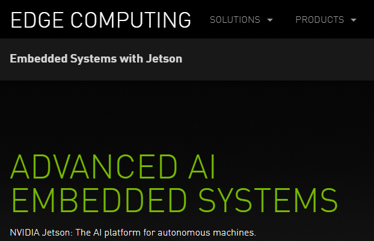
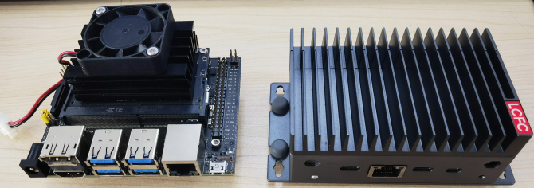
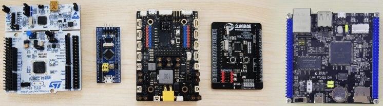

/red)

嵌入式系统学习。

[如何学习嵌入式系统？ - 知乎](https://www.zhihu.com/question/19688487/answer/32217959)

这个回答下面还有个回答：

如果是学计算机的，那么学嵌入式不会有门槛。

如果不是学计算机的，那么忘了嵌入式，先学习计算机。

## 嵌入式系统

（2022.6 写的，浅薄理解，边学边更新）

嵌入式的领域过于宽广，洗衣机控制系统、手机、甚至树莓派都可以叫做嵌入式平台，Nvidia 把自己推出的小型 AI 计算机也叫做嵌入式边缘计算平台，所以我用一句话总结嵌入式：除了日常使用的通用电脑之外其他的可以跑代码的、有 CPU 、需要写程序的计算设备。

<figure>
  
  <figcaption>
  NVIDIA 官网对 Jetson 的介绍
  </figcaption>
</figure>

<figure>
  
  <figcaption>
  Jetson NANO 开发套件，工控造型的nano
  </figcaption>
</figure>

除了这些比较贵的，像一台电脑可以运行 Linux 的嵌入式设备，也有结构简单，偏底层应用的芯片。

<figure>
  
  <figcaption>
  arm cortex-m 内核，ST、GD、NXP的芯片
  </figcaption>
</figure>

这些芯片的内核，或者叫 CPU 都是 ARM 公司设计的，通用 PC 一般来讲都是 x86 架构（Mac 上用的 M1 是个例外），这也是嵌入式系统的一个特征。

## 这个笔记的框架

- Cortex-M 内核芯片裸机开发
  - STM32F 系列芯片与 HAL 库
  - NXP i.MX RT 系列芯片
- LVGL 与 C 语言的 OOP 思想
- 基于 RTOS(rt-thread) 进行开发
- ARM 架构(计算机组成原理)
- RTOS 原理与 rt-thread 实现
- 数字逻辑(FPGA)与 RISC-V 架构 

再往上还有嵌入式 Linux，不过这部分也可以归入到计算机技术里面，自此往后，又要开始学习计算机了，有了对底层硬件以及小型计算机系统的理解，再去重新学习计算机技术也会变得更容易。

## 一些想法

- 2022/10/18
  - 嵌入式软件。程序设计。最近在学抽象数学，数学的发展在一步步抽象，在学习矩阵分析的时候，会发现微积分里的运算、函数，线性代数中的欧几里得空间居然都变成了矩阵分析里的实例，矩阵分析像是一个类，各种东西抽象出一个通用的思想，共性的东西。程序设计也是在一步步从底层向上抽象，这两种不同的东西是否有一些联系呢？思维上相同的东西。比如C++的类和对象，线性代数本身像是一个抽象的类，实例化后有欧几里得空间、状态空间，各种空间。甚至矩阵分析里的各种运算符，要格外的关注其含义，即运算的空间，+的含义是不同的(抽象空间的+或数域的+)，这一点C++有运算符重载这个特性，居然可以直接去实现出来矩阵分析里的一些思想，抽象类相加的含义。
