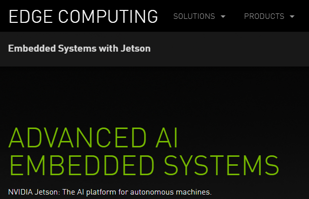
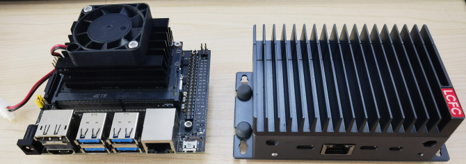
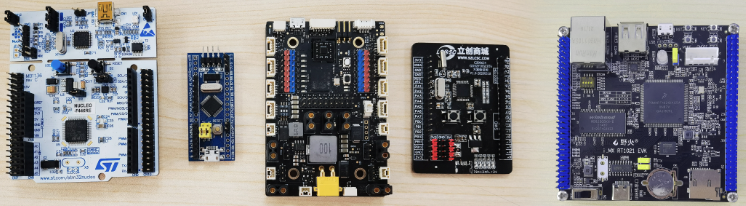

# 计算机与嵌入式系统


---

*感谢访问我的学习笔记。*

*如果是在GitHub看到这些内容，那么可以前往[独立网页](https://embedded.xym.work/)获得更好的浏览体验。*

*如果觉得我的笔记内容对您有帮助，那我会感到非常开心。*

最重要的**如果我在内容上有理解错误，或者表达不严谨，还请不吝指正。**

我的联系方式(微信/QQ)请查看[个人主页](https://xym.work)，欢迎朋友们互相交流、一起学习。

---

我是电气自动化专业出身，最早接触编程相关东西的是 51 单片机，但是这个笔记的标题为<计算机与嵌入式开发>，来自于知乎[如何学习嵌入式系统？](https://www.zhihu.com/question/19688487/answer/32217959)下的一个回答：

**如果是学计算机的，那么学嵌入式不会有门槛。如果不是学计算机的，那么忘了嵌入式，先学习计算机。**

出于对嵌入式的兴趣，以及想弄清楚一块芯片工作原理的好奇心，开始一些计算机课程的学习...


- [ ] 1-1.编程语言、编译过程、数据结构与算法基础
- [ ] 1-2.计算机系统基础 CSAPP
- [ ] 1-3.数字电路、计算机组成原理、steam：图灵完备
- [ ] 1-4.计算机网络
- [ ] 1-5.操作系统原理
- [ ] 2-1.裸机开发，arm cortex-m cortex-a7
  - [ ] 通信接口与通信协议
  - [ ] arm 芯片开发，基于 IDE、gcc 裸机开发
- [ ] 2-2.中等规模系统开发，编程思维(C 语言 OOP 思想)
  - [ ] 裸机 LVGL 图形库
  - [ ] 裸机开发的软件框架(系统架构)：状态机、订阅发布、事件触发、简单的任务调度
  - [ ] 基于 rtos 开发 (rt-thread 和 freeRTOS)
- [ ] 2-3.ARMv7-M 架构与 RTOS 原理
  - [ ] Cortex-M3 内核，指令集、中断、体系结构等
  - [ ] rt-thread 内核、驱动
- [ ] 3-1.linux 应用开发(系统编程+GUI)
  - [ ] ubuntu 相关、linux 使用、
  - [ ] shell 编程、vim、gcc、makefile
  - [ ] 网络编程、多线程
- [ ] 3-2.linux 镜像构建
  - [ ] linux 系统构建：bootloader、kernel、device tree、root filesystem
- [ ] 3-3.linux 驱动开发
  - [ ] 字符设备驱动
  - [ ] 设备树


## 计算机与嵌入式系统


2026/02/18

两种视角，一个是从系统的角度。

另一个从知识分类的角度，按照书去分。同一套内容，两个目录。


2026/02/17

以前的笔记框架思路：

好像也没有什么思路，按类别，计算机课程，然后嵌入式实践，裸机、linux，mcu + RTOS，soc+linux，

学科分类，大学课程的感觉。

GPT 辅助整理和学习，去形成一个叙事框架。这个笔记的目标：
- 提升抽象能力
- 形成可复用的系统思维框架

如果是思路上的事情，那笔记结构不随技术变化而变化，并且允许大量工程实践存在，这就需要反复回到抽象层去考虑问题。

这部分的知识主线，计算机系统，嵌入式系统，

五个问题+具体实践。

00_总论：系统构造的五个问题

01_计算是什么？
02_控制如何建立？
03_资源如何分配？
04_系统如何连接？
05_复杂性如何被管理？


一、计算的本质（Foundations of Computation）

计算与抽象（为什么计算可以被构造），计算是什么？

理论主轴：计算的形式结构
工程主轴：语言与程序的实现

01_什么是计算
02_状态机与自动机
03_图灵机与可计算性
04_抽象与分层
05_复杂性与约束

工程对应：
- C 语言
- 汇编
- ELF
- 静态链接
- 动态链接

数字电路，状态机，图灵机，编程语言，编译与链接，程序的表示

理解状态与转换。

计算是什么？状态+转换+可计算性

数字逻辑与计算机组成，数字电路，组合逻辑与时序逻辑，存储器结构，ALU，物理状态实现。

自动机理论，有限自动机，图灵机。DFA,NFA，可计算性，复杂性基础。形式计算模型。

编译相关，编译原理，词法、语法、语义，中间表示、代码生成。程序是如何被转换的。

程序设计语言原理PL，静态类型，动态类型，函数式，命令式，抽象机制，作用域。


计算机组成原理。书 《计算机组成与设计（Patterson & Hennessy）》，《计算机系统要素（Nand2Tetris）》

看数字逻辑、组合逻辑与时序逻辑、CPU 设计、指令集结构、控制单元

落点，状态如何被存储？指令如何改变状态？程序如何驱动状态变化？

CSAPP，关注 

第2章：信息的表示

第3章：程序的机器级表示

第7章：链接

第8章：异常控制流

落点，C 程序如何变成机器指令？栈帧是什么？控制流如何被打断？

自动机与可计算性，《Introduction to Automata Theory》（Hopcroft）

重点，有限状态机，图灵机，可计算性。

落点：状态机是所有系统的抽象原型。图灵完备意味着什么？


二、单机系统的构造（Single Machine Systems）

（计算如何运行），控制如何建立？

理论主轴：抽象层次
工程主轴：启动链与硬件接口

01_数字电路与状态
02_CPU与指令模型
03_程序与编译
04_内存与地址空间
05_控制权转移（启动链）

CSAPP 组成原理 uboot 链接加载

工程对应：
- 8086
- ARMv7-M
- U-Boot
- Linux 启动
- Device Tree

CPU 执行，中断，启动链，uboot，内核加载，设备初始化。

控制权如何在层级间转移。

计算机组成与体系结构，流水线、缓存、中断、指令执行

操作系统，中断、系统调用、上下文切换、启动过程

嵌入式系统原理，启动链、bootloader、裸机调度、外设控制

计算机体系结构。重点 指令执行周期，中断机制，特权级别，MMU

落点，中断是“控制权打断机制”，特权级是系统边界

操作系统，《Operating Systems: Three Easy Pieces》

重点。虚拟化（进程），系统调用，Trap 机制

落点，用户态如何切换到内核态？系统调用本质是什么？

linux 内核相关，启动流程，init 进程

三、资源与调度（Resource Management）

（系统如何管理复杂性）

理论主轴：资源分配与隔离
工程主轴：OS / RTOS

01_进程与线程
02_调度模型
03_并发与同步
04_虚拟化
05_设备与驱动模型
06_持久化

操作系统是资源系统

工程对应：
- RT-Thread
- Linux 内核
- 驱动开发
- 文件系统

操作系统，OSTEP 和 《Modern Operating Systems》

进程线程，调度同步，死锁，内存管理。

落点：调度算法的设计思想，虚拟内存的本质，同步原语的抽象意义

文件系统，重点，一致性保证，落点：持久化是一种跨时间的资源管理，


四、系统之间（Distributed Systems）

（从单机到网络）

理论主轴：系统边界
工程主轴：协议与通信框架

01_网络模型
02_消息与协议
03_一致性问题
04_服务抽象
05_系统边界
06_可扩展性与演进

工程对应：
- socket
- MQTT
- DDS
- 视频流
- 多端拉流实验

边界扩展时如何保持秩序。

系统边界跨越机器时该怎么办？

《Computer Networking: A Top-Down Approach》

分层模型，TCP/IP 拥塞控制，可靠传输。

分层思想，端到端原则

分布式系统，《Distributed Systems (Tanenbaum)》《Designing Data-Intensive Applications》

一致性模型。落点：延迟是不可消除的，一致性需要代价。


第五卷：系统架构方法论（Architectural Thinking）

理论主轴：系统设计原则
工程主轴：实践反思

01_分层思想
02_能力抽象
03_状态与事件
04_系统边界设计
05_演进式架构
06_工程与理论的关系
07_架构失败案例分析

防止系统失控。

软件架构，软件工程。


从逻辑电路出发，经由计算机组成、操作系统、嵌入式系统与 Linux 内核，逐步理解计算如何在不同抽象层级上被实现与管理。


一个层次图
```
物理层（电路）
↓
硬件结构（CPU/存储）
↓
指令与程序
↓
操作系统抽象
↓
进程/线程
↓
分布式通信
↓
系统构建实践
```

还需要一个抽象总结层，跨系统对比思考


以前大概是按照学习路径整理的


以前的思路，c cpp ，数据结构，刷 leetcode的一些解题思路，以及实践课程The Missing Semester of Your CS Education，这些内容目前我是放在1_program_basic里的，以前的想法是这些事构建大系统的最基本的东西和技能，一些语言的语法，最基本的数据，操作数的方法，以及计算机世界的工具。

基本的编程技能。这些基础技能在系统里会归为哪一类。

C/C++ ，表达计算的语言工具。状态表示，内存模型，控制流。

属于计算是什么，语言是状态转换规则的描述方式。

数据结构是状态的组织方式，解决状态如何被高效表达。

对于 leetcode，算是在训练算法思维，对状态建模，不直接属于系统架构，这算是对人的计算模型的训练。大概算数，算法与问题建模的部分。


the missing semester，并不是编程基础。shell git make 环境管理，属于工程环境抽象，放在控制如何建立更合适。

make 是构建控制，shell 是控制流程，调试是控制观察。


(2025.8)
汽车电子行业，汽车 MCU 嵌入式开发，


(2024.8)

学习了一段时间 linux 驱动开发后，重新回头来看 MCU 和 RTOS。

rtthread 上的驱动设计应该是参考了 linux 驱动的，以及 menuconfig 、项目构建之类等工具。了解一些 linux 驱动回头看 rtthread 的源码，能看到更多的东西。比如设备注册，在 linux 驱动里，我只是用了注册函数，但是在 rtthread 里可以直接跳转去看注册函数干了什么事情(linux 也可以跳进 kernel 看，但是代码量太大了)，并且 rtthread 足够简单，每个层次的注册函数源码都很好读。注册在做的事情：填充设备对应结构体的参数，即完善描述设备的结构体，将足够的信息传递给内核，以便用户使用。在软件架构上，一层层抽象上去，每一层都有自己的注册函数，需要向上一层注册。这个顺序正好和继承是反着来的。比如内核对象派生了设备类，设备类派生了 PIN 类，然后驱动工程师可以自己基于 PIN 类派生一个 stm_pin 的类，初始化时，stm_pin 向 PIN 层注册，PIN 层中向设备对象层注册，设备对象层向内核对象层注册。

此外 liunx 开发都是直接用交叉编译工具，使用 makefile 来管理项目，MCU 开发大多都使用 IDE 如 Keil IAR。但是 STM32 也可以用 gcc 来开发，在这个过程中，控制代码的每一个细节，如第一行代码(第一条指令)所在的位置，自己填充中断向量表，并且理解内存映射 IO 如何对着 datesheet 来使用芯片，了解 C 语言的一些硬件特性(比如 volatile)，熟悉编译过程(i++ 延时的 O2 编译优化)，。做这个事情我觉得是有必要的，熟悉这一套流程，可以做到在一块基于 arm 设计的全新芯片上只对着芯片手册使用芯片。

当然主要还是基于实际出发，linux 开发 uboot kernel driver 都是用交叉编译工具、makefile 对着手册来，但是这些项目这么多年已经很大了，想搞懂每个细节对初学者很不友好。所以对我来说，不妨用一个我自己熟悉的芯片(stm32)、他足够简单、功能足够完整，能让我一个人完成整套流程又不至于花非常大的精力。所以当我完整的理解了这个小系统的工作原理，我在调试更复杂的芯片的时候会更有信心，虽然他更大更复杂，但是芯片、或者说计算机系统在原理上是相通的，工具上也是通用的，调试复杂芯片也会有种似曾相识的感觉，面对新的芯片也会很自信。

学习一个新东西，先保持好奇心学一个小的、简单的、容易理解的、原理上又相通的，然后再去看大的、复杂的、有挑战性的、面向实际应用的东西，在遇到问题时，也会有一个原理上的指导方向，这是我的学习方法。

(2023.7)

嵌入式的几个阶段

裸机，直接使用芯片，猛糙快，非常靠近寄存器，不会太细致的区分层次。

项目大到一定程度以后，出现了代码维护上的困难，需要编码规范或者一些编程思想。

为了更容易处理更多的事情，开始基于 RTOS 去实现一些东西。

出于性能的考虑(更快的芯片)，或者安全性(内存虚拟化)、通用性(POSIX、各种库)的考虑，或者更大的项目的分工(驱动、应用、算法)，需要一套更成熟、更标准化、提供更多基础设施的框架：linux。

时间或者性能上更严格的要求，专用的处理信息的芯片：fpga - 总线 - arm

(2023.4)

MCU 裸机开发、LVGL 以及基于 rt-thread 开发是在面向应用，现称为一个东西的熟练使用者，在去看背后的原理以及实现。个人觉得从刚开始接触 MCU 比如 STM32，到能做出一个简单的电子系统，这个过程有个两三个月足够了，基于 ST 库开发，不同的外设的操作方式实际上是类似的，可能学习GPIO的时候，会跟着教程去细致的看外设内部的原理图，但是一旦用代码操作起来，都是模式化的东西。在能自己独立设计出一个不是那么小的电子系统后，我认为应该再往上走一个层次，去注意软件工程，或者说编码思想方面的东西了，先不着急去做更大的系统。

搞MCU大多是学电气电子或者自动化的同学，写代码很多时候都是猛糙快，讲究个能用就行，如果在熟练使用MCU后停留在这个阶段，对职业发展是不利的。因此我觉得在觉得自己玩熟了MCU，了解了大多数外设后，可以尝试去玩玩一些与外设耦合不那么紧密的代码，比如 LVGL，显示框架本身是硬件无关的，再比如rtthread本身也是，这些大一些的 C 语言项目都是有一套自己的思想以及设计方法在里面的，而且这些东西不仅仅适用于 MCU 平台，举个例子，机器人仿真用的 webots，可以使用 C 语言开发算法，里面的程序表达

```c
WbDeviceTag left_front_motor = wb_robot_get_device("left_front_motor");
wb_motor_set_position(left_front_motor,INFINITY);
wb_motor_set_velocity(left_front_motor,0);
```

对比 lvgl 里的程序表达

```c
/*Create a screen*/
lv_obj_t * scr = lv_obj_create(NULL, NULL);
lv_scr_load(scr);          /*Load the screen*/

/*Create 2 buttons*/
lv_obj_t * btn1 = lv_btn_create(scr, NULL);         /*Create a button on the screen*/
lv_btn_set_fit(btn1, true, true);                   /*Enable automatically setting the size according to content*/
lv_obj_set_pos(btn1, 60, 40);              	   /*Set the position of the button*/

lv_obj_t * btn2 = lv_btn_create(scr, btn1);         /*Copy the first button*/
lv_obj_set_pos(btn2, 180, 80);                    /*Set the position of the button*/

/*Add labels to the buttons*/
lv_obj_t * label1 = lv_label_create(btn1, NULL);	/*Create a label on the first button*/
lv_label_set_text(label1, "Button 1");          	/*Set the text of the label*/

lv_obj_t * label2 = lv_label_create(btn2, NULL);  	/*Create a label on the second button*/
lv_label_set_text(label2, "Button 2");            	/*Set the text of the label*/

/*Delete the second label*/
lv_obj_del(label2);
```

还有 rtthread 里线程创建的

```c
/* 线程示例 */
int thread_sample(void)
{
    /* 创建线程 1，名称是 thread1，入口是 thread1_entry*/
    static rt_thread_t tid1 = rt_thread_create("thread1",
                            thread1_entry, RT_NULL,
                            THREAD_STACK_SIZE,
                            THREAD_PRIORITY, THREAD_TIMESLICE);

    /* 如果获得线程控制块，启动这个线程 */
    if (tid1 != RT_NULL)
        rt_thread_startup(tid1);

    return 0;
}

/* 导出到 msh 命令列表中 */
MSH_CMD_EXPORT(thread_sample, thread sample);
```

甚至 Linux 环境下 socket 编程

```c
int main(){
    //创建套接字
    int serv_sock = socket(AF_INET, SOCK_STREAM, IPPROTO_TCP);
    //将套接字和IP、端口绑定
    struct sockaddr_in serv_addr;
    memset(&serv_addr, 0, sizeof(serv_addr));  //每个字节都用0填充
    serv_addr.sin_family = AF_INET;  //使用IPv4地址
    serv_addr.sin_addr.s_addr = inet_addr("127.0.0.1");  //具体的IP地址
    serv_addr.sin_port = htons(1234);  //端口
    bind(serv_sock, (struct sockaddr*)&serv_addr, sizeof(serv_addr));
    //进入监听状态，等待用户发起请求
    listen(serv_sock, 20);
    //接收客户端请求
    struct sockaddr_in clnt_addr;
    socklen_t clnt_addr_size = sizeof(clnt_addr);
    int clnt_sock = accept(serv_sock, (struct sockaddr*)&clnt_addr, &clnt_addr_size);
    //向客户端发送数据
    char str[] = "http://c.biancheng.net/socket/";
    write(clnt_sock, str, sizeof(str));
   
    //关闭套接字
    close(clnt_sock);
    close(serv_sock);
    return 0;
}
```
这些代码都是类似的，都是定义一个东西等于一个函数的返回值，然后用不同方法操作这个东西。HAL 库里有些东西也是这样，但是 HAL 库还是和STM32硬件本身耦合的比较紧。

在学习使用 LVGL 时会熟悉 C 的一些编程方法和思想，比如 C 中继承，这种思想在 gui 上是可视化的，很容易理解。如果自己写过网站的话，css 样式控制代码里更是如此。在此基础上去使用 rt-thread 的成本就比较低了，只需要稍稍理解一下线程的概念，就能轻松的让多任务跑起来，而且手册中的 OOP 思想也因为有 lgvl 的对比理解，不那么抽象了。

熟练使用 rtos 大约也要花个几个月的时间，这时候应该可以很容易的实现出更大规模的系统。

熟练的基于 rtos 开发后，一方面可以去试着基于 linux 去开发对运算要求更高的应用，也可以去看看 linux 驱动开发，也可以在 linux 上玩玩，有了前面的基础，玩linux 也不困难。同时也可以去看看 rtthread 的实现原理，这是一个中等规模的 C 语言项目，同时也能学习操作系统的一些知识，rtt 里面好多东西在 linux 里都能找到影子 比如 menuconfig 工具，自动初始化机制的宏定义，甚至驱动框架都有借鉴的地方。


(2022.6)

嵌入式的领域过于宽广，洗衣机控制系统、手机、甚至树莓派都可以叫做嵌入式平台，Nvidia 把自己推出的小型 AI 计算机也叫做嵌入式边缘计算平台，所以我用一句话总结嵌入式：除了日常使用的通用电脑之外其他的可以跑代码的、有 CPU 、需要写程序的计算设备。

<figure>
  
  <figcaption>
  NVIDIA 官网对 Jetson 的介绍
  </figcaption>
</figure>

<figure>
  
  <figcaption>
  Jetson NANO 开发套件，工控造型的nano
  </figcaption>
</figure>

除了这些比较贵的，像一台电脑可以运行 Linux 的嵌入式设备，也有结构简单，偏底层应用的芯片。

<figure>
  
  <figcaption>
  arm cortex-m 内核，ST、GD、NXP的芯片
  </figcaption>
</figure>

这些芯片的内核，或者叫 CPU 都是 ARM 公司设计的，通用 PC 一般来讲都是 x86 架构（Mac 上用的 M1 是个例外），这也是嵌入式系统的一个特征。


## 一些想法

- 2022/10/18
  - 嵌入式软件。程序设计。最近在学抽象数学，数学的发展在一步步抽象，在学习矩阵分析的时候，会发现微积分里的运算、函数，线性代数中的欧几里得空间居然都变成了矩阵分析里的实例，矩阵分析像是一个类，各种东西抽象出一个通用的思想，共性的东西。程序设计也是在一步步从底层向上抽象，这两种不同的东西是否有一些联系呢？思维上相同的东西。比如C++的类和对象，线性代数本身像是一个抽象的类，实例化后有欧几里得空间、状态空间，各种空间。甚至矩阵分析里的各种运算符，要格外的关注其含义，即运算的空间，+的含义是不同的(抽象空间的+或数域的+)，这一点C++有运算符重载这个特性，居然可以直接去实现出来矩阵分析里的一些思想，抽象类相加的含义。
