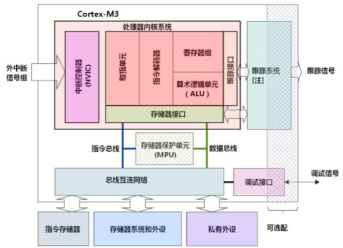

# Cortex-M3概览

## 介绍

Cortex-M3是一个32位处理器，采用了哈佛结构，有独立的指令总线和数据总线，取指和数据访问并行操作。因此CM3内部有好几条总线接口，但是指令和数据总线共享同一个存储器空间，可寻址空间仍然是4GB。

比较复杂的应用可能需要更多的存储系统功能，CM3提供一个可选的MPU，也可以使用外部cache，小端模式和大端模式都支持。

    

## 寄存器组

CM3处理器拥有寄存器R0-R15，其中R13最为堆栈指针SP，有两个，但是同一时刻只能看到一个。

