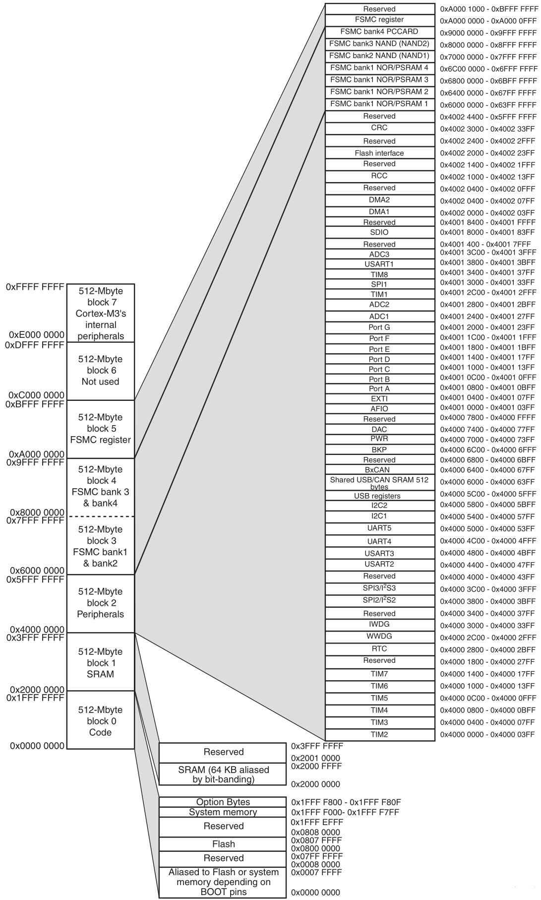

# 嵌入式

## 嵌入式基本介绍

除了PC的运算设备都可以认为是嵌入式。

- 无操作系统的裸机MCU项目，
- 运行RTOS的MCU项目
- 运行Linux/Android的MPU项目


- ARM是一家版单体公司，主要业务是设计RISC嵌入式处理器
- ARM是一类微处理器芯片的统称。ARM芯片
- ARM是技术，采用RISC的处理器体系结构

目前ARM的内核架构：
- A：设计于高性能的“开放应用平台”
- R：高端嵌入式系统
- M：用于深度嵌入的芯片

A系列可用于需要运行复杂应用程序的情况，去支持操作系统入Linux，并需要硬件MMU实现虚拟内存机制。

R系列要硬实时，并且高性能。

M系列适用于实时控制系统，低成本、低功耗、极速中断反应。


M系列还有细分：
- M0，低成本
- M3，低成本低功耗，较高运算性能和快速响应能力
- M4，在M3基础上，增加数字信号处理DSP指令集，
- M7，在M4基础上，加强性能，针对高端控制和大量数据处理的应用


STM32是ST公司基于ARM M系列内核设计的微控制器。

微控制器，Micro-Controller Unit，MCU，俗称单片机，一片上集成RAM和Flash

微处理器，Micro-Processor Unit，MPU，类似通用计算机的CPU，需要外加RAM、Flash、电源等

DSP，两个含义Digital Signal Processing，数字信号处理技术，Digital Signal Processer，数字信号处理芯片。

FPGA，现场可编程门阵列，Field-Programmable Gate Array，


## 最小系统

看原理图，原理图大多数都是常见元件。

STM32芯片的一个大概结构

<figure>
    
</figure>

F103的内核和调试系统都是由ARM设计的，剩下的都是由ST公司设计。

<figure>
    
    <figcaption>STM32F1xx系统架构</figcaption>
</figure>

ICode用于访问存储空间里指令的总线；DCode用于访问存储空间里数据的总线；System用于实质、数据调试；DMA总线用于内存与外设之间搬动数据；AHB system bus用于外设接口的数据传输。Bus matrix管理总线之间访问的优先级。

AHB又分为了APB1和APB2，两个总线挂了不同的外设，APB1总线最大时钟为36MHz，APB2总线最大时钟频率为72MHz。

## 存储结构

M3处理器采用存储器与IO统一编址的方式（存储器映像IO）。程序存储器、数据存储器、寄存器和输入输出端口被组织在同一个4GB的线性地址空间内。数据字节以小端格式存放在存储器中。

```note
小端模式：高址高位，低址低位
```

4GB地址空间分为8个块，每个块为512MB，ARM公司对每个地址块的功能做了一个大概的划分：

<figure>
    
    <figcaption>M3内核地址空间分配</figcaption>
</figure>

也就是说，MCU最大的片上RAM也就是512M，外设端口最多也就由512M个，片外RAM最多可以由1GB，片外外设端口最多有1G个。

根据ARM的大概划分，ST公司做了更具体地设计，在STM32数据手册里，可以看到Memory mapping：

<figure>
    
    <figcaption>STM32地址映射</figcaption>
</figure>

对于外设来说，MCU操作的是寄存器，或者说是读写寄存器地址。向某个地址读写数据就可以控制外设了。

对于寄存器，有**CPU内部寄存器**和**外设寄存器**。

CPU内部寄存器由ARM设计，用汇编语言直接操作，用于暂存中间运算结果，在M3编程手册里，有CPU编程模型：

<figure>
    
    <figcaption>M3内存寄存器</figcaption>
</figure>

外设寄存器就是端口。


## MCU开发模式

GPIOA外设在APB2总线上，这个总线又来自AHB系统总线。数字电路运行需要有时钟信号驱动，因此在操作GPIOA前，先要启动外设的时钟信号。

不同外设在使用前都要开启对应的时钟，这也是低功耗设计的一种方式。

复位和时钟控制(Reset and Clock Control, RCC)是个单独的模块，其控制方式也是访问RCC的寄存器（即端口）。

芯片的设计者把各种外设的端口地址写在了芯片手册里。

RCC的端口地址范围为`0x40021000-0x400213ff`，手册中的端口是按照偏移地址给出来的。按照手册按位搞好控制字，写入到端口地址，就完成了功能配置。

对于GPIOA，挂在APB2总线上，查找手册里的APB2外设时钟使能寄存器，偏移地址为`0x18`，可以看到bit2是控制时钟的。

把控制字`0x0000 0004`写入地址`0x40021000 + 0x18`就开启了GPIOA的时钟。

这时候再去看手册的GPIO，也需要配置好模式，配置好后读写对应寄存器就可以操作GPIO了。

基本思路很简单，就是开时钟-配置-操作。具体是要用程序来实现的。

### 汇编语言

正常做项目一般是不会大面积使用汇编的。太反人类了。在使用操作系统时，会有一些汇编语句完成任务切换的操作，但是这里还是要用汇编点个灯。

```armasm

	PRESERVE8
	THUMB

; Vector Table Mapped to Address 0 at Reset
	AREA    RESET, DATA, READONLY

__Vectors       DCD     0
	DCD     Reset_Handler              ; Reset Handler

	AREA    |.text|, CODE, READONLY
                
; Reset handler
Reset_Handler   PROC
				
	; ʹÄÜGPIOB 
	LDR R0, =(0x40021000 + 0x18)  ; RCC_APB2ENR
	LDR R1, [R0]
	ORR R1, R1, #(1<<3)
	STR R1, [R0]

	; ÉèÖÃGPIOB0ΪÊä³öÒý½Å
	LDR R0, =(0x40010C00 + 0)  ; GPIOB_CRL
	LDR R1, [R0]
	ORR R1, R1, #(1<<0)
	STR R1, [R0]

MainLoop
	; ÉèÖÃGPIIOB0Êä³ö¸ßµçƽ
	LDR R0, =(0x40010C00 + 0xc)  ; GPIOB_ODR
	LDR R1, [R0]
	ORR R1, R1, #(1<<0)
	STR R1, [R0]
	BL Delay

	; ÉèÖÃGPIIOB0Êä³öµÍµçƽ
	LDR R0, =(0x40010C00 + 0xc)  ; GPIOB_ODR
	LDR R1, [R0]
	BIC R1, R1, #(1<<0)
	STR R1, [R0]
	BL Delay
	B MainLoop

Delay
	LDR R0, =300000
DelayLoop
	SUBS R0, #1
	BNE DelayLoop
	BX LR
	NOP
	ENDP
	END
```

### C语言寄存器开发

C语言可以用指针操作存储器，因此可以用这个特性来操作寄存器。

```c
/* C语言操作寄存器 */
#define RCC_APB2ENR  (0x40021000 + 0x18)
#define GPIOB_BASE   (0x40010C00)
#define GPIOB_CRL    (GPIOB_BASE + 0)
#define GPIOB_ODR    (GPIOB_BASE + 0X0c)

void delay(volatile long i)
{
	while (i--);
}

int main(void)
{
	volatile unsigned int *pRccApb2Enr;
	volatile unsigned int *pGpiobCrl;
	volatile unsigned int *pGpiobOdr;
	
	pRccApb2Enr = (volatile unsigned int *)RCC_APB2ENR;
	pGpiobCrl   = (volatile unsigned int *)GPIOB_CRL;
	pGpiobOdr   = (volatile unsigned int *)GPIOB_ODR;
	
    *pGpiobCrl |= (1<<0);
	
	while (1)
	{
        *pGpiobOdr |= (1<<0);
		delay(1000000);
        *pGpiobOdr &= ~(1<<0);
		delay(1000000);
	}
}
```
用C语言操作寄存器可读性比汇编要好一些，但是还是要去查手册，这种方式移植性也差一点，换一个芯片就要大面积修改代码了。这种方式适用于任何芯片。

### C语言标准库

ST公司设计了一套标准外设库(Standard Peripherals Library)，写了许多接口。

```c
#include "main.h"
#include "stm32f10x.h"
#include "driver_led.h"

void delay(volatile long i)
{
	while (i--);
}

int main(void)
{    

    // 初始化LED
    LedGpioInit();
    
    // 点亮LED灯
		while(1)
		{
			GPIO_WriteBit(GPIOB, GPIO_Pin_0, Bit_SET);
			delay(1000000);
			GPIO_WriteBit(GPIOB, GPIO_Pin_0, Bit_RESET);
			delay(1000000);
		}
}
```

其中led驱动

```c
#include "driver_led.h"

/*
 *  函数名：void LedGpioInit(void)
 *  输入参数：无
 *  输出参数：无
 *  返回值：无
 *  函数作用：初始化LED的引脚，配置为推挽输出
*/
void LedGpioInit(void)
{
    // 定义GPIO的结构体变量
    GPIO_InitTypeDef GPIO_InitStructure;
    // 使能LED的GPIO对应的时钟
	RCC_APB2PeriphClockCmd(RCC_APB2Periph_GPIOB, ENABLE);

    GPIO_InitStructure.GPIO_Pin = GPIO_Pin_0;         // 选择LED的引脚
    GPIO_InitStructure.GPIO_Mode = GPIO_Mode_Out_PP;  // 设置为推挽输出模式
    GPIO_InitStructure.GPIO_Speed = GPIO_Speed_50MHz; // 引脚反转速度设置为快

    // 初始化引脚配置
	GPIO_Init(GPIOB, &GPIO_InitStructure);
}
```

可读性更好了，效率也很高，操作意图也明显了。但是移植性还是差了点，比如F1和F4的芯片，标准库区别还是挺大的。

### C语言HAL库

为了让移植性更好，ST公司推出了HAL库。标准库是最早的固件库，发布较早，教程也多，标准库是针对某一系列STM32芯片设计，没啥可移植性，现在基本上也不更新了。

HAL库是ST公司极力推荐的库，用来取代标准库，具有更高的抽象整合水平，API集中关注外设的公共函数功能，使得代码从一个系列移植到另一个系列。此外还有LL库(Low Layer)，底层库，更接近硬件，一般和HAL库配合使用。

```c
#include "main.h"
#include "driver_led.h"

int main(void)
{    
    // 初始化HAL库函数必须要调用此函数
    HAL_Init();
    // 系统时钟即AHB/APB时钟配置
    SystemClock_Config();
    
    // 初始化LED
    LedGpioInit();
    
    // 点亮LED灯
	while(1)
	{
		HAL_GPIO_WritePin(GPIOB, GPIO_PIN_0, GPIO_PIN_SET);
		HAL_Delay(1000);
		HAL_GPIO_WritePin(GPIOB, GPIO_PIN_0, GPIO_PIN_RESET);
		HAL_Delay(1000);
	}
}
```

驱动

```c
#include "driver_led.h"

void LedGpioInit(void)
{
    // 定义GPIO的结构体变量
    GPIO_InitTypeDef GPIO_InitStruct = {0};
    // 使能LED的GPIO对应的时钟
    __HAL_RCC_GPIOB_CLK_ENABLE();

    GPIO_InitStruct.Pin = GPIO_PIN_0;         // 选择LED的引脚
    GPIO_InitStruct.Mode = GPIO_MODE_OUTPUT_PP; // 设置为推挽输出模式
    GPIO_InitStruct.Pull = GPIO_PULLUP;         // 默认上拉
    GPIO_InitStruct.Speed = GPIO_SPEED_FREQ_HIGH;// 引脚反转速度设置为快

    // 初始化引脚配置
    HAL_GPIO_Init(GPIOB, &GPIO_InitStruct);
}
```

看起来和标准库没啥区别，但是HAL库的本意是尽可能将ST公司所有系列处理器的外设名称、库函数名称、操作流程都做了统一。这样开发者熟悉了一个处理器，那么就会使用所有处理器。就开发而言，HAL库最高效。

不管是什么库，底层还是操作寄存器。


